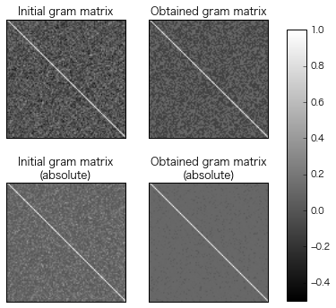
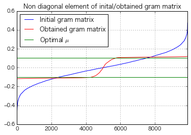
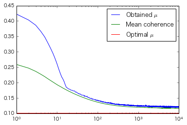

```python
N, L = 50, 100
Iter = 10000
dd1, dd2 = 0.9, 0.9
# 初期化
D = np.random.randn(N, L)
# 列の正規化
D = np.dot(D, np.diag(np.diag(1./np.sqrt(np.dot(D.T, D)))))
# グラム行列
G = np.dot(D.T, D)
# とりうる相互コヒーレンスの最小値
mu = np.sqrt(float(L - N) / N / (L - 1))
log = []
for k in xrange(Iter):
    # 大きい内積を縮小
    gg = np.sort(np.abs(G.flatten()))
    th = gg[np.round(dd1 * (L * L - L)).astype(np.int)]
    pos = (th < np.abs(G)) * (np.abs(G) < 0.999) 
    G[pos] *= dd2
    # ランクをNに減らす
    U, S, V = np.linalg.svd(G)
    S[N:] = 0
    S = np.diag(S)
    G = np.dot(U, np.dot(S, V))
    # 列を正規化
    n = np.diag(1. / np.sqrt(np.diag(G)))
    G = np.dot(n, np.dot(G, n))
    # 統計量を表示
    gg = np.sort(np.abs(G.flatten()))
    th = gg[np.round(dd1 * (L * L - L)).astype(np.int)]
    pos = (th < np.abs(G)) * (np.abs(G) < 0.999)
    print k, mu, np.mean(np.abs(G[pos])), max(np.abs(G[pos]))
    log.append([k, mu, np.mean(np.abs(G[pos])), max(np.abs(G[pos]))])
U, S, V = np.linalg.svd(G)
S = np.diag(S)
D_Grassmannian = np.dot(np.sqrt(S[:N, :N]), U[:N, :])
```

    0 0.100503781526 0.272494093974 0.444851267203
    1 0.100503781526 0.258916757604 0.422688594001
    2 0.100503781526 0.246915856495 0.403212761784
    3 0.100503781526 0.236320262554 0.386328382021
    4 0.100503781526 0.226984097428 0.366360971127
    5 0.100503781526 0.21924840692 0.348047161197
    6 0.100503781526 0.21215713276 0.328180605104
    7 0.100503781526 0.206465176359 0.31069081003
    8 0.100503781526 0.201379548359 0.294370698045
    9 0.100503781526 0.197098074605 0.277667068381
    10 0.100503781526 0.193251047236 0.261225993471
    11 0.100503781526 0.190032173587 0.244715325382
    12 0.100503781526 0.187357021386 0.230694455573
    13 0.100503781526 0.184608585662 0.218817332843
    14 0.100503781526 0.182127905271 0.211555399857
    15 0.100503781526 0.179907250763 0.203014610868
    16 0.100503781526 0.178065709785 0.192613631403
    17 0.100503781526 0.176047108608 0.18444222436
    18 0.100503781526 0.174319950265 0.182537704575
    19 0.100503781526 0.172781391237 0.179793847052
    20 0.100503781526 0.171468939615 0.178707353122
    21 0.100503781526 0.169809012625 0.177694912938
    22 0.100503781526 0.168605060852 0.175271313376
    23 0.100503781526 0.167418208755 0.17508685686
    24 0.100503781526 0.166258124593 0.174598015738
    25 0.100503781526 0.165148608086 0.172964586016
    26 0.100503781526 0.164028288797 0.172665451305
    27 0.100503781526 0.163158105878 0.173071853726
    28 0.100503781526 0.162219318926 0.170629047045
    29 0.100503781526 0.161307997929 0.168231419385
    30 0.100503781526 0.160575872407 0.169493920967
    31 0.100503781526 0.159618285623 0.167596327204
    32 0.100503781526 0.158887432252 0.16587662315
    33 0.100503781526 0.158195556357 0.165576736153
    34 0.100503781526 0.157376075164 0.163215362542
    35 0.100503781526 0.156760507938 0.164475550307
    36 0.100503781526 0.155991678989 0.162307616677
    37 0.100503781526 0.155415862108 0.162259943839
    38 0.100503781526 0.15480944332 0.162890667982
    39 0.100503781526 0.154196128747 0.160135538646
    40 0.100503781526 0.153594549219 0.159929270308
    41 0.100503781526 0.153010581633 0.158626201429
    42 0.100503781526 0.152574636248 0.159461459836
    43 0.100503781526 0.152049699462 0.159075557782
    44 0.100503781526 0.151465226827 0.15891681378
    45 0.100503781526 0.151000249515 0.158937971351
    46 0.100503781526 0.150542403302 0.157998387817
    47 0.100503781526 0.150108993311 0.154596318115
    48 0.100503781526 0.149716587057 0.157754180116
    49 0.100503781526 0.149102165502 0.156526802181
    50 0.100503781526 0.148829874708 0.1552888543
    51 0.100503781526 0.148459662638 0.155413258257
    52 0.100503781526 0.147851843466 0.154025016748
    53 0.100503781526 0.147541219076 0.154352158547
    54 0.100503781526 0.147171970574 0.154877430365
    55 0.100503781526 0.146791590161 0.155931929493
    56 0.100503781526 0.146366112629 0.152652605146
    57 0.100503781526 0.146093618747 0.152317562548
    58 0.100503781526 0.145697492413 0.15253162697
    59 0.100503781526 0.145292669647 0.150818651412
    60 0.100503781526 0.145041308148 0.151814046377
    61 0.100503781526 0.144655414981 0.15174957962
    62 0.100503781526 0.14443861353 0.15134610987
    63 0.100503781526 0.144124676633 0.149333276528
    64 0.100503781526 0.143938804606 0.149412321618
    65 0.100503781526 0.143499484298 0.148855494606
    66 0.100503781526 0.143122987193 0.148337017386
    67 0.100503781526 0.142952578285 0.147940442708
    68 0.100503781526 0.142643325847 0.148734748809
    69 0.100503781526 0.142433885135 0.149579914831
    70 0.100503781526 0.142185901124 0.148318608467
    71 0.100503781526 0.141848913675 0.147470235227
    72 0.100503781526 0.14162741583 0.146549897988
    73 0.100503781526 0.141455394571 0.147833942408
    74 0.100503781526 0.141034548414 0.145643336705
    75 0.100503781526 0.140864302529 0.146823031698
    76 0.100503781526 0.140684588261 0.145935906238
    77 0.100503781526 0.14038891799 0.14552253697
    78 0.100503781526 0.140232756387 0.146319902781
    79 0.100503781526 0.140009233021 0.146229063124
    80 0.100503781526 0.139734153013 0.145749855171
    81 0.100503781526 0.139564678256 0.145466938334
    82 0.100503781526 0.139472525295 0.145441554498
    83 0.100503781526 0.139135506856 0.144552949838
    84 0.100503781526 0.138927881889 0.144208748353
    85 0.100503781526 0.138789516864 0.14436145306
    86 0.100503781526 0.138543516051 0.144191482684
    87 0.100503781526 0.138437657477 0.143523287996
    88 0.100503781526 0.138178045149 0.14531603251
    89 0.100503781526 0.138016678059 0.143228616379
    90 0.100503781526 0.137825006014 0.143093532926
    91 0.100503781526 0.137650611931 0.141899248478
    92 0.100503781526 0.137594631778 0.142235848798
    93 0.100503781526 0.137412852935 0.143917645608
    94 0.100503781526 0.137124084717 0.143121936665
    95 0.100503781526 0.136955278366 0.141905574117
    96 0.100503781526 0.136910462047 0.141650180987
    97 0.100503781526 0.136749720254 0.142536946651
    98 0.100503781526 0.13650261018 0.141953739823
    99 0.100503781526 0.136450978305 0.141956147762
    100 0.100503781526 0.136215426626 0.143391388719
    101 0.100503781526 0.136076316284 0.141193923233
    102 0.100503781526 0.135981099548 0.14132506983
    103 0.100503781526 0.135819027179 0.14082396342
    104 0.100503781526 0.13571246661 0.141221216613
    105 0.100503781526 0.135487483225 0.140756592126
    106 0.100503781526 0.135321501438 0.142273842341
    107 0.100503781526 0.135257812693 0.139861151985
    108 0.100503781526 0.135132510327 0.140488661488
    109 0.100503781526 0.134949779886 0.140052506418
    110 0.100503781526 0.134855157232 0.140350383966
    111 0.100503781526 0.134703909462 0.139862852526
    112 0.100503781526 0.13455022589 0.140056091305
    113 0.100503781526 0.134496664389 0.139641554032
    114 0.100503781526 0.134288515685 0.141037082262
    115 0.100503781526 0.134125209176 0.140726972694
    116 0.100503781526 0.134074047347 0.138967241279
    117 0.100503781526 0.133909585492 0.139036916514
    118 0.100503781526 0.133794429171 0.139245655829
    119 0.100503781526 0.133692000345 0.138523019731
    120 0.100503781526 0.133580787562 0.14033719049
    121 0.100503781526 0.133388569573 0.138094918692
    122 0.100503781526 0.133299166508 0.138682829533
    123 0.100503781526 0.133291437167 0.139371300032
    124 0.100503781526 0.133094762248 0.140102913611
    125 0.100503781526 0.132902801755 0.138021946884
    126 0.100503781526 0.13286250865 0.137680865166
    127 0.100503781526 0.132752150217 0.137656664763
    128 0.100503781526 0.132670798954 0.137300070131
    129 0.100503781526 0.132617754105 0.13649876323
    130 0.100503781526 0.132498127643 0.13790163567
    131 0.100503781526 0.132339867789 0.137025774973
    132 0.100503781526 0.132309985892 0.137204353085
    133 0.100503781526 0.132290229229 0.137766471316
    134 0.100503781526 0.131993620781 0.137270280135
    135 0.100503781526 0.132020108615 0.137660616226
    136 0.100503781526 0.131907259288 0.136286384356
    137 0.100503781526 0.131877027069 0.137672368784
    138 0.100503781526 0.131783391695 0.13863419891
    139 0.100503781526 0.131660290134 0.137979811375
    140 0.100503781526 0.131646207745 0.136703340953
    141 0.100503781526 0.131478725376 0.136655312805
    142 0.100503781526 0.131421613388 0.136292480951
    143 0.100503781526 0.131342093369 0.135780688881
    144 0.100503781526 0.131185332304 0.136126048002
    145 0.100503781526 0.131182758361 0.135627245799
    146 0.100503781526 0.131108231057 0.136380285577
    147 0.100503781526 0.131041899675 0.136245214166
    148 0.100503781526 0.130977434407 0.136317647652
    149 0.100503781526 0.130864336644 0.137138177722
    150 0.100503781526 0.130826942457 0.135828076936
    151 0.100503781526 0.130675941085 0.136504782166
    152 0.100503781526 0.130649619924 0.136516140924
    153 0.100503781526 0.130552274963 0.136203670401
    154 0.100503781526 0.130517555382 0.135463176233
    155 0.100503781526 0.130489131513 0.136004890762
    156 0.100503781526 0.130311202164 0.136515851697
    157 0.100503781526 0.130328565916 0.134455204438
    158 0.100503781526 0.130264601064 0.1360178807
    159 0.100503781526 0.130208679833 0.135635288816
    160 0.100503781526 0.130130732854 0.134987141415
    161 0.100503781526 0.130010901495 0.135117442527
    162 0.100503781526 0.129961321066 0.134262740034
    163 0.100503781526 0.129992015083 0.135006101827
    164 0.100503781526 0.129826704006 0.135039634219
    165 0.100503781526 0.12985974146 0.134440874144
    166 0.100503781526 0.129681120054 0.134008731528
    167 0.100503781526 0.129656117583 0.134270656483
    168 0.100503781526 0.129552979694 0.135625912876
    169 0.100503781526 0.129547635005 0.134840691146
    170 0.100503781526 0.129517116903 0.134465903679
    171 0.100503781526 0.129319081286 0.134710827533
    172 0.100503781526 0.129392674612 0.133165283121
    173 0.100503781526 0.129398040319 0.134788179884
    174 0.100503781526 0.12923286474 0.134363528941
    175 0.100503781526 0.129185946459 0.133466367577
    176 0.100503781526 0.129094721033 0.134159193812
    177 0.100503781526 0.129093941909 0.133652189711
    178 0.100503781526 0.128974676133 0.132872691151
    179 0.100503781526 0.128959113945 0.133700838312
    180 0.100503781526 0.128966096173 0.133078780043
    181 0.100503781526 0.128947628623 0.133877812355
    182 0.100503781526 0.128825969125 0.133977864118
    183 0.100503781526 0.128713912843 0.135333422856
    184 0.100503781526 0.128770002705 0.134557864353
    185 0.100503781526 0.128648403607 0.133656418998
    186 0.100503781526 0.128658143191 0.133342536303
    187 0.100503781526 0.128595978338 0.133202774892
    188 0.100503781526 0.128479868835 0.134041661597
    189 0.100503781526 0.128498628589 0.133089254591
    190 0.100503781526 0.128486763342 0.134098229856
    191 0.100503781526 0.128365487133 0.132864391637
    192 0.100503781526 0.128286474619 0.133729580915
    193 0.100503781526 0.128256332269 0.135125702675
    194 0.100503781526 0.128282160421 0.134258976845
    195 0.100503781526 0.128194326447 0.132671485949
    196 0.100503781526 0.128130540058 0.132648128466
    197 0.100503781526 0.128136251236 0.133531044215
    198 0.100503781526 0.128119512298 0.13364105311
    199 0.100503781526 0.127965215063 0.133182815899
    200 0.100503781526 0.127974425406 0.132563977499
    201 0.100503781526 0.127923412913 0.132737907467
    202 0.100503781526 0.127934176217 0.132666898386
    203 0.100503781526 0.127858127654 0.132722151065
    204 0.100503781526 0.127773722916 0.133482004539
    205 0.100503781526 0.127714428743 0.133343577595
    206 0.100503781526 0.127588726627 0.131862808321
    207 0.100503781526 0.127654485989 0.132542202616
    208 0.100503781526 0.127619214532 0.134883505957
    209 0.100503781526 0.127598922823 0.1314554055
    210 0.100503781526 0.127559829517 0.135451023777
    211 0.100503781526 0.127511887695 0.133651560367
    212 0.100503781526 0.127432123149 0.132788053945
    213 0.100503781526 0.127346091281 0.133636626508
    214 0.100503781526 0.127303344283 0.133361626823
    215 0.100503781526 0.127250232727 0.132246094089
    216 0.100503781526 0.127274224805 0.133016852157
    217 0.100503781526 0.127191784011 0.132064809333
    218 0.100503781526 0.127128920408 0.131443377799
    219 0.100503781526 0.12719897445 0.13333795089
    220 0.100503781526 0.127123013666 0.131534574203
    221 0.100503781526 0.127056059927 0.132614384687
    222 0.100503781526 0.1269666937 0.132126249493
    223 0.100503781526 0.127005047096 0.130803645789
    224 0.100503781526 0.126928042927 0.131584722777
    225 0.100503781526 0.126830296593 0.131036526164
    226 0.100503781526 0.126859018077 0.131017898137
    227 0.100503781526 0.126793845645 0.130648047004
    228 0.100503781526 0.126737766623 0.133112832902
    229 0.100503781526 0.126727456881 0.131299521753
    230 0.100503781526 0.126731754558 0.131598030258
    231 0.100503781526 0.126606669044 0.131225673448
    232 0.100503781526 0.126593016287 0.131180897558
    233 0.100503781526 0.126539523064 0.132864937006
    234 0.100503781526 0.126557717942 0.13177994532
    235 0.100503781526 0.126453421591 0.131163867004
    236 0.100503781526 0.126517761581 0.131078371042
    237 0.100503781526 0.126478379144 0.131484224182
    238 0.100503781526 0.126397882036 0.132003515883
    239 0.100503781526 0.126343188492 0.131270262704
    240 0.100503781526 0.126263010422 0.131092556826
    241 0.100503781526 0.126318202883 0.131819585069
    242 0.100503781526 0.126254328922 0.131982713892
    243 0.100503781526 0.126196266737 0.13139184222
    244 0.100503781526 0.126190913307 0.130659460792
    245 0.100503781526 0.126222524812 0.130022649332
    246 0.100503781526 0.126099367413 0.131125512732
    247 0.100503781526 0.126108842892 0.131790129853
    248 0.100503781526 0.126111005785 0.131385124905
    249 0.100503781526 0.126044125958 0.130554147804
    250 0.100503781526 0.126010949849 0.129931042341
    251 0.100503781526 0.125959463437 0.130713472673
    252 0.100503781526 0.125911519652 0.130754267955
    253 0.100503781526 0.125903392133 0.129564199771
    254 0.100503781526 0.125883046643 0.130858580697
    255 0.100503781526 0.125842558089 0.130332225566
    256 0.100503781526 0.125764707751 0.130994693605
    257 0.100503781526 0.125762643948 0.130203131871
    258 0.100503781526 0.125738952847 0.130117469158
    259 0.100503781526 0.125720438838 0.131003189486
    260 0.100503781526 0.125613064674 0.129380940566
    261 0.100503781526 0.125670698006 0.130666542151
    262 0.100503781526 0.125633571397 0.13002897308
    263 0.100503781526 0.125510949789 0.129895241238
    264 0.100503781526 0.125551130762 0.131216559201
    265 0.100503781526 0.125509669953 0.129627309983
    266 0.100503781526 0.125541607713 0.13017366358
    267 0.100503781526 0.125408922164 0.129490109811
    268 0.100503781526 0.125468569496 0.130461316959
    269 0.100503781526 0.125400081535 0.130585409499
    270 0.100503781526 0.125348877638 0.129557413236
    271 0.100503781526 0.125322608198 0.129594697111
    272 0.100503781526 0.125341255452 0.129470677578
    273 0.100503781526 0.125264710077 0.129452163048
    274 0.100503781526 0.12524978866 0.129849431463
    275 0.100503781526 0.125177885422 0.129164329312
    276 0.100503781526 0.125242630973 0.1301820048
    277 0.100503781526 0.12516005977 0.129476219625
    278 0.100503781526 0.125181819474 0.129826779171
    279 0.100503781526 0.125140007882 0.129673790878
    280 0.100503781526 0.125084464315 0.130244799283
    281 0.100503781526 0.124991265828 0.129776667606
    282 0.100503781526 0.125026893169 0.129622016019
    283 0.100503781526 0.125033560213 0.129694440678
    284 0.100503781526 0.124917025792 0.129606536995
    285 0.100503781526 0.124955306599 0.129323078485
    286 0.100503781526 0.124880259715 0.129733432734
    287 0.100503781526 0.124880258854 0.129312765998
    288 0.100503781526 0.124869568662 0.129611535335
    289 0.100503781526 0.124880231292 0.130812688787
    290 0.100503781526 0.124823323509 0.129117796866
    291 0.100503781526 0.12479765513 0.129536928153
    292 0.100503781526 0.124760050462 0.12912124055
    293 0.100503781526 0.124798076833 0.129082007864
    294 0.100503781526 0.124680407218 0.130861705942
    295 0.100503781526 0.124657678465 0.128664443263
    296 0.100503781526 0.124718528779 0.128633884899
    297 0.100503781526 0.124740083318 0.128847431434
    298 0.100503781526 0.12456118914 0.129573560467
    299 0.100503781526 0.124663186695 0.128738708075
    300 0.100503781526 0.124605966764 0.12992825998
    301 0.100503781526 0.124599521007 0.129107985975
    302 0.100503781526 0.12457259278 0.12940100804
    303 0.100503781526 0.124552809552 0.129259775771
    304 0.100503781526 0.124463930887 0.128734122144
    305 0.100503781526 0.124469265308 0.12870966033
    306 0.100503781526 0.124449141206 0.129189835097
    307 0.100503781526 0.124483151035 0.128261884584
    308 0.100503781526 0.124376948986 0.128896163522
    309 0.100503781526 0.124459808219 0.129441565678
    310 0.100503781526 0.124349847103 0.128811849975
    311 0.100503781526 0.124366775363 0.128907432058
    312 0.100503781526 0.124380094419 0.129930379168
    313 0.100503781526 0.124332850123 0.130386030858
    314 0.100503781526 0.124296914379 0.12938944795
    315 0.100503781526 0.124278149844 0.129420978717
    316 0.100503781526 0.124254711973 0.130144659802
    317 0.100503781526 0.124240094036 0.128313665568
    318 0.100503781526 0.124232613378 0.128508785615
    319 0.100503781526 0.12419020717 0.129240066341
    320 0.100503781526 0.124084582168 0.129621578227
    321 0.100503781526 0.124165773697 0.129237895819
    322 0.100503781526 0.124144872863 0.128925235431
    323 0.100503781526 0.124123551793 0.128995161037
    324 0.100503781526 0.12412171798 0.127888375835
    325 0.100503781526 0.124091457162 0.129796132423
    326 0.100503781526 0.124141875862 0.130946963398
    327 0.100503781526 0.124072715105 0.128618525434
    328 0.100503781526 0.123963972911 0.128057112925
    329 0.100503781526 0.124010833193 0.129384061198
    330 0.100503781526 0.124050140704 0.128696409079
    331 0.100503781526 0.124024667645 0.128020030034
    332 0.100503781526 0.123957894784 0.128092521553
    333 0.100503781526 0.123985118702 0.127781995597
    334 0.100503781526 0.123977690971 0.128429917088
    335 0.100503781526 0.123861595425 0.129399826133
    336 0.100503781526 0.123917279191 0.1283216974
    337 0.100503781526 0.12390904515 0.128111946243
    338 0.100503781526 0.123761480708 0.127878172009
    339 0.100503781526 0.123809249932 0.12918873886
    340 0.100503781526 0.123849964702 0.127680772418
    341 0.100503781526 0.123831506683 0.128133558656
    342 0.100503781526 0.123802331282 0.129750376225
    343 0.100503781526 0.123735326979 0.129094239475
    344 0.100503781526 0.123769960385 0.128121238732
    345 0.100503781526 0.123705193257 0.127985840518
    346 0.100503781526 0.123797716265 0.128154170013
    347 0.100503781526 0.123684746732 0.128623474895
    348 0.100503781526 0.123635348225 0.128199849164
    349 0.100503781526 0.123685410811 0.129137108497
    350 0.100503781526 0.123731395151 0.128581608275
    351 0.100503781526 0.123653132058 0.12803756746
    352 0.100503781526 0.123651638241 0.127547369931
    353 0.100503781526 0.123695980477 0.128051118507
    354 0.100503781526 0.123677503836 0.12781045401
    355 0.100503781526 0.12366512751 0.129043322075
    356 0.100503781526 0.123571662977 0.127657426247
    357 0.100503781526 0.123518683325 0.127731351344
    358 0.100503781526 0.12352783575 0.12800523482
    359 0.100503781526 0.123597766037 0.127754120673
    360 0.100503781526 0.123553659484 0.127677674891
    361 0.100503781526 0.123452115164 0.128136668137
    362 0.100503781526 0.123472239809 0.127947946207
    363 0.100503781526 0.123440305744 0.127154863661
    364 0.100503781526 0.123479135608 0.128309733824
    365 0.100503781526 0.123502142216 0.129169394591
    366 0.100503781526 0.123501246136 0.128550209831
    367 0.100503781526 0.123402319074 0.127657662746
    368 0.100503781526 0.123381804292 0.127433675241
    369 0.100503781526 0.12337221209 0.127448068087
    370 0.100503781526 0.123305873193 0.127063214497
    371 0.100503781526 0.123329758301 0.128159363795
    372 0.100503781526 0.123311883641 0.127608708999
    373 0.100503781526 0.123271152374 0.128007893286
    374 0.100503781526 0.123335022738 0.128113355038
    375 0.100503781526 0.123302211182 0.127198129954
    376 0.100503781526 0.123286475473 0.127511698388
    377 0.100503781526 0.123293239039 0.128633359229
    378 0.100503781526 0.123235788222 0.127584468592
    379 0.100503781526 0.123230750577 0.127555383845
    380 0.100503781526 0.123213831674 0.12815458621
    381 0.100503781526 0.123217158941 0.127448925082
    382 0.100503781526 0.123233332874 0.127111424046
    383 0.100503781526 0.123251228249 0.12793343957
    384 0.100503781526 0.123119117602 0.127566141278
    385 0.100503781526 0.123068530262 0.127734182676
    386 0.100503781526 0.123044805284 0.12837196301
    387 0.100503781526 0.123151156059 0.127438974388
    388 0.100503781526 0.12308815016 0.129159078646
    389 0.100503781526 0.123091235821 0.127369458324
    390 0.100503781526 0.123057963187 0.127446146244
    391 0.100503781526 0.123088023945 0.128413555401
    392 0.100503781526 0.12302222304 0.126930107574
    393 0.100503781526 0.122978884295 0.127326133705
    394 0.100503781526 0.123020087388 0.129174471198
    395 0.100503781526 0.122964075466 0.127063354494
    396 0.100503781526 0.122982656621 0.127331251127
    397 0.100503781526 0.122935099486 0.126983433297
    398 0.100503781526 0.122932742275 0.126791297619
    399 0.100503781526 0.122932132154 0.127496334256
    400 0.100503781526 0.122934817781 0.127891239216
    401 0.100503781526 0.122910388014 0.127073618856
    402 0.100503781526 0.122850359717 0.127811743831
    403 0.100503781526 0.122827615105 0.127293697651
    404 0.100503781526 0.122836968477 0.126891152771
    405 0.100503781526 0.122803516053 0.127076318638
    406 0.100503781526 0.122845547001 0.126809558992
    407 0.100503781526 0.122792939713 0.126878984672
    408 0.100503781526 0.122809120066 0.127118049852
    409 0.100503781526 0.122786360718 0.127040407927
    410 0.100503781526 0.122788476898 0.128632514052
    411 0.100503781526 0.122814085471 0.127037444112
    412 0.100503781526 0.12273416863 0.126947032242
    413 0.100503781526 0.122709165493 0.127338335785
    414 0.100503781526 0.122665853802 0.127102644699
    415 0.100503781526 0.12264556189 0.128568769201
    416 0.100503781526 0.122706237607 0.128064462675
    417 0.100503781526 0.122693283272 0.129004592038
    418 0.100503781526 0.122673753131 0.127695094964
    419 0.100503781526 0.122641544452 0.12721230577
    420 0.100503781526 0.122636065443 0.129086440231
    421 0.100503781526 0.12265990475 0.127621904955
    422 0.100503781526 0.122561069708 0.12729051458
    423 0.100503781526 0.122643828119 0.127912369414
    424 0.100503781526 0.122579703579 0.127104342909
    425 0.100503781526 0.122624395417 0.128735216284
    426 0.100503781526 0.122532186313 0.127103015064
    427 0.100503781526 0.122550800928 0.12688593972
    428 0.100503781526 0.122566831578 0.12789241424
    429 0.100503781526 0.122534355222 0.126871741066
    430 0.100503781526 0.122525915705 0.128136603004
    431 0.100503781526 0.122487195888 0.126837476417
    432 0.100503781526 0.122503864448 0.126995194235
    433 0.100503781526 0.122523672617 0.126208502704
    434 0.100503781526 0.122485886634 0.127387661856
    435 0.100503781526 0.122379398091 0.126967024741
    436 0.100503781526 0.122405589711 0.127332318466
    437 0.100503781526 0.12238649279 0.126341962316
    438 0.100503781526 0.122431623199 0.126211069932
    439 0.100503781526 0.1224002326 0.127281813055
    440 0.100503781526 0.122395171256 0.127012932442
    441 0.100503781526 0.122391463383 0.128167124129
    442 0.100503781526 0.122333343839 0.126388840868
    443 0.100503781526 0.122409522387 0.12719914665
    444 0.100503781526 0.122382921604 0.127208187112
    445 0.100503781526 0.122304679371 0.127728182382
    446 0.100503781526 0.122353436719 0.127084436337
    447 0.100503781526 0.122320651251 0.126710795915
    448 0.100503781526 0.122288879919 0.126714070521
    449 0.100503781526 0.122330715489 0.126675162864
    450 0.100503781526 0.122262434187 0.126152933401
    451 0.100503781526 0.122321723658 0.12854183621
    452 0.100503781526 0.122305662282 0.126847019806
    453 0.100503781526 0.122305021935 0.126576902074
    454 0.100503781526 0.12221297357 0.127131289633
    455 0.100503781526 0.122190651559 0.12684451308
    456 0.100503781526 0.122231009375 0.12638277463
    457 0.100503781526 0.122110856074 0.127014081
    458 0.100503781526 0.12220534347 0.126818950064
    459 0.100503781526 0.122189494165 0.127241140396
    460 0.100503781526 0.122208879574 0.127477069308
    461 0.100503781526 0.122209615573 0.127215792567
    462 0.100503781526 0.122179769297 0.127982498544
    463 0.100503781526 0.122125059918 0.126663267145
    464 0.100503781526 0.122142593113 0.126806289429
    465 0.100503781526 0.122187198297 0.128280235723
    466 0.100503781526 0.122211599833 0.125998636804
    467 0.100503781526 0.122113695412 0.128853672754
    468 0.100503781526 0.122115878001 0.127424247934
    469 0.100503781526 0.122107537662 0.126356855075
    470 0.100503781526 0.122091445798 0.12582936069
    471 0.100503781526 0.122114707997 0.127818224794
    472 0.100503781526 0.122098414942 0.12638273146
    473 0.100503781526 0.121980986241 0.128911926452
    474 0.100503781526 0.121952818234 0.127617257713
    475 0.100503781526 0.122013404959 0.126627891354
    476 0.100503781526 0.122128503074 0.127049876703
    477 0.100503781526 0.122065373681 0.126958455251
    478 0.100503781526 0.122033158939 0.126654056464
    479 0.100503781526 0.122051710716 0.126993009749
    480 0.100503781526 0.121974474527 0.127352767039
    481 0.100503781526 0.12202067351 0.127207962245
    482 0.100503781526 0.122069201686 0.126438593018
    483 0.100503781526 0.121992004224 0.126642255736
    484 0.100503781526 0.122001594652 0.126583582759
    485 0.100503781526 0.121949609099 0.126923286073
    486 0.100503781526 0.121987611372 0.12653694015
    487 0.100503781526 0.121931690112 0.127077424127
    488 0.100503781526 0.121939132072 0.127092241951
    489 0.100503781526 0.121978660804 0.126638221989
    490 0.100503781526 0.121909825521 0.12654427383
    491 0.100503781526 0.121931796613 0.127095054856
    492 0.100503781526 0.121846461659 0.126259042222
    493 0.100503781526 0.121886324989 0.126809159264
    494 0.100503781526 0.121861019358 0.127678455251
    495 0.100503781526 0.121903389868 0.127248454651
    496 0.100503781526 0.121878618644 0.125355960442
    497 0.100503781526 0.121846175705 0.127409750167
    498 0.100503781526 0.121826637587 0.125987134346
    499 0.100503781526 0.121898293447 0.127159949498
    500 0.100503781526 0.121824441977 0.126410118823
    501 0.100503781526 0.121821561576 0.127931944576
    502 0.100503781526 0.12177750935 0.126252923241
    503 0.100503781526 0.121797214385 0.127501637374
    504 0.100503781526 0.121830631522 0.127494527153
    505 0.100503781526 0.121763897127 0.126997385401
    506 0.100503781526 0.121836533578 0.126707972754
    507 0.100503781526 0.121757915103 0.126779860534
    508 0.100503781526 0.121805225042 0.127532115155
    509 0.100503781526 0.121739264707 0.126200978968
    510 0.100503781526 0.121766421228 0.126479976476
    511 0.100503781526 0.121762500672 0.126640512194
    512 0.100503781526 0.121768981557 0.126966341813
    513 0.100503781526 0.121718171746 0.126818790902
    514 0.100503781526 0.121793700208 0.125724321926
    515 0.100503781526 0.121710228904 0.126700624743
    516 0.100503781526 0.121687054044 0.127182478278
    517 0.100503781526 0.121714407825 0.125666737546
    518 0.100503781526 0.121738285849 0.125816456881
    519 0.100503781526 0.121683540388 0.126212075027
    520 0.100503781526 0.121627186286 0.126439646406
    521 0.100503781526 0.121689773216 0.126062764577
    522 0.100503781526 0.121688591084 0.126887278132
    523 0.100503781526 0.121579804422 0.126634865483
    524 0.100503781526 0.12157695587 0.126736244335
    525 0.100503781526 0.12174701891 0.125498171926
    526 0.100503781526 0.121647057958 0.126156937838
    527 0.100503781526 0.121605910686 0.125975504229
    528 0.100503781526 0.121565389033 0.127307885451
    529 0.100503781526 0.12161002151 0.126052485555
    530 0.100503781526 0.121646082534 0.126341528123
    531 0.100503781526 0.121653442801 0.126703796687
    532 0.100503781526 0.121590621724 0.127184888837
    533 0.100503781526 0.121587975653 0.126889275575
    534 0.100503781526 0.121554196411 0.125454161786
    535 0.100503781526 0.121556202745 0.125801947155
    536 0.100503781526 0.121542409353 0.127379601499
    537 0.100503781526 0.121512343716 0.12633488685
    538 0.100503781526 0.121604973197 0.125525459964
    539 0.100503781526 0.121603803133 0.127036858838
    540 0.100503781526 0.121559434637 0.127982116552
    541 0.100503781526 0.121530751288 0.125877746435
    542 0.100503781526 0.12150072252 0.125545631122
    543 0.100503781526 0.12156551115 0.127635427254
    544 0.100503781526 0.121557786424 0.126297092684
    545 0.100503781526 0.121447309698 0.127659103009
    546 0.100503781526 0.12146470572 0.125733043037
    547 0.100503781526 0.121519928587 0.125869868002
    548 0.100503781526 0.121464309816 0.12637604825
    549 0.100503781526 0.121391327969 0.1253360465
    550 0.100503781526 0.121460051224 0.12687893707
    551 0.100503781526 0.121458834292 0.126298958154
    552 0.100503781526 0.121456778762 0.126728086584
    553 0.100503781526 0.12135997531 0.128063661487
    554 0.100503781526 0.12143489683 0.125637450417
    555 0.100503781526 0.121447731978 0.125802450069
    556 0.100503781526 0.121434257425 0.12544890666
    557 0.100503781526 0.121414062856 0.125608888484
    558 0.100503781526 0.121349822616 0.12684065597
    559 0.100503781526 0.121355994982 0.125395932027
    560 0.100503781526 0.121382007681 0.127527651791
    561 0.100503781526 0.121353129479 0.125816156516
    562 0.100503781526 0.121353835521 0.126067717329
    563 0.100503781526 0.121354219976 0.125358823486
    564 0.100503781526 0.121301393577 0.126194504347
    565 0.100503781526 0.121363046527 0.12751031421
    566 0.100503781526 0.121303963518 0.125074401004
    567 0.100503781526 0.121282360083 0.12583172037
    568 0.100503781526 0.12135334133 0.126712776137
    569 0.100503781526 0.121266460586 0.125288469132
    570 0.100503781526 0.12130094553 0.125282586073
    571 0.100503781526 0.121345531826 0.12577195159
    572 0.100503781526 0.121282691372 0.125994530905
    573 0.100503781526 0.121259234701 0.125971298876
    574 0.100503781526 0.121283516229 0.126258454734
    575 0.100503781526 0.121255209906 0.125634775239
    576 0.100503781526 0.121257541936 0.127213675949
    577 0.100503781526 0.121251937415 0.128308536987
    578 0.100503781526 0.121255103884 0.126125177111
    579 0.100503781526 0.12121353917 0.125904922374
    580 0.100503781526 0.121316556513 0.126280698785
    581 0.100503781526 0.121205566694 0.125353130353
    582 0.100503781526 0.121221469582 0.127050826214
    583 0.100503781526 0.121220344195 0.126170467475
    584 0.100503781526 0.121276145356 0.126556807892
    585 0.100503781526 0.1212199327 0.12554953326
    586 0.100503781526 0.121219364257 0.126352768153
    587 0.100503781526 0.121220123745 0.126967927202
    588 0.100503781526 0.121174120925 0.125710731699
    589 0.100503781526 0.121201723293 0.125888715093
    590 0.100503781526 0.121224726171 0.125623924837
    591 0.100503781526 0.121158024345 0.125981281083
    592 0.100503781526 0.121140416749 0.125212136298
    593 0.100503781526 0.121172664682 0.127394839477
    594 0.100503781526 0.121161963108 0.127405479651
    595 0.100503781526 0.121156437743 0.124499061202
    596 0.100503781526 0.121148173357 0.125281305115
    597 0.100503781526 0.121113374981 0.125878663013
    598 0.100503781526 0.121080517244 0.125588872874
    599 0.100503781526 0.121112906358 0.125971929133
    600 0.100503781526 0.12110850212 0.127133859719
    601 0.100503781526 0.121079925896 0.125937157296
    602 0.100503781526 0.121053870379 0.125026580765
    603 0.100503781526 0.121079947339 0.125825145876
    604 0.100503781526 0.121119546311 0.125958578218
    605 0.100503781526 0.121038571835 0.126099400283
    606 0.100503781526 0.120994469904 0.125225209887
    607 0.100503781526 0.120978310866 0.125731415517
    608 0.100503781526 0.121073210654 0.126097277692
    609 0.100503781526 0.121040860765 0.125848567442
    610 0.100503781526 0.12103551237 0.125964601906
    611 0.100503781526 0.121090692367 0.125861281673
    612 0.100503781526 0.121035379618 0.125842162702
    613 0.100503781526 0.121033704874 0.125407034377
    614 0.100503781526 0.120986683375 0.125691501668
    615 0.100503781526 0.12104799926 0.125364134607
    616 0.100503781526 0.120979007498 0.125711264942
    617 0.100503781526 0.121012113414 0.12647295507
    618 0.100503781526 0.121050527635 0.12500618785
    619 0.100503781526 0.120950997532 0.124705672124
    620 0.100503781526 0.120938429382 0.125153600075
    621 0.100503781526 0.120958934657 0.125965188018
    622 0.100503781526 0.120991400943 0.125490836723
    623 0.100503781526 0.120963408526 0.125526962165
    624 0.100503781526 0.120994252929 0.125817699818
    625 0.100503781526 0.120980495789 0.127080304336
    626 0.100503781526 0.120961311805 0.124947064167
    627 0.100503781526 0.12095836305 0.12591105802
    628 0.100503781526 0.120968037092 0.125119031077
    629 0.100503781526 0.120878848651 0.125563866821
    630 0.100503781526 0.120878981152 0.126052769726
    631 0.100503781526 0.120967809076 0.125631780806
    632 0.100503781526 0.120866093065 0.124851928776
    633 0.100503781526 0.120898820388 0.124772538531
    634 0.100503781526 0.120977699653 0.126487686146
    635 0.100503781526 0.120910813523 0.125809554525
    636 0.100503781526 0.120951650802 0.124925269563
    637 0.100503781526 0.120843742824 0.125548864323
    638 0.100503781526 0.120830871169 0.124523493633
    639 0.100503781526 0.120875417863 0.126615759998
    640 0.100503781526 0.120876065025 0.125054708292
    641 0.100503781526 0.120908970825 0.125243900469
    642 0.100503781526 0.12084719096 0.125722148787
    643 0.100503781526 0.120849998184 0.125504508988
    644 0.100503781526 0.120912046421 0.126086351885
    645 0.100503781526 0.120877090593 0.124956261727
    646 0.100503781526 0.120818082567 0.124513725986
    647 0.100503781526 0.120767571806 0.125202130482
    648 0.100503781526 0.120807372955 0.1253706794
    649 0.100503781526 0.120802488088 0.125058653694
    650 0.100503781526 0.120774911096 0.12557702389
    651 0.100503781526 0.120804066586 0.125997412962
    652 0.100503781526 0.120852329638 0.124789870889
    653 0.100503781526 0.120828542518 0.12591672166
    654 0.100503781526 0.12080369352 0.126817431686
    655 0.100503781526 0.120735780258 0.124339533397
    656 0.100503781526 0.120800441839 0.125692888845
    657 0.100503781526 0.120764553795 0.125198465052
    658 0.100503781526 0.120786929168 0.125381784512
    659 0.100503781526 0.120755817193 0.12541251845
    660 0.100503781526 0.120746355727 0.125990203039
    661 0.100503781526 0.120755165397 0.125426622978
    662 0.100503781526 0.120772763153 0.125271738916
    663 0.100503781526 0.120716222734 0.124509185694
    664 0.100503781526 0.120752783256 0.125364799264
    665 0.100503781526 0.120684412532 0.12685603496
    666 0.100503781526 0.120699146206 0.124669957197
    667 0.100503781526 0.120737315441 0.124467468191
    668 0.100503781526 0.120661769734 0.125999605198
    669 0.100503781526 0.120702614598 0.124925448764
    670 0.100503781526 0.120648640242 0.125535581889
    671 0.100503781526 0.120687593936 0.125091253588
    672 0.100503781526 0.120702950001 0.125582476849
    673 0.100503781526 0.120735952417 0.124974209855
    674 0.100503781526 0.120721948813 0.125013475597
    675 0.100503781526 0.120689226222 0.126242905094
    676 0.100503781526 0.120686668507 0.124661743145
    677 0.100503781526 0.120666350099 0.124793621452
    678 0.100503781526 0.120690877987 0.124779289723
    679 0.100503781526 0.120628783942 0.1265255416
    680 0.100503781526 0.120611860668 0.124995574966
    681 0.100503781526 0.120670520293 0.12614490655
    682 0.100503781526 0.120707884925 0.125268677678
    683 0.100503781526 0.120673677335 0.125070718975
    684 0.100503781526 0.120564316718 0.125732863158
    685 0.100503781526 0.12060064398 0.124977536037
    686 0.100503781526 0.120711847576 0.124858732691
    687 0.100503781526 0.120628186428 0.124847268653
    688 0.100503781526 0.120608418724 0.126265249933
    689 0.100503781526 0.1205943153 0.124479655103
    690 0.100503781526 0.120622302494 0.124775628587
    691 0.100503781526 0.120593846213 0.125546995245
    692 0.100503781526 0.120591379544 0.125703477312
    693 0.100503781526 0.120571983279 0.124940574075
    694 0.100503781526 0.120665386653 0.125859953113
    695 0.100503781526 0.120544498082 0.125763094377
    696 0.100503781526 0.120588767934 0.12651661043
    697 0.100503781526 0.120532063092 0.126044584246
    698 0.100503781526 0.120627193299 0.12680266836
    699 0.100503781526 0.12054138841 0.12402294525
    700 0.100503781526 0.120602612111 0.125115596473
    701 0.100503781526 0.120626204826 0.124874930557
    702 0.100503781526 0.120496791174 0.125724211329
    703 0.100503781526 0.120518635411 0.124449131355
    704 0.100503781526 0.120516760512 0.123913780723
    705 0.100503781526 0.120538314191 0.124228912516
    706 0.100503781526 0.120510919636 0.12452618547
    707 0.100503781526 0.120534321233 0.125139046989
    708 0.100503781526 0.120503227637 0.125920021961
    709 0.100503781526 0.120455000912 0.124432593834
    710 0.100503781526 0.120547709448 0.125653234131
    711 0.100503781526 0.120569733158 0.125465142517
    712 0.100503781526 0.120470206667 0.124484226819
    713 0.100503781526 0.120452305733 0.12420778971
    714 0.100503781526 0.120470133085 0.125280306056
    715 0.100503781526 0.120496769687 0.12514685444
    716 0.100503781526 0.120510202332 0.124605386287
    717 0.100503781526 0.120504108704 0.124780149521
    718 0.100503781526 0.120462577578 0.12417706248
    719 0.100503781526 0.120474292853 0.124904695723
    720 0.100503781526 0.120479056102 0.125189340724
    721 0.100503781526 0.120446358391 0.124222574871
    722 0.100503781526 0.120436898307 0.125384150074
    723 0.100503781526 0.120480412808 0.125174028233
    724 0.100503781526 0.120484141611 0.124885548561
    725 0.100503781526 0.120415440917 0.12426024055
    726 0.100503781526 0.120405026382 0.125706794076
    727 0.100503781526 0.120422115553 0.125777491419
    728 0.100503781526 0.120453884193 0.125029366267
    729 0.100503781526 0.120437026618 0.124511981082
    730 0.100503781526 0.12042003363 0.126038643969
    731 0.100503781526 0.120400334398 0.124789326019
    732 0.100503781526 0.120454243421 0.125346984213
    733 0.100503781526 0.120491749428 0.124490338881
    734 0.100503781526 0.120490124055 0.126630334247
    735 0.100503781526 0.12042040447 0.124954434329
    736 0.100503781526 0.120373687043 0.124705689134
    737 0.100503781526 0.120435975271 0.125363241461
    738 0.100503781526 0.120418773306 0.125094909214
    739 0.100503781526 0.120302689224 0.125403394535
    740 0.100503781526 0.120428253459 0.125422797006
    741 0.100503781526 0.120376644612 0.125073809219
    742 0.100503781526 0.120366388261 0.124766281679
    743 0.100503781526 0.120397183613 0.124807063738
    744 0.100503781526 0.120375120058 0.125710675286
    745 0.100503781526 0.120390775491 0.124849893897
    746 0.100503781526 0.120313630205 0.12672359787
    747 0.100503781526 0.120322572331 0.124265555579
    748 0.100503781526 0.120346586585 0.124793863145
    749 0.100503781526 0.1203404118 0.124401366638
    750 0.100503781526 0.120396421517 0.124512490532
    751 0.100503781526 0.120279138268 0.124817229597
    752 0.100503781526 0.120357662563 0.125101531111
    753 0.100503781526 0.120344484487 0.124905046792
    754 0.100503781526 0.120352578074 0.124585650585
    755 0.100503781526 0.120283237007 0.126966022796
    756 0.100503781526 0.12026601678 0.124678231441
    757 0.100503781526 0.120296418134 0.124196833191
    758 0.100503781526 0.120291604676 0.125534490089
    759 0.100503781526 0.120253602198 0.125120733766
    760 0.100503781526 0.120359587808 0.124428499414
    761 0.100503781526 0.120304355143 0.125119238865
    762 0.100503781526 0.120264039476 0.124731446996
    763 0.100503781526 0.120318021699 0.124015591798
    764 0.100503781526 0.120359899974 0.124786214989
    765 0.100503781526 0.120282332452 0.125501729795
    766 0.100503781526 0.120250298862 0.124891097349
    767 0.100503781526 0.120245036578 0.126154257995
    768 0.100503781526 0.120259816527 0.125207779084
    769 0.100503781526 0.120237163234 0.125064186228
    770 0.100503781526 0.120280412145 0.12514606828
    771 0.100503781526 0.120322450194 0.125334881175
    772 0.100503781526 0.120273623736 0.125010420907
    773 0.100503781526 0.120265818176 0.12419461764
    774 0.100503781526 0.120231909149 0.124092237275
    775 0.100503781526 0.120259921512 0.123929208192
    776 0.100503781526 0.120199273508 0.12491126963
    777 0.100503781526 0.120206153419 0.124074681412
    778 0.100503781526 0.120236078825 0.124576859559
    779 0.100503781526 0.120270481977 0.125257760493
    780 0.100503781526 0.120274020603 0.124834561958
    781 0.100503781526 0.120249307296 0.12461870499
    782 0.100503781526 0.120220060202 0.124307875157
    783 0.100503781526 0.120235206854 0.124610180502
    784 0.100503781526 0.120185242428 0.124622121787
    785 0.100503781526 0.120166455233 0.124831730281
    786 0.100503781526 0.12017074128 0.123961254361
    787 0.100503781526 0.120235157339 0.123933862692
    788 0.100503781526 0.120242726621 0.125120459847
    789 0.100503781526 0.120165088915 0.124443554445
    790 0.100503781526 0.120178739679 0.126398710998
    791 0.100503781526 0.12018848433 0.12499613079
    792 0.100503781526 0.120191765852 0.12379927616
    793 0.100503781526 0.120205279311 0.125545708108
    794 0.100503781526 0.120238939459 0.124098268874
    795 0.100503781526 0.120180866942 0.124350354285
    796 0.100503781526 0.120196358885 0.124342075709
    797 0.100503781526 0.120195783609 0.124462516049
    798 0.100503781526 0.120147832485 0.124400914606
    799 0.100503781526 0.120176009891 0.124647779671
    800 0.100503781526 0.1201430992 0.123832996007
    801 0.100503781526 0.120112639864 0.124566195064
    802 0.100503781526 0.120163089041 0.12434669928
    803 0.100503781526 0.120187238648 0.125336306635
    804 0.100503781526 0.120138140682 0.124127362108
    805 0.100503781526 0.120177487452 0.124679441104
    806 0.100503781526 0.120106245834 0.124201351693
    807 0.100503781526 0.120190766974 0.124433615534
    808 0.100503781526 0.120164481461 0.125177505013
    809 0.100503781526 0.120097551039 0.123630186025
    810 0.100503781526 0.12013345062 0.123781480673
    811 0.100503781526 0.120196671163 0.124509432344
    812 0.100503781526 0.120116553707 0.123679870137
    813 0.100503781526 0.120159011748 0.124805404142
    814 0.100503781526 0.120112945288 0.124122664118
    815 0.100503781526 0.120153312361 0.124671582549
    816 0.100503781526 0.120129573356 0.124042952889
    817 0.100503781526 0.120149533172 0.125275243277
    818 0.100503781526 0.120134683195 0.123768223026
    819 0.100503781526 0.120076718133 0.125600693679
    820 0.100503781526 0.120098253068 0.124184496312
    821 0.100503781526 0.120119896401 0.124722784947
    822 0.100503781526 0.120132377049 0.124170155389
    823 0.100503781526 0.120072589338 0.124725811322
    824 0.100503781526 0.120067814017 0.124517273291
    825 0.100503781526 0.120072417034 0.125161555019
    826 0.100503781526 0.120117362361 0.123506778869
    827 0.100503781526 0.120085755987 0.124095421756
    828 0.100503781526 0.120027615773 0.124853745149
    829 0.100503781526 0.120123626757 0.124650700301
    830 0.100503781526 0.120147957984 0.124734067038
    831 0.100503781526 0.120103809102 0.125085875817
    832 0.100503781526 0.120027819444 0.124180066114
    833 0.100503781526 0.120105802597 0.124712831315
    834 0.100503781526 0.120087168058 0.124844315969
    835 0.100503781526 0.120089452541 0.124805019732
    836 0.100503781526 0.120031275836 0.125033903391
    837 0.100503781526 0.119941297142 0.125400564819
    838 0.100503781526 0.120053060368 0.124276464634
    839 0.100503781526 0.120112515901 0.124613864041
    840 0.100503781526 0.12007311577 0.124098798474
    841 0.100503781526 0.12005023488 0.123810078692
    842 0.100503781526 0.120061149684 0.124764030441
    843 0.100503781526 0.120100580496 0.124949313321
    844 0.100503781526 0.12001437602 0.123471535089
    845 0.100503781526 0.120009855849 0.124697075966
    846 0.100503781526 0.120080282554 0.125879628212
    847 0.100503781526 0.120049786 0.12577612516
    848 0.100503781526 0.120035934189 0.124686903656
    849 0.100503781526 0.120052880488 0.12408757296
    850 0.100503781526 0.12002195059 0.12404951747
    851 0.100503781526 0.120040361309 0.123896333561
    852 0.100503781526 0.120072954939 0.12439858397
    853 0.100503781526 0.119997577252 0.125800515918
    854 0.100503781526 0.120035973944 0.124122657651
    855 0.100503781526 0.120027992721 0.12507299298
    856 0.100503781526 0.120024204398 0.12472926724
    857 0.100503781526 0.120041295864 0.125202513515
    858 0.100503781526 0.119991319607 0.123892901642
    859 0.100503781526 0.120027351914 0.124032304909
    860 0.100503781526 0.119992903183 0.124885082361
    861 0.100503781526 0.11999688342 0.124543882121
    862 0.100503781526 0.120007148698 0.125399124536
    863 0.100503781526 0.119986128529 0.124510759703
    864 0.100503781526 0.120012886307 0.124254000009
    865 0.100503781526 0.120017596098 0.125204030791
    866 0.100503781526 0.119992584037 0.124454241702
    867 0.100503781526 0.119976384407 0.124246058944
    868 0.100503781526 0.119932565995 0.125222831897
    869 0.100503781526 0.119920236817 0.124155323597
    870 0.100503781526 0.120034082444 0.123953695798
    871 0.100503781526 0.1199872655 0.125140338112
    872 0.100503781526 0.120012361513 0.12477206523
    873 0.100503781526 0.11995842178 0.124747297787
    874 0.100503781526 0.119952853729 0.124962685773
    875 0.100503781526 0.119973064254 0.124329721488
    876 0.100503781526 0.119961401753 0.124623285316
    877 0.100503781526 0.119984499547 0.124894647694
    878 0.100503781526 0.120018573112 0.125473014756
    879 0.100503781526 0.119936996673 0.124223289586
    880 0.100503781526 0.119960216507 0.123724893546
    881 0.100503781526 0.119917478866 0.124122016253
    882 0.100503781526 0.119939793662 0.12536549857
    883 0.100503781526 0.11991206421 0.124454467901
    884 0.100503781526 0.119967011833 0.124861113823
    885 0.100503781526 0.119935038229 0.125089221364
    886 0.100503781526 0.119909766228 0.123686676476
    887 0.100503781526 0.119937391837 0.124403220169
    888 0.100503781526 0.120011146668 0.124328549212
    889 0.100503781526 0.11993672355 0.125366689415
    890 0.100503781526 0.119881495611 0.124847752649
    891 0.100503781526 0.119876416528 0.124335052658
    892 0.100503781526 0.11998238871 0.125807209106
    893 0.100503781526 0.119967469707 0.124911942638
    894 0.100503781526 0.119972858598 0.1234664817
    895 0.100503781526 0.119977210462 0.124278010909
    896 0.100503781526 0.119894851477 0.124200008259
    897 0.100503781526 0.119864188705 0.125112186026
    898 0.100503781526 0.119894472814 0.124192402102
    899 0.100503781526 0.119886414517 0.123841358533
    900 0.100503781526 0.11988574527 0.124041112363
    901 0.100503781526 0.119914917788 0.125046019624
    902 0.100503781526 0.119927113552 0.124634179781
    903 0.100503781526 0.119886718711 0.124486655302
    904 0.100503781526 0.119881009562 0.124078520434
    905 0.100503781526 0.119915726108 0.124531606085
    906 0.100503781526 0.119890809077 0.124228243278
    907 0.100503781526 0.119838522625 0.12343515024
    908 0.100503781526 0.119906613706 0.125309884601
    909 0.100503781526 0.119920619967 0.125470109405
    910 0.100503781526 0.119879415993 0.123657233258
    911 0.100503781526 0.119849299863 0.124323299466
    912 0.100503781526 0.119835806027 0.124293366449
    913 0.100503781526 0.119790115193 0.123727248207
    914 0.100503781526 0.119895515154 0.125322451659
    915 0.100503781526 0.119920471618 0.123613823616
    916 0.100503781526 0.119867671277 0.124211982178
    917 0.100503781526 0.119906696281 0.123778111122
    918 0.100503781526 0.119810207753 0.123966779358
    919 0.100503781526 0.11989678926 0.124060506551
    920 0.100503781526 0.119820722368 0.124431991032
    921 0.100503781526 0.11976605221 0.124018057082
    922 0.100503781526 0.119923419339 0.123894175383
    923 0.100503781526 0.119873991053 0.123683070185
    924 0.100503781526 0.119786706298 0.124408809494
    925 0.100503781526 0.119837204831 0.124400746863
    926 0.100503781526 0.119813474428 0.124552433508
    927 0.100503781526 0.119906999075 0.123846144174
    928 0.100503781526 0.119830479924 0.123945467628
    929 0.100503781526 0.119861872558 0.123442952948
    930 0.100503781526 0.119844560136 0.123805139265
    931 0.100503781526 0.119807113711 0.123677725311
    932 0.100503781526 0.119806462684 0.125076410512
    933 0.100503781526 0.119903282199 0.124041894552
    934 0.100503781526 0.119811939171 0.123822274536
    935 0.100503781526 0.119730826012 0.123434395159
    936 0.100503781526 0.119808937671 0.123468834436
    937 0.100503781526 0.119828606022 0.123441370376
    938 0.100503781526 0.119862465538 0.124737861277
    939 0.100503781526 0.119792024383 0.124166679074
    940 0.100503781526 0.119816435703 0.124627092569
    941 0.100503781526 0.119841834392 0.123845860846
    942 0.100503781526 0.119805167112 0.123699703325
    943 0.100503781526 0.119827496204 0.123723803582
    944 0.100503781526 0.11981715536 0.123977936086
    945 0.100503781526 0.11971566659 0.124862730064
    946 0.100503781526 0.119835834627 0.124306709915
    947 0.100503781526 0.119832725132 0.124349531089
    948 0.100503781526 0.119777818678 0.124721557264
    949 0.100503781526 0.119866796003 0.125139063091
    950 0.100503781526 0.119810627806 0.123613874859
    951 0.100503781526 0.119822586716 0.12342197088
    952 0.100503781526 0.11980138364 0.123806235395
    953 0.100503781526 0.119789306168 0.124328032409
    954 0.100503781526 0.119769508054 0.124763070769
    955 0.100503781526 0.119773568169 0.123663237614
    956 0.100503781526 0.11973879184 0.125241330952
    957 0.100503781526 0.119802391769 0.1237781781
    958 0.100503781526 0.119769542552 0.123658265714
    959 0.100503781526 0.11976084274 0.123633868918
    960 0.100503781526 0.119785661608 0.124475398669
    961 0.100503781526 0.119791634785 0.123997197816
    962 0.100503781526 0.119739066776 0.124059101431
    963 0.100503781526 0.119802635132 0.124701177855
    964 0.100503781526 0.11976085164 0.124060483691
    965 0.100503781526 0.119817023213 0.123886658896
    966 0.100503781526 0.119772470801 0.123769943221
    967 0.100503781526 0.119803308847 0.123162166894
    968 0.100503781526 0.119792934104 0.123634867737
    969 0.100503781526 0.119799243709 0.123743642312
    970 0.100503781526 0.119726532309 0.123760398568
    971 0.100503781526 0.11975905882 0.126808763427
    972 0.100503781526 0.119782326318 0.123482271445
    973 0.100503781526 0.119774473825 0.124252924347
    974 0.100503781526 0.119784411744 0.124534495071
    975 0.100503781526 0.119840058468 0.123906331764
    976 0.100503781526 0.119737531435 0.12389355222
    977 0.100503781526 0.119763585276 0.123882050754
    978 0.100503781526 0.119790673775 0.123093611326
    979 0.100503781526 0.119757749018 0.124577696694
    980 0.100503781526 0.119770352586 0.124557270746
    981 0.100503781526 0.119760291068 0.124280837523
    982 0.100503781526 0.119787500815 0.123659775115
    983 0.100503781526 0.119774177561 0.123112359867
    984 0.100503781526 0.119731016531 0.123530194356
    985 0.100503781526 0.119719676908 0.124040864103
    986 0.100503781526 0.11972949378 0.123662347193
    987 0.100503781526 0.119765566768 0.123882155232
    988 0.100503781526 0.119768839885 0.124476241743
    989 0.100503781526 0.119763689322 0.123655864851
    990 0.100503781526 0.119744362126 0.124090524744
    991 0.100503781526 0.119746667549 0.123344132285
    992 0.100503781526 0.119811718748 0.124620271633
    993 0.100503781526 0.119747611956 0.124166242759
    994 0.100503781526 0.119665233197 0.123804743178
    995 0.100503781526 0.119649107469 0.123128519806
    996 0.100503781526 0.11975027382 0.123881281907
    997 0.100503781526 0.119737132251 0.125016469928
    998 0.100503781526 0.119781226684 0.124189297147
    999 0.100503781526 0.119715322632 0.125808330957
    1000 0.100503781526 0.11970362827 0.123997389165
    1001 0.100503781526 0.119685078716 0.123863765131
    1002 0.100503781526 0.119745953173 0.12442914924
    1003 0.100503781526 0.119686228732 0.123355280197
    1004 0.100503781526 0.119716121901 0.125120322696
    1005 0.100503781526 0.119719367597 0.123381155765
    1006 0.100503781526 0.119719926396 0.123535147733
    1007 0.100503781526 0.119725345984 0.123515269638
    1008 0.100503781526 0.119762114421 0.125172791867
    1009 0.100503781526 0.119685339335 0.125013416373
    1010 0.100503781526 0.119685702712 0.12371176273
    1011 0.100503781526 0.119701270134 0.124629857531
    1012 0.100503781526 0.119685446522 0.123641775306
    1013 0.100503781526 0.11974218551 0.124320230867
    1014 0.100503781526 0.119687171754 0.123316742284
    1015 0.100503781526 0.119670457544 0.124665307482
    1016 0.100503781526 0.119695539334 0.123547676774
    1017 0.100503781526 0.119716071574 0.123761327668
    1018 0.100503781526 0.119732144016 0.124076509242
    1019 0.100503781526 0.119677947447 0.123764061375
    1020 0.100503781526 0.119689370263 0.123947488722
    1021 0.100503781526 0.119646796097 0.124039326781
    1022 0.100503781526 0.119693312884 0.124455412758
    1023 0.100503781526 0.119628680774 0.123765423978
    1024 0.100503781526 0.119689341803 0.123708180367
    1025 0.100503781526 0.119664027996 0.123991680548
    1026 0.100503781526 0.119640474451 0.124838691011
    1027 0.100503781526 0.119634772956 0.124571645929
    1028 0.100503781526 0.119618389234 0.12388938478
    1029 0.100503781526 0.11970107916 0.123373018449
    1030 0.100503781526 0.119635520884 0.123359135912
    1031 0.100503781526 0.119705411265 0.124026382469
    1032 0.100503781526 0.119675820315 0.123962354275
    1033 0.100503781526 0.119662375151 0.123499535252
    1034 0.100503781526 0.119677162888 0.124280729814
    1035 0.100503781526 0.119639701894 0.124632489329
    1036 0.100503781526 0.119630895083 0.124226609592
    1037 0.100503781526 0.119748210059 0.123557279743
    1038 0.100503781526 0.119622296235 0.123487604177
    1039 0.100503781526 0.119685188067 0.124413074333
    1040 0.100503781526 0.119623953478 0.124053869904
    1041 0.100503781526 0.119610030596 0.123649858384
    1042 0.100503781526 0.119637150478 0.124659226438
    1043 0.100503781526 0.119630296601 0.123558342502
    1044 0.100503781526 0.119685896837 0.123704865216
    1045 0.100503781526 0.119713635796 0.124336137602
    1046 0.100503781526 0.119664502705 0.123216004715
    1047 0.100503781526 0.119645065164 0.123509302035
    1048 0.100503781526 0.119591634336 0.125413446747
    1049 0.100503781526 0.119607874486 0.123595480876
    1050 0.100503781526 0.119659494324 0.123564673319
    1051 0.100503781526 0.119609468467 0.124123679065
    1052 0.100503781526 0.119611861419 0.124546532828
    1053 0.100503781526 0.119636401905 0.123603702919
    1054 0.100503781526 0.119651750006 0.123509878291
    1055 0.100503781526 0.119652907764 0.124285667091
    1056 0.100503781526 0.119639472993 0.124005923058
    1057 0.100503781526 0.119634995157 0.123715302345
    1058 0.100503781526 0.119563171197 0.124202355696
    1059 0.100503781526 0.119565940968 0.123510933176
    1060 0.100503781526 0.11960753445 0.123681895632
    1061 0.100503781526 0.119651374001 0.123661721034
    1062 0.100503781526 0.119644933899 0.123555477225
    1063 0.100503781526 0.119602792153 0.123596607378
    1064 0.100503781526 0.119679273715 0.12412037137
    1065 0.100503781526 0.119561609684 0.123360709771
    1066 0.100503781526 0.119567113356 0.123035852164
    1067 0.100503781526 0.119626596817 0.124770920861
    1068 0.100503781526 0.119551258996 0.123339166683
    1069 0.100503781526 0.119607551691 0.123684430096
    1070 0.100503781526 0.119604839102 0.123522826004
    1071 0.100503781526 0.119572657576 0.123170268455
    1072 0.100503781526 0.119581475061 0.124357217262
    1073 0.100503781526 0.119613693699 0.123821987802
    1074 0.100503781526 0.119591738633 0.124040756924
    1075 0.100503781526 0.119588254976 0.123997087674
    1076 0.100503781526 0.119614158793 0.124716829703
    1077 0.100503781526 0.119575169256 0.123675540187
    1078 0.100503781526 0.119585966785 0.124124007478
    1079 0.100503781526 0.119609383686 0.123616042522
    1080 0.100503781526 0.11956091534 0.122965290103
    1081 0.100503781526 0.119519690405 0.12334663001
    1082 0.100503781526 0.119604738318 0.123451173824
    1083 0.100503781526 0.119592065116 0.124402351257
    1084 0.100503781526 0.119634142222 0.123903038116
    1085 0.100503781526 0.119546885618 0.124138653094
    1086 0.100503781526 0.119539677586 0.123831181339
    1087 0.100503781526 0.119556651815 0.123844368695
    1088 0.100503781526 0.119592535429 0.122173989283
    1089 0.100503781526 0.119613980084 0.12389707579
    1090 0.100503781526 0.119566329419 0.123609933912
    1091 0.100503781526 0.119557522358 0.123408711906
    1092 0.100503781526 0.119564406414 0.124584273734
    1093 0.100503781526 0.119599167126 0.12406066435
    1094 0.100503781526 0.119525012298 0.124310719464
    1095 0.100503781526 0.11958190542 0.12468880233
    1096 0.100503781526 0.119629929246 0.123054051633
    1097 0.100503781526 0.119553935796 0.123796202321
    1098 0.100503781526 0.119509900823 0.123516244581
    1099 0.100503781526 0.119559094266 0.123229804315
    1100 0.100503781526 0.11961058392 0.123738320217
    1101 0.100503781526 0.119555332687 0.124445314747
    1102 0.100503781526 0.119554778899 0.123879647584
    1103 0.100503781526 0.119508293654 0.123288977595
    1104 0.100503781526 0.119536476113 0.122835354794
    1105 0.100503781526 0.119565159615 0.124240736798
    1106 0.100503781526 0.119551176965 0.124187206838
    1107 0.100503781526 0.119496061109 0.125445330936
    1108 0.100503781526 0.119496070987 0.124072418629
    1109 0.100503781526 0.119571414982 0.123910330506
    1110 0.100503781526 0.119531532654 0.1246151245
    1111 0.100503781526 0.119495522507 0.123913694281
    1112 0.100503781526 0.119530059723 0.123889780656
    1113 0.100503781526 0.119543525157 0.123621644177
    1114 0.100503781526 0.119542444614 0.122887154132
    1115 0.100503781526 0.119550283676 0.123549704679
    1116 0.100503781526 0.119499801233 0.123331295507
    1117 0.100503781526 0.119510127625 0.12277394265
    1118 0.100503781526 0.119494699985 0.123928621978
    1119 0.100503781526 0.119424653489 0.123417100564
    1120 0.100503781526 0.119558791693 0.123669719688
    1121 0.100503781526 0.11946803001 0.12465789355
    1122 0.100503781526 0.119567761792 0.12483630361
    1123 0.100503781526 0.119527817549 0.123345300099
    1124 0.100503781526 0.119573760002 0.123734786662
    1125 0.100503781526 0.11952305133 0.124243532677
    1126 0.100503781526 0.119460695874 0.123270167699
    1127 0.100503781526 0.119437596273 0.123284781673
    1128 0.100503781526 0.119539471573 0.123400650023
    1129 0.100503781526 0.119492377964 0.124763791427
    1130 0.100503781526 0.119463478504 0.122995823943
    1131 0.100503781526 0.119489728196 0.123571752846
    1132 0.100503781526 0.119456022455 0.12324138137
    1133 0.100503781526 0.119510592087 0.123863082743
    1134 0.100503781526 0.119502240497 0.123524832831
    1135 0.100503781526 0.119482042819 0.123473304901
    1136 0.100503781526 0.119467544079 0.123649345575
    1137 0.100503781526 0.119460426427 0.123892144954
    1138 0.100503781526 0.119426945456 0.124052154097
    1139 0.100503781526 0.11953660614 0.124641597722
    1140 0.100503781526 0.119514007162 0.125235299177
    1141 0.100503781526 0.119388498473 0.123546213782
    1142 0.100503781526 0.119480076389 0.124477154754
    1143 0.100503781526 0.119509482033 0.124300826958
    1144 0.100503781526 0.11944783884 0.125935088382
    1145 0.100503781526 0.119438686539 0.123589372409
    1146 0.100503781526 0.119542847969 0.124181367592
    1147 0.100503781526 0.119461476132 0.124169875809
    1148 0.100503781526 0.119449844638 0.125022847014
    1149 0.100503781526 0.119442755356 0.124115269045
    1150 0.100503781526 0.119479293525 0.122984429816
    1151 0.100503781526 0.119506368651 0.124544180279
    1152 0.100503781526 0.119474826583 0.124068546895
    1153 0.100503781526 0.119467485925 0.123517156092
    1154 0.100503781526 0.119501601318 0.124068878979
    1155 0.100503781526 0.119485214318 0.123823319507
    1156 0.100503781526 0.119479086172 0.122658153976
    1157 0.100503781526 0.119473277272 0.123227345538
    1158 0.100503781526 0.119500706393 0.123593813295
    1159 0.100503781526 0.119438276367 0.123497624645
    1160 0.100503781526 0.119436447032 0.123916923631
    1161 0.100503781526 0.119485437948 0.123531952423
    1162 0.100503781526 0.11949825471 0.124183116598
    1163 0.100503781526 0.119457458181 0.122979794635
    1164 0.100503781526 0.119472884971 0.123353230169
    1165 0.100503781526 0.119438866859 0.124339118021
    1166 0.100503781526 0.119465670509 0.124130150011
    1167 0.100503781526 0.119393313714 0.122986363792
    1168 0.100503781526 0.119445643893 0.123850953759
    1169 0.100503781526 0.119478844425 0.123402264157
    1170 0.100503781526 0.119462087919 0.123449656348
    1171 0.100503781526 0.119431339505 0.124224576358
    1172 0.100503781526 0.119460789606 0.123738668162
    1173 0.100503781526 0.119445534695 0.123254021628
    1174 0.100503781526 0.119469953468 0.123400236492
    1175 0.100503781526 0.119419547783 0.123700370595
    1176 0.100503781526 0.119494074695 0.124371248785
    1177 0.100503781526 0.119430140437 0.1236634533
    1178 0.100503781526 0.119391986287 0.12301552497
    1179 0.100503781526 0.119438878723 0.124885362569
    1180 0.100503781526 0.119455910026 0.123774307167
    1181 0.100503781526 0.119454502287 0.122941825125
    1182 0.100503781526 0.11944383666 0.124017198281
    1183 0.100503781526 0.119445346243 0.124280553604
    1184 0.100503781526 0.119397708838 0.122870141359
    1185 0.100503781526 0.119427915909 0.123976069926
    1186 0.100503781526 0.119393577523 0.123059970814
    1187 0.100503781526 0.119461349738 0.123802733724
    1188 0.100503781526 0.119424447178 0.122892803237
    1189 0.100503781526 0.11938909277 0.122978842365
    1190 0.100503781526 0.119435417163 0.124132388639
    1191 0.100503781526 0.119499901954 0.124192107224
    1192 0.100503781526 0.119362456815 0.123651108662
    1193 0.100503781526 0.119440715105 0.124113204563
    1194 0.100503781526 0.119441746269 0.124234889108
    1195 0.100503781526 0.119390729701 0.123638253532
    1196 0.100503781526 0.119439956416 0.123677405874
    1197 0.100503781526 0.119497691037 0.124632437843
    1198 0.100503781526 0.119382030037 0.122917537378
    1199 0.100503781526 0.119359068947 0.123371860276
    1200 0.100503781526 0.119412883141 0.125965623283
    1201 0.100503781526 0.11939513812 0.123744272707
    1202 0.100503781526 0.119422963221 0.123880020997
    1203 0.100503781526 0.119419447089 0.123497718362
    1204 0.100503781526 0.119337136699 0.123440525989
    1205 0.100503781526 0.11941025981 0.124606358856
    1206 0.100503781526 0.119435359082 0.122715214318
    1207 0.100503781526 0.119390096917 0.124210664375
    1208 0.100503781526 0.11940597333 0.123411046641
    1209 0.100503781526 0.119377496674 0.123853600677
    1210 0.100503781526 0.119372205346 0.124230096091
    1211 0.100503781526 0.119372672667 0.123604597316
    1212 0.100503781526 0.119387686954 0.123032848833
    1213 0.100503781526 0.119427655777 0.125284140409
    1214 0.100503781526 0.119435161748 0.123429718691
    1215 0.100503781526 0.119395104356 0.123256382765
    1216 0.100503781526 0.119400659038 0.123562777468
    1217 0.100503781526 0.119430212985 0.122948775643
    1218 0.100503781526 0.119355105216 0.123939654153
    1219 0.100503781526 0.119367531474 0.122598320447
    1220 0.100503781526 0.119379385486 0.122849506636
    1221 0.100503781526 0.119406856228 0.123141726346
    1222 0.100503781526 0.119371172228 0.124077545599
    1223 0.100503781526 0.119322563926 0.123327671637
    1224 0.100503781526 0.119369683507 0.124452970994
    1225 0.100503781526 0.119374747466 0.123975389778
    1226 0.100503781526 0.119374435526 0.122951834305
    1227 0.100503781526 0.119391197604 0.122980455804
    1228 0.100503781526 0.11942283392 0.124252018758
    1229 0.100503781526 0.119339041605 0.122783111136
    1230 0.100503781526 0.119369737158 0.124032079133
    1231 0.100503781526 0.119397067652 0.123963028001
    1232 0.100503781526 0.119369994018 0.123857082192
    1233 0.100503781526 0.119410976579 0.123741094085
    1234 0.100503781526 0.119366855215 0.12369089363
    1235 0.100503781526 0.119376873407 0.123428159364
    1236 0.100503781526 0.119349790601 0.123372175019
    1237 0.100503781526 0.119360242516 0.12293986724
    1238 0.100503781526 0.119369992322 0.123572223325
    1239 0.100503781526 0.119395349448 0.124898645864
    1240 0.100503781526 0.119366784355 0.123985465495
    1241 0.100503781526 0.119373799628 0.12360143992
    1242 0.100503781526 0.119375831177 0.123255168786
    1243 0.100503781526 0.11938271066 0.123714804015
    1244 0.100503781526 0.119308952017 0.123135832056
    1245 0.100503781526 0.119286053633 0.123182630514
    1246 0.100503781526 0.119333228145 0.123461894236
    1247 0.100503781526 0.119305725708 0.123090757309
    1248 0.100503781526 0.119373755422 0.123143476147
    1249 0.100503781526 0.119327763014 0.123364977844
    1250 0.100503781526 0.11929228384 0.123503367456
    1251 0.100503781526 0.119324169219 0.124095737761
    1252 0.100503781526 0.119349461639 0.123270430885
    1253 0.100503781526 0.119357816368 0.122824267459
    1254 0.100503781526 0.119312579669 0.123566532629
    1255 0.100503781526 0.119353058842 0.122958975333
    1256 0.100503781526 0.119289087038 0.123599809612
    1257 0.100503781526 0.119327007552 0.123648573503
    1258 0.100503781526 0.119329994014 0.122958012228
    1259 0.100503781526 0.119302373042 0.123694108387
    1260 0.100503781526 0.119256154421 0.124308733814
    1261 0.100503781526 0.119277365996 0.123050295137
    1262 0.100503781526 0.11933138122 0.123160664506
    1263 0.100503781526 0.11932038616 0.123323732188
    1264 0.100503781526 0.119229838386 0.122955901103
    1265 0.100503781526 0.119275105618 0.124020832608
    1266 0.100503781526 0.119302753203 0.123299951988
    1267 0.100503781526 0.119287349249 0.124468379689
    1268 0.100503781526 0.119327786401 0.123233749074
    1269 0.100503781526 0.119340246145 0.123508131959
    1270 0.100503781526 0.119339677521 0.123761762333
    1271 0.100503781526 0.119329362493 0.122737338695
    1272 0.100503781526 0.119279234131 0.123207613006
    1273 0.100503781526 0.119385212928 0.123014002031
    1274 0.100503781526 0.11929695093 0.122674648516
    1275 0.100503781526 0.119292966071 0.124550926764
    1276 0.100503781526 0.119349813858 0.123050789633
    1277 0.100503781526 0.11934672515 0.123900544032
    1278 0.100503781526 0.119275595836 0.123751670758
    1279 0.100503781526 0.119343472558 0.123213346713
    1280 0.100503781526 0.119345661792 0.122845803998
    1281 0.100503781526 0.119274687549 0.123091172417
    1282 0.100503781526 0.11927814089 0.123091164863
    1283 0.100503781526 0.119286589167 0.122999204525
    1284 0.100503781526 0.11928083666 0.123657456538
    1285 0.100503781526 0.119230623454 0.122927845095
    1286 0.100503781526 0.119262278338 0.123308242228
    1287 0.100503781526 0.119247124172 0.122767506422
    1288 0.100503781526 0.119266726975 0.122590359611
    1289 0.100503781526 0.11926337156 0.124627616438
    1290 0.100503781526 0.119286371697 0.122510473846
    1291 0.100503781526 0.119265713885 0.123112713554
    1292 0.100503781526 0.119315406643 0.123470734428
    1293 0.100503781526 0.119233673804 0.122845297135
    1294 0.100503781526 0.119262581839 0.122901267746
    1295 0.100503781526 0.119251572263 0.123159621386
    1296 0.100503781526 0.11920068808 0.124565501907
    1297 0.100503781526 0.119247580689 0.123042399121
    1298 0.100503781526 0.119324515344 0.122924327564
    1299 0.100503781526 0.119299997012 0.123966103335
    1300 0.100503781526 0.119230411566 0.124143602114
    1301 0.100503781526 0.119257650091 0.123118621179
    1302 0.100503781526 0.11933098133 0.123873220695
    1303 0.100503781526 0.11919103476 0.123134929776
    1304 0.100503781526 0.119240074805 0.123544956783
    1305 0.100503781526 0.119252929855 0.12402775755
    1306 0.100503781526 0.119264520497 0.122835812283
    1307 0.100503781526 0.119241624221 0.124024042395
    1308 0.100503781526 0.119272323374 0.123131682931
    1309 0.100503781526 0.119250638858 0.124222846253
    1310 0.100503781526 0.119297575137 0.12320173694
    1311 0.100503781526 0.119259209579 0.123234177041
    1312 0.100503781526 0.119249369678 0.123483453325
    1313 0.100503781526 0.119201941589 0.123486332637
    1314 0.100503781526 0.119202764279 0.123792879012
    1315 0.100503781526 0.119273800117 0.122913863627
    1316 0.100503781526 0.119256767583 0.122945528375
    1317 0.100503781526 0.119265138567 0.123731269868
    1318 0.100503781526 0.119213602873 0.124152497976
    1319 0.100503781526 0.119214745472 0.123533815951
    1320 0.100503781526 0.11922246647 0.123402141076
    1321 0.100503781526 0.119222580847 0.122764914975
    1322 0.100503781526 0.119249560424 0.123671791855
    1323 0.100503781526 0.119194184912 0.123475997664
    1324 0.100503781526 0.119219220486 0.123281199351
    1325 0.100503781526 0.11920449573 0.123242156446
    1326 0.100503781526 0.119257873102 0.123115144145
    1327 0.100503781526 0.119219494392 0.12329739001
    1328 0.100503781526 0.119238517925 0.124013758362
    1329 0.100503781526 0.119190130505 0.123062902469
    1330 0.100503781526 0.119200800293 0.12329781029
    1331 0.100503781526 0.119256217395 0.122997904233
    1332 0.100503781526 0.119210464433 0.123452282673
    1333 0.100503781526 0.119268687812 0.123274760062
    1334 0.100503781526 0.119183617501 0.124682251253
    1335 0.100503781526 0.119266529582 0.123572301987
    1336 0.100503781526 0.11921301625 0.122879506687
    1337 0.100503781526 0.119177362129 0.122919984736
    1338 0.100503781526 0.1191793665 0.124364111954
    1339 0.100503781526 0.119211479152 0.123023464344
    1340 0.100503781526 0.119224667069 0.123861829781
    1341 0.100503781526 0.119213803696 0.122480250047
    1342 0.100503781526 0.119223156098 0.124205538484
    1343 0.100503781526 0.119185813561 0.124160977141
    1344 0.100503781526 0.119204133977 0.124948883987
    1345 0.100503781526 0.11914777765 0.123925314266
    1346 0.100503781526 0.119191693153 0.124062306588
    1347 0.100503781526 0.119190409063 0.122933264951
    1348 0.100503781526 0.119225528376 0.123563321593
    1349 0.100503781526 0.119207550738 0.123734511651
    1350 0.100503781526 0.119110410037 0.123863369113
    1351 0.100503781526 0.119165757487 0.123483579212
    1352 0.100503781526 0.119171230871 0.123834354345
    1353 0.100503781526 0.119202622443 0.123566756402
    1354 0.100503781526 0.119191374623 0.123174021165
    1355 0.100503781526 0.119215188774 0.125730217944
    1356 0.100503781526 0.119148790674 0.123951314627
    1357 0.100503781526 0.119174705422 0.123496034491
    1358 0.100503781526 0.119187697699 0.124269171034
    1359 0.100503781526 0.119192667411 0.123791187271
    1360 0.100503781526 0.119114331941 0.123744040687
    1361 0.100503781526 0.119206241303 0.123892756868
    1362 0.100503781526 0.11910013676 0.124117596202
    1363 0.100503781526 0.11909610342 0.123251487536
    1364 0.100503781526 0.119188921652 0.123150278333
    1365 0.100503781526 0.119193204461 0.122778016134
    1366 0.100503781526 0.119220030143 0.123046815993
    1367 0.100503781526 0.119193513566 0.122305920577
    1368 0.100503781526 0.119077623363 0.123736809042
    1369 0.100503781526 0.119217945834 0.12376602963
    1370 0.100503781526 0.119226167073 0.12293282565
    1371 0.100503781526 0.119147572196 0.123402904346
    1372 0.100503781526 0.119129250164 0.122895519714
    1373 0.100503781526 0.119140147713 0.123658581086
    1374 0.100503781526 0.119175938013 0.122981884666
    1375 0.100503781526 0.119160260543 0.123722806901
    1376 0.100503781526 0.119106420103 0.12389570207
    1377 0.100503781526 0.119169468605 0.123034099123
    1378 0.100503781526 0.11913073618 0.123181001453
    1379 0.100503781526 0.119155292053 0.123263061271
    1380 0.100503781526 0.119176067543 0.123563961555
    1381 0.100503781526 0.119101917013 0.123126351526
    1382 0.100503781526 0.119153443227 0.124075447263
    1383 0.100503781526 0.119144977065 0.123180568037
    1384 0.100503781526 0.119084008843 0.123009322352
    1385 0.100503781526 0.119053516192 0.122554203786
    1386 0.100503781526 0.119174481166 0.123107623779
    1387 0.100503781526 0.119217763169 0.123563100223
    1388 0.100503781526 0.119074996795 0.123156570757
    1389 0.100503781526 0.119180113119 0.123485077955
    1390 0.100503781526 0.119114279789 0.123194425801
    1391 0.100503781526 0.119100084377 0.123981139708
    1392 0.100503781526 0.119107420561 0.122837814118
    1393 0.100503781526 0.119077713461 0.123476810136
    1394 0.100503781526 0.119064152048 0.122999216532
    1395 0.100503781526 0.119176686004 0.124776172872
    1396 0.100503781526 0.119146789432 0.123050995097
    1397 0.100503781526 0.119099699887 0.122728966057
    1398 0.100503781526 0.119031356882 0.123749889917
    1399 0.100503781526 0.119127234773 0.122918651697
    1400 0.100503781526 0.119102873583 0.123214773563
    1401 0.100503781526 0.119099303689 0.122428138397
    1402 0.100503781526 0.11917085693 0.123222285773
    1403 0.100503781526 0.119149787376 0.123043305261
    1404 0.100503781526 0.119046450124 0.122672975254
    1405 0.100503781526 0.119108926489 0.122742102703
    1406 0.100503781526 0.119089404463 0.123427045103
    1407 0.100503781526 0.11909806814 0.122951456929
    1408 0.100503781526 0.119132226771 0.122873483808
    1409 0.100503781526 0.119040061026 0.124628327848
    1410 0.100503781526 0.119032086562 0.122667742657
    1411 0.100503781526 0.119119238898 0.12378121437
    1412 0.100503781526 0.119122653572 0.12416345776
    1413 0.100503781526 0.119146173339 0.122753095841
    1414 0.100503781526 0.118996832935 0.123464819522
    1415 0.100503781526 0.119082011154 0.123383628374
    1416 0.100503781526 0.119113462456 0.123533640596
    1417 0.100503781526 0.11904573968 0.123975893585
    1418 0.100503781526 0.119046069118 0.123088982728
    1419 0.100503781526 0.119056362906 0.123344510847
    1420 0.100503781526 0.119075276983 0.122603808456
    1421 0.100503781526 0.119059797103 0.12342538784
    1422 0.100503781526 0.119100487766 0.123521761982
    1423 0.100503781526 0.119044716874 0.123827345586
    1424 0.100503781526 0.119052172576 0.12265998059
    1425 0.100503781526 0.119090262552 0.123445877979
    1426 0.100503781526 0.119025388096 0.123297852813
    1427 0.100503781526 0.119000538773 0.123431363515
    1428 0.100503781526 0.119047404331 0.123501260677
    1429 0.100503781526 0.119123095135 0.123302805033
    1430 0.100503781526 0.119056026018 0.122911038445
    1431 0.100503781526 0.119041657013 0.123534933336
    1432 0.100503781526 0.119064131884 0.123160824251
    1433 0.100503781526 0.119079200226 0.122847299416
    1434 0.100503781526 0.11902370587 0.123164218915
    1435 0.100503781526 0.119044908456 0.123367979673
    1436 0.100503781526 0.119044248355 0.122316087606
    1437 0.100503781526 0.11904037643 0.122764296218
    1438 0.100503781526 0.119079294103 0.124394952567
    1439 0.100503781526 0.118966610139 0.124240074646
    1440 0.100503781526 0.119065905298 0.123650932884
    1441 0.100503781526 0.11902295937 0.123222164889
    1442 0.100503781526 0.119067095432 0.123052001306
    1443 0.100503781526 0.119059905803 0.124138236106
    1444 0.100503781526 0.119020728409 0.123971587169
    1445 0.100503781526 0.11907381688 0.12325264567
    1446 0.100503781526 0.119000221491 0.123236406669
    1447 0.100503781526 0.119036101232 0.123507492322
    1448 0.100503781526 0.119002669922 0.122903167416
    1449 0.100503781526 0.119088556894 0.12349105175
    1450 0.100503781526 0.11896750333 0.122798695898
    1451 0.100503781526 0.119006864135 0.122733328896
    1452 0.100503781526 0.119046462782 0.123327078038
    1453 0.100503781526 0.119011275052 0.123264720298
    1454 0.100503781526 0.119014909914 0.123225911754
    1455 0.100503781526 0.118995259188 0.122820998509
    1456 0.100503781526 0.119010171342 0.123144349902
    1457 0.100503781526 0.11904198278 0.123331166453
    1458 0.100503781526 0.118989404332 0.124277867446
    1459 0.100503781526 0.118969134193 0.122605723398
    1460 0.100503781526 0.11915528846 0.123412192929
    1461 0.100503781526 0.119015809586 0.123168882031
    1462 0.100503781526 0.118989687017 0.123039108267
    1463 0.100503781526 0.118969156731 0.123508393239
    1464 0.100503781526 0.119017502305 0.123780221654
    1465 0.100503781526 0.11904282009 0.123667106511
    1466 0.100503781526 0.119032131467 0.123743285898
    1467 0.100503781526 0.118985530518 0.123174878041
    1468 0.100503781526 0.118948804294 0.123458992652
    1469 0.100503781526 0.118932143612 0.123901489826
    1470 0.100503781526 0.119057071583 0.123497587674
    1471 0.100503781526 0.118976616902 0.123303303017
    1472 0.100503781526 0.119004184343 0.122980545962
    1473 0.100503781526 0.118994645534 0.124274973375
    1474 0.100503781526 0.118995685468 0.122725775468
    1475 0.100503781526 0.119033895718 0.123300727858
    1476 0.100503781526 0.119027679981 0.122763400384
    1477 0.100503781526 0.118975758273 0.123688007783
    1478 0.100503781526 0.118895306948 0.123070955154
    1479 0.100503781526 0.119021911007 0.122737839439
    1480 0.100503781526 0.119023337557 0.123729040122
    1481 0.100503781526 0.118956135543 0.122927003995
    1482 0.100503781526 0.118993457855 0.123824651807
    1483 0.100503781526 0.118902995208 0.122840160591
    1484 0.100503781526 0.118993291931 0.122461565116
    1485 0.100503781526 0.118977490989 0.123671431198
    1486 0.100503781526 0.118930346058 0.122694324404
    1487 0.100503781526 0.118977955128 0.124116106144
    1488 0.100503781526 0.118943256855 0.123278586428
    1489 0.100503781526 0.118992257899 0.12248765428
    1490 0.100503781526 0.1189817556 0.125215588621
    1491 0.100503781526 0.118944302508 0.12279393812
    1492 0.100503781526 0.118957243537 0.122685628662
    1493 0.100503781526 0.118966304965 0.122684005468
    1494 0.100503781526 0.119004593333 0.122722702352
    1495 0.100503781526 0.118977116996 0.122894392144
    1496 0.100503781526 0.1189568993 0.123639415412
    1497 0.100503781526 0.119002667547 0.122458012546
    1498 0.100503781526 0.118998987258 0.12336366496
    1499 0.100503781526 0.118994065334 0.123488090291
    1500 0.100503781526 0.118972099542 0.124414749117
    1501 0.100503781526 0.118992487157 0.122734696042
    1502 0.100503781526 0.118928281082 0.123313137972
    1503 0.100503781526 0.118955649739 0.123034944706
    1504 0.100503781526 0.118937258924 0.123118347689
    1505 0.100503781526 0.118927662639 0.12316767436
    1506 0.100503781526 0.118923600188 0.123286001903
    1507 0.100503781526 0.118982714292 0.123908667948
    1508 0.100503781526 0.118980935298 0.122900535904
    1509 0.100503781526 0.118912502498 0.124290090078
    1510 0.100503781526 0.118978049123 0.123133333934
    1511 0.100503781526 0.118951263003 0.123771901754
    1512 0.100503781526 0.11894365315 0.122594417576
    1513 0.100503781526 0.118944540303 0.123441215355
    1514 0.100503781526 0.11888452158 0.123035687382
    1515 0.100503781526 0.118947022218 0.123546217745
    1516 0.100503781526 0.118960496448 0.124221531005
    1517 0.100503781526 0.11894051845 0.123088947173
    1518 0.100503781526 0.118953319108 0.123547863985
    1519 0.100503781526 0.118895921591 0.123171620981
    1520 0.100503781526 0.118898658711 0.12261750023
    1521 0.100503781526 0.118927186916 0.125391821103
    1522 0.100503781526 0.118928532464 0.123253493379
    1523 0.100503781526 0.118882874735 0.12275377206
    1524 0.100503781526 0.118912877332 0.123730488927
    1525 0.100503781526 0.118921916128 0.123574945526
    1526 0.100503781526 0.118923527191 0.123812920364
    1527 0.100503781526 0.118931306171 0.12319767051
    1528 0.100503781526 0.118931781811 0.127507008487
    1529 0.100503781526 0.11884202004 0.122676204644
    1530 0.100503781526 0.118856729436 0.122270729446
    1531 0.100503781526 0.11897947345 0.123430582499
    1532 0.100503781526 0.118910355314 0.122990288912
    1533 0.100503781526 0.118876852995 0.123426779252
    1534 0.100503781526 0.118854029283 0.123435830795
    1535 0.100503781526 0.118825418299 0.122981840063
    1536 0.100503781526 0.118874810485 0.12382329516
    1537 0.100503781526 0.118961275146 0.123673782958
    1538 0.100503781526 0.118859999221 0.123228433875
    1539 0.100503781526 0.118901128343 0.123327553022
    1540 0.100503781526 0.118927155197 0.123489923186
    1541 0.100503781526 0.118899233576 0.122403658226
    1542 0.100503781526 0.118904511565 0.124586973819
    1543 0.100503781526 0.118848317258 0.122191747682
    1544 0.100503781526 0.118902340406 0.123993951064
    1545 0.100503781526 0.11890520366 0.123008892914
    1546 0.100503781526 0.118883212754 0.122923015825
    1547 0.100503781526 0.118870144628 0.12274634516
    1548 0.100503781526 0.118908275959 0.123649603025
    1549 0.100503781526 0.118881213776 0.123695396006
    1550 0.100503781526 0.118866831571 0.123650004548
    1551 0.100503781526 0.118866917518 0.123724759099
    1552 0.100503781526 0.118899689373 0.123206502298
    1553 0.100503781526 0.118871718563 0.12340872173
    1554 0.100503781526 0.118872618858 0.124262668349
    1555 0.100503781526 0.118883801584 0.123821150541
    1556 0.100503781526 0.118830187918 0.123114157705
    1557 0.100503781526 0.11883492854 0.123402405514
    1558 0.100503781526 0.118911803239 0.122573869479
    1559 0.100503781526 0.118847767957 0.125113025482
    1560 0.100503781526 0.118840283552 0.122735786216
    1561 0.100503781526 0.118894075473 0.122627753395
    1562 0.100503781526 0.118832829072 0.123543227461
    1563 0.100503781526 0.118879279056 0.122830862143
    1564 0.100503781526 0.118825321755 0.124148218244
    1565 0.100503781526 0.118853863038 0.12206108402
    1566 0.100503781526 0.118850101509 0.122567701903
    1567 0.100503781526 0.118910177687 0.123539062035
    1568 0.100503781526 0.118844229208 0.123740045102
    1569 0.100503781526 0.118858906912 0.122728448766
    1570 0.100503781526 0.118835118496 0.123029790624
    1571 0.100503781526 0.118819881531 0.122356375026
    1572 0.100503781526 0.118837092978 0.122653923053
    1573 0.100503781526 0.1188571275 0.124399955367
    1574 0.100503781526 0.118890462583 0.122646721195
    1575 0.100503781526 0.118772594475 0.123187972648
    1576 0.100503781526 0.118848129842 0.122901811047
    1577 0.100503781526 0.118922667292 0.123079000592
    1578 0.100503781526 0.11878578128 0.122498198907
    1579 0.100503781526 0.118867543063 0.122954514153
    1580 0.100503781526 0.118801979064 0.122551450561
    1581 0.100503781526 0.118810328771 0.123362686402
    1582 0.100503781526 0.118859017537 0.122566174745
    1583 0.100503781526 0.118812173424 0.122733102709
    1584 0.100503781526 0.118814764166 0.12285367524
    1585 0.100503781526 0.118798926099 0.122462443963
    1586 0.100503781526 0.118811773098 0.122762568533
    1587 0.100503781526 0.11883817401 0.122720803845
    1588 0.100503781526 0.118878379487 0.125066426733
    1589 0.100503781526 0.118826095677 0.122946720731
    1590 0.100503781526 0.118878794922 0.123761400707
    1591 0.100503781526 0.118822511891 0.122933228742
    1592 0.100503781526 0.11882156188 0.122631530521
    1593 0.100503781526 0.118847026849 0.123067384702
    1594 0.100503781526 0.11879652923 0.122845784685
    1595 0.100503781526 0.118796644262 0.123154245389
    1596 0.100503781526 0.118828948721 0.122817720196
    1597 0.100503781526 0.118779144028 0.122526899229
    1598 0.100503781526 0.118800642133 0.123006092835
    1599 0.100503781526 0.118869444004 0.123963232268
    1600 0.100503781526 0.118836362808 0.123454421875
    1601 0.100503781526 0.118770450229 0.123988141738
    1602 0.100503781526 0.118841361513 0.122729312627
    1603 0.100503781526 0.118807357737 0.124234136129
    1604 0.100503781526 0.118800887167 0.123419392235
    1605 0.100503781526 0.118791627754 0.123669154842
    1606 0.100503781526 0.118795966088 0.122948517639
    1607 0.100503781526 0.118812297621 0.123481623287
    1608 0.100503781526 0.118798481523 0.1229736081
    1609 0.100503781526 0.118784411696 0.122745122485
    1610 0.100503781526 0.118802830533 0.122702965906
    1611 0.100503781526 0.118824963429 0.123008325721
    1612 0.100503781526 0.118796804926 0.122187441676
    1613 0.100503781526 0.118809911297 0.124488872437
    1614 0.100503781526 0.118717059717 0.123705327825
    1615 0.100503781526 0.118822940661 0.123162795186
    1616 0.100503781526 0.118824215747 0.123028303467
    1617 0.100503781526 0.11874693408 0.122574845825
    1618 0.100503781526 0.118734119401 0.122563874456
    1619 0.100503781526 0.118778222188 0.124782918389
    1620 0.100503781526 0.118799681605 0.12265814898
    1621 0.100503781526 0.118794176246 0.123527041985
    1622 0.100503781526 0.118765286435 0.123195052742
    1623 0.100503781526 0.118773223906 0.122911204457
    1624 0.100503781526 0.118687408525 0.122412458947
    1625 0.100503781526 0.118762336166 0.123423307875
    1626 0.100503781526 0.11875044709 0.122754202944
    1627 0.100503781526 0.118733848237 0.122932826228
    1628 0.100503781526 0.118784662022 0.122846871778
    1629 0.100503781526 0.118732751791 0.122771219401
    1630 0.100503781526 0.118741196848 0.123096084133
    1631 0.100503781526 0.118767574722 0.123289052802
    1632 0.100503781526 0.118690742224 0.122671278053
    1633 0.100503781526 0.118724649853 0.122616399518
    1634 0.100503781526 0.118765296905 0.122937237838
    1635 0.100503781526 0.118772920437 0.1228358821
    1636 0.100503781526 0.118794985913 0.122846241134
    1637 0.100503781526 0.118728774803 0.122921645742
    1638 0.100503781526 0.118757758666 0.123871892394
    1639 0.100503781526 0.118748075381 0.122942447329
    1640 0.100503781526 0.118763630809 0.122856721807
    1641 0.100503781526 0.118744231111 0.122222775235
    1642 0.100503781526 0.118700314935 0.123214933985
    1643 0.100503781526 0.118732874551 0.123671875562
    1644 0.100503781526 0.118660761667 0.123960663802
    1645 0.100503781526 0.118759749818 0.12337785658
    1646 0.100503781526 0.118719431317 0.122352815459
    1647 0.100503781526 0.11874395579 0.123050666732
    1648 0.100503781526 0.118668939389 0.12301218348
    1649 0.100503781526 0.11871934138 0.123433402295
    1650 0.100503781526 0.118750819547 0.122895348596
    1651 0.100503781526 0.118771439918 0.124317137611
    1652 0.100503781526 0.118755116493 0.123257509697
    1653 0.100503781526 0.11877627758 0.121899248863
    1654 0.100503781526 0.118730524759 0.122919193664
    1655 0.100503781526 0.118735969219 0.123213457177
    1656 0.100503781526 0.118755395735 0.122775930826
    1657 0.100503781526 0.118664753972 0.12252198782
    1658 0.100503781526 0.118747543604 0.123529345934
    1659 0.100503781526 0.118722509468 0.122507418991
    1660 0.100503781526 0.118639827191 0.122799153836
    1661 0.100503781526 0.118661846477 0.123362466883
    1662 0.100503781526 0.118744650048 0.122983491217
    1663 0.100503781526 0.118658941669 0.122787940323
    1664 0.100503781526 0.11868621751 0.122825312663
    1665 0.100503781526 0.118710188197 0.122927706407
    1666 0.100503781526 0.118711577889 0.122290203891
    1667 0.100503781526 0.118643387388 0.123416964185
    1668 0.100503781526 0.11865936662 0.122392152273
    1669 0.100503781526 0.118702928936 0.1223213283
    1670 0.100503781526 0.118705459706 0.123774934022
    1671 0.100503781526 0.118618227718 0.123645796283
    1672 0.100503781526 0.118706272047 0.123262214168
    1673 0.100503781526 0.118723148613 0.122967276797
    1674 0.100503781526 0.118628734411 0.122180429548
    1675 0.100503781526 0.118736763996 0.122606805533
    1676 0.100503781526 0.118688745057 0.123416105669
    1677 0.100503781526 0.118643609603 0.123223301007
    1678 0.100503781526 0.118702386611 0.12260562224
    1679 0.100503781526 0.118654758055 0.122841485894
    1680 0.100503781526 0.118668811753 0.123085498285
    1681 0.100503781526 0.118647393075 0.1228418551
    1682 0.100503781526 0.118691002301 0.123160897038
    1683 0.100503781526 0.118700476159 0.122420038475
    1684 0.100503781526 0.118583855276 0.123650776111
    1685 0.100503781526 0.118615710748 0.122685292855
    1686 0.100503781526 0.118642682074 0.123439800854
    1687 0.100503781526 0.118645115052 0.122514984982
    1688 0.100503781526 0.118633878241 0.124286017525
    1689 0.100503781526 0.118664993474 0.122189590605
    1690 0.100503781526 0.118596952969 0.122534583144
    1691 0.100503781526 0.118701427277 0.122985502179
    1692 0.100503781526 0.118655276418 0.123901779236
    1693 0.100503781526 0.118690004543 0.1226654579
    1694 0.100503781526 0.118600634123 0.122944587443
    1695 0.100503781526 0.118624323124 0.122862213549
    1696 0.100503781526 0.118613906495 0.122790165527
    1697 0.100503781526 0.118650864345 0.12281787037
    1698 0.100503781526 0.11864066112 0.12263119827
    1699 0.100503781526 0.118692359684 0.122818775611
    1700 0.100503781526 0.118654364804 0.122914296952
    1701 0.100503781526 0.118669104697 0.122300773068
    1702 0.100503781526 0.118575811267 0.122340011516
    1703 0.100503781526 0.118621090827 0.122511159141
    1704 0.100503781526 0.118665094373 0.122637035082
    1705 0.100503781526 0.118635758336 0.122126169628
    1706 0.100503781526 0.118618267974 0.121686787268
    1707 0.100503781526 0.118644408152 0.12250508534
    1708 0.100503781526 0.118624264616 0.122700094038
    1709 0.100503781526 0.118595594779 0.1222803396
    1710 0.100503781526 0.118581127418 0.123164460662
    1711 0.100503781526 0.118660144517 0.122831541248
    1712 0.100503781526 0.118574923541 0.123807222154
    1713 0.100503781526 0.118596425159 0.12264904948
    1714 0.100503781526 0.118553903466 0.123648405658
    1715 0.100503781526 0.118653770427 0.12249735118
    1716 0.100503781526 0.118589890385 0.123002223629
    1717 0.100503781526 0.118595222984 0.122480219403
    1718 0.100503781526 0.118526124117 0.122877941657
    1719 0.100503781526 0.118626138755 0.122235719376
    1720 0.100503781526 0.118611646335 0.12321550719
    1721 0.100503781526 0.118595899122 0.123074823037
    1722 0.100503781526 0.11860132129 0.122960182762
    1723 0.100503781526 0.118604510793 0.123425755156
    1724 0.100503781526 0.118604005143 0.123031486043
    1725 0.100503781526 0.118583914502 0.121793662054
    1726 0.100503781526 0.118612932045 0.121892185665
    1727 0.100503781526 0.118635421521 0.122998407845
    1728 0.100503781526 0.118648145942 0.122624021068
    1729 0.100503781526 0.11857084506 0.122347208454
    1730 0.100503781526 0.118516816521 0.122145387967
    1731 0.100503781526 0.118571022242 0.123682493579
    1732 0.100503781526 0.118647721311 0.122329396652
    1733 0.100503781526 0.118560383707 0.121814065892
    1734 0.100503781526 0.118532737449 0.122666431108
    1735 0.100503781526 0.118576156005 0.122121101996
    1736 0.100503781526 0.118574145616 0.122692446204
    1737 0.100503781526 0.118602573939 0.122759519818
    1738 0.100503781526 0.118631103985 0.122252592257
    1739 0.100503781526 0.118575079298 0.122144421277
    1740 0.100503781526 0.118572339935 0.123269725608
    1741 0.100503781526 0.118607371138 0.122432310917
    1742 0.100503781526 0.118597421318 0.122616923901
    1743 0.100503781526 0.118556151752 0.123188554479
    1744 0.100503781526 0.118505677831 0.123008691245
    1745 0.100503781526 0.118555593099 0.122753774131
    1746 0.100503781526 0.118564655094 0.122592130558
    1747 0.100503781526 0.118559049008 0.124396005572
    1748 0.100503781526 0.118611276491 0.123242963521
    1749 0.100503781526 0.118560861733 0.123528399792
    1750 0.100503781526 0.118491348653 0.122397274198
    1751 0.100503781526 0.118554987082 0.122565393368
    1752 0.100503781526 0.11854404163 0.122944478185
    1753 0.100503781526 0.118537619299 0.122821650067
    1754 0.100503781526 0.118594735856 0.122933647781
    1755 0.100503781526 0.118512933555 0.123031435688
    1756 0.100503781526 0.118521271814 0.124498895491
    1757 0.100503781526 0.118538290607 0.123846064748
    1758 0.100503781526 0.118564453523 0.122172724155
    1759 0.100503781526 0.118563127917 0.122231177655
    1760 0.100503781526 0.118537114489 0.122620000115
    1761 0.100503781526 0.118558621363 0.123363532586
    1762 0.100503781526 0.118508699922 0.122660242881
    1763 0.100503781526 0.118540094739 0.123097401268
    1764 0.100503781526 0.118599529336 0.123408344374
    1765 0.100503781526 0.11854510985 0.122517154104
    1766 0.100503781526 0.118550037182 0.12381772002
    1767 0.100503781526 0.118566949453 0.122404720311
    1768 0.100503781526 0.118562566587 0.123661116439
    1769 0.100503781526 0.118530663116 0.123181263662
    1770 0.100503781526 0.118545972532 0.122858882351
    1771 0.100503781526 0.118519061597 0.123532612435
    1772 0.100503781526 0.118579716484 0.122915217587
    1773 0.100503781526 0.118532508624 0.123870967364
    1774 0.100503781526 0.118501997077 0.123494631574
    1775 0.100503781526 0.118564471888 0.122707781861
    1776 0.100503781526 0.118581696742 0.122605479512
    1777 0.100503781526 0.118514728215 0.123006391826
    1778 0.100503781526 0.11855295383 0.122388707585
    1779 0.100503781526 0.118501361926 0.121798292281
    1780 0.100503781526 0.118493198772 0.123378590299
    1781 0.100503781526 0.118497734573 0.122651590318
    1782 0.100503781526 0.118534275333 0.124165837759
    1783 0.100503781526 0.118534208564 0.124769207994
    1784 0.100503781526 0.118534313599 0.123884151442
    1785 0.100503781526 0.118502132403 0.123243512036
    1786 0.100503781526 0.118511131316 0.123521034875
    1787 0.100503781526 0.118524323454 0.122459515203
    1788 0.100503781526 0.118505672138 0.12251003981
    1789 0.100503781526 0.11850058714 0.122160227774
    1790 0.100503781526 0.118495764494 0.122264166535
    1791 0.100503781526 0.118543310926 0.123465331779
    1792 0.100503781526 0.118552325816 0.123680889705
    1793 0.100503781526 0.118410970316 0.124237202026
    1794 0.100503781526 0.118510910302 0.123162456514
    1795 0.100503781526 0.11849179345 0.123318700849
    1796 0.100503781526 0.118512647044 0.122585961899
    1797 0.100503781526 0.118525065927 0.122468596617
    1798 0.100503781526 0.118461581398 0.122077895349
    1799 0.100503781526 0.118417647348 0.122753601518
    1800 0.100503781526 0.118426361431 0.122154696364
    1801 0.100503781526 0.118450176196 0.121785414155
    1802 0.100503781526 0.118510506438 0.122739627335
    1803 0.100503781526 0.118471520412 0.12279801675
    1804 0.100503781526 0.118508525262 0.122932222293
    1805 0.100503781526 0.1184634307 0.122209884836
    1806 0.100503781526 0.118506898509 0.122663418801
    1807 0.100503781526 0.118499825775 0.122520922827
    1808 0.100503781526 0.118464872798 0.122714415916
    1809 0.100503781526 0.118477622099 0.123010585674
    1810 0.100503781526 0.118501737728 0.122908887633
    1811 0.100503781526 0.118432164828 0.122515207173
    1812 0.100503781526 0.118486287874 0.121776872401
    1813 0.100503781526 0.118495297012 0.122863570686
    1814 0.100503781526 0.118435411095 0.122128869689
    1815 0.100503781526 0.118436847775 0.123407370406
    1816 0.100503781526 0.118502476253 0.121892448673
    1817 0.100503781526 0.118537579179 0.123530003873
    1818 0.100503781526 0.118479222507 0.123556124161
    1819 0.100503781526 0.118470096411 0.122497870679
    1820 0.100503781526 0.118482833227 0.122606928408
    1821 0.100503781526 0.118404849627 0.123363929934
    1822 0.100503781526 0.118424186323 0.122712485001
    1823 0.100503781526 0.11854744507 0.123436746528
    1824 0.100503781526 0.118473214489 0.124507289872
    1825 0.100503781526 0.118379371313 0.123242283276
    1826 0.100503781526 0.118413070116 0.122903108994
    1827 0.100503781526 0.118449656246 0.122295541972
    1828 0.100503781526 0.118493578024 0.12376038316
    1829 0.100503781526 0.118471184094 0.123411557653
    1830 0.100503781526 0.118434757845 0.123116273369
    1831 0.100503781526 0.11853376399 0.122571040779
    1832 0.100503781526 0.118430318589 0.122319749419
    1833 0.100503781526 0.11845624215 0.122171249216
    1834 0.100503781526 0.1184593578 0.122230227459
    1835 0.100503781526 0.118407738687 0.123056253272
    1836 0.100503781526 0.118439186668 0.122114682139
    1837 0.100503781526 0.118442776066 0.124272275518
    1838 0.100503781526 0.118446606865 0.122782550891
    1839 0.100503781526 0.118502225127 0.122863400454
    1840 0.100503781526 0.118433474673 0.12177889223
    1841 0.100503781526 0.11842210247 0.12176729089
    1842 0.100503781526 0.118423658366 0.122044397268
    1843 0.100503781526 0.118462284101 0.121745653243
    1844 0.100503781526 0.118458189596 0.12358442517
    1845 0.100503781526 0.118413307775 0.122657641229
    1846 0.100503781526 0.118355434501 0.122490560866
    1847 0.100503781526 0.118499497542 0.12263754971
    1848 0.100503781526 0.118488306833 0.122722695186
    1849 0.100503781526 0.118357346435 0.123140307871
    1850 0.100503781526 0.118423889627 0.121917330924
    1851 0.100503781526 0.118462718099 0.122361059659
    1852 0.100503781526 0.118411150994 0.122925649432
    1853 0.100503781526 0.118389732125 0.122362480948
    1854 0.100503781526 0.118428535548 0.125357704445
    1855 0.100503781526 0.118396997122 0.122359079437
    1856 0.100503781526 0.118415556046 0.12272695422
    1857 0.100503781526 0.118511702532 0.122545049566
    1858 0.100503781526 0.118416575117 0.122868727791
    1859 0.100503781526 0.118386702441 0.122869984181
    1860 0.100503781526 0.118427417829 0.123483759873
    1861 0.100503781526 0.118437595671 0.123344413177
    1862 0.100503781526 0.118321573616 0.122073813991
    1863 0.100503781526 0.118441627011 0.122675274871
    1864 0.100503781526 0.118373813643 0.122481029781
    1865 0.100503781526 0.118391229782 0.123681916884
    1866 0.100503781526 0.118406299691 0.122940016031
    1867 0.100503781526 0.118425427403 0.122380165883
    1868 0.100503781526 0.118399033337 0.122947316219
    1869 0.100503781526 0.118429036469 0.121772548753
    1870 0.100503781526 0.118358225817 0.122041833805
    1871 0.100503781526 0.118438891535 0.121945245133
    1872 0.100503781526 0.118355109401 0.122617582286
    1873 0.100503781526 0.118393214276 0.122273025121
    1874 0.100503781526 0.11842591602 0.122692257417
    1875 0.100503781526 0.118414821375 0.121819563976
    1876 0.100503781526 0.118373729325 0.122329559697
    1877 0.100503781526 0.118421786305 0.122857330942
    1878 0.100503781526 0.118433364559 0.122041244388
    1879 0.100503781526 0.118404979346 0.122153006754
    1880 0.100503781526 0.118409149301 0.124354631641
    1881 0.100503781526 0.11839631945 0.122759141379
    1882 0.100503781526 0.118334180908 0.121994282375
    1883 0.100503781526 0.118393779508 0.122523721997
    1884 0.100503781526 0.11841133911 0.121848332402
    1885 0.100503781526 0.118444461448 0.123014398644
    1886 0.100503781526 0.118355165346 0.121710364452
    1887 0.100503781526 0.118407416051 0.123240561288
    1888 0.100503781526 0.118324878699 0.123531021173
    1889 0.100503781526 0.118416467659 0.12380019065
    1890 0.100503781526 0.118421094112 0.122052332575
    1891 0.100503781526 0.118408365504 0.124095245151
    1892 0.100503781526 0.118356833905 0.122728259398
    1893 0.100503781526 0.118375789833 0.122992916852
    1894 0.100503781526 0.118431573181 0.122989615717
    1895 0.100503781526 0.118335380677 0.123084870839
    1896 0.100503781526 0.118344758035 0.123360299795
    1897 0.100503781526 0.118382811742 0.122268235618
    1898 0.100503781526 0.118434438686 0.123523707502
    1899 0.100503781526 0.118426709454 0.122437714851
    1900 0.100503781526 0.118343228912 0.122644616869
    1901 0.100503781526 0.118335278661 0.122618539995
    1902 0.100503781526 0.118411996366 0.122470571425
    1903 0.100503781526 0.118419925842 0.122192553705
    1904 0.100503781526 0.118320355337 0.121523302156
    1905 0.100503781526 0.118374286173 0.122591895757
    1906 0.100503781526 0.118351856786 0.122010104281
    1907 0.100503781526 0.118343149356 0.122574642486
    1908 0.100503781526 0.118394949844 0.121942476877
    1909 0.100503781526 0.118325107861 0.122666998247
    1910 0.100503781526 0.118441700614 0.12284401942
    1911 0.100503781526 0.118410694399 0.122595130707
    1912 0.100503781526 0.118365849055 0.122689317589
    1913 0.100503781526 0.118372325761 0.122486589191
    1914 0.100503781526 0.118342431019 0.122155704186
    1915 0.100503781526 0.118383538259 0.122166983944
    1916 0.100503781526 0.118403276777 0.122725684123
    1917 0.100503781526 0.118388587586 0.121864552405
    1918 0.100503781526 0.118313863661 0.122249282394
    1919 0.100503781526 0.118374887122 0.122180707582
    1920 0.100503781526 0.118346988959 0.122483092001
    1921 0.100503781526 0.1183557479 0.12187071824
    1922 0.100503781526 0.118329194673 0.122593431651
    1923 0.100503781526 0.118359422093 0.122216061709
    1924 0.100503781526 0.118387782251 0.122571740075
    1925 0.100503781526 0.118379934156 0.123008619629
    1926 0.100503781526 0.118376312215 0.123515347679
    1927 0.100503781526 0.118299850835 0.122182515412
    1928 0.100503781526 0.118359963144 0.122689757214
    1929 0.100503781526 0.118306201235 0.122157684522
    1930 0.100503781526 0.11840488547 0.122664118537
    1931 0.100503781526 0.118384670551 0.121963934802
    1932 0.100503781526 0.118378883022 0.123012064842
    1933 0.100503781526 0.118382459963 0.122103349447
    1934 0.100503781526 0.118272773354 0.122225956701
    1935 0.100503781526 0.118346770755 0.123531334974
    1936 0.100503781526 0.118342491659 0.122296664406
    1937 0.100503781526 0.11838674263 0.122261362945
    1938 0.100503781526 0.118368935866 0.122467225962
    1939 0.100503781526 0.118318418082 0.122586976453
    1940 0.100503781526 0.118384226023 0.123579666836
    1941 0.100503781526 0.118337352958 0.123165097357
    1942 0.100503781526 0.118300844333 0.122029354242
    1943 0.100503781526 0.118413449455 0.123071326382
    1944 0.100503781526 0.118418497332 0.121674204709
    1945 0.100503781526 0.118367149875 0.122667103192
    1946 0.100503781526 0.118278304229 0.121941820634
    1947 0.100503781526 0.118275381548 0.121781782404
    1948 0.100503781526 0.118311195001 0.123457338486
    1949 0.100503781526 0.118354843133 0.122179102419
    1950 0.100503781526 0.118357056471 0.122824857907
    1951 0.100503781526 0.118342123981 0.123139524383
    1952 0.100503781526 0.118349815941 0.121966551077
    1953 0.100503781526 0.118291156968 0.122582385896
    1954 0.100503781526 0.11834354346 0.122826780078
    1955 0.100503781526 0.118352003859 0.122825968154
    1956 0.100503781526 0.118320208418 0.122633786968
    1957 0.100503781526 0.11832086758 0.122812472604
    1958 0.100503781526 0.118280275075 0.12257600775
    1959 0.100503781526 0.11836048064 0.122082407832
    1960 0.100503781526 0.118320835516 0.123403507765
    1961 0.100503781526 0.118325721768 0.122484034654
    1962 0.100503781526 0.118369029093 0.123903034838
    1963 0.100503781526 0.118347082612 0.12223735529
    1964 0.100503781526 0.118282408428 0.122050954974
    1965 0.100503781526 0.118298535794 0.122508230071
    1966 0.100503781526 0.118313572692 0.122693364589
    1967 0.100503781526 0.118355010352 0.121845911726
    1968 0.100503781526 0.118373034759 0.123101998609
    1969 0.100503781526 0.118359188873 0.122945849089
    1970 0.100503781526 0.118301096661 0.122139335058
    1971 0.100503781526 0.118275542523 0.121733086003
    1972 0.100503781526 0.118389921165 0.122501521249
    1973 0.100503781526 0.118291747866 0.121828888455
    1974 0.100503781526 0.118285139191 0.122899154793
    1975 0.100503781526 0.118276488152 0.122862672187
    1976 0.100503781526 0.118269868412 0.122884945084
    1977 0.100503781526 0.118284102074 0.121765092805
    1978 0.100503781526 0.1183197622 0.12333125697
    1979 0.100503781526 0.118307723527 0.122248466788
    1980 0.100503781526 0.118312486879 0.122800739061
    1981 0.100503781526 0.118282315528 0.121623450939
    1982 0.100503781526 0.118326920744 0.121799609806
    1983 0.100503781526 0.1182946381 0.122391179562
    1984 0.100503781526 0.118266473968 0.122830085304
    1985 0.100503781526 0.118324709226 0.12221398277
    1986 0.100503781526 0.118312536045 0.122205983853
    1987 0.100503781526 0.118252036022 0.122304347623
    1988 0.100503781526 0.118255835186 0.122421022796
    1989 0.100503781526 0.118378146654 0.123003609108
    1990 0.100503781526 0.118271571296 0.123037080082
    1991 0.100503781526 0.118339513064 0.123245963614
    1992 0.100503781526 0.118327036409 0.121993082775
    1993 0.100503781526 0.118342595477 0.123186541103
    1994 0.100503781526 0.118300458397 0.122875211243
    1995 0.100503781526 0.11836575544 0.122597022211
    1996 0.100503781526 0.118284002802 0.12208821231
    1997 0.100503781526 0.118318024667 0.122278659238
    1998 0.100503781526 0.118368673952 0.123775478894
    1999 0.100503781526 0.118341749615 0.12275106457
    2000 0.100503781526 0.118289351353 0.122948118532
    2001 0.100503781526 0.118266916468 0.123058308683
    2002 0.100503781526 0.118271191294 0.122445427733
    2003 0.100503781526 0.118256808947 0.121755007145
    2004 0.100503781526 0.118364946865 0.122441582625
    2005 0.100503781526 0.118283792264 0.121495211666
    2006 0.100503781526 0.118334364894 0.122022157491
    2007 0.100503781526 0.118330380139 0.121959531992
    2008 0.100503781526 0.118310320813 0.123322674207
    2009 0.100503781526 0.118339165165 0.12254668908
    2010 0.100503781526 0.118334961958 0.122977401335
    2011 0.100503781526 0.118282207355 0.122730515081
    2012 0.100503781526 0.118306876447 0.123526456978
    2013 0.100503781526 0.118302438061 0.12256514786
    2014 0.100503781526 0.118292253589 0.122953107331
    2015 0.100503781526 0.118290045957 0.123276771272
    2016 0.100503781526 0.118283483152 0.122491897643
    2017 0.100503781526 0.118280914947 0.122108754545
    2018 0.100503781526 0.118277179001 0.122192153462
    2019 0.100503781526 0.118263710118 0.122333122599
    2020 0.100503781526 0.118337520079 0.122731823294
    2021 0.100503781526 0.118325129147 0.12187076195
    2022 0.100503781526 0.118268569552 0.122000207958
    2023 0.100503781526 0.118263061304 0.122345011805
    2024 0.100503781526 0.118249072473 0.122737540904
    2025 0.100503781526 0.118262003881 0.123197532919
    2026 0.100503781526 0.11827769574 0.122241775849
    2027 0.100503781526 0.118330992722 0.12202241028
    2028 0.100503781526 0.118304174081 0.122496936041
    2029 0.100503781526 0.118290776342 0.122355657616
    2030 0.100503781526 0.118281887372 0.123523625322
    2031 0.100503781526 0.118295260433 0.122931741912
    2032 0.100503781526 0.118317555485 0.122565244666
    2033 0.100503781526 0.118319906268 0.122525581417
    2034 0.100503781526 0.118240075081 0.123051957513
    2035 0.100503781526 0.118233211272 0.124313482145
    2036 0.100503781526 0.118268152333 0.122300041461
    2037 0.100503781526 0.11827170967 0.122906224061
    2038 0.100503781526 0.118299947731 0.122617291246
    2039 0.100503781526 0.118251926056 0.121675766302
    2040 0.100503781526 0.118265555463 0.122949085596
    2041 0.100503781526 0.118242525811 0.121642460134
    2042 0.100503781526 0.118342395489 0.123712708357
    2043 0.100503781526 0.118282325271 0.121925806557
    2044 0.100503781526 0.11824438291 0.121888556631
    2045 0.100503781526 0.118297614189 0.122044530083
    2046 0.100503781526 0.118313632732 0.122515272891
    2047 0.100503781526 0.118279745223 0.123490192928
    2048 0.100503781526 0.118256530189 0.122484176051
    2049 0.100503781526 0.118284756874 0.122553941857
    2050 0.100503781526 0.118233438367 0.123081311067
    2051 0.100503781526 0.11827162405 0.122527227832
    2052 0.100503781526 0.118264747183 0.122220840695
    2053 0.100503781526 0.118278881177 0.122158814023
    2054 0.100503781526 0.11828294728 0.122483571561
    2055 0.100503781526 0.118260325552 0.121750277645
    2056 0.100503781526 0.118301727242 0.122334728092
    2057 0.100503781526 0.118279002327 0.122862240426
    2058 0.100503781526 0.118216102144 0.122771607865
    2059 0.100503781526 0.118326724478 0.121746278864
    2060 0.100503781526 0.118292920967 0.121995329109
    2061 0.100503781526 0.118297362864 0.122203280975
    2062 0.100503781526 0.1182996092 0.121967586587
    2063 0.100503781526 0.118265357151 0.122907453251
    2064 0.100503781526 0.118276361255 0.122093173106
    2065 0.100503781526 0.118248828428 0.122830459347
    2066 0.100503781526 0.118237391961 0.122658484065
    2067 0.100503781526 0.11823882229 0.122565619573
    2068 0.100503781526 0.118247411236 0.121881994131
    2069 0.100503781526 0.118201123893 0.122645379736
    2070 0.100503781526 0.118224331709 0.121327608557
    2071 0.100503781526 0.118173571638 0.123823656801
    2072 0.100503781526 0.118210931867 0.122624934325
    2073 0.100503781526 0.118284491765 0.122129568776
    2074 0.100503781526 0.118296887337 0.121968288809
    2075 0.100503781526 0.118235403426 0.123159963836
    2076 0.100503781526 0.118255606269 0.122949981327
    2077 0.100503781526 0.118225246703 0.122031123565
    2078 0.100503781526 0.118264604067 0.122255943117
    2079 0.100503781526 0.118250834423 0.122711009767
    2080 0.100503781526 0.118221530414 0.122242206957
    2081 0.100503781526 0.118246336759 0.122433994732
    2082 0.100503781526 0.118305439906 0.12190164964
    2083 0.100503781526 0.118175865131 0.121894094661
    2084 0.100503781526 0.11832109108 0.122010628709
    2085 0.100503781526 0.118234157327 0.122182314542
    2086 0.100503781526 0.118268691018 0.121672291286
    2087 0.100503781526 0.118195707143 0.121630772436
    2088 0.100503781526 0.118299113123 0.12227183608
    2089 0.100503781526 0.118214246975 0.122209913906
    2090 0.100503781526 0.118240392291 0.122664149584
    2091 0.100503781526 0.118199132537 0.122251278792
    2092 0.100503781526 0.118265906774 0.121837822643
    2093 0.100503781526 0.118256147335 0.1217578194
    2094 0.100503781526 0.118248030908 0.122409241323
    2095 0.100503781526 0.118196945762 0.12171734813
    2096 0.100503781526 0.118267336394 0.123026931062
    2097 0.100503781526 0.118260501224 0.122372993191
    2098 0.100503781526 0.118179898241 0.123223384408
    2099 0.100503781526 0.118182037654 0.122174925304
    2100 0.100503781526 0.118284657206 0.122778448025
    2101 0.100503781526 0.118192463141 0.121880779625
    2102 0.100503781526 0.118202318465 0.121846187196
    2103 0.100503781526 0.118283460385 0.124044388775
    2104 0.100503781526 0.118191993459 0.122529109527
    2105 0.100503781526 0.118231639076 0.123249214322
    2106 0.100503781526 0.118241729331 0.122664102033
    2107 0.100503781526 0.118188853014 0.121713682751
    2108 0.100503781526 0.118192336406 0.122381055747
    2109 0.100503781526 0.118232760469 0.122360876614
    2110 0.100503781526 0.118228714747 0.12430874514
    2111 0.100503781526 0.118254531895 0.121480386531
    2112 0.100503781526 0.118273976946 0.122596094909
    2113 0.100503781526 0.118276011614 0.123602625835
    2114 0.100503781526 0.118171158982 0.122739124416
    2115 0.100503781526 0.118230210341 0.122522322631
    2116 0.100503781526 0.118230688025 0.121941899455
    2117 0.100503781526 0.118332082217 0.122260141479
    2118 0.100503781526 0.118182923131 0.121962293476
    2119 0.100503781526 0.118210770269 0.122259549649
    2120 0.100503781526 0.118244763207 0.121988703213
    2121 0.100503781526 0.118195796196 0.122018821912
    2122 0.100503781526 0.118232981651 0.122367542929
    2123 0.100503781526 0.118187326346 0.122825069125
    2124 0.100503781526 0.118156887125 0.121852151924
    2125 0.100503781526 0.118167428625 0.123093159059
    2126 0.100503781526 0.118233064393 0.12199906249
    2127 0.100503781526 0.118217038392 0.12233123911
    2128 0.100503781526 0.118263555989 0.122531316119
    2129 0.100503781526 0.118260131778 0.12224716225
    2130 0.100503781526 0.118191013669 0.122689065673
    2131 0.100503781526 0.11815438985 0.12263734943
    2132 0.100503781526 0.118267494152 0.123399459792
    2133 0.100503781526 0.118212754856 0.122776821093
    2134 0.100503781526 0.118195491605 0.122296916543
    2135 0.100503781526 0.118209552704 0.122260993495
    2136 0.100503781526 0.118244822812 0.121793663189
    2137 0.100503781526 0.118309453778 0.122008774867
    2138 0.100503781526 0.11820935947 0.122367892191
    2139 0.100503781526 0.118165887842 0.121442785999
    2140 0.100503781526 0.118219570488 0.122589497275
    2141 0.100503781526 0.118230349511 0.121719754062
    2142 0.100503781526 0.118220183598 0.122812172748
    2143 0.100503781526 0.11820511147 0.122937569257
    2144 0.100503781526 0.118147119488 0.123151065301
    2145 0.100503781526 0.118197698781 0.122200084717
    2146 0.100503781526 0.118224590062 0.122433745451
    2147 0.100503781526 0.118223013251 0.122073357272
    2148 0.100503781526 0.118202004433 0.122469812346
    2149 0.100503781526 0.118215488588 0.122489316373
    2150 0.100503781526 0.118264063025 0.122331176407
    2151 0.100503781526 0.118186952358 0.121490574733
    2152 0.100503781526 0.118206172123 0.122172478734
    2153 0.100503781526 0.118215817411 0.121617910047
    2154 0.100503781526 0.118115210878 0.121728998315
    2155 0.100503781526 0.118233051138 0.121936623596
    2156 0.100503781526 0.118208760821 0.122049494443
    2157 0.100503781526 0.118234444839 0.122960836947
    2158 0.100503781526 0.118133811417 0.123105745373
    2159 0.100503781526 0.118213328181 0.122100921515
    2160 0.100503781526 0.118264499934 0.12147028192
    2161 0.100503781526 0.118186159435 0.123184924951
    2162 0.100503781526 0.118206542473 0.12176815228
    2163 0.100503781526 0.118192879005 0.12316042654
    2164 0.100503781526 0.118146736921 0.12293784713
    2165 0.100503781526 0.118199941566 0.122704147049
    2166 0.100503781526 0.118208216924 0.121696027319
    2167 0.100503781526 0.118255768295 0.124041781836
    2168 0.100503781526 0.118171175439 0.121979599963
    2169 0.100503781526 0.11820988728 0.122355551394
    2170 0.100503781526 0.118204139124 0.122759639882
    2171 0.100503781526 0.118236369528 0.121664964315
    2172 0.100503781526 0.118148338045 0.121779066387
    2173 0.100503781526 0.11812235117 0.122085788954
    2174 0.100503781526 0.118216654283 0.122758443776
    2175 0.100503781526 0.118185505434 0.12237050866
    2176 0.100503781526 0.118219332056 0.122646813681
    2177 0.100503781526 0.11822102861 0.122719446923
    2178 0.100503781526 0.118217877465 0.122396753552
    2179 0.100503781526 0.118176266216 0.122313274917
    2180 0.100503781526 0.11812491939 0.121652813511
    2181 0.100503781526 0.118225396355 0.122276855582
    2182 0.100503781526 0.118208467561 0.122614567666
    2183 0.100503781526 0.118236899225 0.122406153681
    2184 0.100503781526 0.118238317595 0.121539141229
    2185 0.100503781526 0.118179187521 0.122510714671
    2186 0.100503781526 0.11823089277 0.122127794929
    2187 0.100503781526 0.118181879703 0.123217916418
    2188 0.100503781526 0.118191701726 0.122549120505
    2189 0.100503781526 0.118164154227 0.121460874857
    2190 0.100503781526 0.118213268393 0.123124021317
    2191 0.100503781526 0.118170930958 0.122840429481
    2192 0.100503781526 0.118142035809 0.121148865672
    2193 0.100503781526 0.118125720607 0.121874563895
    2194 0.100503781526 0.118210806669 0.121844448484
    2195 0.100503781526 0.118162003973 0.121787247662
    2196 0.100503781526 0.118192052224 0.122580262737
    2197 0.100503781526 0.118157239939 0.121994129172
    2198 0.100503781526 0.118161472774 0.121896633575
    2199 0.100503781526 0.118171240897 0.122418363769
    2200 0.100503781526 0.118226352323 0.122693727042
    2201 0.100503781526 0.118168179905 0.122373219489
    2202 0.100503781526 0.118167283578 0.121892623739
    2203 0.100503781526 0.118208685741 0.122793486255
    2204 0.100503781526 0.118052369765 0.122149332057
    2205 0.100503781526 0.118150694204 0.122417103977
    2206 0.100503781526 0.11820012671 0.122248826428
    2207 0.100503781526 0.118169425801 0.121767852683
    2208 0.100503781526 0.118117385421 0.122944605195
    2209 0.100503781526 0.118211201323 0.121892166409
    2210 0.100503781526 0.118155861937 0.121524507326
    2211 0.100503781526 0.118217641136 0.121944461632
    2212 0.100503781526 0.118140975459 0.121361002641
    2213 0.100503781526 0.118167346719 0.122225747725
    2214 0.100503781526 0.1182143358 0.122429289548
    2215 0.100503781526 0.118156508344 0.122563976315
    2216 0.100503781526 0.118164898235 0.122636275747
    2217 0.100503781526 0.118189121832 0.122247433506
    2218 0.100503781526 0.118171618749 0.123070705717
    2219 0.100503781526 0.118137016067 0.122591372752
    2220 0.100503781526 0.11811811539 0.123230528332
    2221 0.100503781526 0.118173549665 0.122267669857
    2222 0.100503781526 0.11812670462 0.122317928307
    2223 0.100503781526 0.118201232624 0.122895734154
    2224 0.100503781526 0.118187603826 0.122251056321
    2225 0.100503781526 0.118108636448 0.122771184825
    2226 0.100503781526 0.118136844978 0.121638161108
    2227 0.100503781526 0.118166844601 0.122432856511
    2228 0.100503781526 0.118104213181 0.121763551179
    2229 0.100503781526 0.118137575547 0.122248866606
    2230 0.100503781526 0.118201053965 0.12276588447
    2231 0.100503781526 0.118144556058 0.122407557903
    2232 0.100503781526 0.118155260258 0.124340205092
    2233 0.100503781526 0.118123096613 0.122571122309
    2234 0.100503781526 0.118113076938 0.121956297611
    2235 0.100503781526 0.118111926194 0.121965158291
    2236 0.100503781526 0.118172165782 0.122690845917
    2237 0.100503781526 0.118101046384 0.122157527293
    2238 0.100503781526 0.118154920177 0.122041868025
    2239 0.100503781526 0.118201993493 0.123493294373
    2240 0.100503781526 0.118194024123 0.12328451466
    2241 0.100503781526 0.118166843454 0.122509830297
    2242 0.100503781526 0.118105794894 0.12231218582
    2243 0.100503781526 0.118119362 0.122956844576
    2244 0.100503781526 0.118088507786 0.121986326328
    2245 0.100503781526 0.118163942289 0.121607833976
    2246 0.100503781526 0.11813271018 0.122508474914
    2247 0.100503781526 0.118139826249 0.122284767322
    2248 0.100503781526 0.118163728875 0.121768081144
    2249 0.100503781526 0.118161523475 0.12228086209
    2250 0.100503781526 0.118172742041 0.121787876336
    2251 0.100503781526 0.118126599548 0.121709227803
    2252 0.100503781526 0.118189413009 0.122525262751
    2253 0.100503781526 0.118143601154 0.121940148152
    2254 0.100503781526 0.118156851147 0.123015970345
    2255 0.100503781526 0.118116068666 0.121558864417
    2256 0.100503781526 0.118135910401 0.122379680089
    2257 0.100503781526 0.118140172411 0.122219320507
    2258 0.100503781526 0.118157489848 0.122067991003
    2259 0.100503781526 0.118157620444 0.122052633541
    2260 0.100503781526 0.118066122693 0.121813216941
    2261 0.100503781526 0.118126945796 0.123621556846
    2262 0.100503781526 0.118172140079 0.123251623856
    2263 0.100503781526 0.118110248517 0.121407039854
    2264 0.100503781526 0.118136496437 0.122385847113
    2265 0.100503781526 0.118147915155 0.122087285254
    2266 0.100503781526 0.118136899153 0.123264212501
    2267 0.100503781526 0.118121890616 0.121595029947
    2268 0.100503781526 0.118125796931 0.121960424295
    2269 0.100503781526 0.118147197408 0.121655140929
    2270 0.100503781526 0.118112900928 0.121698994203
    2271 0.100503781526 0.11812924346 0.121740971577
    2272 0.100503781526 0.118052522413 0.122128128699
    2273 0.100503781526 0.118103557921 0.122783654043
    2274 0.100503781526 0.118119576757 0.122437575083
    2275 0.100503781526 0.118099993415 0.122379519414
    2276 0.100503781526 0.118112169984 0.12258282012
    2277 0.100503781526 0.11809607773 0.122223322195
    2278 0.100503781526 0.118168749489 0.122356576879
    2279 0.100503781526 0.118126789005 0.122885736611
    2280 0.100503781526 0.118123371629 0.122604463366
    2281 0.100503781526 0.118104491813 0.1221658081
    2282 0.100503781526 0.118095572672 0.122422368821
    2283 0.100503781526 0.118096137362 0.122058198259
    2284 0.100503781526 0.118142123015 0.121893649232
    2285 0.100503781526 0.11816036461 0.122622762267
    2286 0.100503781526 0.118027144982 0.121421807681
    2287 0.100503781526 0.118113311947 0.123410551365
    2288 0.100503781526 0.118134534733 0.121545000861
    2289 0.100503781526 0.118094855991 0.122546613371
    2290 0.100503781526 0.11809791195 0.121410312795
    2291 0.100503781526 0.118141540711 0.122069105397
    2292 0.100503781526 0.118126738673 0.122280543247
    2293 0.100503781526 0.118067034443 0.121202915729
    2294 0.100503781526 0.118082966872 0.123276584309
    2295 0.100503781526 0.118118958152 0.121835223047
    2296 0.100503781526 0.118076365952 0.122228477621
    2297 0.100503781526 0.11811282463 0.123367376709
    2298 0.100503781526 0.11811332695 0.123780650852
    2299 0.100503781526 0.118131513195 0.122660836248
    2300 0.100503781526 0.118130068172 0.122175068356
    2301 0.100503781526 0.118085228707 0.121558971656
    2302 0.100503781526 0.118135468292 0.121710298888
    2303 0.100503781526 0.118154566641 0.123271878587
    2304 0.100503781526 0.118066373942 0.123085577178
    2305 0.100503781526 0.118041904314 0.122298749974
    2306 0.100503781526 0.118057158503 0.12220199261
    2307 0.100503781526 0.118083758532 0.122133589303
    2308 0.100503781526 0.118137538436 0.122634907646
    2309 0.100503781526 0.118071625791 0.123139451077
    2310 0.100503781526 0.118056916141 0.122227632765
    2311 0.100503781526 0.118101570964 0.122383345192
    2312 0.100503781526 0.118050068764 0.121968650149
    2313 0.100503781526 0.118042624723 0.122566597522
    2314 0.100503781526 0.118088938771 0.122496106444
    2315 0.100503781526 0.118009577834 0.122959186222
    2316 0.100503781526 0.118098562841 0.121465322977
    2317 0.100503781526 0.118068308334 0.121671704627
    2318 0.100503781526 0.118112250649 0.122287819309
    2319 0.100503781526 0.11803196236 0.121971062559
    2320 0.100503781526 0.11810773305 0.12270279594
    2321 0.100503781526 0.118084384801 0.1228871926
    2322 0.100503781526 0.118016141515 0.122665550609
    2323 0.100503781526 0.118044596172 0.122059790851
    2324 0.100503781526 0.118064297205 0.121546263756
    2325 0.100503781526 0.118062201749 0.121278974138
    2326 0.100503781526 0.118081756276 0.122506193383
    2327 0.100503781526 0.118096460028 0.122137083903
    2328 0.100503781526 0.118148544691 0.124206906593
    2329 0.100503781526 0.118100948019 0.122771456359
    2330 0.100503781526 0.118057368376 0.122803757878
    2331 0.100503781526 0.118117379537 0.122173096853
    2332 0.100503781526 0.118048462631 0.121639596684
    2333 0.100503781526 0.118083959739 0.122135820032
    2334 0.100503781526 0.118055955546 0.121576022346
    2335 0.100503781526 0.118045219107 0.123699766259
    2336 0.100503781526 0.118066480184 0.123145323505
    2337 0.100503781526 0.118076739915 0.122385933778
    2338 0.100503781526 0.118062867781 0.121637663017
    2339 0.100503781526 0.11809813465 0.12181185809
    2340 0.100503781526 0.118076531596 0.123383608337
    2341 0.100503781526 0.1179667818 0.123030611719
    2342 0.100503781526 0.118024966066 0.122267452924
    2343 0.100503781526 0.118022103483 0.122432585394
    2344 0.100503781526 0.118077998858 0.123784597626
    2345 0.100503781526 0.118066044674 0.122378837053
    2346 0.100503781526 0.118089115814 0.124339062977
    2347 0.100503781526 0.118052231293 0.122103149436
    2348 0.100503781526 0.11802050166 0.121884081407
    2349 0.100503781526 0.118055563365 0.122659813149
    2350 0.100503781526 0.118022794994 0.121162261321
    2351 0.100503781526 0.118050120169 0.121833450575
    2352 0.100503781526 0.11803656162 0.122061281044
    2353 0.100503781526 0.118074304402 0.122351886841
    2354 0.100503781526 0.118082258181 0.122988259345
    2355 0.100503781526 0.118082698272 0.122882378709
    2356 0.100503781526 0.118026382657 0.122231996108
    2357 0.100503781526 0.11800674041 0.122536837324
    2358 0.100503781526 0.118021485233 0.122588562729
    2359 0.100503781526 0.118060105688 0.122330908748
    2360 0.100503781526 0.118038765178 0.122075552925
    2361 0.100503781526 0.118039416283 0.122080380277
    2362 0.100503781526 0.118014254836 0.122338591067
    2363 0.100503781526 0.117995550459 0.121630840357
    2364 0.100503781526 0.118002226009 0.12191726649
    2365 0.100503781526 0.118002595918 0.121257170336
    2366 0.100503781526 0.118055697796 0.121484489002
    2367 0.100503781526 0.118049409825 0.122582013037
    2368 0.100503781526 0.118012994855 0.121997938724
    2369 0.100503781526 0.11800553311 0.122215769341
    2370 0.100503781526 0.118066037943 0.122603677063
    2371 0.100503781526 0.118022517174 0.121520388968
    2372 0.100503781526 0.118047362322 0.121825219745
    2373 0.100503781526 0.118013293593 0.122006509737
    2374 0.100503781526 0.117955229729 0.121890013756
    2375 0.100503781526 0.118014920313 0.121696731732
    2376 0.100503781526 0.118092466631 0.12285230465
    2377 0.100503781526 0.118055248422 0.122568496409
    2378 0.100503781526 0.118015409303 0.121644212418
    2379 0.100503781526 0.117951829727 0.121630742378
    2380 0.100503781526 0.118031712616 0.121978212534
    2381 0.100503781526 0.118061775832 0.121362244495
    2382 0.100503781526 0.117972957922 0.124027857095
    2383 0.100503781526 0.117936023482 0.121734229309
    2384 0.100503781526 0.117979272849 0.12111359971
    2385 0.100503781526 0.118069386052 0.122633820789
    2386 0.100503781526 0.118055591596 0.123024700432
    2387 0.100503781526 0.117970386972 0.122596099736
    2388 0.100503781526 0.117938589814 0.121716565762
    2389 0.100503781526 0.118012923803 0.121944209309
    2390 0.100503781526 0.118072892986 0.12207770862
    2391 0.100503781526 0.11801202707 0.122341206848
    2392 0.100503781526 0.1179973855 0.121848304847
    2393 0.100503781526 0.118024183401 0.121897212368
    2394 0.100503781526 0.118041830581 0.121573724814
    2395 0.100503781526 0.117987332429 0.1212247709
    2396 0.100503781526 0.117993368807 0.122033519879
    2397 0.100503781526 0.118023748892 0.122579321819
    2398 0.100503781526 0.118025262992 0.122538988914
    2399 0.100503781526 0.117992249716 0.121999091371
    2400 0.100503781526 0.118000960397 0.121640539216
    2401 0.100503781526 0.118002740464 0.121058219868
    2402 0.100503781526 0.117996916865 0.12138547854
    2403 0.100503781526 0.117996773654 0.124208259461
    2404 0.100503781526 0.118035726608 0.122315688806
    2405 0.100503781526 0.118009391305 0.122800420831
    2406 0.100503781526 0.117994838911 0.121761529348
    2407 0.100503781526 0.117996333159 0.122355300631
    2408 0.100503781526 0.118016742665 0.12205741426
    2409 0.100503781526 0.117977558182 0.122308767438
    2410 0.100503781526 0.117979434136 0.121581895385
    2411 0.100503781526 0.118034718143 0.124403665841
    2412 0.100503781526 0.118016381171 0.122276986489
    2413 0.100503781526 0.118047749654 0.121446410164
    2414 0.100503781526 0.118011943832 0.121652077673
    2415 0.100503781526 0.117995807644 0.121958769163
    2416 0.100503781526 0.117953515327 0.121590641345
    2417 0.100503781526 0.118051009986 0.1224871466
    2418 0.100503781526 0.117998085718 0.121815463841
    2419 0.100503781526 0.118032758219 0.122580908922
    2420 0.100503781526 0.117988306313 0.122281518178
    2421 0.100503781526 0.118013131997 0.122594417733
    2422 0.100503781526 0.117945628816 0.122123887552
    2423 0.100503781526 0.118008060857 0.121896251206
    2424 0.100503781526 0.117992700866 0.122196144885
    2425 0.100503781526 0.117981321909 0.122219210961
    2426 0.100503781526 0.118032076521 0.121735370308
    2427 0.100503781526 0.117967147724 0.121884328132
    2428 0.100503781526 0.117951064197 0.122367970496
    2429 0.100503781526 0.117947719427 0.121741922821
    2430 0.100503781526 0.117934045832 0.123230793006
    2431 0.100503781526 0.117978737308 0.121410704657
    2432 0.100503781526 0.117981532002 0.121741939248
    2433 0.100503781526 0.117974864489 0.121637992007
    2434 0.100503781526 0.118025968524 0.1220148313
    2435 0.100503781526 0.117975154854 0.122431626018
    2436 0.100503781526 0.117970851659 0.121664768989
    2437 0.100503781526 0.117956361853 0.121667363266
    2438 0.100503781526 0.117960293095 0.121944206158
    2439 0.100503781526 0.11795000728 0.123165234894
    2440 0.100503781526 0.117959779253 0.122867661499
    2441 0.100503781526 0.117958004951 0.122204172873
    2442 0.100503781526 0.117961990672 0.122914294071
    2443 0.100503781526 0.117962393443 0.121793772818
    2444 0.100503781526 0.117985256687 0.122385381933
    2445 0.100503781526 0.117958631404 0.122074549442
    2446 0.100503781526 0.117977385321 0.123015681663
    2447 0.100503781526 0.117908772906 0.121360819389
    2448 0.100503781526 0.117960282329 0.123879824289
    2449 0.100503781526 0.11796013227 0.12176118482
    2450 0.100503781526 0.117971974616 0.122311048311
    2451 0.100503781526 0.117925340841 0.122645426766
    2452 0.100503781526 0.117971340478 0.121966993201
    2453 0.100503781526 0.117905778093 0.122992616839
    2454 0.100503781526 0.117938322231 0.121693200066
    2455 0.100503781526 0.117910540025 0.122182952752
    2456 0.100503781526 0.117985617956 0.121460044802
    2457 0.100503781526 0.117947193233 0.122522749169
    2458 0.100503781526 0.117952981886 0.122137293205
    2459 0.100503781526 0.117981746967 0.122184596888
    2460 0.100503781526 0.117954632889 0.122605865463
    2461 0.100503781526 0.118034285924 0.121741014326
    2462 0.100503781526 0.117906801379 0.121883586193
    2463 0.100503781526 0.117913335405 0.1217845601
    2464 0.100503781526 0.118022122969 0.122553228855
    2465 0.100503781526 0.117926676164 0.121656005022
    2466 0.100503781526 0.117940259149 0.122125266619
    2467 0.100503781526 0.117930476032 0.122252443861
    2468 0.100503781526 0.117955447051 0.122922221012
    2469 0.100503781526 0.118000228611 0.122173090117
    2470 0.100503781526 0.117935387796 0.12198159643
    2471 0.100503781526 0.117954049429 0.121628036508
    2472 0.100503781526 0.117871833055 0.122209059149
    2473 0.100503781526 0.117929389657 0.122528141883
    2474 0.100503781526 0.117925099825 0.122297657668
    2475 0.100503781526 0.117943550955 0.122022758639
    2476 0.100503781526 0.117885622472 0.122862042625
    2477 0.100503781526 0.117905968354 0.12165060114
    2478 0.100503781526 0.117954465755 0.121437798736
    2479 0.100503781526 0.117977116085 0.121885259595
    2480 0.100503781526 0.11788423744 0.123077225671
    2481 0.100503781526 0.117971049497 0.123401056014
    2482 0.100503781526 0.117929285425 0.121543379199
    2483 0.100503781526 0.117904259298 0.12183275348
    2484 0.100503781526 0.117911596798 0.122362755455
    2485 0.100503781526 0.11797826478 0.12171880506
    2486 0.100503781526 0.11795565845 0.121765836215
    2487 0.100503781526 0.117819845527 0.121519341775
    2488 0.100503781526 0.117954823961 0.122311084275
    2489 0.100503781526 0.117957500439 0.122154061128
    2490 0.100503781526 0.117866503881 0.122063696876
    2491 0.100503781526 0.118006636567 0.122032854018
    2492 0.100503781526 0.117921383157 0.121756605378
    2493 0.100503781526 0.117909852927 0.121981129881
    2494 0.100503781526 0.117918789212 0.121305231904
    2495 0.100503781526 0.117921390377 0.121956262388
    2496 0.100503781526 0.117866962578 0.122000728796
    2497 0.100503781526 0.117880082466 0.121698742996
    2498 0.100503781526 0.11789308628 0.12105535822
    2499 0.100503781526 0.117900764975 0.121450317398
    2500 0.100503781526 0.117910929898 0.121976979302
    2501 0.100503781526 0.117874113653 0.121864932476
    2502 0.100503781526 0.117942941719 0.122234989514
    2503 0.100503781526 0.117926267737 0.122524706186
    2504 0.100503781526 0.117874412012 0.121777167164
    2505 0.100503781526 0.117917387364 0.123282815539
    2506 0.100503781526 0.117934063868 0.122575913561
    2507 0.100503781526 0.117906722313 0.121694663927
    2508 0.100503781526 0.117886692565 0.121492539745
    2509 0.100503781526 0.117905487233 0.123437835059
    2510 0.100503781526 0.117861580763 0.121162310129
    2511 0.100503781526 0.11793679834 0.123444862885
    2512 0.100503781526 0.117892370912 0.122909567798
    2513 0.100503781526 0.117952077235 0.121776397874
    2514 0.100503781526 0.11790961461 0.121518541601
    2515 0.100503781526 0.117892311574 0.121093163605
    2516 0.100503781526 0.117921888853 0.121326929146
    2517 0.100503781526 0.117921896072 0.123693832483
    2518 0.100503781526 0.117884610535 0.121596105842
    2519 0.100503781526 0.117853512617 0.121301087807
    2520 0.100503781526 0.117846585108 0.121888507047
    2521 0.100503781526 0.117878400576 0.12200363189
    2522 0.100503781526 0.117939781213 0.121751383786
    2523 0.100503781526 0.117870855165 0.121565945594
    2524 0.100503781526 0.117929506368 0.121291148966
    2525 0.100503781526 0.117906838596 0.121697063132
    2526 0.100503781526 0.117906236649 0.122416279084
    2527 0.100503781526 0.117868514404 0.122253447549
    2528 0.100503781526 0.11782243895 0.121128011449
    2529 0.100503781526 0.117970760108 0.122492727058
    2530 0.100503781526 0.11793903283 0.122011725422
    2531 0.100503781526 0.117908578472 0.121994252143
    2532 0.100503781526 0.117897880109 0.122455858402
    2533 0.100503781526 0.117864616341 0.121560782927
    2534 0.100503781526 0.117952175604 0.123148948632
    2535 0.100503781526 0.117829702012 0.121113477757
    2536 0.100503781526 0.117902232356 0.12240332428
    2537 0.100503781526 0.117926149195 0.121590139373
    2538 0.100503781526 0.117867083396 0.121333868965
    2539 0.100503781526 0.117893564295 0.121770041943
    2540 0.100503781526 0.117922938132 0.121842707883
    2541 0.100503781526 0.117854486986 0.12214587855
    2542 0.100503781526 0.117855810532 0.122980184504
    2543 0.100503781526 0.117945451765 0.122902045446
    2544 0.100503781526 0.117912219257 0.121288449634
    2545 0.100503781526 0.117867353827 0.12128285695
    2546 0.100503781526 0.117859768082 0.121728685397
    2547 0.100503781526 0.117869359787 0.122597452438
    2548 0.100503781526 0.117868690248 0.122439690778
    2549 0.100503781526 0.117877308255 0.122836539555
    2550 0.100503781526 0.117842683822 0.121990896771
    2551 0.100503781526 0.117822536504 0.122345566445
    2552 0.100503781526 0.117919063024 0.122833689811
    2553 0.100503781526 0.1178296344 0.122132651557
    2554 0.100503781526 0.117819168342 0.121688381485
    2555 0.100503781526 0.117897231387 0.121587483431
    2556 0.100503781526 0.117931530301 0.123003631775
    2557 0.100503781526 0.117881495941 0.12201011452
    2558 0.100503781526 0.117893461294 0.121359971486
    2559 0.100503781526 0.117882739761 0.121743943086
    2560 0.100503781526 0.117870353298 0.121605283222
    2561 0.100503781526 0.117859438281 0.122428559779
    2562 0.100503781526 0.117917633657 0.121784984547
    2563 0.100503781526 0.117947300075 0.12219303602
    2564 0.100503781526 0.117873857321 0.122784255088
    2565 0.100503781526 0.11785336778 0.121632623887
    2566 0.100503781526 0.117821353484 0.121366284122
    2567 0.100503781526 0.117953158126 0.121326277657
    2568 0.100503781526 0.117891678501 0.121887772165
    2569 0.100503781526 0.117941377127 0.123101033006
    2570 0.100503781526 0.117765076548 0.122357892465
    2571 0.100503781526 0.117855904548 0.121819245334
    2572 0.100503781526 0.117879691311 0.121427424962
    2573 0.100503781526 0.117836781199 0.122049516415
    2574 0.100503781526 0.117859411879 0.122398675449
    2575 0.100503781526 0.11781826677 0.122732857485
    2576 0.100503781526 0.117906062334 0.121626199297
    2577 0.100503781526 0.11789566859 0.121762092119
    2578 0.100503781526 0.117863871234 0.122083616955
    2579 0.100503781526 0.117818716707 0.122265863971
    2580 0.100503781526 0.117861154813 0.121948876915
    2581 0.100503781526 0.117835565057 0.121389451015
    2582 0.100503781526 0.117896760888 0.122039356178
    2583 0.100503781526 0.117846645528 0.121049272511
    2584 0.100503781526 0.117880613097 0.121444493257
    2585 0.100503781526 0.117837748137 0.122028612815
    2586 0.100503781526 0.117858842837 0.122695667057
    2587 0.100503781526 0.117815085121 0.121359248096
    2588 0.100503781526 0.11784593378 0.121570500061
    2589 0.100503781526 0.117871140076 0.122224489446
    2590 0.100503781526 0.117870028762 0.122263932992
    2591 0.100503781526 0.117872029904 0.122101048227
    2592 0.100503781526 0.117886142179 0.121828507731
    2593 0.100503781526 0.117889112695 0.121484834184
    2594 0.100503781526 0.117828438077 0.123845095425
    2595 0.100503781526 0.117858881486 0.121799212978
    2596 0.100503781526 0.117816353549 0.120852306538
    2597 0.100503781526 0.117868589488 0.122576254097
    2598 0.100503781526 0.117827602614 0.122308244896
    2599 0.100503781526 0.117849352361 0.122371952711
    2600 0.100503781526 0.117847571387 0.12189224454
    2601 0.100503781526 0.117798219381 0.121870483192
    2602 0.100503781526 0.117836267482 0.122205675527
    2603 0.100503781526 0.117913824687 0.122375192519
    2604 0.100503781526 0.117874955543 0.122503268845
    2605 0.100503781526 0.117832603729 0.121966403125
    2606 0.100503781526 0.11782348947 0.121233839147
    2607 0.100503781526 0.11781285282 0.121669870131
    2608 0.100503781526 0.11782776501 0.121666403789
    2609 0.100503781526 0.11786002877 0.122749726539
    2610 0.100503781526 0.117820095888 0.122101210396
    2611 0.100503781526 0.117870400516 0.122718018638
    2612 0.100503781526 0.117763870437 0.122031844953
    2613 0.100503781526 0.117859589405 0.121351794687
    2614 0.100503781526 0.117871665082 0.122842573707
    2615 0.100503781526 0.11779650524 0.122347332415
    2616 0.100503781526 0.117890238549 0.122339867977
    2617 0.100503781526 0.117874625601 0.121963881075
    2618 0.100503781526 0.117828670971 0.121808977617
    2619 0.100503781526 0.117846862775 0.122206174954
    2620 0.100503781526 0.117783576116 0.121849393916
    2621 0.100503781526 0.117794879031 0.121890251537
    2622 0.100503781526 0.117823534469 0.122228381207
    2623 0.100503781526 0.117858277033 0.123347405991
    2624 0.100503781526 0.117802284634 0.122223748346
    2625 0.100503781526 0.117780895262 0.121427453232
    2626 0.100503781526 0.1178611737 0.122561898583
    2627 0.100503781526 0.117794668315 0.122237969719
    2628 0.100503781526 0.117786695762 0.122764763045
    2629 0.100503781526 0.117812348797 0.121852276527
    2630 0.100503781526 0.117860104088 0.121815622745
    2631 0.100503781526 0.117783203708 0.121579986674
    2632 0.100503781526 0.117773139652 0.122139958767
    2633 0.100503781526 0.117811990847 0.122111908807
    2634 0.100503781526 0.117792428316 0.122462403659
    2635 0.100503781526 0.117764064282 0.122822115842
    2636 0.100503781526 0.117805772577 0.121916703484
    2637 0.100503781526 0.117825412034 0.121756194025
    2638 0.100503781526 0.117810598312 0.121960710755
    2639 0.100503781526 0.117835786413 0.121339203156
    2640 0.100503781526 0.117770736549 0.122303934009
    2641 0.100503781526 0.11780592579 0.121964599839
    2642 0.100503781526 0.117891673491 0.122530186286
    2643 0.100503781526 0.117797304226 0.121641545186
    2644 0.100503781526 0.117781121164 0.121341735938
    2645 0.100503781526 0.117789429883 0.122092526295
    2646 0.100503781526 0.117815018672 0.122579445595
    2647 0.100503781526 0.117807864591 0.121600277907
    2648 0.100503781526 0.117790055605 0.121540785154
    2649 0.100503781526 0.117828910791 0.122140857328
    2650 0.100503781526 0.117758043812 0.122019700649
    2651 0.100503781526 0.117843778337 0.122138043653
    2652 0.100503781526 0.117842846569 0.123327103869
    2653 0.100503781526 0.117786443674 0.122221427428
    2654 0.100503781526 0.117758256937 0.122615317192
    2655 0.100503781526 0.117860369565 0.122383532933
    2656 0.100503781526 0.117844095954 0.121995602436
    2657 0.100503781526 0.117767152636 0.121220592769
    2658 0.100503781526 0.117821518204 0.122051627268
    2659 0.100503781526 0.11784665512 0.121655236997
    2660 0.100503781526 0.117810039744 0.121701859546
    2661 0.100503781526 0.117695144761 0.12167762899
    2662 0.100503781526 0.117799508031 0.121946212031
    2663 0.100503781526 0.117784909187 0.121267203308
    2664 0.100503781526 0.117787061967 0.121090651598
    2665 0.100503781526 0.11782313699 0.121960014124
    2666 0.100503781526 0.117803552934 0.122790259169
    2667 0.100503781526 0.117789969399 0.121622992555
    2668 0.100503781526 0.1177889575 0.122918396206
    2669 0.100503781526 0.117730444408 0.1223380117
    2670 0.100503781526 0.117848269699 0.122538725332
    2671 0.100503781526 0.117741953595 0.123126219043
    2672 0.100503781526 0.117778228818 0.122597473899
    2673 0.100503781526 0.117769870487 0.121947456554
    2674 0.100503781526 0.117811581263 0.121525990368
    2675 0.100503781526 0.117743421214 0.122549150561
    2676 0.100503781526 0.117863008852 0.122564652974
    2677 0.100503781526 0.11780098071 0.122144082594
    2678 0.100503781526 0.117788607717 0.122304814873
    2679 0.100503781526 0.11776943754 0.121397916842
    2680 0.100503781526 0.117789190435 0.122319147145
    2681 0.100503781526 0.117782584725 0.121878854579
    2682 0.100503781526 0.117814653869 0.121268413219
    2683 0.100503781526 0.117776423442 0.12133571588
    2684 0.100503781526 0.117762555762 0.121768445755
    2685 0.100503781526 0.117745110735 0.122389873306
    2686 0.100503781526 0.117781979819 0.120915915277
    2687 0.100503781526 0.117755368502 0.122903577105
    2688 0.100503781526 0.117822755412 0.121676129982
    2689 0.100503781526 0.117840407663 0.121799854016
    2690 0.100503781526 0.117780179214 0.121903861558
    2691 0.100503781526 0.117753311515 0.121674455245
    2692 0.100503781526 0.117764285933 0.121982242882
    2693 0.100503781526 0.117793958571 0.12329660484
    2694 0.100503781526 0.117755550596 0.121982059181
    2695 0.100503781526 0.117811315934 0.122848154055
    2696 0.100503781526 0.117821343386 0.122154302768
    2697 0.100503781526 0.117746546857 0.121897597526
    2698 0.100503781526 0.117779783704 0.122425028795
    2699 0.100503781526 0.11784518103 0.122434747417
    2700 0.100503781526 0.117891565717 0.122559504052
    2701 0.100503781526 0.11768150381 0.12226188412
    2702 0.100503781526 0.117757775843 0.122230846136
    2703 0.100503781526 0.117773946513 0.121894947504
    2704 0.100503781526 0.117800755985 0.124493758588
    2705 0.100503781526 0.117750909976 0.121008823223
    2706 0.100503781526 0.117739954081 0.121251526584
    2707 0.100503781526 0.117739462303 0.12189353934
    2708 0.100503781526 0.117772137541 0.121958590839
    2709 0.100503781526 0.11781537354 0.12216007294
    2710 0.100503781526 0.117756376772 0.122133462139
    2711 0.100503781526 0.117733572713 0.121910947126
    2712 0.100503781526 0.117749362358 0.121626077094
    2713 0.100503781526 0.117831268268 0.121952880808
    2714 0.100503781526 0.117793740001 0.122600403665
    2715 0.100503781526 0.117703924621 0.12291027575
    2716 0.100503781526 0.117741652727 0.121717696665
    2717 0.100503781526 0.117781278935 0.121192097416
    2718 0.100503781526 0.117776025701 0.121106458512
    2719 0.100503781526 0.117744868747 0.121106485876
    2720 0.100503781526 0.117757632792 0.121260987356
    2721 0.100503781526 0.117738668444 0.123723076427
    2722 0.100503781526 0.117784667597 0.121306135826
    2723 0.100503781526 0.117786138917 0.123346714831
    2724 0.100503781526 0.117765451304 0.122893931361
    2725 0.100503781526 0.117756942773 0.121390390587
    2726 0.100503781526 0.117752816398 0.121988313705
    2727 0.100503781526 0.117740251249 0.121446759348
    2728 0.100503781526 0.117732664937 0.122341576433
    2729 0.100503781526 0.117741952185 0.121924404155
    2730 0.100503781526 0.117764730042 0.122023217115
    2731 0.100503781526 0.117748235623 0.121921902601
    2732 0.100503781526 0.11776756269 0.121193233896
    2733 0.100503781526 0.11776662537 0.121967920421
    2734 0.100503781526 0.117785822775 0.122430222868
    2735 0.100503781526 0.117764807935 0.122803234429
    2736 0.100503781526 0.117718949553 0.122386005897
    2737 0.100503781526 0.117768973151 0.122579487391
    2738 0.100503781526 0.117728468473 0.121425115459
    2739 0.100503781526 0.117680652836 0.121874601514
    2740 0.100503781526 0.117758219547 0.121546859566
    2741 0.100503781526 0.117726781512 0.122453619409
    2742 0.100503781526 0.117786938153 0.121627623396
    2743 0.100503781526 0.11778511879 0.123236990589
    2744 0.100503781526 0.117762313341 0.12182011858
    2745 0.100503781526 0.117677031875 0.121809792034
    2746 0.100503781526 0.117694182977 0.122346280946
    2747 0.100503781526 0.117756308213 0.122036965092
    2748 0.100503781526 0.117775778217 0.121919008081
    2749 0.100503781526 0.117707744847 0.12196581419
    2750 0.100503781526 0.117692807548 0.124019995127
    2751 0.100503781526 0.117717152707 0.121181774449
    2752 0.100503781526 0.117761186777 0.122133178803
    2753 0.100503781526 0.117724514584 0.122078754598
    2754 0.100503781526 0.11769243219 0.121250738509
    2755 0.100503781526 0.117771155239 0.12263745434
    2756 0.100503781526 0.117736884579 0.121764528016
    2757 0.100503781526 0.117712917078 0.121514006105
    2758 0.100503781526 0.117669093856 0.122184710582
    2759 0.100503781526 0.117771961488 0.1223878977
    2760 0.100503781526 0.117794239242 0.122187815157
    2761 0.100503781526 0.117733550553 0.121887075498
    2762 0.100503781526 0.117680241904 0.121839976051
    2763 0.100503781526 0.117764173077 0.121945024633
    2764 0.100503781526 0.117765626336 0.121584504851
    2765 0.100503781526 0.117710304338 0.122092199465
    2766 0.100503781526 0.1177071286 0.121890458874
    2767 0.100503781526 0.117751514087 0.123006615105
    2768 0.100503781526 0.11775516171 0.122532283751
    2769 0.100503781526 0.117697272686 0.121321629419
    2770 0.100503781526 0.117698336637 0.122067345293
    2771 0.100503781526 0.11770495192 0.12123194524
    2772 0.100503781526 0.117703831235 0.121542822885
    2773 0.100503781526 0.117756453739 0.121475835279
    2774 0.100503781526 0.117721064767 0.121707665963
    2775 0.100503781526 0.117729362809 0.122086736118
    2776 0.100503781526 0.117702373813 0.122466310232
    2777 0.100503781526 0.117700973574 0.121797716329
    2778 0.100503781526 0.117684295287 0.121911597178
    2779 0.100503781526 0.117720393405 0.122215846817
    2780 0.100503781526 0.11770199863 0.121303122925
    2781 0.100503781526 0.117707150371 0.122613355526
    2782 0.100503781526 0.117706410177 0.120897318136
    2783 0.100503781526 0.117710607448 0.12179965584
    2784 0.100503781526 0.117715293328 0.122861788703
    2785 0.100503781526 0.117664572534 0.12175987661
    2786 0.100503781526 0.117733280197 0.122082562285
    2787 0.100503781526 0.117641238231 0.121481828942
    2788 0.100503781526 0.117713512666 0.122265822789
    2789 0.100503781526 0.117670015941 0.122662445634
    2790 0.100503781526 0.117736377521 0.122135100091
    2791 0.100503781526 0.117683378736 0.121303535476
    2792 0.100503781526 0.11767709522 0.122300651336
    2793 0.100503781526 0.117757506708 0.122494465232
    2794 0.100503781526 0.117713232704 0.12251766991
    2795 0.100503781526 0.117692808534 0.121267428439
    2796 0.100503781526 0.117722909564 0.121749014021
    2797 0.100503781526 0.11770202174 0.121589053782
    2798 0.100503781526 0.117727110493 0.12166427898
    2799 0.100503781526 0.117682899749 0.121926838605
    2800 0.100503781526 0.117650914584 0.121750189483
    2801 0.100503781526 0.11770479932 0.122690432566
    2802 0.100503781526 0.117657773587 0.121292058078
    2803 0.100503781526 0.117697649794 0.121466168599
    2804 0.100503781526 0.117673204075 0.122256134955
    2805 0.100503781526 0.117737705093 0.122327976019
    2806 0.100503781526 0.117766808716 0.122664538446
    2807 0.100503781526 0.117685212139 0.121142518586
    2808 0.100503781526 0.117711117268 0.121136095613
    2809 0.100503781526 0.117646161458 0.122003038724
    2810 0.100503781526 0.117713004652 0.121693098488
    2811 0.100503781526 0.117632986756 0.122176598725
    2812 0.100503781526 0.117672252419 0.121965106562
    2813 0.100503781526 0.117673202966 0.122021642968
    2814 0.100503781526 0.117718983119 0.122052218326
    2815 0.100503781526 0.117705241123 0.122370416151
    2816 0.100503781526 0.117740738228 0.12166600888
    2817 0.100503781526 0.117716213835 0.123080077921
    2818 0.100503781526 0.117637383672 0.121636412706
    2819 0.100503781526 0.117691942413 0.121837378036
    2820 0.100503781526 0.117689157862 0.12267290505
    2821 0.100503781526 0.117740416009 0.122546021258
    2822 0.100503781526 0.117716797479 0.121931936275
    2823 0.100503781526 0.117645461413 0.122387886366
    2824 0.100503781526 0.117605085705 0.120861509733
    2825 0.100503781526 0.117694448048 0.121665120849
    2826 0.100503781526 0.117701698256 0.122071778535
    2827 0.100503781526 0.117676020622 0.121146509067
    2828 0.100503781526 0.117631671488 0.121354886625
    2829 0.100503781526 0.117709331372 0.121681779166
    2830 0.100503781526 0.117763765093 0.121442841521
    2831 0.100503781526 0.117621468744 0.121698744937
    2832 0.100503781526 0.117625542778 0.122461656704
    2833 0.100503781526 0.11766440648 0.121386735895
    2834 0.100503781526 0.117692574324 0.122122185062
    2835 0.100503781526 0.117611211861 0.121480724447
    2836 0.100503781526 0.11767771322 0.122219159239
    2837 0.100503781526 0.117654311233 0.121461106123
    2838 0.100503781526 0.117699373096 0.121927677702
    2839 0.100503781526 0.117667898262 0.121777922312
    2840 0.100503781526 0.117607662889 0.121435795865
    2841 0.100503781526 0.117680837005 0.121229127156
    2842 0.100503781526 0.117744035496 0.122371909891
    2843 0.100503781526 0.117650353666 0.121088461628
    2844 0.100503781526 0.117650259609 0.121672888716
    2845 0.100503781526 0.117700215404 0.123369996624
    2846 0.100503781526 0.117618664808 0.121561600072
    2847 0.100503781526 0.117668363607 0.121766436691
    2848 0.100503781526 0.117684597174 0.122471937434
    2849 0.100503781526 0.117708676937 0.120990601804
    2850 0.100503781526 0.117671206605 0.12236276813
    2851 0.100503781526 0.117639488119 0.122093514266
    2852 0.100503781526 0.117625294945 0.122630817416
    2853 0.100503781526 0.117681970855 0.121673382535
    2854 0.100503781526 0.11768133091 0.12176448844
    2855 0.100503781526 0.117698499029 0.122438401421
    2856 0.100503781526 0.117695431407 0.121416634676
    2857 0.100503781526 0.117643513697 0.121996527061
    2858 0.100503781526 0.117682720304 0.121226922627
    2859 0.100503781526 0.117654617193 0.121663010151
    2860 0.100503781526 0.117649739129 0.123793267646
    2861 0.100503781526 0.117644532391 0.121974765069
    2862 0.100503781526 0.117628419548 0.121846254714
    2863 0.100503781526 0.117655919541 0.122123082406
    2864 0.100503781526 0.11772483354 0.122515723081
    2865 0.100503781526 0.117652567203 0.122797342111
    2866 0.100503781526 0.117675620045 0.121922741271
    2867 0.100503781526 0.117604096536 0.122200528084
    2868 0.100503781526 0.117690091752 0.121414625502
    2869 0.100503781526 0.117633052333 0.12279662501
    2870 0.100503781526 0.117625318948 0.121269694356
    2871 0.100503781526 0.117628221957 0.123627292979
    2872 0.100503781526 0.117685010757 0.122133291599
    2873 0.100503781526 0.11763312654 0.122862474533
    2874 0.100503781526 0.117614201044 0.122723046078
    2875 0.100503781526 0.117618464719 0.12213269168
    2876 0.100503781526 0.117641968178 0.122268014518
    2877 0.100503781526 0.117657143788 0.122438658381
    2878 0.100503781526 0.117621412824 0.121509695076
    2879 0.100503781526 0.11764481806 0.121650254166
    2880 0.100503781526 0.117645767057 0.121080253465
    2881 0.100503781526 0.117663425169 0.123656569977
    2882 0.100503781526 0.117607244265 0.121231271499
    2883 0.100503781526 0.117625714283 0.121852190884
    2884 0.100503781526 0.117702771646 0.122239080718
    2885 0.100503781526 0.117641951254 0.12161062161
    2886 0.100503781526 0.117676759608 0.122061873103
    2887 0.100503781526 0.117639902556 0.122360059744
    2888 0.100503781526 0.117654839537 0.121693133323
    2889 0.100503781526 0.117624459843 0.123083247252
    2890 0.100503781526 0.117622611507 0.121988833766
    2891 0.100503781526 0.117621260747 0.121057211333
    2892 0.100503781526 0.117647118679 0.122634203003
    2893 0.100503781526 0.117631272104 0.121842036486
    2894 0.100503781526 0.117624904234 0.121348602843
    2895 0.100503781526 0.117674416045 0.121657258161
    2896 0.100503781526 0.117676959734 0.121928044231
    2897 0.100503781526 0.117636485797 0.121376810385
    2898 0.100503781526 0.117684379714 0.121381757251
    2899 0.100503781526 0.117633870377 0.121764667546
    2900 0.100503781526 0.117605081285 0.121862726767
    2901 0.100503781526 0.117644306944 0.121833918006
    2902 0.100503781526 0.117647087813 0.122174230949
    2903 0.100503781526 0.117617471385 0.121452647219
    2904 0.100503781526 0.117587150716 0.122325433996
    2905 0.100503781526 0.117607101176 0.121410788014
    2906 0.100503781526 0.117672141055 0.122848459754
    2907 0.100503781526 0.117641495868 0.120894726673
    2908 0.100503781526 0.117649705057 0.121921002631
    2909 0.100503781526 0.117646232978 0.121330049707
    2910 0.100503781526 0.117621784418 0.122109062794
    2911 0.100503781526 0.117656828815 0.122501765308
    2912 0.100503781526 0.117600268921 0.12136355417
    2913 0.100503781526 0.117620890176 0.121992354783
    2914 0.100503781526 0.117654818291 0.121398690162
    2915 0.100503781526 0.117652732681 0.122424614686
    2916 0.100503781526 0.117639367537 0.123171562578
    2917 0.100503781526 0.117603974171 0.120849267326
    2918 0.100503781526 0.117638800933 0.121915504175
    2919 0.100503781526 0.117574396834 0.122863861322
    2920 0.100503781526 0.11763198452 0.121266490093
    2921 0.100503781526 0.11766956454 0.12232764952
    2922 0.100503781526 0.11760687795 0.121192395348
    2923 0.100503781526 0.117608061656 0.122611418579
    2924 0.100503781526 0.117640801146 0.122849031351
    2925 0.100503781526 0.117586574251 0.121192110464
    2926 0.100503781526 0.11760586132 0.121619086964
    2927 0.100503781526 0.117661641593 0.122388119269
    2928 0.100503781526 0.117680161268 0.121890378981
    2929 0.100503781526 0.117557698079 0.121184778293
    2930 0.100503781526 0.117655240166 0.121510175592
    2931 0.100503781526 0.117677929804 0.121459081458
    2932 0.100503781526 0.117568484868 0.121895037989
    2933 0.100503781526 0.117596572703 0.122135797294
    2934 0.100503781526 0.117590973284 0.121715062097
    2935 0.100503781526 0.117593703055 0.122874413461
    2936 0.100503781526 0.117696014715 0.121799965707
    2937 0.100503781526 0.117698747714 0.121356135426
    2938 0.100503781526 0.117610997532 0.121640348496
    2939 0.100503781526 0.117666945617 0.121550300384
    2940 0.100503781526 0.117681585035 0.122378225546
    2941 0.100503781526 0.117598014758 0.121496173361
    2942 0.100503781526 0.117594490994 0.121913890011
    2943 0.100503781526 0.117633747276 0.122418159574
    2944 0.100503781526 0.11759997557 0.123476577673
    2945 0.100503781526 0.1176437254 0.122256688814
    2946 0.100503781526 0.117610537465 0.121829016048
    2947 0.100503781526 0.117559979658 0.121010372658
    2948 0.100503781526 0.117623184256 0.121555301226
    2949 0.100503781526 0.1177089102 0.122250863648
    2950 0.100503781526 0.117586807429 0.121716808791
    2951 0.100503781526 0.117582708534 0.122009953483
    2952 0.100503781526 0.117607151563 0.122335711378
    2953 0.100503781526 0.1176098797 0.121186740433
    2954 0.100503781526 0.117636124789 0.12088714324
    2955 0.100503781526 0.117609700286 0.121839255819
    2956 0.100503781526 0.117526095616 0.12100746831
    2957 0.100503781526 0.117637660938 0.121844897166
    2958 0.100503781526 0.117561242262 0.121580768399
    2959 0.100503781526 0.117601845929 0.121129998236
    2960 0.100503781526 0.117634953536 0.121805686581
    2961 0.100503781526 0.117653943168 0.121279245049
    2962 0.100503781526 0.117584216966 0.121256346561
    2963 0.100503781526 0.117582886525 0.122097447152
    2964 0.100503781526 0.117615124333 0.122319860628
    2965 0.100503781526 0.117622064289 0.122410863428
    2966 0.100503781526 0.117562808295 0.122467666294
    2967 0.100503781526 0.117583099921 0.12185829377
    2968 0.100503781526 0.117559640362 0.121321182298
    2969 0.100503781526 0.117597477009 0.121886996845
    2970 0.100503781526 0.117602105646 0.122452700586
    2971 0.100503781526 0.117660678813 0.121255226866
    2972 0.100503781526 0.117524587276 0.121876169843
    2973 0.100503781526 0.117573081891 0.122467303862
    2974 0.100503781526 0.11759045135 0.121014108032
    2975 0.100503781526 0.117635126075 0.121992393376
    2976 0.100503781526 0.11764688615 0.121433953114
    2977 0.100503781526 0.117588469902 0.121149869993
    2978 0.100503781526 0.117584908318 0.122152219591
    2979 0.100503781526 0.117593920887 0.121925731517
    2980 0.100503781526 0.117554584047 0.121856183388
    2981 0.100503781526 0.117575098215 0.121605189123
    2982 0.100503781526 0.117565336971 0.12158143196
    2983 0.100503781526 0.117613317598 0.121047046087
    2984 0.100503781526 0.117583703752 0.121411151888
    2985 0.100503781526 0.117612830368 0.121337351705
    2986 0.100503781526 0.117606090143 0.121307381974
    2987 0.100503781526 0.117600388577 0.121340413356
    2988 0.100503781526 0.11761775705 0.121694591455
    2989 0.100503781526 0.117609098632 0.122107140257
    2990 0.100503781526 0.117654188185 0.121725984489
    2991 0.100503781526 0.117588807692 0.122242814254
    2992 0.100503781526 0.117581006857 0.122037674179
    2993 0.100503781526 0.117525781817 0.121807262968
    2994 0.100503781526 0.117588602154 0.122414144452
    2995 0.100503781526 0.117585101763 0.121686552218
    2996 0.100503781526 0.117626463363 0.121574790192
    2997 0.100503781526 0.11759225473 0.121323122906
    2998 0.100503781526 0.117542861518 0.121025852381
    2999 0.100503781526 0.117562045018 0.12215738366
    3000 0.100503781526 0.117544430259 0.121640925042
    3001 0.100503781526 0.117667113372 0.12187070177
    3002 0.100503781526 0.117597353459 0.121796214717
    3003 0.100503781526 0.117606403668 0.122022781688
    3004 0.100503781526 0.117536386956 0.122395868585
    3005 0.100503781526 0.117570827723 0.122220772961
    3006 0.100503781526 0.117524432393 0.12249172227
    3007 0.100503781526 0.117556269541 0.121777863989
    3008 0.100503781526 0.117562007962 0.121769286687
    3009 0.100503781526 0.117519299818 0.121412818799
    3010 0.100503781526 0.117567604898 0.122149619289
    3011 0.100503781526 0.117559384671 0.122154070633
    3012 0.100503781526 0.117605155952 0.121166997237
    3013 0.100503781526 0.117572594029 0.12097465669
    3014 0.100503781526 0.117588668517 0.12125030104
    3015 0.100503781526 0.117540296904 0.120761629566
    3016 0.100503781526 0.117559199663 0.121661743723
    3017 0.100503781526 0.117582153312 0.122129534196
    3018 0.100503781526 0.117563790988 0.122103059146
    3019 0.100503781526 0.117589584084 0.122267038725
    3020 0.100503781526 0.117604028859 0.121235875543
    3021 0.100503781526 0.117618217108 0.121482980958
    3022 0.100503781526 0.117515813186 0.123018782871
    3023 0.100503781526 0.117545629536 0.122047804641
    3024 0.100503781526 0.117555830186 0.122018260928
    3025 0.100503781526 0.11757117395 0.121489634946
    3026 0.100503781526 0.117590130232 0.121014388169
    3027 0.100503781526 0.117576349569 0.121629464896
    3028 0.100503781526 0.117546272404 0.12207154929
    3029 0.100503781526 0.117572108884 0.121445818797
    3030 0.100503781526 0.117544271214 0.1211575913
    3031 0.100503781526 0.117614490161 0.121018390819
    3032 0.100503781526 0.117559479053 0.122912689669
    3033 0.100503781526 0.117531592539 0.121348784748
    3034 0.100503781526 0.117586366297 0.122572009952
    3035 0.100503781526 0.117523505771 0.121864541033
    3036 0.100503781526 0.11755129232 0.122274246225
    3037 0.100503781526 0.117601613358 0.122685612879
    3038 0.100503781526 0.11755248853 0.121868929831
    3039 0.100503781526 0.117563051059 0.121809053694
    3040 0.100503781526 0.117564837682 0.122337685028
    3041 0.100503781526 0.117561829159 0.121680302164
    3042 0.100503781526 0.117493383961 0.123159837409
    3043 0.100503781526 0.117552128249 0.121271932132
    3044 0.100503781526 0.117579511041 0.121248418554
    3045 0.100503781526 0.117560677474 0.120855634095
    3046 0.100503781526 0.117568972348 0.122013205427
    3047 0.100503781526 0.117547907165 0.121703168684
    3048 0.100503781526 0.1175670248 0.120678223074
    3049 0.100503781526 0.117574845201 0.122053450944
    3050 0.100503781526 0.11752159299 0.122478544441
    3051 0.100503781526 0.117575521831 0.122144665612
    3052 0.100503781526 0.117559510661 0.122062383415
    3053 0.100503781526 0.117552342017 0.12130948769
    3054 0.100503781526 0.117513844329 0.120892639784
    3055 0.100503781526 0.117528262074 0.122981601159
    3056 0.100503781526 0.117589855712 0.12104556335
    3057 0.100503781526 0.117525173579 0.120802086903
    3058 0.100503781526 0.117482119654 0.121975774734
    3059 0.100503781526 0.117557846984 0.121750278863
    3060 0.100503781526 0.117534660489 0.121499463973
    3061 0.100503781526 0.11752529208 0.121280938704
    3062 0.100503781526 0.117538767633 0.12177985746
    3063 0.100503781526 0.117549933854 0.122485820967
    3064 0.100503781526 0.117538535334 0.122198687001
    3065 0.100503781526 0.11752863441 0.121890032394
    3066 0.100503781526 0.117622984762 0.121590772871
    3067 0.100503781526 0.117550375317 0.122345077159
    3068 0.100503781526 0.117511684924 0.121431167982
    3069 0.100503781526 0.117502353498 0.121788975329
    3070 0.100503781526 0.117652124196 0.121395523743
    3071 0.100503781526 0.117551825992 0.122277142968
    3072 0.100503781526 0.117539834253 0.121163270551
    3073 0.100503781526 0.117455067213 0.121752206693
    3074 0.100503781526 0.117578183754 0.122113394539
    3075 0.100503781526 0.117522329151 0.121283551717
    3076 0.100503781526 0.117540912564 0.121759506003
    3077 0.100503781526 0.117583009181 0.122622219917
    3078 0.100503781526 0.117506133279 0.120869256318
    3079 0.100503781526 0.117526799906 0.122456338323
    3080 0.100503781526 0.117447637608 0.121251444442
    3081 0.100503781526 0.117502261219 0.121432284139
    3082 0.100503781526 0.11760609085 0.122395867162
    3083 0.100503781526 0.11758488482 0.121877765887
    3084 0.100503781526 0.117503151003 0.12173097099
    3085 0.100503781526 0.117522101779 0.121382540278
    3086 0.100503781526 0.117562238801 0.12189787315
    3087 0.100503781526 0.117521274036 0.120898749499
    3088 0.100503781526 0.11748402439 0.121563986853
    3089 0.100503781526 0.117568296724 0.121522416481
    3090 0.100503781526 0.117521386762 0.121269521857
    3091 0.100503781526 0.117489906585 0.121660961695
    3092 0.100503781526 0.117534368933 0.123138307465
    3093 0.100503781526 0.117511431664 0.121628837169
    3094 0.100503781526 0.117519057272 0.121159325798
    3095 0.100503781526 0.117546047865 0.121477230439
    3096 0.100503781526 0.11751694939 0.122307529933
    3097 0.100503781526 0.117492063809 0.1224543049
    3098 0.100503781526 0.11755576771 0.121553963176
    3099 0.100503781526 0.117528334271 0.121633287151
    3100 0.100503781526 0.117501585445 0.12168683683
    3101 0.100503781526 0.117457370855 0.122048754794
    3102 0.100503781526 0.11753556582 0.121411814151
    3103 0.100503781526 0.117501694477 0.121639173981
    3104 0.100503781526 0.117528745082 0.12143422537
    3105 0.100503781526 0.117491973035 0.121269293099
    3106 0.100503781526 0.117591238404 0.122002274058
    3107 0.100503781526 0.117608998121 0.120753769508
    3108 0.100503781526 0.117574655706 0.122285832795
    3109 0.100503781526 0.117505767595 0.121303894487
    3110 0.100503781526 0.117485185828 0.122324075668
    3111 0.100503781526 0.117514670183 0.122304118673
    3112 0.100503781526 0.117565620494 0.121750175746
    3113 0.100503781526 0.117535574784 0.12260219764
    3114 0.100503781526 0.117480220729 0.121386285483
    3115 0.100503781526 0.117532459753 0.122125341058
    3116 0.100503781526 0.117479441305 0.122270018974
    3117 0.100503781526 0.117493773086 0.122734568933
    3118 0.100503781526 0.117512615162 0.122005986159
    3119 0.100503781526 0.117524646224 0.121395927358
    3120 0.100503781526 0.117496318365 0.122296871141
    3121 0.100503781526 0.117603012212 0.121150265267
    3122 0.100503781526 0.117534879788 0.121629993745
    3123 0.100503781526 0.117568049047 0.121485539524
    3124 0.100503781526 0.117527286307 0.121063845306
    3125 0.100503781526 0.117458697255 0.121287129304
    3126 0.100503781526 0.117476300853 0.122050874424
    3127 0.100503781526 0.117527458712 0.121453742848
    3128 0.100503781526 0.117500721153 0.122059107211
    3129 0.100503781526 0.11747036618 0.120631345136
    3130 0.100503781526 0.117553589799 0.122646564344
    3131 0.100503781526 0.117534486247 0.122330077605
    3132 0.100503781526 0.117515711824 0.121225728845
    3133 0.100503781526 0.117576001978 0.121887674603
    3134 0.100503781526 0.117492030618 0.120715242414
    3135 0.100503781526 0.117524018574 0.121583972853
    3136 0.100503781526 0.11752672578 0.121869049065
    3137 0.100503781526 0.11751053906 0.121210413916
    3138 0.100503781526 0.117491072405 0.12170930368
    3139 0.100503781526 0.117495338896 0.12163420937
    3140 0.100503781526 0.117581126779 0.121557959751
    3141 0.100503781526 0.117551943473 0.122389128047
    3142 0.100503781526 0.117520712579 0.121919101569
    3143 0.100503781526 0.117523174219 0.121979184862
    3144 0.100503781526 0.117449029455 0.12148802326
    3145 0.100503781526 0.117514738907 0.12176551589
    3146 0.100503781526 0.117517339437 0.121359956183
    3147 0.100503781526 0.117501468552 0.122169761356
    3148 0.100503781526 0.1175275866 0.123087118721
    3149 0.100503781526 0.117491457948 0.121704223402
    3150 0.100503781526 0.117515018506 0.121541493013
    3151 0.100503781526 0.117466696466 0.121019763773
    3152 0.100503781526 0.117510617003 0.122270263666
    3153 0.100503781526 0.117521971834 0.122063463912
    3154 0.100503781526 0.117499813756 0.121827667319
    3155 0.100503781526 0.117551212595 0.120969386932
    3156 0.100503781526 0.117542114552 0.121965676265
    3157 0.100503781526 0.117494998095 0.12203475932
    3158 0.100503781526 0.117511189784 0.12251444467
    3159 0.100503781526 0.117484978002 0.120732697233
    3160 0.100503781526 0.117557295721 0.12091645418
    3161 0.100503781526 0.117447213862 0.12108830849
    3162 0.100503781526 0.117478483429 0.121321306466
    3163 0.100503781526 0.117491206794 0.121110249858
    3164 0.100503781526 0.117495329292 0.121869514275
    3165 0.100503781526 0.117539106901 0.121715976029
    3166 0.100503781526 0.117512235428 0.121254837257
    3167 0.100503781526 0.117508051608 0.12194898652
    3168 0.100503781526 0.117504198396 0.121519000183
    3169 0.100503781526 0.117490342241 0.121519443297
    3170 0.100503781526 0.117505575363 0.122010334716
    3171 0.100503781526 0.117537085632 0.121508483834
    3172 0.100503781526 0.117524885212 0.121127841378
    3173 0.100503781526 0.11748896224 0.120770292701
    3174 0.100503781526 0.117504114281 0.121646084846
    3175 0.100503781526 0.11746326357 0.121651728412
    3176 0.100503781526 0.117477336126 0.121166544066
    3177 0.100503781526 0.117498606953 0.121094227268
    3178 0.100503781526 0.117551982028 0.121298847269
    3179 0.100503781526 0.11749040222 0.121508582972
    3180 0.100503781526 0.117518582799 0.122023510659
    3181 0.100503781526 0.117533513587 0.12195393469
    3182 0.100503781526 0.117489752104 0.121853694305
    3183 0.100503781526 0.117488325216 0.121887001571
    3184 0.100503781526 0.117457547726 0.121139146593
    3185 0.100503781526 0.117465066338 0.122246641058
    3186 0.100503781526 0.117468932956 0.121102185242
    3187 0.100503781526 0.117460299998 0.122067454496
    3188 0.100503781526 0.117499575567 0.121921564828
    3189 0.100503781526 0.117550462698 0.121621510096
    3190 0.100503781526 0.117539561802 0.122644731129
    3191 0.100503781526 0.117457929145 0.121290412794
    3192 0.100503781526 0.117489138689 0.121050491096
    3193 0.100503781526 0.11749734764 0.121306051318
    3194 0.100503781526 0.117500611513 0.122619613446
    3195 0.100503781526 0.117454823289 0.120873878507
    3196 0.100503781526 0.11747254258 0.121414518646
    3197 0.100503781526 0.117495279101 0.122468475638
    3198 0.100503781526 0.11748118487 0.121225239946
    3199 0.100503781526 0.11754135256 0.121679139956
    3200 0.100503781526 0.117498514442 0.122140153539
    3201 0.100503781526 0.117535338069 0.121445139382
    3202 0.100503781526 0.117473717852 0.121653115577
    3203 0.100503781526 0.11751568772 0.122881228622
    3204 0.100503781526 0.117470723392 0.12175705291
    3205 0.100503781526 0.117450878764 0.122131681315
    3206 0.100503781526 0.117493672822 0.121288826645
    3207 0.100503781526 0.117495775203 0.121127779348
    3208 0.100503781526 0.117514401958 0.122439160176
    3209 0.100503781526 0.117485275293 0.121202196155
    3210 0.100503781526 0.117504183124 0.122171221503
    3211 0.100503781526 0.117505923544 0.121552161023
    3212 0.100503781526 0.117439227729 0.123065374855
    3213 0.100503781526 0.117435665143 0.121395188473
    3214 0.100503781526 0.11753233269 0.120886214645
    3215 0.100503781526 0.117503451411 0.121245308486
    3216 0.100503781526 0.117531674907 0.122299652845
    3217 0.100503781526 0.117456343851 0.12160627829
    3218 0.100503781526 0.117436826209 0.121410748383
    3219 0.100503781526 0.117470050415 0.121862941747
    3220 0.100503781526 0.11747765219 0.121120275595
    3221 0.100503781526 0.117509648065 0.121570907807
    3222 0.100503781526 0.117469654701 0.120659192001
    3223 0.100503781526 0.117555785079 0.12091563539
    3224 0.100503781526 0.117509294074 0.121610468936
    3225 0.100503781526 0.117536382357 0.120944287299
    3226 0.100503781526 0.117430357006 0.122375854277
    3227 0.100503781526 0.117412207782 0.121243855837
    3228 0.100503781526 0.117515445247 0.122429994721
    3229 0.100503781526 0.117495804551 0.12082605821
    3230 0.100503781526 0.11751482341 0.121163418848
    3231 0.100503781526 0.117514154466 0.121477465825
    3232 0.100503781526 0.117444533419 0.122096096144
    3233 0.100503781526 0.11746906793 0.121602448428
    3234 0.100503781526 0.117445154817 0.121328753555
    3235 0.100503781526 0.117467012662 0.121230477354
    3236 0.100503781526 0.117457746073 0.121226285248
    3237 0.100503781526 0.117473252924 0.122853655781
    3238 0.100503781526 0.117453791685 0.12179290105
    3239 0.100503781526 0.117458514472 0.121296194321
    3240 0.100503781526 0.117480175528 0.122853052375
    3241 0.100503781526 0.11745375766 0.121804276948
    3242 0.100503781526 0.117469118001 0.121137148716
    3243 0.100503781526 0.117434723055 0.120553933012
    3244 0.100503781526 0.11745579047 0.121321047861
    3245 0.100503781526 0.117495477493 0.121732478882
    3246 0.100503781526 0.11751708668 0.122040734091
    3247 0.100503781526 0.117464444877 0.121583192998
    3248 0.100503781526 0.117500516836 0.121056178942
    3249 0.100503781526 0.117488735717 0.122462573004
    3250 0.100503781526 0.117405155656 0.121363935027
    3251 0.100503781526 0.11748130843 0.121462409168
    3252 0.100503781526 0.117424620128 0.121322801203
    3253 0.100503781526 0.117473211833 0.121396609073
    3254 0.100503781526 0.117503995087 0.121705690858
    3255 0.100503781526 0.117494529207 0.121381426339
    3256 0.100503781526 0.117454427274 0.121335100227
    3257 0.100503781526 0.117525278057 0.122207689761
    3258 0.100503781526 0.117486991023 0.12179916303
    3259 0.100503781526 0.117410978034 0.121409485173
    3260 0.100503781526 0.117430362526 0.121185779028
    3261 0.100503781526 0.117497515124 0.121637281325
    3262 0.100503781526 0.11747937009 0.121209330919
    3263 0.100503781526 0.117492547085 0.120983521616
    3264 0.100503781526 0.117463694024 0.123253800206
    3265 0.100503781526 0.117403225901 0.123195351118
    3266 0.100503781526 0.117501626385 0.121097233454
    3267 0.100503781526 0.1175003438 0.121045058924
    3268 0.100503781526 0.117414812875 0.121065753279
    3269 0.100503781526 0.117470483057 0.122388561671
    3270 0.100503781526 0.117457913509 0.121492571508
    3271 0.100503781526 0.117451662486 0.120467154957
    3272 0.100503781526 0.117415516551 0.122722141039
    3273 0.100503781526 0.117427314122 0.121873890673
    3274 0.100503781526 0.117464595861 0.121673484691
    3275 0.100503781526 0.117466310693 0.122422661517
    3276 0.100503781526 0.117444555551 0.122591636861
    3277 0.100503781526 0.117417777351 0.12066838075
    3278 0.100503781526 0.117427721483 0.121726672948
    3279 0.100503781526 0.117495795804 0.121463912675
    3280 0.100503781526 0.117491882604 0.121867494368
    3281 0.100503781526 0.117460134999 0.122316546968
    3282 0.100503781526 0.117393969441 0.121890333113
    3283 0.100503781526 0.117456785738 0.12108149003
    3284 0.100503781526 0.117413499174 0.121169280822
    3285 0.100503781526 0.117447952558 0.123440363765
    3286 0.100503781526 0.117416440873 0.122172079496
    3287 0.100503781526 0.117483512856 0.121207281165
    3288 0.100503781526 0.117475154298 0.122065081792
    3289 0.100503781526 0.117504273791 0.121277174355
    3290 0.100503781526 0.117413993836 0.122511538698
    3291 0.100503781526 0.117430849917 0.121572359691
    3292 0.100503781526 0.117433419035 0.121749894775
    3293 0.100503781526 0.117475216744 0.122783758374
    3294 0.100503781526 0.117464064897 0.121551505411
    3295 0.100503781526 0.117495763094 0.120802462936
    3296 0.100503781526 0.117443186644 0.121311575351
    3297 0.100503781526 0.117436604829 0.12135454914
    3298 0.100503781526 0.117461376892 0.120775544291
    3299 0.100503781526 0.11747006812 0.121154782263
    3300 0.100503781526 0.117468726414 0.120923709082
    3301 0.100503781526 0.117492878557 0.121516663933
    3302 0.100503781526 0.117440505134 0.122059247824
    3303 0.100503781526 0.117440971528 0.121627387482
    3304 0.100503781526 0.117530901484 0.121332888506
    3305 0.100503781526 0.117468386704 0.121378577179
    3306 0.100503781526 0.117445157574 0.12123735009
    3307 0.100503781526 0.11743549733 0.122676073169
    3308 0.100503781526 0.117430809422 0.12163982155
    3309 0.100503781526 0.117487756962 0.121229888779
    3310 0.100503781526 0.117496909417 0.121688130723
    3311 0.100503781526 0.117484785017 0.122227836011
    3312 0.100503781526 0.117479998673 0.121083532733
    3313 0.100503781526 0.117474810152 0.121408606695
    3314 0.100503781526 0.117420773969 0.120946688914
    3315 0.100503781526 0.117396836816 0.121111113993
    3316 0.100503781526 0.117461657466 0.121321332729
    3317 0.100503781526 0.117437429633 0.121438699765
    3318 0.100503781526 0.117425232597 0.121685800641
    3319 0.100503781526 0.117478414807 0.121625827679
    3320 0.100503781526 0.117472518102 0.121690596938
    3321 0.100503781526 0.117498861722 0.121883540354
    3322 0.100503781526 0.117380962954 0.122365123634
    3323 0.100503781526 0.117493709916 0.12162122958
    3324 0.100503781526 0.117420868 0.120642401842
    3325 0.100503781526 0.117431192247 0.12151496171
    3326 0.100503781526 0.117448926536 0.122230930138
    3327 0.100503781526 0.117435523901 0.122440166151
    3328 0.100503781526 0.117428207942 0.121956727012
    3329 0.100503781526 0.117411235241 0.121471954496
    3330 0.100503781526 0.117440238912 0.120978094973
    3331 0.100503781526 0.117480509494 0.121843010624
    3332 0.100503781526 0.117521203616 0.121543931758
    3333 0.100503781526 0.117453054878 0.121681646447
    3334 0.100503781526 0.117441955131 0.121193421968
    3335 0.100503781526 0.117429732584 0.121000317089
    3336 0.100503781526 0.117423012594 0.121108233218
    3337 0.100503781526 0.117512970822 0.12142593429
    3338 0.100503781526 0.117441312693 0.122022880049
    3339 0.100503781526 0.117411067085 0.121532069835
    3340 0.100503781526 0.117468499356 0.121908728196
    3341 0.100503781526 0.117427319948 0.121091143287
    3342 0.100503781526 0.117393849689 0.121615497834
    3343 0.100503781526 0.117449534662 0.12107488782
    3344 0.100503781526 0.117394378585 0.121632396451
    3345 0.100503781526 0.117488946311 0.122569258102
    3346 0.100503781526 0.117464630098 0.120975106057
    3347 0.100503781526 0.117375846577 0.121170834088
    3348 0.100503781526 0.117379246045 0.121305839431
    3349 0.100503781526 0.117455991707 0.121468386561
    3350 0.100503781526 0.117470926097 0.120884247232
    3351 0.100503781526 0.117435976222 0.121868012272
    3352 0.100503781526 0.117448644919 0.121644562483
    3353 0.100503781526 0.117505725785 0.121956054087
    3354 0.100503781526 0.117458155416 0.122301025949
    3355 0.100503781526 0.117472111342 0.121139444743
    3356 0.100503781526 0.117430798625 0.121669946477
    3357 0.100503781526 0.117436553162 0.120959815543
    3358 0.100503781526 0.117451877046 0.121949726939
    3359 0.100503781526 0.117413937936 0.121235825903
    3360 0.100503781526 0.117446772154 0.121445496401
    3361 0.100503781526 0.117491238048 0.12098062322
    3362 0.100503781526 0.117392125063 0.121736521454
    3363 0.100503781526 0.117403576599 0.122407132377
    3364 0.100503781526 0.117435006902 0.121676440469
    3365 0.100503781526 0.117452449628 0.12082747949
    3366 0.100503781526 0.117469793633 0.121361416583
    3367 0.100503781526 0.117443520168 0.122032747581
    3368 0.100503781526 0.117423998661 0.121243091431
    3369 0.100503781526 0.117398272649 0.121314461328
    3370 0.100503781526 0.117387305563 0.121858690088
    3371 0.100503781526 0.117492230994 0.121194236135
    3372 0.100503781526 0.117411396631 0.122290724071
    3373 0.100503781526 0.117467261736 0.121370780087
    3374 0.100503781526 0.117416464466 0.121883753356
    3375 0.100503781526 0.117415563968 0.120944881526
    3376 0.100503781526 0.117474583023 0.121234521521
    3377 0.100503781526 0.117409303323 0.121710489242
    3378 0.100503781526 0.117476404172 0.12122864931
    3379 0.100503781526 0.117449423779 0.122144609439
    3380 0.100503781526 0.117406217461 0.122506673624
    3381 0.100503781526 0.117429137061 0.121886569349
    3382 0.100503781526 0.117450767883 0.12157884283
    3383 0.100503781526 0.11738143512 0.121342169156
    3384 0.100503781526 0.117446544738 0.123421459285
    3385 0.100503781526 0.117436955307 0.121541519587
    3386 0.100503781526 0.11748950884 0.121750559883
    3387 0.100503781526 0.117419996428 0.121048067793
    3388 0.100503781526 0.117377008483 0.12087452427
    3389 0.100503781526 0.11740260142 0.121885593676
    3390 0.100503781526 0.117428496382 0.122873902733
    3391 0.100503781526 0.117433206338 0.122048447744
    3392 0.100503781526 0.11739973838 0.121019087753
    3393 0.100503781526 0.117406913474 0.121763838374
    3394 0.100503781526 0.117420096643 0.120961678568
    3395 0.100503781526 0.117435069667 0.121469214354
    3396 0.100503781526 0.11739342328 0.121965838025
    3397 0.100503781526 0.117399424672 0.121900777813
    3398 0.100503781526 0.117452349981 0.121514281809
    3399 0.100503781526 0.117411508164 0.121252195194
    3400 0.100503781526 0.11741352118 0.120962212339
    3401 0.100503781526 0.117423386869 0.120923540342
    3402 0.100503781526 0.117441620874 0.12154061573
    3403 0.100503781526 0.117424882414 0.121046123428
    3404 0.100503781526 0.117393431931 0.121966275399
    3405 0.100503781526 0.117395481753 0.122439997975
    3406 0.100503781526 0.117385741202 0.121071071491
    3407 0.100503781526 0.117411854837 0.120990346394
    3408 0.100503781526 0.117460378109 0.121281862304
    3409 0.100503781526 0.117414807054 0.120770647696
    3410 0.100503781526 0.117440251336 0.121118460256
    3411 0.100503781526 0.117410357469 0.121347053674
    3412 0.100503781526 0.117468913312 0.121391531626
    3413 0.100503781526 0.117452430055 0.121290113973
    3414 0.100503781526 0.117391207712 0.121258898209
    3415 0.100503781526 0.117360428172 0.120782730146
    3416 0.100503781526 0.117367408541 0.122301872136
    3417 0.100503781526 0.117474247638 0.122082814766
    3418 0.100503781526 0.11732669554 0.122591865548
    3419 0.100503781526 0.117416785625 0.121793815149
    3420 0.100503781526 0.117406926415 0.121177488543
    3421 0.100503781526 0.11742154129 0.121115509707
    3422 0.100503781526 0.117377379658 0.121062978096
    3423 0.100503781526 0.11745178946 0.122157743023
    3424 0.100503781526 0.117419330134 0.123367892262
    3425 0.100503781526 0.117334691779 0.12281412641
    3426 0.100503781526 0.117402063473 0.122411870761
    3427 0.100503781526 0.117435806633 0.121774888365
    3428 0.100503781526 0.117394588691 0.121534940848
    3429 0.100503781526 0.117415180297 0.1219314971
    3430 0.100503781526 0.117417529195 0.122867802324
    3431 0.100503781526 0.117430860835 0.122245500606
    3432 0.100503781526 0.117495547837 0.122234811159
    3433 0.100503781526 0.117391534271 0.122802028163
    3434 0.100503781526 0.117366432393 0.1212805118
    3435 0.100503781526 0.117415489012 0.120875401797
    3436 0.100503781526 0.117451534035 0.121713909917
    3437 0.100503781526 0.117388136206 0.121381678017
    3438 0.100503781526 0.117364518447 0.121365703509
    3439 0.100503781526 0.117374316423 0.121273213809
    3440 0.100503781526 0.117445153747 0.122816497759
    3441 0.100503781526 0.117407676999 0.121863837968
    3442 0.100503781526 0.117462323709 0.121521730445
    3443 0.100503781526 0.11742103661 0.121286691698
    3444 0.100503781526 0.117430868851 0.122808602961
    3445 0.100503781526 0.117375004409 0.122591084591
    3446 0.100503781526 0.117423242278 0.122298943472
    3447 0.100503781526 0.117380627981 0.121546731095
    3448 0.100503781526 0.117365695617 0.121398454071
    3449 0.100503781526 0.117414839947 0.12148474287
    3450 0.100503781526 0.117461148737 0.120555711218
    3451 0.100503781526 0.117379770361 0.122290382357
    3452 0.100503781526 0.117371856578 0.122648263632
    3453 0.100503781526 0.117392578081 0.120978577774
    3454 0.100503781526 0.117415110412 0.121887763069
    3455 0.100503781526 0.117371726277 0.120673465359
    3456 0.100503781526 0.117405609703 0.121279926737
    3457 0.100503781526 0.117427404766 0.121215133753
    3458 0.100503781526 0.117405544111 0.122492034999
    3459 0.100503781526 0.117331216295 0.121843358341
    3460 0.100503781526 0.117414797638 0.121221567319
    3461 0.100503781526 0.117391987457 0.122108685555
    3462 0.100503781526 0.117433637677 0.120948983054
    3463 0.100503781526 0.117377494748 0.122783530466
    3464 0.100503781526 0.117415864506 0.121266415331
    3465 0.100503781526 0.117423072926 0.122298431017
    3466 0.100503781526 0.117358013806 0.12192025841
    3467 0.100503781526 0.117373974604 0.122575776718
    3468 0.100503781526 0.117414940178 0.122085304911
    3469 0.100503781526 0.117406432419 0.122062206925
    3470 0.100503781526 0.117410305159 0.121575972423
    3471 0.100503781526 0.117354924632 0.12078435947
    3472 0.100503781526 0.117385351316 0.122241161141
    3473 0.100503781526 0.117392844357 0.121167524667
    3474 0.100503781526 0.117385110749 0.121885665992
    3475 0.100503781526 0.11742592721 0.121472998997
    3476 0.100503781526 0.11741424534 0.121675824255
    3477 0.100503781526 0.117400421314 0.121736752091
    3478 0.100503781526 0.117417325375 0.121468812053
    3479 0.100503781526 0.117362354286 0.121449988616
    3480 0.100503781526 0.117410020451 0.121128668901
    3481 0.100503781526 0.117402558314 0.121692937469
    3482 0.100503781526 0.117390521539 0.121579406501
    3483 0.100503781526 0.117438772851 0.123385316289
    3484 0.100503781526 0.117332220632 0.122898666458
    3485 0.100503781526 0.117372986101 0.123280135084
    3486 0.100503781526 0.117437789378 0.120943766044
    3487 0.100503781526 0.11736737457 0.122604536494
    3488 0.100503781526 0.117375329075 0.122029159481
    3489 0.100503781526 0.117386230744 0.123799311868
    3490 0.100503781526 0.117434163302 0.121993168332
    3491 0.100503781526 0.117382075049 0.121140712259
    3492 0.100503781526 0.117373032799 0.121223037672
    3493 0.100503781526 0.117383031016 0.122327303511
    3494 0.100503781526 0.117348820213 0.121199917194
    3495 0.100503781526 0.117448460894 0.121328322787
    3496 0.100503781526 0.117298310852 0.120866609277
    3497 0.100503781526 0.117415464212 0.12160660975
    3498 0.100503781526 0.117424535779 0.12073076066
    3499 0.100503781526 0.1173985476 0.121855606714
    3500 0.100503781526 0.11739997422 0.121881064125
    3501 0.100503781526 0.117397123165 0.121106622242
    3502 0.100503781526 0.117397149215 0.120520315019
    3503 0.100503781526 0.117409670365 0.121626829092
    3504 0.100503781526 0.117346873794 0.121521813269
    3505 0.100503781526 0.117398419972 0.121614085649
    3506 0.100503781526 0.117405734825 0.122775496312
    3507 0.100503781526 0.117503162235 0.122506705166
    3508 0.100503781526 0.117401656156 0.121314571616
    3509 0.100503781526 0.117372244236 0.121081594828
    3510 0.100503781526 0.11737759047 0.120774561999
    3511 0.100503781526 0.117354266061 0.123342556606
    3512 0.100503781526 0.117374796407 0.121520989399
    3513 0.100503781526 0.117347705849 0.121065956009
    3514 0.100503781526 0.117389472989 0.121505062367
    3515 0.100503781526 0.117397702559 0.12103581536
    3516 0.100503781526 0.11739192136 0.121382139731
    3517 0.100503781526 0.117364989799 0.122299879518
    3518 0.100503781526 0.117394764419 0.121334822718
    3519 0.100503781526 0.117399374114 0.121560175391
    3520 0.100503781526 0.117386513932 0.122728984084
    3521 0.100503781526 0.117388232434 0.121338805332
    3522 0.100503781526 0.117447286706 0.121745488606
    3523 0.100503781526 0.117350343142 0.121063948121
    3524 0.100503781526 0.117346185741 0.121691081611
    3525 0.100503781526 0.11736660583 0.121483947291
    3526 0.100503781526 0.117376439739 0.121158118353
    3527 0.100503781526 0.117423927209 0.122475989344
    3528 0.100503781526 0.117405017467 0.12297024601
    3529 0.100503781526 0.11740942604 0.121884947082
    3530 0.100503781526 0.117362712961 0.120981727079
    3531 0.100503781526 0.117290558035 0.12232180413
    3532 0.100503781526 0.117425860198 0.121155067819
    3533 0.100503781526 0.117372296129 0.121101428618
    3534 0.100503781526 0.117377590949 0.121363754463
    3535 0.100503781526 0.11738810361 0.121146106013
    3536 0.100503781526 0.117354654846 0.12154799806
    3537 0.100503781526 0.117369991946 0.121730271129
    3538 0.100503781526 0.117319449416 0.121873005871
    3539 0.100503781526 0.117404725218 0.12141554102
    3540 0.100503781526 0.117335678032 0.120854074843
    3541 0.100503781526 0.117410321323 0.121749977731
    3542 0.100503781526 0.117366103814 0.12230687123
    3543 0.100503781526 0.117362397431 0.121460392239
    3544 0.100503781526 0.117353336338 0.121977303703
    3545 0.100503781526 0.117408024756 0.121660240848
    3546 0.100503781526 0.117403339747 0.121251738765
    3547 0.100503781526 0.117347964143 0.122419871746
    3548 0.100503781526 0.117357437277 0.12274211268
    3549 0.100503781526 0.11735470746 0.121191975805
    3550 0.100503781526 0.117365116104 0.120785396336
    3551 0.100503781526 0.117382625714 0.12230493496
    3552 0.100503781526 0.117345218342 0.120877523349
    3553 0.100503781526 0.117382343461 0.121300107688
    3554 0.100503781526 0.117342563493 0.12181656793
    3555 0.100503781526 0.117383586147 0.121665195346
    3556 0.100503781526 0.117373117673 0.121521006936
    3557 0.100503781526 0.117344642278 0.121444643964
    3558 0.100503781526 0.117371997628 0.121020773454
    3559 0.100503781526 0.117349527132 0.120994729348
    3560 0.100503781526 0.117361532733 0.121078880647
    3561 0.100503781526 0.117371689905 0.121556699702
    3562 0.100503781526 0.117359235167 0.121782220085
    3563 0.100503781526 0.117375299064 0.121819135462
    3564 0.100503781526 0.11732382801 0.121219742289
    3565 0.100503781526 0.117359706663 0.121465303913
    3566 0.100503781526 0.11735401104 0.121800178744
    3567 0.100503781526 0.117403913425 0.124621562928
    3568 0.100503781526 0.117322060454 0.121855791155
    3569 0.100503781526 0.117367366828 0.121570274148
    3570 0.100503781526 0.117393136827 0.121268353882
    3571 0.100503781526 0.117405988984 0.122365918295
    3572 0.100503781526 0.117319528578 0.121161540566
    3573 0.100503781526 0.117329118176 0.121485496419
    3574 0.100503781526 0.117343934717 0.121636213091
    3575 0.100503781526 0.117432819864 0.120624901019
    3576 0.100503781526 0.117444664877 0.121461935749
    3577 0.100503781526 0.117290316434 0.120776734098
    3578 0.100503781526 0.117349867145 0.121219451427
    3579 0.100503781526 0.11733663179 0.121459218878
    3580 0.100503781526 0.117360255033 0.121620293759
    3581 0.100503781526 0.117362987178 0.121912792141
    3582 0.100503781526 0.117398499086 0.121526363308
    3583 0.100503781526 0.117291855674 0.121401367829
    3584 0.100503781526 0.117371700207 0.122501370008
    3585 0.100503781526 0.117375436044 0.121194189251
    3586 0.100503781526 0.11733932243 0.121471387125
    3587 0.100503781526 0.11733343186 0.121434961866
    3588 0.100503781526 0.117350313436 0.122459936221
    3589 0.100503781526 0.117348299189 0.122767670822
    3590 0.100503781526 0.117332994793 0.120797005977
    3591 0.100503781526 0.117295138453 0.120796301757
    3592 0.100503781526 0.117324757488 0.12298477977
    3593 0.100503781526 0.117317355262 0.121401575658
    3594 0.100503781526 0.117398569767 0.122545111506
    3595 0.100503781526 0.11734096875 0.12204921708
    3596 0.100503781526 0.117347322294 0.121062304159
    3597 0.100503781526 0.117361939515 0.121004184795
    3598 0.100503781526 0.117416250286 0.121631117129
    3599 0.100503781526 0.117307985358 0.121068178999
    3600 0.100503781526 0.117367245448 0.122387108062
    3601 0.100503781526 0.117389794581 0.12155159469
    3602 0.100503781526 0.117308082825 0.121313515789
    3603 0.100503781526 0.117308789697 0.121470200827
    3604 0.100503781526 0.117307350802 0.120872615893
    3605 0.100503781526 0.117365749133 0.121840086519
    3606 0.100503781526 0.117323910647 0.12147958206
    3607 0.100503781526 0.117277673094 0.121486950598
    3608 0.100503781526 0.117294733286 0.122026382773
    3609 0.100503781526 0.117330486391 0.123067139045
    3610 0.100503781526 0.117399843121 0.120810842023
    3611 0.100503781526 0.117369840331 0.121611993982
    3612 0.100503781526 0.117335528858 0.120768596168
    3613 0.100503781526 0.117340154403 0.121316182808
    3614 0.100503781526 0.117281449724 0.121842132618
    3615 0.100503781526 0.117334115816 0.1210777577
    3616 0.100503781526 0.117373935319 0.122765875698
    3617 0.100503781526 0.117358555544 0.122566143032
    3618 0.100503781526 0.117344021757 0.120785408007
    3619 0.100503781526 0.117349926565 0.120969443593
    3620 0.100503781526 0.117397836815 0.1218424721
    3621 0.100503781526 0.117331419425 0.121410832351
    3622 0.100503781526 0.117347483494 0.120868556637
    3623 0.100503781526 0.117334043993 0.120647927488
    3624 0.100503781526 0.117312986157 0.121637605136
    3625 0.100503781526 0.117331088194 0.121689606181
    3626 0.100503781526 0.117359559068 0.121189332823
    3627 0.100503781526 0.117345184983 0.12084672232
    3628 0.100503781526 0.117370459737 0.121184567372
    3629 0.100503781526 0.117300603096 0.124291740748
    3630 0.100503781526 0.117361750901 0.121349158722
    3631 0.100503781526 0.117348634665 0.121146877378
    3632 0.100503781526 0.117267361366 0.121057227177
    3633 0.100503781526 0.117306966008 0.120850431787
    3634 0.100503781526 0.117342251863 0.121630297319
    3635 0.100503781526 0.117346642853 0.121461832641
    3636 0.100503781526 0.117333253264 0.121535066644
    3637 0.100503781526 0.117339806968 0.12154307413
    3638 0.100503781526 0.117327465907 0.120983843142
    3639 0.100503781526 0.117319650184 0.121073664663
    3640 0.100503781526 0.11743137879 0.121056104129
    3641 0.100503781526 0.117326855869 0.121129240285
    3642 0.100503781526 0.117336774149 0.120971981599
    3643 0.100503781526 0.117362222442 0.121304360505
    3644 0.100503781526 0.117292565704 0.12132814665
    3645 0.100503781526 0.117334442821 0.121768946338
    3646 0.100503781526 0.117399037537 0.122174331044
    3647 0.100503781526 0.117358048503 0.121228375981
    3648 0.100503781526 0.117345390705 0.121903876207
    3649 0.100503781526 0.117280847274 0.121697388595
    3650 0.100503781526 0.117294237939 0.12126600765
    3651 0.100503781526 0.117378301946 0.121336647919
    3652 0.100503781526 0.117412262594 0.121813541441
    3653 0.100503781526 0.117327995692 0.121162781548
    3654 0.100503781526 0.117376189747 0.121199067641
    3655 0.100503781526 0.117349563385 0.122421167236
    3656 0.100503781526 0.117353956171 0.12202917931
    3657 0.100503781526 0.117284449745 0.121006210849
    3658 0.100503781526 0.117315264434 0.121374286278
    3659 0.100503781526 0.11732575091 0.12091661503
    3660 0.100503781526 0.117308808133 0.121163416094
    3661 0.100503781526 0.117282790523 0.121808098069
    3662 0.100503781526 0.11733688553 0.121400534627
    3663 0.100503781526 0.117356772379 0.121351407955
    3664 0.100503781526 0.117266361818 0.121526882943
    3665 0.100503781526 0.117320474382 0.121467001124
    3666 0.100503781526 0.117343556174 0.121996195389
    3667 0.100503781526 0.117307519196 0.120690457133
    3668 0.100503781526 0.117268300266 0.120893626057
    3669 0.100503781526 0.117298968185 0.12204043316
    3670 0.100503781526 0.117289519577 0.121365940736
    3671 0.100503781526 0.117324301401 0.122010088779
    3672 0.100503781526 0.117305567041 0.122769291166
    3673 0.100503781526 0.11732554926 0.121252763526
    3674 0.100503781526 0.117317004692 0.120806132129
    3675 0.100503781526 0.117365378589 0.121541830276
    3676 0.100503781526 0.117392398096 0.121233324784
    3677 0.100503781526 0.117315813299 0.120672191829
    3678 0.100503781526 0.117272697804 0.122639869655
    3679 0.100503781526 0.117333841965 0.121317616335
    3680 0.100503781526 0.117251738865 0.122039845779
    3681 0.100503781526 0.11735874545 0.121164888872
    3682 0.100503781526 0.117318771098 0.121881685628
    3683 0.100503781526 0.117321295524 0.121036873805
    3684 0.100503781526 0.117308197949 0.120628338062
    3685 0.100503781526 0.117324787605 0.12130559172
    3686 0.100503781526 0.117365678341 0.121402029798
    3687 0.100503781526 0.117389329499 0.121572940567
    3688 0.100503781526 0.117328317812 0.120815074075
    3689 0.100503781526 0.117324224499 0.122106330798
    3690 0.100503781526 0.117312504303 0.121603036146
    3691 0.100503781526 0.11731505106 0.121550201962
    3692 0.100503781526 0.117359960434 0.12156875581
    3693 0.100503781526 0.117334449901 0.122468390837
    3694 0.100503781526 0.117315738876 0.122006889848
    3695 0.100503781526 0.117333933152 0.121535772444
    3696 0.100503781526 0.117322859176 0.121926548335
    3697 0.100503781526 0.117332250924 0.121759527992
    3698 0.100503781526 0.11738607394 0.121781213381
    3699 0.100503781526 0.117321637333 0.120495503393
    3700 0.100503781526 0.117295522595 0.12130133655
    3701 0.100503781526 0.117345141759 0.121518123877
    3702 0.100503781526 0.11724745242 0.122254665265
    3703 0.100503781526 0.117314402547 0.12160479231
    3704 0.100503781526 0.117324110121 0.121116760033
    3705 0.100503781526 0.117346774442 0.121756339134
    3706 0.100503781526 0.117293925647 0.12158213665
    3707 0.100503781526 0.117329694254 0.120998407989
    3708 0.100503781526 0.117329393659 0.121128118551
    3709 0.100503781526 0.117293783301 0.120950974318
    3710 0.100503781526 0.117306671985 0.122053700318
    3711 0.100503781526 0.117272047249 0.121125801533
    3712 0.100503781526 0.117316262174 0.122083150457
    3713 0.100503781526 0.117320177967 0.121931622805
    3714 0.100503781526 0.1173410493 0.120628601385
    3715 0.100503781526 0.117373609217 0.121769043005
    3716 0.100503781526 0.117269423685 0.122067583062
    3717 0.100503781526 0.117357263138 0.121560884884
    3718 0.100503781526 0.11729232329 0.121622323576
    3719 0.100503781526 0.117286841006 0.120928159988
    3720 0.100503781526 0.117327297256 0.121110072462
    3721 0.100503781526 0.117338712969 0.121336100868
    3722 0.100503781526 0.117312394312 0.121215245478
    3723 0.100503781526 0.117268995088 0.121516992431
    3724 0.100503781526 0.117283470004 0.12065492166
    3725 0.100503781526 0.117351510067 0.121008431054
    3726 0.100503781526 0.117337107809 0.121378345059
    3727 0.100503781526 0.117308813829 0.121515611833
    3728 0.100503781526 0.117284968907 0.121445720522
    3729 0.100503781526 0.117336264324 0.122156424335
    3730 0.100503781526 0.11728320557 0.1215255754
    3731 0.100503781526 0.117312183285 0.121083533785
    3732 0.100503781526 0.11738961003 0.121826975903
    3733 0.100503781526 0.117294761009 0.12093161558
    3734 0.100503781526 0.117364413029 0.122331985807
    3735 0.100503781526 0.117371813242 0.121142301041
    3736 0.100503781526 0.117315968322 0.120893370248
    3737 0.100503781526 0.117280088291 0.122086093474
    3738 0.100503781526 0.117249741044 0.120704032884
    3739 0.100503781526 0.11731295028 0.121742286927
    3740 0.100503781526 0.117304207709 0.121052473244
    3741 0.100503781526 0.117275385444 0.122188047028
    3742 0.100503781526 0.117290404371 0.121495704687
    3743 0.100503781526 0.117345926797 0.121236687477
    3744 0.100503781526 0.117312472711 0.122278954625
    3745 0.100503781526 0.117308255453 0.120828801214
    3746 0.100503781526 0.117320899636 0.120776558661
    3747 0.100503781526 0.117276323083 0.121232141776
    3748 0.100503781526 0.117333723992 0.122704378485
    3749 0.100503781526 0.11733022241 0.121308677955
    3750 0.100503781526 0.117344859939 0.123078849153
    3751 0.100503781526 0.11731585474 0.120984325355
    3752 0.100503781526 0.11732898609 0.121104275051
    3753 0.100503781526 0.11726403858 0.121917712863
    3754 0.100503781526 0.11721478931 0.120990211396
    3755 0.100503781526 0.117269646419 0.122232821702
    3756 0.100503781526 0.117320157522 0.121027070622
    3757 0.100503781526 0.11732655608 0.12211607872
    3758 0.100503781526 0.117274775035 0.121230230553
    3759 0.100503781526 0.117315277762 0.121013681909
    3760 0.100503781526 0.117277903545 0.120759768209
    3761 0.100503781526 0.117317368084 0.121950669709
    3762 0.100503781526 0.117290747319 0.121494918392
    3763 0.100503781526 0.11731585401 0.122042473671
    3764 0.100503781526 0.117313898472 0.121172601976
    3765 0.100503781526 0.117356185305 0.121171696066
    3766 0.100503781526 0.117278886363 0.122080138647
    3767 0.100503781526 0.11726626341 0.120732130466
    3768 0.100503781526 0.117345633141 0.122643867105
    3769 0.100503781526 0.117278632032 0.121630771284
    3770 0.100503781526 0.117321975765 0.121319963469
    3771 0.100503781526 0.117325317962 0.120371951099
    3772 0.100503781526 0.117301976477 0.120860715054
    3773 0.100503781526 0.117307681437 0.121408623363
    3774 0.100503781526 0.117289154225 0.122326272655
    3775 0.100503781526 0.117341614298 0.121131642511
    3776 0.100503781526 0.117301850305 0.122696099131
    3777 0.100503781526 0.117263281395 0.121503472234
    3778 0.100503781526 0.117256294632 0.122835730407
    3779 0.100503781526 0.117314471872 0.122043345697
    3780 0.100503781526 0.117277895425 0.121363525736
    3781 0.100503781526 0.117309323183 0.12199154429
    3782 0.100503781526 0.117346765048 0.121889379972
    3783 0.100503781526 0.117266099711 0.121221135397
    3784 0.100503781526 0.117284217582 0.121188064617
    3785 0.100503781526 0.117336316963 0.121545650974
    3786 0.100503781526 0.117272101096 0.121600683714
    3787 0.100503781526 0.117282873834 0.120925179264
    3788 0.100503781526 0.117390104506 0.120829064473
    3789 0.100503781526 0.117315531061 0.121537796771
    3790 0.100503781526 0.11728920057 0.121481185031
    3791 0.100503781526 0.117305650381 0.122198799019
    3792 0.100503781526 0.117276101077 0.121003299993
    3793 0.100503781526 0.117281425233 0.121347897662
    3794 0.100503781526 0.117253192547 0.122334468552
    3795 0.100503781526 0.117318062041 0.122072647457
    3796 0.100503781526 0.117332232606 0.121360991832
    3797 0.100503781526 0.117316591962 0.12185280011
    3798 0.100503781526 0.117301854192 0.121791034386
    3799 0.100503781526 0.11726228951 0.121379574933
    3800 0.100503781526 0.117246326312 0.120818627697
    3801 0.100503781526 0.117234472082 0.121292382218
    3802 0.100503781526 0.117233002995 0.121063969742
    3803 0.100503781526 0.117329341843 0.121961213677
    3804 0.100503781526 0.117275731529 0.120948385949
    3805 0.100503781526 0.117240451727 0.121033101312
    3806 0.100503781526 0.117250308349 0.122061007779
    3807 0.100503781526 0.117288806126 0.122468517945
    3808 0.100503781526 0.117305420998 0.122162398358
    3809 0.100503781526 0.117267388728 0.121144073676
    3810 0.100503781526 0.117283990964 0.120711568099
    3811 0.100503781526 0.117313068353 0.121993141086
    3812 0.100503781526 0.117355924364 0.121879551297
    3813 0.100503781526 0.117279325101 0.121902521087
    3814 0.100503781526 0.117239201315 0.122359426825
    3815 0.100503781526 0.117297556838 0.120826128282
    3816 0.100503781526 0.117301352917 0.122380086982
    3817 0.100503781526 0.117285512824 0.121011916591
    3818 0.100503781526 0.117308614531 0.122197350031
    3819 0.100503781526 0.117309749665 0.121390800753
    3820 0.100503781526 0.117277799512 0.121829169933
    3821 0.100503781526 0.117293697329 0.121727115365
    3822 0.100503781526 0.117319256281 0.121371401005
    3823 0.100503781526 0.117314471163 0.120791137067
    3824 0.100503781526 0.117301053092 0.121287703816
    3825 0.100503781526 0.117276564823 0.12060495418
    3826 0.100503781526 0.117209891842 0.120885023219
    3827 0.100503781526 0.117165126905 0.121721635437
    3828 0.100503781526 0.117288385627 0.121977158849
    3829 0.100503781526 0.11732492938 0.121199470842
    3830 0.100503781526 0.117329524482 0.121527047255
    3831 0.100503781526 0.11724797327 0.121489074713
    3832 0.100503781526 0.117297429906 0.120865836951
    3833 0.100503781526 0.117263276187 0.120957087173
    3834 0.100503781526 0.117297961193 0.120846485385
    3835 0.100503781526 0.117285325793 0.121101933704
    3836 0.100503781526 0.117309231416 0.121999633578
    3837 0.100503781526 0.11728032843 0.122084797837
    3838 0.100503781526 0.11730501329 0.121380794057
    3839 0.100503781526 0.117281689813 0.121153082137
    3840 0.100503781526 0.117289356313 0.120633724557
    3841 0.100503781526 0.117314917605 0.121838906062
    3842 0.100503781526 0.117304117829 0.121888216872
    3843 0.100503781526 0.117253625252 0.121211962671
    3844 0.100503781526 0.117302921243 0.121662409347
    3845 0.100503781526 0.117343552915 0.121580866771
    3846 0.100503781526 0.11714982808 0.121253846336
    3847 0.100503781526 0.11726872253 0.12194893081
    3848 0.100503781526 0.1172746643 0.121226294459
    3849 0.100503781526 0.117297192974 0.120727819004
    3850 0.100503781526 0.117277469292 0.121193826712
    3851 0.100503781526 0.117274097608 0.120937677858
    3852 0.100503781526 0.117275095726 0.121732185794
    3853 0.100503781526 0.117195462573 0.120999478478
    3854 0.100503781526 0.117239309063 0.121898726811
    3855 0.100503781526 0.117331100637 0.121353577399
    3856 0.100503781526 0.117320669657 0.121173848074
    3857 0.100503781526 0.11730117372 0.121259443739
    3858 0.100503781526 0.117252132219 0.121449655903
    3859 0.100503781526 0.117246977982 0.122113809686
    3860 0.100503781526 0.117247428984 0.121820383158
    3861 0.100503781526 0.117296278977 0.122096066742
    3862 0.100503781526 0.117285602016 0.121796869642
    3863 0.100503781526 0.117231106068 0.121115543648
    3864 0.100503781526 0.117341776576 0.121818355621
    3865 0.100503781526 0.117234535218 0.121449554952
    3866 0.100503781526 0.117176871558 0.120844299608
    3867 0.100503781526 0.117243483568 0.121200412956
    3868 0.100503781526 0.117322327764 0.123024848646
    3869 0.100503781526 0.117290937131 0.121878552847
    3870 0.100503781526 0.11727707245 0.121337461583
    3871 0.100503781526 0.117270968489 0.121691527098
    3872 0.100503781526 0.117233613941 0.120512771109
    3873 0.100503781526 0.117224537489 0.122887799624
    3874 0.100503781526 0.117287921725 0.122576969719
    3875 0.100503781526 0.117261303269 0.121178139824
    3876 0.100503781526 0.11723719196 0.121410953122
    3877 0.100503781526 0.117347861775 0.121413093116
    3878 0.100503781526 0.117261585765 0.121825641599
    3879 0.100503781526 0.117194687172 0.121550038188
    3880 0.100503781526 0.117215534116 0.1225473356
    3881 0.100503781526 0.117259462435 0.121199767155
    3882 0.100503781526 0.117311130418 0.122187307136
    3883 0.100503781526 0.117248884558 0.122494696435
    3884 0.100503781526 0.117257926158 0.121444103979
    3885 0.100503781526 0.117258078191 0.121784909558
    3886 0.100503781526 0.117215617613 0.120810550404
    3887 0.100503781526 0.117298068318 0.122043781459
    3888 0.100503781526 0.117262845112 0.121195420885
    3889 0.100503781526 0.117262669941 0.120713460637
    3890 0.100503781526 0.117249993825 0.121690994765
    3891 0.100503781526 0.117299542103 0.121702778301
    3892 0.100503781526 0.117316083342 0.120801779246
    3893 0.100503781526 0.117231745141 0.121715032763
    3894 0.100503781526 0.117253275733 0.12129627526
    3895 0.100503781526 0.11729430041 0.122403539248
    3896 0.100503781526 0.117203551146 0.122026983884
    3897 0.100503781526 0.117224739209 0.121161764007
    3898 0.100503781526 0.117305806049 0.1215567066
    3899 0.100503781526 0.11728092843 0.122688243847
    3900 0.100503781526 0.117267589302 0.120742474972
    3901 0.100503781526 0.117276705671 0.121697933974
    3902 0.100503781526 0.117247382256 0.121415505651
    3903 0.100503781526 0.117270529309 0.121370661148
    3904 0.100503781526 0.117259085379 0.121552315476
    3905 0.100503781526 0.117258913368 0.122316570504
    3906 0.100503781526 0.117197622017 0.121414024668
    3907 0.100503781526 0.117251618935 0.121737527691
    3908 0.100503781526 0.117208184579 0.120458201028
    3909 0.100503781526 0.117284484539 0.121931900988
    3910 0.100503781526 0.117285501963 0.121839676486
    3911 0.100503781526 0.1172755201 0.121043426196
    3912 0.100503781526 0.11724259085 0.121679520547
    3913 0.100503781526 0.11721908166 0.120822270856
    3914 0.100503781526 0.11728398472 0.122058167804
    3915 0.100503781526 0.117248611566 0.120825562789
    3916 0.100503781526 0.117242101678 0.121003342769
    3917 0.100503781526 0.117220389685 0.121469997782
    3918 0.100503781526 0.117240659801 0.121052586025
    3919 0.100503781526 0.117240717294 0.121898683583
    3920 0.100503781526 0.117255568155 0.12119911736
    3921 0.100503781526 0.117227045243 0.121708504797
    3922 0.100503781526 0.117229728179 0.120920628492
    3923 0.100503781526 0.117279842406 0.121332413231
    3924 0.100503781526 0.117286932111 0.121305115034
    3925 0.100503781526 0.117264802048 0.122734803135
    3926 0.100503781526 0.117256756752 0.120524881106
    3927 0.100503781526 0.117229847188 0.121149644098
    3928 0.100503781526 0.117252848976 0.121246691246
    3929 0.100503781526 0.117317653601 0.122114466219
    3930 0.100503781526 0.117217664339 0.120898154361
    3931 0.100503781526 0.117199895464 0.121471603403
    3932 0.100503781526 0.117259780392 0.12217593098
    3933 0.100503781526 0.117243503753 0.122311568817
    3934 0.100503781526 0.117226716387 0.121297951416
    3935 0.100503781526 0.117299162981 0.121648380124
    3936 0.100503781526 0.117252508982 0.120943724125
    3937 0.100503781526 0.117260566225 0.121435387673
    3938 0.100503781526 0.117229145769 0.122090673479
    3939 0.100503781526 0.117283200358 0.120717393344
    3940 0.100503781526 0.117294145936 0.121505390161
    3941 0.100503781526 0.117194603239 0.122331800712
    3942 0.100503781526 0.117249416176 0.121975345509
    3943 0.100503781526 0.11722276638 0.121301539721
    3944 0.100503781526 0.11724694349 0.121431907562
    3945 0.100503781526 0.117223570074 0.121266695406
    3946 0.100503781526 0.117279632793 0.122416985379
    3947 0.100503781526 0.117303750384 0.121850313357
    3948 0.100503781526 0.117144319445 0.121165142563
    3949 0.100503781526 0.117186951455 0.120594833479
    3950 0.100503781526 0.11723382103 0.122392895826
    3951 0.100503781526 0.117305651526 0.120296547251
    3952 0.100503781526 0.117207831965 0.12194915363
    3953 0.100503781526 0.117264355923 0.120904421015
    3954 0.100503781526 0.117234182934 0.121574019563
    3955 0.100503781526 0.117245021352 0.120764716631
    3956 0.100503781526 0.117226561873 0.122335858847
    3957 0.100503781526 0.117306023411 0.121660842594
    3958 0.100503781526 0.117237580609 0.120951826504
    3959 0.100503781526 0.117211880092 0.121167497707
    3960 0.100503781526 0.117212960249 0.121541782621
    3961 0.100503781526 0.117214043399 0.121997381852
    3962 0.100503781526 0.11727494251 0.121780008459
    3963 0.100503781526 0.117254598069 0.121717298173
    3964 0.100503781526 0.117179891908 0.121880734014
    3965 0.100503781526 0.117255276944 0.121685538746
    3966 0.100503781526 0.117311171303 0.121334863948
    3967 0.100503781526 0.117196022608 0.122156516864
    3968 0.100503781526 0.117250201336 0.12110725169
    3969 0.100503781526 0.117314422803 0.12101150775
    3970 0.100503781526 0.117207585534 0.121308193792
    3971 0.100503781526 0.117252075472 0.120851787098
    3972 0.100503781526 0.117265265624 0.121729236223
    3973 0.100503781526 0.117246305728 0.120859848702
    3974 0.100503781526 0.117206761359 0.121770240149
    3975 0.100503781526 0.117224178304 0.121415470461
    3976 0.100503781526 0.117205809577 0.121704393483
    3977 0.100503781526 0.117266538293 0.121885135972
    3978 0.100503781526 0.117227242184 0.121278656173
    3979 0.100503781526 0.117262670293 0.123747363938
    3980 0.100503781526 0.117227325221 0.121615045011
    3981 0.100503781526 0.117196067231 0.121120505233
    3982 0.100503781526 0.117149137929 0.121760316199
    3983 0.100503781526 0.117300184031 0.120988339698
    3984 0.100503781526 0.117260862438 0.121812011737
    3985 0.100503781526 0.117239847558 0.121413094728
    3986 0.100503781526 0.117269152831 0.121177789781
    3987 0.100503781526 0.117226382128 0.12127205693
    3988 0.100503781526 0.117225591804 0.121307764221
    3989 0.100503781526 0.117230172195 0.121462159663
    3990 0.100503781526 0.117278323663 0.121068867555
    3991 0.100503781526 0.117207676571 0.120678561458
    3992 0.100503781526 0.117287195728 0.121366980167
    3993 0.100503781526 0.117247639076 0.120990777193
    3994 0.100503781526 0.117216803297 0.121451672035
    3995 0.100503781526 0.117268282799 0.121075829703
    3996 0.100503781526 0.117254314568 0.121764593117
    3997 0.100503781526 0.117285501557 0.122898686003
    3998 0.100503781526 0.117243954896 0.120855220917
    3999 0.100503781526 0.117254194587 0.123250172336
    4000 0.100503781526 0.117269163546 0.1215993533
    4001 0.100503781526 0.117213534312 0.121921142563
    4002 0.100503781526 0.117235268356 0.121470946451
    4003 0.100503781526 0.117230221328 0.120940167464
    4004 0.100503781526 0.117200782918 0.12138662478
    4005 0.100503781526 0.117208478813 0.121398334624
    4006 0.100503781526 0.117206874616 0.121585503151
    4007 0.100503781526 0.11719903775 0.120676011867
    4008 0.100503781526 0.117245930042 0.121716633271
    4009 0.100503781526 0.117240063686 0.122024173617
    4010 0.100503781526 0.117188969707 0.121805125639
    4011 0.100503781526 0.117269541383 0.121698849727
    4012 0.100503781526 0.117161566924 0.120844277209
    4013 0.100503781526 0.117199458436 0.122573546583
    4014 0.100503781526 0.117277145919 0.121097976079
    4015 0.100503781526 0.11721756955 0.121598600528
    4016 0.100503781526 0.117191497363 0.122215180255
    4017 0.100503781526 0.117145383174 0.122286430094
    4018 0.100503781526 0.117273540825 0.122223395125
    4019 0.100503781526 0.117233775653 0.120534882895
    4020 0.100503781526 0.117242983726 0.121814012811
    4021 0.100503781526 0.117162242226 0.120915135515
    4022 0.100503781526 0.117271057316 0.121518935112
    4023 0.100503781526 0.117255701794 0.120791757715
    4024 0.100503781526 0.117251455764 0.121195545274
    4025 0.100503781526 0.117233428593 0.121527634545
    4026 0.100503781526 0.117243133109 0.121968845761
    4027 0.100503781526 0.11719294479 0.121474361856
    4028 0.100503781526 0.11719259305 0.121540336432
    4029 0.100503781526 0.117251160629 0.121478093839
    4030 0.100503781526 0.117255333158 0.121376850832
    4031 0.100503781526 0.117229876619 0.121049165497
    4032 0.100503781526 0.117272271167 0.121197437884
    4033 0.100503781526 0.117188867405 0.122766056548
    4034 0.100503781526 0.117216347562 0.123377166043
    4035 0.100503781526 0.117238014586 0.120490350734
    4036 0.100503781526 0.117189742682 0.120854633006
    4037 0.100503781526 0.117275114183 0.120944963476
    4038 0.100503781526 0.117243969445 0.121084383565
    4039 0.100503781526 0.117234085283 0.120872671895
    4040 0.100503781526 0.11718000025 0.121261760034
    4041 0.100503781526 0.117202124354 0.12072733983
    4042 0.100503781526 0.117235866541 0.121855837156
    4043 0.100503781526 0.117215834145 0.122387694491
    4044 0.100503781526 0.117174147741 0.122761016519
    4045 0.100503781526 0.117219597612 0.121605395638
    4046 0.100503781526 0.117293956327 0.121167810062
    4047 0.100503781526 0.117230964684 0.121012430905
    4048 0.100503781526 0.117210518899 0.121904812674
    4049 0.100503781526 0.117172555002 0.120885468044
    4050 0.100503781526 0.117194831432 0.12224142237
    4051 0.100503781526 0.117191618985 0.120638942142
    4052 0.100503781526 0.117239750563 0.121346009765
    4053 0.100503781526 0.117272389125 0.121295048261
    4054 0.100503781526 0.117185215417 0.121118805956
    4055 0.100503781526 0.117213837904 0.122477000506
    4056 0.100503781526 0.117162308754 0.121611638994
    4057 0.100503781526 0.117242809959 0.12106180637
    4058 0.100503781526 0.117235599982 0.121328094277
    4059 0.100503781526 0.117194746836 0.120650344053
    4060 0.100503781526 0.117246760714 0.121137152705
    4061 0.100503781526 0.11725055108 0.122123511398
    4062 0.100503781526 0.117249171884 0.121739208542
    4063 0.100503781526 0.117177312982 0.121844159961
    4064 0.100503781526 0.117219551693 0.120950346693
    4065 0.100503781526 0.117233688712 0.121078475243
    4066 0.100503781526 0.117185603102 0.120417487373
    4067 0.100503781526 0.117193260673 0.120865086297
    4068 0.100503781526 0.117242661496 0.120865944704
    4069 0.100503781526 0.117164604763 0.12098691787
    4070 0.100503781526 0.117207569918 0.121529285631
    4071 0.100503781526 0.117195847125 0.120459011015
    4072 0.100503781526 0.117181521751 0.122818967704
    4073 0.100503781526 0.117202271275 0.120854817507
    4074 0.100503781526 0.117201278493 0.121335301296
    4075 0.100503781526 0.117214635812 0.12085349585
    4076 0.100503781526 0.117226430676 0.1213596686
    4077 0.100503781526 0.117196839758 0.120783308877
    4078 0.100503781526 0.117160954508 0.120697471886
    4079 0.100503781526 0.117231987251 0.121497826695
    4080 0.100503781526 0.117267033194 0.120789780208
    4081 0.100503781526 0.117170317418 0.120458606182
    4082 0.100503781526 0.117237669397 0.121637478785
    4083 0.100503781526 0.11723052274 0.121298409144
    4084 0.100503781526 0.117168159309 0.121513092121
    4085 0.100503781526 0.117214656249 0.121182241878
    4086 0.100503781526 0.11721388331 0.121451975096
    4087 0.100503781526 0.117188862392 0.121555407876
    4088 0.100503781526 0.117217306167 0.120921271516
    4089 0.100503781526 0.11723967391 0.121316136225
    4090 0.100503781526 0.117203626302 0.121326531294
    4091 0.100503781526 0.117190232551 0.12216987839
    4092 0.100503781526 0.117185887524 0.120965475759
    4093 0.100503781526 0.117222711051 0.120861538336
    4094 0.100503781526 0.1172202506 0.12100435814
    4095 0.100503781526 0.117246472835 0.121313916382
    4096 0.100503781526 0.117199518337 0.121805181275
    4097 0.100503781526 0.117214654957 0.121266153749
    4098 0.100503781526 0.117232616701 0.12165563735
    4099 0.100503781526 0.117241930085 0.120802510306
    4100 0.100503781526 0.117130142446 0.121377462057
    4101 0.100503781526 0.117123719977 0.12085796479
    4102 0.100503781526 0.117194238125 0.122417806548
    4103 0.100503781526 0.117183919701 0.121092989439
    4104 0.100503781526 0.117174144271 0.121452578674
    4105 0.100503781526 0.117181599205 0.12097266993
    4106 0.100503781526 0.117183654999 0.121530353128
    4107 0.100503781526 0.117156813074 0.121623733162
    4108 0.100503781526 0.117211370112 0.121679026901
    4109 0.100503781526 0.117205604236 0.121803362033
    4110 0.100503781526 0.117228442331 0.121029461557
    4111 0.100503781526 0.117212834562 0.121809521996
    4112 0.100503781526 0.117158071559 0.120363045089
    4113 0.100503781526 0.117176568154 0.12116189603
    4114 0.100503781526 0.1172522326 0.121747649149
    4115 0.100503781526 0.117195216266 0.120900327989
    4116 0.100503781526 0.117152107033 0.121003108707
    4117 0.100503781526 0.117252618969 0.120747844418
    4118 0.100503781526 0.117155560652 0.120883493692
    4119 0.100503781526 0.117225323854 0.121266300314
    4120 0.100503781526 0.117193108412 0.121892375644
    4121 0.100503781526 0.117194536711 0.121164919533
    4122 0.100503781526 0.117175896547 0.121377191076
    4123 0.100503781526 0.117214002403 0.121023599362
    4124 0.100503781526 0.117191660536 0.120516613883
    4125 0.100503781526 0.117253103238 0.121090356068
    4126 0.100503781526 0.117213881668 0.121325276238
    4127 0.100503781526 0.117214556686 0.122405378228
    4128 0.100503781526 0.117146124283 0.120798982784
    4129 0.100503781526 0.117173562478 0.121419062396
    4130 0.100503781526 0.117160069429 0.121121048348
    4131 0.100503781526 0.117126102507 0.12250911389
    4132 0.100503781526 0.117205930849 0.121283432297
    4133 0.100503781526 0.117191671973 0.121215207573
    4134 0.100503781526 0.117191207814 0.12162795022
    4135 0.100503781526 0.117143208344 0.120735842477
    4136 0.100503781526 0.1172005857 0.120797378463
    4137 0.100503781526 0.117187212638 0.121267670202
    4138 0.100503781526 0.117184812847 0.121161923036
    4139 0.100503781526 0.117172838306 0.120474353258
    4140 0.100503781526 0.117175078893 0.121431962182
    4141 0.100503781526 0.117205791183 0.12160922609
    4142 0.100503781526 0.117178662609 0.121788418844
    4143 0.100503781526 0.117201288947 0.121468519405
    4144 0.100503781526 0.117206662924 0.121520038026
    4145 0.100503781526 0.117167206647 0.121587454817
    4146 0.100503781526 0.117215473657 0.121302863479
    4147 0.100503781526 0.117156227328 0.120340801815
    4148 0.100503781526 0.117174222564 0.121638190175
    4149 0.100503781526 0.117186701222 0.120646525131
    4150 0.100503781526 0.11715070704 0.121015736698
    4151 0.100503781526 0.117155551657 0.120720581431
    4152 0.100503781526 0.117222389352 0.121839225966
    4153 0.100503781526 0.117202906496 0.120846253336
    4154 0.100503781526 0.117140994304 0.121032235261
    4155 0.100503781526 0.117224989758 0.120903052539
    4156 0.100503781526 0.117180334573 0.120647135369
    4157 0.100503781526 0.117179847597 0.122299974596
    4158 0.100503781526 0.117130689541 0.121694031291
    4159 0.100503781526 0.117145227744 0.120814690909
    4160 0.100503781526 0.117248272979 0.122000196859
    4161 0.100503781526 0.117178210685 0.122830863776
    4162 0.100503781526 0.117118217071 0.121366068975
    4163 0.100503781526 0.117150143008 0.12058615938
    4164 0.100503781526 0.117160812286 0.120792142767
    4165 0.100503781526 0.117194196783 0.120833580586
    4166 0.100503781526 0.117214162625 0.121776681221
    4167 0.100503781526 0.117175755342 0.121115696418
    4168 0.100503781526 0.117144347892 0.122983027247
    4169 0.100503781526 0.11718924075 0.121810092803
    4170 0.100503781526 0.117142796282 0.121013833302
    4171 0.100503781526 0.117196920049 0.120835741546
    4172 0.100503781526 0.1171446356 0.120643070509
    4173 0.100503781526 0.11716758891 0.12249175315
    4174 0.100503781526 0.117128736302 0.121201267047
    4175 0.100503781526 0.117179268472 0.120725717644
    4176 0.100503781526 0.117265287619 0.12167733072
    4177 0.100503781526 0.117213292427 0.121643542765
    4178 0.100503781526 0.117141784342 0.121137597962
    4179 0.100503781526 0.117110121653 0.120643782025
    4180 0.100503781526 0.117221435932 0.121886017597
    4181 0.100503781526 0.117181114448 0.121848374715
    4182 0.100503781526 0.117169748155 0.122220620329
    4183 0.100503781526 0.117194982637 0.122139596691
    4184 0.100503781526 0.11719399412 0.121653602328
    4185 0.100503781526 0.117165333015 0.1211396834
    4186 0.100503781526 0.117155963942 0.120656443567
    4187 0.100503781526 0.117184722743 0.120841518303
    4188 0.100503781526 0.117183044056 0.121290683809
    4189 0.100503781526 0.11713704054 0.121609630916
    4190 0.100503781526 0.11719359294 0.120631634674
    4191 0.100503781526 0.117159949277 0.120797027164
    4192 0.100503781526 0.117170304459 0.122143291601
    4193 0.100503781526 0.117179729933 0.12355565015
    4194 0.100503781526 0.117175216259 0.121678568517
    4195 0.100503781526 0.117208600002 0.121768209557
    4196 0.100503781526 0.117191308966 0.121282106441
    4197 0.100503781526 0.117147134495 0.122614480247
    4198 0.100503781526 0.11710431484 0.121473961604
    4199 0.100503781526 0.117146675895 0.121534512874
    4200 0.100503781526 0.117200395823 0.120929088874
    4201 0.100503781526 0.117168730407 0.121280362067
    4202 0.100503781526 0.117177544552 0.121727834191
    4203 0.100503781526 0.117142356517 0.120848709227
    4204 0.100503781526 0.117162969658 0.12084892792
    4205 0.100503781526 0.117190770649 0.120821814294
    4206 0.100503781526 0.117173853924 0.121745707154
    4207 0.100503781526 0.117094679214 0.12077247377
    4208 0.100503781526 0.11716814496 0.121260768088
    4209 0.100503781526 0.117232872742 0.121399009888
    4210 0.100503781526 0.117177233469 0.120573645066
    4211 0.100503781526 0.117154419325 0.120657773389
    4212 0.100503781526 0.117183920411 0.12145689072
    4213 0.100503781526 0.117143941306 0.121687731303
    4214 0.100503781526 0.117080279871 0.121031718281
    4215 0.100503781526 0.117139492557 0.122160487712
    4216 0.100503781526 0.117159298588 0.121841139243
    4217 0.100503781526 0.117162842832 0.120652617983
    4218 0.100503781526 0.117215644078 0.121352504281
    4219 0.100503781526 0.117120516816 0.120624746469
    4220 0.100503781526 0.11709328467 0.121378889377
    4221 0.100503781526 0.117164883758 0.121907692639
    4222 0.100503781526 0.117172674303 0.120549918086
    4223 0.100503781526 0.117189507815 0.122044218764
    4224 0.100503781526 0.117116951665 0.120896649555
    4225 0.100503781526 0.117118606406 0.121171498855
    4226 0.100503781526 0.11717705226 0.121337879709
    4227 0.100503781526 0.117157778951 0.121405605945
    4228 0.100503781526 0.117218247548 0.121034825956
    4229 0.100503781526 0.11714040546 0.121093649595
    4230 0.100503781526 0.117131326729 0.121094567357
    4231 0.100503781526 0.117165390735 0.121393978905
    4232 0.100503781526 0.117144238743 0.120879626437
    4233 0.100503781526 0.117104754335 0.121868498697
    4234 0.100503781526 0.11714088334 0.123229909549
    4235 0.100503781526 0.117159138613 0.120535198197
    4236 0.100503781526 0.117101491068 0.12038876143
    4237 0.100503781526 0.117129520318 0.120405568954
    4238 0.100503781526 0.117192726821 0.122310083121
    4239 0.100503781526 0.117090233765 0.120385649492
    4240 0.100503781526 0.117143618188 0.122115960494
    4241 0.100503781526 0.117200081727 0.122063174018
    4242 0.100503781526 0.117135303018 0.120955160717
    4243 0.100503781526 0.117156242248 0.121588033965
    4244 0.100503781526 0.117164651285 0.120769298776
    4245 0.100503781526 0.117168458786 0.120575439657
    4246 0.100503781526 0.117132309233 0.120885987922
    4247 0.100503781526 0.117146624173 0.121180148372
    4248 0.100503781526 0.117163167213 0.120940388423
    4249 0.100503781526 0.117172658553 0.120665207265
    4250 0.100503781526 0.117130371771 0.12293225914
    4251 0.100503781526 0.117115377183 0.121286049114
    4252 0.100503781526 0.117165609766 0.121103415895
    4253 0.100503781526 0.117191207953 0.120864622478
    4254 0.100503781526 0.117104431205 0.120954247178
    4255 0.100503781526 0.117065396759 0.121444120945
    4256 0.100503781526 0.117144661685 0.121269523208
    4257 0.100503781526 0.117166532076 0.121451014726
    4258 0.100503781526 0.1171531704 0.121617005648
    4259 0.100503781526 0.11719500353 0.120861514137
    4260 0.100503781526 0.117124722525 0.120512457241
    4261 0.100503781526 0.117165852756 0.120830896035
    4262 0.100503781526 0.117175134228 0.122467037629
    4263 0.100503781526 0.117179913407 0.12091177907
    4264 0.100503781526 0.117102017255 0.120330534229
    4265 0.100503781526 0.117139484337 0.121774768437
    4266 0.100503781526 0.117157315439 0.12093438813
    4267 0.100503781526 0.117115080398 0.121092844941
    4268 0.100503781526 0.117152427743 0.120181840292
    4269 0.100503781526 0.117144475648 0.121894674991
    4270 0.100503781526 0.117157796552 0.120979412367
    4271 0.100503781526 0.117167936397 0.121572590783
    4272 0.100503781526 0.11718074556 0.121171573568
    4273 0.100503781526 0.117081947928 0.120608624255
    4274 0.100503781526 0.117167789188 0.122066178779
    4275 0.100503781526 0.117124374153 0.120955424519
    4276 0.100503781526 0.117121578452 0.120317780984
    4277 0.100503781526 0.117172108774 0.121235837903
    4278 0.100503781526 0.117173096382 0.122118719929
    4279 0.100503781526 0.117089474279 0.120448795168
    4280 0.100503781526 0.11713427834 0.123142037165
    4281 0.100503781526 0.117085703252 0.121451539579
    4282 0.100503781526 0.11718942995 0.123326593172
    4283 0.100503781526 0.117150866628 0.121020958866
    4284 0.100503781526 0.117075462001 0.121473069638
    4285 0.100503781526 0.117142919975 0.121294725406
    4286 0.100503781526 0.11717681328 0.121033576486
    4287 0.100503781526 0.117127485807 0.121248647888
    4288 0.100503781526 0.117206267895 0.121940412821
    4289 0.100503781526 0.11710796057 0.120591469405
    4290 0.100503781526 0.117139020627 0.120752378144
    4291 0.100503781526 0.11719606888 0.121086082231
    4292 0.100503781526 0.117138864097 0.120685581689
    4293 0.100503781526 0.117114506689 0.120727435017
    4294 0.100503781526 0.117105077867 0.120606204187
    4295 0.100503781526 0.11714144628 0.121311550003
    4296 0.100503781526 0.117142646005 0.122505178452
    4297 0.100503781526 0.11718445009 0.12115763008
    4298 0.100503781526 0.117209095668 0.120910841788
    4299 0.100503781526 0.117157295601 0.121225955448
    4300 0.100503781526 0.117162583706 0.121162745117
    4301 0.100503781526 0.117117013419 0.120344918238
    4302 0.100503781526 0.117131077477 0.121648650099
    4303 0.100503781526 0.117115617696 0.121721468974
    4304 0.100503781526 0.117191228048 0.121540081011
    4305 0.100503781526 0.117161130765 0.12072648755
    4306 0.100503781526 0.117232293133 0.120751991787
    4307 0.100503781526 0.117105594825 0.1214425825
    4308 0.100503781526 0.117119619295 0.120798243283
    4309 0.100503781526 0.117163330421 0.121179598959
    4310 0.100503781526 0.117145978579 0.120987135289
    4311 0.100503781526 0.117093703035 0.121552171252
    4312 0.100503781526 0.117061469403 0.120749498804
    4313 0.100503781526 0.11712614979 0.120668851158
    4314 0.100503781526 0.117125303697 0.120436263646
    4315 0.100503781526 0.117169483662 0.121892774677
    4316 0.100503781526 0.117208944387 0.120927913525
    4317 0.100503781526 0.117117877637 0.12288917575
    4318 0.100503781526 0.117136657896 0.121247272186
    4319 0.100503781526 0.117167407121 0.121093009096
    4320 0.100503781526 0.117168358167 0.121036170494
    4321 0.100503781526 0.117159880905 0.122798852045
    4322 0.100503781526 0.117120495599 0.12180625457
    4323 0.100503781526 0.117235105371 0.121643627153
    4324 0.100503781526 0.117120191533 0.121593909638
    4325 0.100503781526 0.117125739374 0.121031664335
    4326 0.100503781526 0.117159400524 0.122866919807
    4327 0.100503781526 0.117050070756 0.122906648193
    4328 0.100503781526 0.117127747425 0.120846514752
    4329 0.100503781526 0.117135557818 0.120793204402
    4330 0.100503781526 0.117182312275 0.121564610243
    4331 0.100503781526 0.117159191334 0.121689357202
    4332 0.100503781526 0.117168606982 0.121398499193
    4333 0.100503781526 0.117126145612 0.120756377175
    4334 0.100503781526 0.117128935348 0.120646012447
    4335 0.100503781526 0.117193956494 0.122064511233
    4336 0.100503781526 0.117130137657 0.120563256489
    4337 0.100503781526 0.117082399413 0.120563465244
    4338 0.100503781526 0.117111498012 0.121622463643
    4339 0.100503781526 0.117162855661 0.120782837327
    4340 0.100503781526 0.117092763455 0.120764271382
    4341 0.100503781526 0.117088730194 0.120787186938
    4342 0.100503781526 0.117124296156 0.120305869157
    4343 0.100503781526 0.117088350471 0.120898271674
    4344 0.100503781526 0.117122521051 0.121262070171
    4345 0.100503781526 0.117174584949 0.121687699219
    4346 0.100503781526 0.117141089862 0.121247699531
    4347 0.100503781526 0.11713519232 0.121546782835
    4348 0.100503781526 0.117146988066 0.120810902899
    4349 0.100503781526 0.117069813558 0.121666164747
    4350 0.100503781526 0.117123613265 0.121009780452
    4351 0.100503781526 0.117089399437 0.120927479359
    4352 0.100503781526 0.117115726138 0.12129065941
    4353 0.100503781526 0.117165645113 0.12128389483
    4354 0.100503781526 0.117110645489 0.121662311907
    4355 0.100503781526 0.117201578521 0.122239322364
    4356 0.100503781526 0.117093679027 0.121660881667
    4357 0.100503781526 0.117123165874 0.121345801948
    4358 0.100503781526 0.117121823218 0.12130145948
    4359 0.100503781526 0.117078356527 0.12127242904
    4360 0.100503781526 0.117103422028 0.122422798722
    4361 0.100503781526 0.11716819631 0.121142548657
    4362 0.100503781526 0.117150472742 0.120161022926
    4363 0.100503781526 0.117135506952 0.121714743127
    4364 0.100503781526 0.117112258431 0.120633009031
    4365 0.100503781526 0.117115646097 0.121365857849
    4366 0.100503781526 0.117132408982 0.121337439033
    4367 0.100503781526 0.117143388572 0.121057208652
    4368 0.100503781526 0.117086366842 0.120758591903
    4369 0.100503781526 0.117122131642 0.120984497659
    4370 0.100503781526 0.117081210797 0.122410704134
    4371 0.100503781526 0.11710780974 0.120850127371
    4372 0.100503781526 0.117117628066 0.121492853346
    4373 0.100503781526 0.117096613214 0.121098048622
    4374 0.100503781526 0.117128266413 0.120830824016
    4375 0.100503781526 0.117080825787 0.121554366147
    4376 0.100503781526 0.117063811306 0.120550874595
    4377 0.100503781526 0.11711647704 0.120938181696
    4378 0.100503781526 0.117125172591 0.121263962291
    4379 0.100503781526 0.117092197139 0.121006103092
    4380 0.100503781526 0.117051975476 0.121057149362
    4381 0.100503781526 0.117088356295 0.120641733857
    4382 0.100503781526 0.117105898656 0.12078421661
    4383 0.100503781526 0.117107332479 0.121861904093
    4384 0.100503781526 0.11713776503 0.121275821436
    4385 0.100503781526 0.117148187226 0.121893165098
    4386 0.100503781526 0.117115004811 0.122099212871
    4387 0.100503781526 0.117102942188 0.121134924582
    4388 0.100503781526 0.117099279367 0.121446764992
    4389 0.100503781526 0.117091621364 0.120882320163
    4390 0.100503781526 0.117134633852 0.12102809737
    4391 0.100503781526 0.117069955294 0.121102409831
    4392 0.100503781526 0.117099640303 0.121829046718
    4393 0.100503781526 0.117146477369 0.121693534634
    4394 0.100503781526 0.117070852073 0.122075595271
    4395 0.100503781526 0.117127995861 0.120386437554
    4396 0.100503781526 0.117138550882 0.121353292961
    4397 0.100503781526 0.11713059705 0.121358157006
    4398 0.100503781526 0.117130493162 0.122515277899
    4399 0.100503781526 0.117183785674 0.120660399344
    4400 0.100503781526 0.117107212154 0.12074092219
    4401 0.100503781526 0.117152369092 0.121189135586
    4402 0.100503781526 0.117042988106 0.12048049719
    4403 0.100503781526 0.11708399826 0.121950664022
    4404 0.100503781526 0.117150458545 0.122619868133
    4405 0.100503781526 0.117119900745 0.121813242616
    4406 0.100503781526 0.117120918728 0.12139235001
    4407 0.100503781526 0.117125048255 0.121684075325
    4408 0.100503781526 0.117181661707 0.121161743406
    4409 0.100503781526 0.117132514373 0.121278685117
    4410 0.100503781526 0.117092898668 0.120686667257
    4411 0.100503781526 0.11706003903 0.120652869948
    4412 0.100503781526 0.117136194052 0.121403481684
    4413 0.100503781526 0.117165070498 0.122240969431
    4414 0.100503781526 0.117058648089 0.121051161319
    4415 0.100503781526 0.117016391088 0.121155876303
    4416 0.100503781526 0.11706123643 0.121418872953
    4417 0.100503781526 0.117134324609 0.120576409512
    4418 0.100503781526 0.117127514828 0.121755505697
    4419 0.100503781526 0.117097582287 0.121023079708
    4420 0.100503781526 0.117062384986 0.12250873187
    4421 0.100503781526 0.117116297254 0.120663912685
    4422 0.100503781526 0.117127105656 0.121037117568
    4423 0.100503781526 0.117079442853 0.121994029718
    4424 0.100503781526 0.116972444142 0.122298843622
    4425 0.100503781526 0.117097194917 0.121297371577
    4426 0.100503781526 0.117109346124 0.121254666302
    4427 0.100503781526 0.117091400411 0.121049090913
    4428 0.100503781526 0.11710728712 0.120548026881
    4429 0.100503781526 0.117113826551 0.121135186811
    4430 0.100503781526 0.117060313995 0.121644069924
    4431 0.100503781526 0.117128604663 0.122962512325
    4432 0.100503781526 0.117089192338 0.120854784761
    4433 0.100503781526 0.117124800439 0.121779706956
    4434 0.100503781526 0.11705710855 0.121426458734
    4435 0.100503781526 0.117127686938 0.121069803403
    4436 0.100503781526 0.117100222901 0.121273625523
    4437 0.100503781526 0.117045584738 0.121298588241
    4438 0.100503781526 0.1170521814 0.120897339502
    4439 0.100503781526 0.117129570542 0.122314035592
    4440 0.100503781526 0.117157105201 0.122133794855
    4441 0.100503781526 0.117127739215 0.121022735962
    4442 0.100503781526 0.117079214293 0.121193701139
    4443 0.100503781526 0.117104834805 0.121437818177
    4444 0.100503781526 0.117117571951 0.12197678453
    4445 0.100503781526 0.117152193386 0.12167946297
    4446 0.100503781526 0.117072354153 0.121878178736
    4447 0.100503781526 0.117084976559 0.121792042092
    4448 0.100503781526 0.117114923411 0.120315122893
    4449 0.100503781526 0.117115786449 0.121404120534
    4450 0.100503781526 0.117069882699 0.121094604174
    4451 0.100503781526 0.117093601739 0.123145148714
    4452 0.100503781526 0.117086087741 0.121217628855
    4453 0.100503781526 0.117098971395 0.120893144675
    4454 0.100503781526 0.117158758021 0.121020401869
    4455 0.100503781526 0.117140903245 0.121014780324
    4456 0.100503781526 0.117115929427 0.121522943153
    4457 0.100503781526 0.117124361268 0.121014592083
    4458 0.100503781526 0.117065272579 0.121088307487
    4459 0.100503781526 0.117108474374 0.123144058664
    4460 0.100503781526 0.117109205809 0.120664510897
    4461 0.100503781526 0.117131131316 0.120846810595
    4462 0.100503781526 0.117144312825 0.121045770707
    4463 0.100503781526 0.117166691613 0.12090327824
    4464 0.100503781526 0.117088712582 0.120687789386
    4465 0.100503781526 0.1170702942 0.12171543119
    4466 0.100503781526 0.117091442531 0.121724266954
    4467 0.100503781526 0.117128459407 0.121801726174
    4468 0.100503781526 0.117123074611 0.121469020553
    4469 0.100503781526 0.117122480964 0.12122564928
    4470 0.100503781526 0.11708860335 0.121866708002
    4471 0.100503781526 0.117084924969 0.121107569647
    4472 0.100503781526 0.11707172204 0.121179973945
    4473 0.100503781526 0.117083539121 0.12099728281
    4474 0.100503781526 0.117096435716 0.12213948746
    4475 0.100503781526 0.117146661694 0.120417756022
    4476 0.100503781526 0.117085770745 0.120858266106
    4477 0.100503781526 0.117060188674 0.120791403058
    4478 0.100503781526 0.117098920473 0.120722260276
    4479 0.100503781526 0.117134633332 0.120915001783
    4480 0.100503781526 0.117107919801 0.120928755815
    4481 0.100503781526 0.117068786431 0.12033649178
    4482 0.100503781526 0.117038994678 0.120475926596
    4483 0.100503781526 0.117124426723 0.121116940863
    4484 0.100503781526 0.117129444914 0.121592522542
    4485 0.100503781526 0.117092512238 0.121061242101
    4486 0.100503781526 0.117035595816 0.120339840529
    4487 0.100503781526 0.117075608679 0.121407506129
    4488 0.100503781526 0.116986456147 0.121159805264
    4489 0.100503781526 0.117088032975 0.121766969297
    4490 0.100503781526 0.117074098611 0.121788768539
    4491 0.100503781526 0.117081708319 0.120569814402
    4492 0.100503781526 0.117090197982 0.121938865535
    4493 0.100503781526 0.117120115261 0.121616198802
    4494 0.100503781526 0.117100747419 0.122032913397
    4495 0.100503781526 0.117085188161 0.121740684273
    4496 0.100503781526 0.117120325832 0.120549292741
    4497 0.100503781526 0.117003740524 0.12114534001
    4498 0.100503781526 0.117043856277 0.121808584202
    4499 0.100503781526 0.117078274964 0.122278687335
    4500 0.100503781526 0.117067349492 0.121572808237
    4501 0.100503781526 0.117078280403 0.121235561327
    4502 0.100503781526 0.117121865769 0.121456668964
    4503 0.100503781526 0.11712082777 0.120980534066
    4504 0.100503781526 0.117181907218 0.120649195763
    4505 0.100503781526 0.117100495487 0.121756704849
    4506 0.100503781526 0.117126942275 0.120490240661
    4507 0.100503781526 0.117096994997 0.120592571098
    4508 0.100503781526 0.117006391941 0.12230974826
    4509 0.100503781526 0.117131126329 0.120534231542
    4510 0.100503781526 0.117076578044 0.123429074898
    4511 0.100503781526 0.1171023261 0.121176942524
    4512 0.100503781526 0.117062436786 0.120438730012
    4513 0.100503781526 0.117070582651 0.120972536576
    4514 0.100503781526 0.11709909328 0.120838532374
    4515 0.100503781526 0.117064884079 0.120983616296
    4516 0.100503781526 0.117112477712 0.121002763385
    4517 0.100503781526 0.117057391289 0.120957343066
    4518 0.100503781526 0.117091291039 0.121490781711
    4519 0.100503781526 0.117042119296 0.120935553791
    4520 0.100503781526 0.117129642701 0.121112391166
    4521 0.100503781526 0.117134317391 0.12207139498
    4522 0.100503781526 0.11711230204 0.121316990423
    4523 0.100503781526 0.117090349551 0.12160658078
    4524 0.100503781526 0.117080395059 0.12102539119
    4525 0.100503781526 0.117097205056 0.121565731002
    4526 0.100503781526 0.117069773491 0.120867350941
    4527 0.100503781526 0.117023723387 0.121906995103
    4528 0.100503781526 0.117105366549 0.121398181347
    4529 0.100503781526 0.117065071121 0.120533659158
    4530 0.100503781526 0.117042641566 0.12171358371
    4531 0.100503781526 0.11710532204 0.120887174128
    4532 0.100503781526 0.117088312737 0.121453590293
    4533 0.100503781526 0.117050961098 0.121143802056
    4534 0.100503781526 0.116986054495 0.120821416711
    4535 0.100503781526 0.117155170227 0.121840821244
    4536 0.100503781526 0.117076155263 0.122400828078
    4537 0.100503781526 0.117018837528 0.120266342878
    4538 0.100503781526 0.117114544491 0.120946660442
    4539 0.100503781526 0.117070930195 0.121577150718
    4540 0.100503781526 0.117127598828 0.121087494755
    4541 0.100503781526 0.117121872304 0.120875221599
    4542 0.100503781526 0.117069884958 0.120622519314
    4543 0.100503781526 0.117154144483 0.121337758125
    4544 0.100503781526 0.117143180089 0.120969149268
    4545 0.100503781526 0.117061394724 0.12190259233
    4546 0.100503781526 0.117064213838 0.121217068886
    4547 0.100503781526 0.117093376953 0.120883401084
    4548 0.100503781526 0.117045536874 0.121197362245
    4549 0.100503781526 0.117109843759 0.120886403813
    4550 0.100503781526 0.117078520777 0.121231042542
    4551 0.100503781526 0.117041718063 0.122263851258
    4552 0.100503781526 0.117070388789 0.121175309247
    4553 0.100503781526 0.117067491552 0.12039877055
    4554 0.100503781526 0.117071255982 0.120729445212
    4555 0.100503781526 0.11704435388 0.121150082889
    4556 0.100503781526 0.117068764546 0.120403107449
    4557 0.100503781526 0.117136060657 0.1212575679
    4558 0.100503781526 0.117075073991 0.121696482059
    4559 0.100503781526 0.117072783707 0.120681105428
    4560 0.100503781526 0.117029279817 0.121546012493
    4561 0.100503781526 0.117114420947 0.120565423542
    4562 0.100503781526 0.117091446574 0.121554888459
    4563 0.100503781526 0.117092369101 0.121826664216
    4564 0.100503781526 0.117067787708 0.122129442895
    4565 0.100503781526 0.11702072435 0.120915262073
    4566 0.100503781526 0.11708079344 0.121081722982
    4567 0.100503781526 0.117050561659 0.121507537757
    4568 0.100503781526 0.117089576547 0.121398523282
    4569 0.100503781526 0.117072953369 0.120497049824
    4570 0.100503781526 0.117025501336 0.12058221215
    4571 0.100503781526 0.11704860873 0.121687071549
    4572 0.100503781526 0.117109357063 0.121885985321
    4573 0.100503781526 0.117092321184 0.121617837159
    4574 0.100503781526 0.117030099466 0.121484919873
    4575 0.100503781526 0.117072663269 0.120892084446
    4576 0.100503781526 0.117119308545 0.122713698059
    4577 0.100503781526 0.117050846647 0.12280955321
    4578 0.100503781526 0.117110469611 0.121480951789
    4579 0.100503781526 0.11710265124 0.121161835806
    4580 0.100503781526 0.117121612932 0.122718367131
    4581 0.100503781526 0.117057490932 0.121149095462
    4582 0.100503781526 0.117051997545 0.121659999841
    4583 0.100503781526 0.117050804283 0.121109733697
    4584 0.100503781526 0.117036705418 0.120451929453
    4585 0.100503781526 0.117106229195 0.120367535365
    4586 0.100503781526 0.117092664474 0.120591788929
    4587 0.100503781526 0.117072298993 0.121295612544
    4588 0.100503781526 0.117074095573 0.121584348204
    4589 0.100503781526 0.117057706129 0.12123446796
    4590 0.100503781526 0.117042168649 0.121701296046
    4591 0.100503781526 0.117082869135 0.121038898966
    4592 0.100503781526 0.117086267682 0.121763891593
    4593 0.100503781526 0.117126145885 0.121595365217
    4594 0.100503781526 0.117100173989 0.121717085859
    4595 0.100503781526 0.117096329262 0.121781159774
    4596 0.100503781526 0.117050100759 0.120873698665
    4597 0.100503781526 0.117029604853 0.12191670727
    4598 0.100503781526 0.117033374814 0.120756372529
    4599 0.100503781526 0.117054692895 0.121247447344
    4600 0.100503781526 0.117098602765 0.120642793929
    4601 0.100503781526 0.117133166517 0.121367332318
    4602 0.100503781526 0.117060131321 0.121872762085
    4603 0.100503781526 0.117040142501 0.120640796899
    4604 0.100503781526 0.117151959137 0.120796961044
    4605 0.100503781526 0.11709529033 0.120826838419
    4606 0.100503781526 0.117073569706 0.121291758797
    4607 0.100503781526 0.117055743954 0.121736853468
    4608 0.100503781526 0.11701743418 0.121154322065
    4609 0.100503781526 0.117066750778 0.120831851833
    4610 0.100503781526 0.117057161325 0.121077711854
    4611 0.100503781526 0.117156727728 0.121478584508
    4612 0.100503781526 0.117053603344 0.121446130489
    4613 0.100503781526 0.116992778334 0.120545617942
    4614 0.100503781526 0.117057917907 0.121625615194
    4615 0.100503781526 0.117065114965 0.121937702922
    4616 0.100503781526 0.117082019559 0.121587307655
    4617 0.100503781526 0.117110182305 0.121305206345
    4618 0.100503781526 0.117044667822 0.121123647399
    4619 0.100503781526 0.11706671356 0.121718079086
    4620 0.100503781526 0.117072020431 0.120913450154
    4621 0.100503781526 0.11703507984 0.12057241727
    4622 0.100503781526 0.117040436167 0.122017146317
    4623 0.100503781526 0.117062767916 0.122013085956
    4624 0.100503781526 0.117115744454 0.121902791418
    4625 0.100503781526 0.117002869122 0.120910355109
    4626 0.100503781526 0.117105594856 0.121795015861
    4627 0.100503781526 0.117078171089 0.121047586122
    4628 0.100503781526 0.11708758514 0.120461503532
    4629 0.100503781526 0.117103995567 0.120676495679
    4630 0.100503781526 0.116977740746 0.120329362963
    4631 0.100503781526 0.1170560245 0.120701059807
    4632 0.100503781526 0.117129402306 0.121610985658
    4633 0.100503781526 0.117107195083 0.120376838394
    4634 0.100503781526 0.117087995402 0.121883901509
    4635 0.100503781526 0.117048047871 0.121539230319
    4636 0.100503781526 0.117048885363 0.122147967407
    4637 0.100503781526 0.117079716948 0.120986965912
    4638 0.100503781526 0.117033690278 0.120695653193
    4639 0.100503781526 0.11701233772 0.120944758392
    4640 0.100503781526 0.117057307794 0.120929464745
    4641 0.100503781526 0.117135931661 0.120605664073
    4642 0.100503781526 0.117028701754 0.121244430713
    4643 0.100503781526 0.117040510332 0.121635225968
    4644 0.100503781526 0.117076357406 0.121439865968
    4645 0.100503781526 0.117024841941 0.121882737447
    4646 0.100503781526 0.117034213328 0.121296713172
    4647 0.100503781526 0.117073732889 0.120808203791
    4648 0.100503781526 0.117128707019 0.121129085323
    4649 0.100503781526 0.117085192889 0.121033678975
    4650 0.100503781526 0.117061377055 0.120602956223
    4651 0.100503781526 0.117093689193 0.121175829802
    4652 0.100503781526 0.11707064704 0.121026622933
    4653 0.100503781526 0.116980181896 0.121068696055
    4654 0.100503781526 0.116996290445 0.120869831376
    4655 0.100503781526 0.117091964081 0.120971727767
    4656 0.100503781526 0.117047355952 0.121547843776
    4657 0.100503781526 0.117005563877 0.12098406391
    4658 0.100503781526 0.117048238954 0.120748947755
    4659 0.100503781526 0.117025454379 0.122460887415
    4660 0.100503781526 0.117077335561 0.121522202767
    4661 0.100503781526 0.117030514408 0.120479211952
    4662 0.100503781526 0.11704974862 0.1209204918
    4663 0.100503781526 0.1170565212 0.121802599229
    4664 0.100503781526 0.117028714968 0.122555272459
    4665 0.100503781526 0.11707150105 0.121172757959
    4666 0.100503781526 0.11702551403 0.120777997287
    4667 0.100503781526 0.11708226917 0.121472990761
    4668 0.100503781526 0.116991880117 0.121204562805
    4669 0.100503781526 0.117091430823 0.121683037655
    4670 0.100503781526 0.117084849999 0.120875493531
    4671 0.100503781526 0.11707732048 0.120742468774
    4672 0.100503781526 0.117005074773 0.121914256003
    4673 0.100503781526 0.117080692096 0.121270327724
    4674 0.100503781526 0.117055396897 0.121030225596
    4675 0.100503781526 0.117049429933 0.121567634618
    4676 0.100503781526 0.116990715739 0.120962398229
    4677 0.100503781526 0.117074338107 0.122053518521
    4678 0.100503781526 0.116960860138 0.122022945641
    4679 0.100503781526 0.117014072477 0.122037972732
    4680 0.100503781526 0.117054105466 0.122233824492
    4681 0.100503781526 0.117043511205 0.121828239272
    4682 0.100503781526 0.117031295305 0.120753134492
    4683 0.100503781526 0.117052682973 0.121200646744
    4684 0.100503781526 0.117064433711 0.122187536736
    4685 0.100503781526 0.117003518878 0.121909698742
    4686 0.100503781526 0.117043239795 0.121135685901
    4687 0.100503781526 0.117073687434 0.120704996314
    4688 0.100503781526 0.117028610286 0.121849679051
    4689 0.100503781526 0.117077344437 0.121749480148
    4690 0.100503781526 0.117098522522 0.121019361896
    4691 0.100503781526 0.117064585258 0.120884309432
    4692 0.100503781526 0.11710467379 0.120595979122
    4693 0.100503781526 0.11704662203 0.121166561017
    4694 0.100503781526 0.11702216731 0.121589642172
    4695 0.100503781526 0.117067141812 0.121003779013
    4696 0.100503781526 0.117129184225 0.121297943751
    4697 0.100503781526 0.117061403389 0.120696756994
    4698 0.100503781526 0.11708074262 0.121925854118
    4699 0.100503781526 0.117068973379 0.120071199907
    4700 0.100503781526 0.117074985053 0.12228453736
    4701 0.100503781526 0.117022485138 0.121050583496
    4702 0.100503781526 0.116987487055 0.120904845668
    4703 0.100503781526 0.117040233701 0.121578220104
    4704 0.100503781526 0.117100589834 0.121496959961
    4705 0.100503781526 0.117081640168 0.121231412511
    4706 0.100503781526 0.117157777808 0.120912637804
    4707 0.100503781526 0.117028136064 0.12136241797
    4708 0.100503781526 0.117051984257 0.121289088681
    4709 0.100503781526 0.1170710838 0.120693937387
    4710 0.100503781526 0.117067709948 0.121013441783
    4711 0.100503781526 0.117074210954 0.122308059458
    4712 0.100503781526 0.117112592618 0.121417560563
    4713 0.100503781526 0.117086166568 0.120829553298
    4714 0.100503781526 0.117059979208 0.120931994306
    4715 0.100503781526 0.117017221518 0.120527251644
    4716 0.100503781526 0.117031661284 0.120929413776
    4717 0.100503781526 0.117137492755 0.123048372946
    4718 0.100503781526 0.116968545675 0.12162311783
    4719 0.100503781526 0.117067093734 0.121687436845
    4720 0.100503781526 0.117102575848 0.121414159947
    4721 0.100503781526 0.117013170429 0.121094087187
    4722 0.100503781526 0.11707748811 0.122160071178
    4723 0.100503781526 0.117073831384 0.121180324732
    4724 0.100503781526 0.116979800013 0.122281112632
    4725 0.100503781526 0.117066164644 0.121368627111
    4726 0.100503781526 0.117067885012 0.120767373139
    4727 0.100503781526 0.117041449865 0.121165827037
    4728 0.100503781526 0.117039322842 0.121258827271
    4729 0.100503781526 0.117092635342 0.121013322056
    4730 0.100503781526 0.11707843641 0.120767958108
    4731 0.100503781526 0.117040809698 0.122358143606
    4732 0.100503781526 0.117040230796 0.122059736855
    4733 0.100503781526 0.116998478762 0.120669106589
    4734 0.100503781526 0.117086980087 0.121308164616
    4735 0.100503781526 0.117047045634 0.121796827916
    4736 0.100503781526 0.117068238073 0.122263046445
    4737 0.100503781526 0.1170639668 0.120369353474
    4738 0.100503781526 0.117056830828 0.121309202196
    4739 0.100503781526 0.117104759396 0.121385439777
    4740 0.100503781526 0.117058044125 0.121577360062
    4741 0.100503781526 0.116974677616 0.120673011304
    4742 0.100503781526 0.11700267437 0.122293121018
    4743 0.100503781526 0.117069803795 0.12036719426
    4744 0.100503781526 0.117081996872 0.121268810204
    4745 0.100503781526 0.117028627875 0.121245453293
    4746 0.100503781526 0.117054241412 0.121229215783
    4747 0.100503781526 0.117066520778 0.121955987984
    4748 0.100503781526 0.117071211257 0.120541102364
    4749 0.100503781526 0.117056494047 0.120586292988
    4750 0.100503781526 0.117064395845 0.120460634026
    4751 0.100503781526 0.11708518788 0.122289901865
    4752 0.100503781526 0.117093100266 0.121144634297
    4753 0.100503781526 0.11706921637 0.121743558494
    4754 0.100503781526 0.11701535803 0.121038568757
    4755 0.100503781526 0.117020400394 0.12018709861
    4756 0.100503781526 0.116985650782 0.121160668937
    4757 0.100503781526 0.11707216721 0.121353449692
    4758 0.100503781526 0.117106385177 0.121483169269
    4759 0.100503781526 0.11702916095 0.120370326756
    4760 0.100503781526 0.117089807843 0.122541775698
    4761 0.100503781526 0.116975448041 0.12095813851
    4762 0.100503781526 0.116971040571 0.122390837296
    4763 0.100503781526 0.11709070718 0.121615023501
    4764 0.100503781526 0.116998870313 0.122203314672
    4765 0.100503781526 0.1170282855 0.120732216497
    4766 0.100503781526 0.117065467406 0.122515569651
    4767 0.100503781526 0.117028018794 0.121784660984
    4768 0.100503781526 0.117040414186 0.12234982206
    4769 0.100503781526 0.11703205473 0.120927724716
    4770 0.100503781526 0.116997282577 0.120831798933
    4771 0.100503781526 0.117009519524 0.121222013785
    4772 0.100503781526 0.117049307409 0.122100612941
    4773 0.100503781526 0.117040275209 0.120845305199
    4774 0.100503781526 0.117046047245 0.120974521627
    4775 0.100503781526 0.117027149263 0.121359011942
    4776 0.100503781526 0.117090240377 0.120838214902
    4777 0.100503781526 0.117093150031 0.121222200836
    4778 0.100503781526 0.117018397013 0.120979988111
    4779 0.100503781526 0.1169779647 0.12130114094
    4780 0.100503781526 0.117076327074 0.121013908474
    4781 0.100503781526 0.11704185586 0.120667099889
    4782 0.100503781526 0.117030665051 0.121489911813
    4783 0.100503781526 0.117020288433 0.121446570787
    4784 0.100503781526 0.117081700975 0.120681192694
    4785 0.100503781526 0.11709652962 0.121573253436
    4786 0.100503781526 0.11695489359 0.120964032713
    4787 0.100503781526 0.117039018593 0.121650634533
    4788 0.100503781526 0.117057158604 0.120957132269
    4789 0.100503781526 0.117022575799 0.120693568389
    4790 0.100503781526 0.117056652591 0.121334372042
    4791 0.100503781526 0.117085345077 0.120917936459
    4792 0.100503781526 0.117025943479 0.121273354686
    4793 0.100503781526 0.117020067428 0.120704884656
    4794 0.100503781526 0.117054583219 0.120716021486
    4795 0.100503781526 0.117025005788 0.122869065786
    4796 0.100503781526 0.117016298381 0.122322491549
    4797 0.100503781526 0.117000434931 0.121053647033
    4798 0.100503781526 0.11700941893 0.120420210267
    4799 0.100503781526 0.11710269994 0.12170372301
    4800 0.100503781526 0.117008157538 0.121110021829
    4801 0.100503781526 0.117086447958 0.121732453336
    4802 0.100503781526 0.117016424385 0.12099090892
    4803 0.100503781526 0.117010105693 0.120230355056
    4804 0.100503781526 0.117047928919 0.120664635635
    4805 0.100503781526 0.117040280737 0.119906276715
    4806 0.100503781526 0.117092942224 0.12163634178
    4807 0.100503781526 0.117005017056 0.120632152573
    4808 0.100503781526 0.116987586513 0.122318539968
    4809 0.100503781526 0.117107481652 0.121541118456
    4810 0.100503781526 0.117038410797 0.121200480681
    4811 0.100503781526 0.117043356513 0.121864848346
    4812 0.100503781526 0.117025387227 0.120736338835
    4813 0.100503781526 0.117013320366 0.120515882417
    4814 0.100503781526 0.117062581115 0.120731020544
    4815 0.100503781526 0.117050771415 0.121468301313
    4816 0.100503781526 0.117012664595 0.122409799087
    4817 0.100503781526 0.117017938219 0.121159774956
    4818 0.100503781526 0.117022686901 0.12158564414
    4819 0.100503781526 0.117035643391 0.122596042331
    4820 0.100503781526 0.117026278323 0.121077441015
    4821 0.100503781526 0.117051987185 0.121091489681
    4822 0.100503781526 0.117009923671 0.121815517901
    4823 0.100503781526 0.117080862213 0.12073985909
    4824 0.100503781526 0.117052980574 0.121572766899
    4825 0.100503781526 0.117049972009 0.121100691927
    4826 0.100503781526 0.116958621205 0.120823884704
    4827 0.100503781526 0.117031884588 0.121088429931
    4828 0.100503781526 0.117052369205 0.120737047712
    4829 0.100503781526 0.117043685228 0.120074417474
    4830 0.100503781526 0.117032876165 0.1218606343
    4831 0.100503781526 0.117009728591 0.121565864727
    4832 0.100503781526 0.117048915822 0.120839871482
    4833 0.100503781526 0.11704458248 0.122406047526
    4834 0.100503781526 0.117071694372 0.12141412616
    4835 0.100503781526 0.117008018903 0.121709508492
    4836 0.100503781526 0.117024193508 0.121292433899
    4837 0.100503781526 0.117073172685 0.121680282418
    4838 0.100503781526 0.117037661582 0.122327128508
    4839 0.100503781526 0.117038057223 0.121360969587
    4840 0.100503781526 0.11704031527 0.121638189463
    4841 0.100503781526 0.117066751005 0.121495056503
    4842 0.100503781526 0.116998733619 0.121009236165
    4843 0.100503781526 0.117041635603 0.121349476798
    4844 0.100503781526 0.116988490876 0.120578547378
    4845 0.100503781526 0.116979967342 0.121124365818
    4846 0.100503781526 0.117028760727 0.120424342091
    4847 0.100503781526 0.117013669862 0.121674706629
    4848 0.100503781526 0.117062554542 0.120928064257
    4849 0.100503781526 0.11704412307 0.121302240183
    4850 0.100503781526 0.117009893394 0.120868772479
    4851 0.100503781526 0.11697658203 0.121019073733
    4852 0.100503781526 0.117040713334 0.121168647279
    4853 0.100503781526 0.117077045039 0.12191235813
    4854 0.100503781526 0.117078080623 0.122046943072
    4855 0.100503781526 0.117037003841 0.120565487973
    4856 0.100503781526 0.117063615366 0.12070973847
    4857 0.100503781526 0.117016151789 0.120590073809
    4858 0.100503781526 0.117013021655 0.120508923848
    4859 0.100503781526 0.116978811757 0.120727180308
    4860 0.100503781526 0.117021472658 0.120964184651
    4861 0.100503781526 0.117061657859 0.121726010046
    4862 0.100503781526 0.117008147941 0.120854880676
    4863 0.100503781526 0.117051266633 0.121159652327
    4864 0.100503781526 0.117024298456 0.120657228896
    4865 0.100503781526 0.117062488821 0.122393904322
    4866 0.100503781526 0.116992520552 0.122031461558
    4867 0.100503781526 0.117027343783 0.122474388045
    4868 0.100503781526 0.11708993972 0.120363501583
    4869 0.100503781526 0.117038024743 0.120316882955
    4870 0.100503781526 0.117106099671 0.121721794731
    4871 0.100503781526 0.117041597318 0.120696448066
    4872 0.100503781526 0.117004979478 0.120838848074
    4873 0.100503781526 0.116989780181 0.123610608939
    4874 0.100503781526 0.117023701143 0.121833072829
    4875 0.100503781526 0.117009318262 0.120776471138
    4876 0.100503781526 0.11703843687 0.121418181242
    4877 0.100503781526 0.117027184213 0.120999419923
    4878 0.100503781526 0.117022862197 0.122144309694
    4879 0.100503781526 0.117065869536 0.12051448455
    4880 0.100503781526 0.11700887784 0.121977643962
    4881 0.100503781526 0.117021102635 0.120382137882
    4882 0.100503781526 0.117016655252 0.121271172329
    4883 0.100503781526 0.116993141947 0.121020690224
    4884 0.100503781526 0.116980198369 0.12069930755
    4885 0.100503781526 0.117012676847 0.121789988886
    4886 0.100503781526 0.117044759175 0.121935135729
    4887 0.100503781526 0.117045451543 0.120828321807
    4888 0.100503781526 0.117060208984 0.121278413501
    4889 0.100503781526 0.11699297791 0.122395072041
    4890 0.100503781526 0.11705535511 0.120309278265
    4891 0.100503781526 0.11701475793 0.120728651319
    4892 0.100503781526 0.116968684599 0.121055513704
    4893 0.100503781526 0.116971184551 0.121196139692
    4894 0.100503781526 0.117004397237 0.120579922073
    4895 0.100503781526 0.117086182613 0.121211314927
    4896 0.100503781526 0.117012795293 0.121353218402
    4897 0.100503781526 0.116978701998 0.122628020318
    4898 0.100503781526 0.11705313548 0.120379937169
    4899 0.100503781526 0.117045862332 0.120847140693
    4900 0.100503781526 0.117028831169 0.121270788846
    4901 0.100503781526 0.117056236889 0.120421000766
    4902 0.100503781526 0.11703624213 0.122428882581
    4903 0.100503781526 0.116997107982 0.121091037292
    4904 0.100503781526 0.116974818 0.120540179456
    4905 0.100503781526 0.11697546729 0.121659541213
    4906 0.100503781526 0.116991868248 0.121237415504
    4907 0.100503781526 0.117021852385 0.121929314996
    4908 0.100503781526 0.117018335028 0.120716637016
    4909 0.100503781526 0.117075239621 0.121129031115
    4910 0.100503781526 0.11701588298 0.120805460371
    4911 0.100503781526 0.117016783447 0.121117306174
    4912 0.100503781526 0.117024445412 0.121924214151
    4913 0.100503781526 0.116978946332 0.120468516483
    4914 0.100503781526 0.116990961535 0.120515386315
    4915 0.100503781526 0.117027292754 0.122185690474
    4916 0.100503781526 0.117037384928 0.120553778583
    4917 0.100503781526 0.117039683805 0.122393602058
    4918 0.100503781526 0.116997813741 0.120573969777
    4919 0.100503781526 0.117043835973 0.120762678717
    4920 0.100503781526 0.117049367154 0.121888611916
    4921 0.100503781526 0.117038795677 0.120912498696
    4922 0.100503781526 0.117068371451 0.121241659644
    4923 0.100503781526 0.116987950411 0.121186467577
    4924 0.100503781526 0.116930264761 0.120700340693
    4925 0.100503781526 0.117076978382 0.120975505203
    4926 0.100503781526 0.117047313838 0.121367729928
    4927 0.100503781526 0.116968649455 0.120643376596
    4928 0.100503781526 0.116965952202 0.12278457042
    4929 0.100503781526 0.117074928242 0.120958992706
    4930 0.100503781526 0.11701084377 0.120559567826
    4931 0.100503781526 0.117017537462 0.121258682
    4932 0.100503781526 0.117066522419 0.121996952334
    4933 0.100503781526 0.117059228988 0.122782375159
    4934 0.100503781526 0.116988589366 0.121682469918
    4935 0.100503781526 0.116976421025 0.121759810819
    4936 0.100503781526 0.116985541405 0.120847472932
    4937 0.100503781526 0.117031350334 0.121326342049
    4938 0.100503781526 0.117075083822 0.121522620087
    4939 0.100503781526 0.116999956548 0.121178715663
    4940 0.100503781526 0.11699761157 0.120314562414
    4941 0.100503781526 0.116978269596 0.121035656498
    4942 0.100503781526 0.117051527622 0.121276904194
    4943 0.100503781526 0.117030166694 0.122130425243
    4944 0.100503781526 0.117009920922 0.123784156882
    4945 0.100503781526 0.116967988741 0.121791212828
    4946 0.100503781526 0.116971569918 0.121680522083
    4947 0.100503781526 0.1170338949 0.121645825133
    4948 0.100503781526 0.116973635669 0.122420322948
    4949 0.100503781526 0.117015149755 0.121605580374
    4950 0.100503781526 0.117091075364 0.120677773752
    4951 0.100503781526 0.117014948742 0.120827842701
    4952 0.100503781526 0.116928224165 0.121855863354
    4953 0.100503781526 0.117045819171 0.120805471402
    4954 0.100503781526 0.11701298675 0.121305812939
    4955 0.100503781526 0.116976841603 0.12233455153
    4956 0.100503781526 0.117019733079 0.121952278721
    4957 0.100503781526 0.117040182183 0.120985851168
    4958 0.100503781526 0.116981050815 0.121700967664
    4959 0.100503781526 0.117039622544 0.120799456593
    4960 0.100503781526 0.116991383952 0.122196072032
    4961 0.100503781526 0.117022188559 0.120457459592
    4962 0.100503781526 0.117003767138 0.120792573242
    4963 0.100503781526 0.116998145326 0.121796284273
    4964 0.100503781526 0.117006891568 0.120831815639
    4965 0.100503781526 0.117058936546 0.121588951221
    4966 0.100503781526 0.116929497791 0.122883184019
    4967 0.100503781526 0.117010752207 0.120831272152
    4968 0.100503781526 0.117018495768 0.122138075406
    4969 0.100503781526 0.116997592729 0.120838805081
    4970 0.100503781526 0.116976299245 0.121617387745
    4971 0.100503781526 0.1170161243 0.121911138615
    4972 0.100503781526 0.117034294103 0.121234640279
    4973 0.100503781526 0.117026635087 0.120729573876
    4974 0.100503781526 0.117010504573 0.120967067519
    4975 0.100503781526 0.11698976271 0.121364053581
    4976 0.100503781526 0.116991592691 0.120555387473
    4977 0.100503781526 0.116999829357 0.120514207028
    4978 0.100503781526 0.116979501287 0.120839790056
    4979 0.100503781526 0.117015968697 0.121613554611
    4980 0.100503781526 0.117090755599 0.121694394556
    4981 0.100503781526 0.117074975391 0.121216314944
    4982 0.100503781526 0.116981185135 0.120858434076
    4983 0.100503781526 0.116980845272 0.121418327356
    4984 0.100503781526 0.116969686459 0.121284813384
    4985 0.100503781526 0.117034499642 0.121583981513
    4986 0.100503781526 0.117026818715 0.12101441936
    4987 0.100503781526 0.117056214121 0.120953059007
    4988 0.100503781526 0.117037284541 0.122176500996
    4989 0.100503781526 0.117014729053 0.121335455738
    4990 0.100503781526 0.116949157779 0.121763137581
    4991 0.100503781526 0.11704412252 0.120266134586
    4992 0.100503781526 0.116975124175 0.121793938828
    4993 0.100503781526 0.116998557466 0.121454603672
    4994 0.100503781526 0.116943494565 0.120856734383
    4995 0.100503781526 0.117090277028 0.121900291009
    4996 0.100503781526 0.117028645872 0.121535012248
    4997 0.100503781526 0.117027671647 0.121736460069
    4998 0.100503781526 0.11702460519 0.122034715464
    4999 0.100503781526 0.116963516379 0.121350126613
    5000 0.100503781526 0.116968929547 0.120983545613
    5001 0.100503781526 0.117003169028 0.120886374513
    5002 0.100503781526 0.117006781143 0.120177855519
    5003 0.100503781526 0.11699044487 0.120675891825
    5004 0.100503781526 0.117030745769 0.12165458054
    5005 0.100503781526 0.116998205652 0.120495642014
    5006 0.100503781526 0.116939962767 0.12100654193
    5007 0.100503781526 0.117006673606 0.121174693031
    5008 0.100503781526 0.117008951792 0.121700115793
    5009 0.100503781526 0.116981580494 0.122015390371
    5010 0.100503781526 0.117040962584 0.121143371624
    5011 0.100503781526 0.117008682548 0.122661156885
    5012 0.100503781526 0.117006863062 0.122520886913
    5013 0.100503781526 0.116951502945 0.121368652716
    5014 0.100503781526 0.117007579389 0.121315872838
    5015 0.100503781526 0.117002863643 0.120680503525
    5016 0.100503781526 0.116999546563 0.120778835759
    5017 0.100503781526 0.116987455084 0.12067167334
    5018 0.100503781526 0.117013896768 0.120838215182
    5019 0.100503781526 0.117028050392 0.121215525064
    5020 0.100503781526 0.117041777252 0.121251549138
    5021 0.100503781526 0.116936894146 0.120983406806
    5022 0.100503781526 0.11699485197 0.12065848729
    5023 0.100503781526 0.11701335728 0.120446566067
    5024 0.100503781526 0.117016431409 0.121467389271
    5025 0.100503781526 0.116985735217 0.121158735361
    5026 0.100503781526 0.116966701119 0.120619516568
    5027 0.100503781526 0.117045092552 0.121732309623
    5028 0.100503781526 0.116981767424 0.120446938321
    5029 0.100503781526 0.117057016918 0.120889018165
    5030 0.100503781526 0.117032526289 0.12051451252
    5031 0.100503781526 0.11695047002 0.120864464464
    5032 0.100503781526 0.117033462078 0.120757947306
    5033 0.100503781526 0.117066044585 0.12058402577
    5034 0.100503781526 0.116976718824 0.120831691876
    5035 0.100503781526 0.116980167559 0.120818753576
    5036 0.100503781526 0.117022494117 0.121803637821
    5037 0.100503781526 0.116996932193 0.121228460495
    5038 0.100503781526 0.117024351026 0.121761924039
    5039 0.100503781526 0.117012407502 0.120391611029
    5040 0.100503781526 0.11702478808 0.120641666772
    5041 0.100503781526 0.117003368362 0.121167229005
    5042 0.100503781526 0.116957313538 0.120176566599
    5043 0.100503781526 0.117003548529 0.121692682675
    5044 0.100503781526 0.11699365493 0.122553957929
    5045 0.100503781526 0.117023326261 0.120514642673
    5046 0.100503781526 0.116924609612 0.120363042714
    5047 0.100503781526 0.117030978847 0.121084969423
    5048 0.100503781526 0.117035245343 0.121250859924
    5049 0.100503781526 0.117003717541 0.122454503612
    5050 0.100503781526 0.116936075757 0.122301464442
    5051 0.100503781526 0.117028889774 0.120465600539
    5052 0.100503781526 0.116996440281 0.120808513961
    5053 0.100503781526 0.117036510915 0.121307093965
    5054 0.100503781526 0.116953731469 0.121025191013
    5055 0.100503781526 0.116976042043 0.121588815163
    5056 0.100503781526 0.116986273917 0.120989613504
    5057 0.100503781526 0.116924200299 0.120302422304
    5058 0.100503781526 0.116957022373 0.120082308298
    5059 0.100503781526 0.117028213292 0.121667238362
    5060 0.100503781526 0.116999623018 0.121162862824
    5061 0.100503781526 0.116983037815 0.121010697126
    5062 0.100503781526 0.116977928272 0.12043194628
    5063 0.100503781526 0.117028889612 0.120929887042
    5064 0.100503781526 0.116986385077 0.120542223955
    5065 0.100503781526 0.116967804552 0.121337428051
    5066 0.100503781526 0.116984318473 0.121355085632
    5067 0.100503781526 0.117013951395 0.120438000844
    5068 0.100503781526 0.117013485305 0.121051717851
    5069 0.100503781526 0.117012039521 0.121044394208
    5070 0.100503781526 0.117017312532 0.120537660325
    5071 0.100503781526 0.117008801084 0.122143406278
    5072 0.100503781526 0.117016015351 0.120868402265
    5073 0.100503781526 0.11696498924 0.12235920266
    5074 0.100503781526 0.116935310764 0.120545939217
    5075 0.100503781526 0.117005650123 0.120932862832
    5076 0.100503781526 0.116966842934 0.12057579936
    5077 0.100503781526 0.116974470825 0.121700015207
    5078 0.100503781526 0.117044394176 0.121281477564
    5079 0.100503781526 0.117005355114 0.120348336169
    5080 0.100503781526 0.116969925921 0.121126349071
    5081 0.100503781526 0.116965801875 0.121587518372
    5082 0.100503781526 0.117041872475 0.12146292253
    5083 0.100503781526 0.116989096089 0.121917549525
    5084 0.100503781526 0.116976701099 0.12077616066
    5085 0.100503781526 0.117001821989 0.120737527652
    5086 0.100503781526 0.117024244646 0.122619342761
    5087 0.100503781526 0.116961695768 0.120607153091
    5088 0.100503781526 0.116956099987 0.121449346855
    5089 0.100503781526 0.116984311705 0.121139022185
    5090 0.100503781526 0.116974373446 0.120560459451
    5091 0.100503781526 0.117050188107 0.12089157703
    5092 0.100503781526 0.117007175129 0.121278327534
    5093 0.100503781526 0.11699794587 0.121138526334
    5094 0.100503781526 0.117012455429 0.121263189343
    5095 0.100503781526 0.11700407012 0.121362760225
    5096 0.100503781526 0.117049902205 0.121861138196
    5097 0.100503781526 0.117041529818 0.120639253977
    5098 0.100503781526 0.116995073601 0.120724852316
    5099 0.100503781526 0.116998337788 0.121223464513
    5100 0.100503781526 0.117016189936 0.121236506079
    5101 0.100503781526 0.116974279404 0.120722040107
    5102 0.100503781526 0.116969886489 0.12185951795
    5103 0.100503781526 0.117060789318 0.121311611301
    5104 0.100503781526 0.116981838213 0.120794750017
    5105 0.100503781526 0.116988137926 0.12163386722
    5106 0.100503781526 0.116956289716 0.12082654211
    5107 0.100503781526 0.116990993001 0.120633027796
    5108 0.100503781526 0.116976488399 0.12096717929
    5109 0.100503781526 0.116961963364 0.120365097286
    5110 0.100503781526 0.117044932736 0.12060207096
    5111 0.100503781526 0.116994726034 0.12127704194
    5112 0.100503781526 0.116990676181 0.120435842799
    5113 0.100503781526 0.116939317039 0.120685271943
    5114 0.100503781526 0.117014577758 0.120605790371
    5115 0.100503781526 0.117043517945 0.121913319607
    5116 0.100503781526 0.117013139923 0.122118543858
    5117 0.100503781526 0.116958896169 0.120655140231
    5118 0.100503781526 0.116939194084 0.121070951779
    5119 0.100503781526 0.116995400668 0.121493712891
    5120 0.100503781526 0.116952373812 0.120792965102
    5121 0.100503781526 0.116967521799 0.120836780404
    5122 0.100503781526 0.116939473034 0.120331695121
    5123 0.100503781526 0.116973745855 0.120934150542
    5124 0.100503781526 0.116970208834 0.120675234308
    5125 0.100503781526 0.116995799307 0.121499221201
    5126 0.100503781526 0.11701353738 0.121699378275
    5127 0.100503781526 0.116952262888 0.120677474177
    5128 0.100503781526 0.116950560695 0.120262164362
    5129 0.100503781526 0.117037363249 0.121775319045
    5130 0.100503781526 0.117024114417 0.121706333766
    5131 0.100503781526 0.116999453368 0.121480979043
    5132 0.100503781526 0.116995897969 0.121748924091
    5133 0.100503781526 0.116986260102 0.121654133248
    5134 0.100503781526 0.116952540652 0.121024510441
    5135 0.100503781526 0.117017862956 0.121298087469
    5136 0.100503781526 0.117021080315 0.120764316381
    5137 0.100503781526 0.117003225059 0.120963545817
    5138 0.100503781526 0.116980907258 0.122249949971
    5139 0.100503781526 0.116975855615 0.121075514458
    5140 0.100503781526 0.116980674894 0.121072955434
    5141 0.100503781526 0.117036830848 0.120377594587
    5142 0.100503781526 0.116991921834 0.121188939157
    5143 0.100503781526 0.117043660105 0.121208498478
    5144 0.100503781526 0.11698300754 0.121277513554
    5145 0.100503781526 0.117006466552 0.12174599736
    5146 0.100503781526 0.116986931952 0.121169302062
    5147 0.100503781526 0.117031720327 0.122138377028
    5148 0.100503781526 0.116995925169 0.121700284229
    5149 0.100503781526 0.116937136026 0.120669624089
    5150 0.100503781526 0.116960441059 0.120992492223
    5151 0.100503781526 0.117044820985 0.121684245833
    5152 0.100503781526 0.116995027887 0.120662609971
    5153 0.100503781526 0.117007397754 0.120947866272
    5154 0.100503781526 0.117038168421 0.120778364136
    5155 0.100503781526 0.116979677707 0.121538053019
    5156 0.100503781526 0.117053405006 0.120783409821
    5157 0.100503781526 0.116973474293 0.121275404089
    5158 0.100503781526 0.116977204197 0.120961114841
    5159 0.100503781526 0.117013181697 0.120943183587
    5160 0.100503781526 0.117007485635 0.121775277403
    5161 0.100503781526 0.116972929212 0.120852176362
    5162 0.100503781526 0.117012800791 0.121536392295
    5163 0.100503781526 0.11700790151 0.120957372864
    5164 0.100503781526 0.11698768924 0.120803658935
    5165 0.100503781526 0.116952138175 0.121061977579
    5166 0.100503781526 0.116974627213 0.120701590395
    5167 0.100503781526 0.11702235652 0.120726777533
    5168 0.100503781526 0.117019049494 0.121623410698
    5169 0.100503781526 0.116983700456 0.120537699125
    5170 0.100503781526 0.116983925113 0.120994534335
    5171 0.100503781526 0.116987838703 0.120958433444
    5172 0.100503781526 0.116982121636 0.121455013665
    5173 0.100503781526 0.116936628244 0.121079619724
    5174 0.100503781526 0.116940761281 0.120695629776
    5175 0.100503781526 0.116989507304 0.121902710212
    5176 0.100503781526 0.116982181737 0.121817355959
    5177 0.100503781526 0.117033643241 0.120887578325
    5178 0.100503781526 0.117019049058 0.120655259704
    5179 0.100503781526 0.11699757592 0.120798244243
    5180 0.100503781526 0.116985334885 0.120942794486
    5181 0.100503781526 0.116986948266 0.12025480874
    5182 0.100503781526 0.117049746187 0.121276395879
    5183 0.100503781526 0.116950632967 0.121171487689
    5184 0.100503781526 0.116954999147 0.120751105617
    5185 0.100503781526 0.116976735945 0.120828390017
    5186 0.100503781526 0.11696127952 0.120528485118
    5187 0.100503781526 0.116992144357 0.120588551316
    5188 0.100503781526 0.116985601535 0.12145824858
    5189 0.100503781526 0.117033578656 0.120810250804
    5190 0.100503781526 0.116926032141 0.121027899159
    5191 0.100503781526 0.116998186737 0.120811087949
    5192 0.100503781526 0.116972321081 0.120688684941
    5193 0.100503781526 0.117000353254 0.122043517865
    5194 0.100503781526 0.117014100775 0.120617161215
    5195 0.100503781526 0.116993575854 0.121004467053
    5196 0.100503781526 0.116988534639 0.121064876327
    5197 0.100503781526 0.117025002247 0.122086709541
    5198 0.100503781526 0.116940223179 0.120849634077
    5199 0.100503781526 0.116912930623 0.120891611045
    5200 0.100503781526 0.11698918938 0.121299216399
    5201 0.100503781526 0.11699261097 0.121023440002
    5202 0.100503781526 0.116952625517 0.120896456609
    5203 0.100503781526 0.117046055264 0.120800792091
    5204 0.100503781526 0.117025292955 0.120758141779
    5205 0.100503781526 0.117011831385 0.120294352726
    5206 0.100503781526 0.116909576105 0.12103320758
    5207 0.100503781526 0.116993957096 0.122158954481
    5208 0.100503781526 0.117012469407 0.120694532356
    5209 0.100503781526 0.116971528884 0.120741492769
    5210 0.100503781526 0.116967824984 0.120405202818
    5211 0.100503781526 0.11695907107 0.120807498958
    5212 0.100503781526 0.117004164067 0.121367596909
    5213 0.100503781526 0.116979064687 0.120960884308
    5214 0.100503781526 0.116978613323 0.121201864034
    5215 0.100503781526 0.116953067504 0.120409301996
    5216 0.100503781526 0.116992754783 0.121196898678
    5217 0.100503781526 0.11701738629 0.121150393795
    5218 0.100503781526 0.116994170636 0.121273852804
    5219 0.100503781526 0.116931414227 0.121847948582
    5220 0.100503781526 0.116890873261 0.121695544259
    5221 0.100503781526 0.116977363688 0.12037507076
    5222 0.100503781526 0.117006132323 0.121229283279
    5223 0.100503781526 0.117053980756 0.12082280433
    5224 0.100503781526 0.116969964943 0.121496451896
    5225 0.100503781526 0.116942197052 0.121170186551
    5226 0.100503781526 0.117013522485 0.121338893801
    5227 0.100503781526 0.116952379301 0.121239055061
    5228 0.100503781526 0.116961252301 0.12175598827
    5229 0.100503781526 0.11703619018 0.120947380529
    5230 0.100503781526 0.117044836695 0.121661821011
    5231 0.100503781526 0.116937283046 0.121108121557
    5232 0.100503781526 0.116989857948 0.120568459192
    5233 0.100503781526 0.116998672918 0.120832782224
    5234 0.100503781526 0.116972218814 0.120789136334
    5235 0.100503781526 0.116950112397 0.122090895825
    5236 0.100503781526 0.116931546445 0.120688086335
    5237 0.100503781526 0.116964978546 0.120708308546
    5238 0.100503781526 0.116988045337 0.121417630318
    5239 0.100503781526 0.116979525364 0.121871640341
    5240 0.100503781526 0.116973152632 0.120815687665
    5241 0.100503781526 0.117024000521 0.12142925554
    5242 0.100503781526 0.116967771418 0.120707167548
    5243 0.100503781526 0.116966882305 0.121304441726
    5244 0.100503781526 0.117015329971 0.120913718975
    5245 0.100503781526 0.116968159949 0.12176962606
    5246 0.100503781526 0.116952168015 0.120632666952
    5247 0.100503781526 0.116969163647 0.122057281452
    5248 0.100503781526 0.117018429649 0.121391751916
    5249 0.100503781526 0.117053413801 0.120784444873
    5250 0.100503781526 0.116924460667 0.12094229745
    5251 0.100503781526 0.116994914927 0.121891715126
    5252 0.100503781526 0.116992211793 0.121069944699
    5253 0.100503781526 0.116930877686 0.12080950603
    5254 0.100503781526 0.116996189368 0.121041513779
    5255 0.100503781526 0.116945911722 0.120436138921
    5256 0.100503781526 0.116970581055 0.121656330911
    5257 0.100503781526 0.116972901297 0.120633266799
    5258 0.100503781526 0.117003408521 0.120620914772
    5259 0.100503781526 0.116999915108 0.121405268763
    5260 0.100503781526 0.116990230189 0.121065272362
    5261 0.100503781526 0.1169999838 0.120298839124
    5262 0.100503781526 0.116964743761 0.121766864844
    5263 0.100503781526 0.116957509375 0.12092887186
    5264 0.100503781526 0.117000232007 0.12063295822
    5265 0.100503781526 0.116982080727 0.120948291925
    5266 0.100503781526 0.116985142817 0.120949832253
    5267 0.100503781526 0.116985680985 0.122285595217
    5268 0.100503781526 0.116991861385 0.120826524576
    5269 0.100503781526 0.116979188426 0.121411589594
    5270 0.100503781526 0.116955512543 0.122196054019
    5271 0.100503781526 0.116990153334 0.121601206297
    5272 0.100503781526 0.117014558427 0.121639635573
    5273 0.100503781526 0.116957518848 0.120821867614
    5274 0.100503781526 0.116974324172 0.120816058469
    5275 0.100503781526 0.116972636807 0.121214834909
    5276 0.100503781526 0.116980766784 0.121317939151
    5277 0.100503781526 0.116969257568 0.121818934184
    5278 0.100503781526 0.11702483702 0.120493728858
    5279 0.100503781526 0.11698802651 0.121335002408
    5280 0.100503781526 0.116921781387 0.120502486446
    5281 0.100503781526 0.11703339293 0.121004338776
    5282 0.100503781526 0.117005845719 0.120966090302
    5283 0.100503781526 0.117008789585 0.121107545819
    5284 0.100503781526 0.116961693138 0.122100279513
    5285 0.100503781526 0.117023133258 0.120684746094
    5286 0.100503781526 0.117018467003 0.12097365169
    5287 0.100503781526 0.116956294858 0.120851032461
    5288 0.100503781526 0.116953165746 0.120185362049
    5289 0.100503781526 0.116976387913 0.121140841019
    5290 0.100503781526 0.116945964454 0.121293738303
    5291 0.100503781526 0.116934192244 0.121802299015
    5292 0.100503781526 0.117013624528 0.120220654147
    5293 0.100503781526 0.11695259034 0.120878139373
    5294 0.100503781526 0.116944892752 0.120749449458
    5295 0.100503781526 0.116988263187 0.121809608032
    5296 0.100503781526 0.116952173222 0.1213639977
    5297 0.100503781526 0.116976559768 0.121301388244
    5298 0.100503781526 0.116986545227 0.121233131105
    5299 0.100503781526 0.116969191388 0.120952940229
    5300 0.100503781526 0.116945761626 0.120715205949
    5301 0.100503781526 0.116907154032 0.120832371911
    5302 0.100503781526 0.117032751357 0.120996556228
    5303 0.100503781526 0.116975420527 0.12088142996
    5304 0.100503781526 0.116904050483 0.121029467449
    5305 0.100503781526 0.116906508246 0.120474736232
    5306 0.100503781526 0.116940710362 0.120777819688
    5307 0.100503781526 0.117036674245 0.121367100089
    5308 0.100503781526 0.117000445975 0.122722068204
    5309 0.100503781526 0.116952009329 0.120619787398
    5310 0.100503781526 0.116955263081 0.122083047919
    5311 0.100503781526 0.116992395752 0.120883963861
    5312 0.100503781526 0.116995551542 0.120941133033
    5313 0.100503781526 0.117032713228 0.121556398917
    5314 0.100503781526 0.117004299307 0.120344117948
    5315 0.100503781526 0.116980164742 0.121246086898
    5316 0.100503781526 0.116936418067 0.121263562566
    5317 0.100503781526 0.116998318533 0.121159146712
    5318 0.100503781526 0.116964436678 0.12106639806
    5319 0.100503781526 0.116972741206 0.121066248242
    5320 0.100503781526 0.117006155745 0.121484684865
    5321 0.100503781526 0.116974228113 0.121125351538
    5322 0.100503781526 0.116954205565 0.120537969033
    5323 0.100503781526 0.116985898938 0.120570651165
    5324 0.100503781526 0.116983286541 0.121639839423
    5325 0.100503781526 0.116901945878 0.120443475782
    5326 0.100503781526 0.116998512049 0.120487425958
    5327 0.100503781526 0.116964421732 0.120856706871
    5328 0.100503781526 0.116931173563 0.120414090339
    5329 0.100503781526 0.116945000301 0.121395813488
    5330 0.100503781526 0.117014844947 0.120781309205
    5331 0.100503781526 0.11702175685 0.120815280876
    5332 0.100503781526 0.116986770304 0.121651153341
    5333 0.100503781526 0.116978225111 0.120583173199
    5334 0.100503781526 0.116928523457 0.120587623979
    5335 0.100503781526 0.116947709773 0.120517706829
    5336 0.100503781526 0.116934845032 0.121386359009
    5337 0.100503781526 0.116997820972 0.120766248108
    5338 0.100503781526 0.116965946521 0.121454611336
    5339 0.100503781526 0.117017131388 0.120873297734
    5340 0.100503781526 0.116936400877 0.121163350118
    5341 0.100503781526 0.116897421563 0.121664171622
    5342 0.100503781526 0.116990113907 0.121166619956
    5343 0.100503781526 0.11702843122 0.121511336899
    5344 0.100503781526 0.11690495467 0.120575615643
    5345 0.100503781526 0.116942139591 0.12026509569
    5346 0.100503781526 0.116974434298 0.121199689806
    5347 0.100503781526 0.117021602126 0.121155813885
    5348 0.100503781526 0.117020245693 0.122157360792
    5349 0.100503781526 0.116954755836 0.122120305429
    5350 0.100503781526 0.116997140101 0.12184880275
    5351 0.100503781526 0.116961544666 0.120483903823
    5352 0.100503781526 0.116963779416 0.121208877052
    5353 0.100503781526 0.11693996286 0.120889123925
    5354 0.100503781526 0.116962079407 0.120359348335
    5355 0.100503781526 0.116929604027 0.12138453545
    5356 0.100503781526 0.117007918009 0.12104252697
    5357 0.100503781526 0.116938193606 0.121582712451
    5358 0.100503781526 0.116926556272 0.121333768845
    5359 0.100503781526 0.117010079548 0.121166930545
    5360 0.100503781526 0.116955164521 0.120734081641
    5361 0.100503781526 0.116944816618 0.121109233023
    5362 0.100503781526 0.116951649106 0.120711829172
    5363 0.100503781526 0.116949438901 0.122568936962
    5364 0.100503781526 0.116951219108 0.121485640873
    5365 0.100503781526 0.116940031165 0.120299764116
    5366 0.100503781526 0.116975492177 0.120139869468
    5367 0.100503781526 0.11694905159 0.120501922632
    5368 0.100503781526 0.116984293162 0.121213738629
    5369 0.100503781526 0.117000893613 0.121885549744
    5370 0.100503781526 0.117004482446 0.121522910335
    5371 0.100503781526 0.116999154798 0.121801629883
    5372 0.100503781526 0.116957095794 0.121408546305
    5373 0.100503781526 0.116944604058 0.12062648851
    5374 0.100503781526 0.117010390863 0.120822686784
    5375 0.100503781526 0.116973856365 0.121105209925
    5376 0.100503781526 0.117025528349 0.120680774216
    5377 0.100503781526 0.116933069655 0.121474401696
    5378 0.100503781526 0.116944630838 0.121735681448
    5379 0.100503781526 0.116918124129 0.120902790849
    5380 0.100503781526 0.116961884376 0.121563951092
    5381 0.100503781526 0.116973127492 0.120711328192
    5382 0.100503781526 0.116986997899 0.122061595656
    5383 0.100503781526 0.11698209331 0.121594805957
    5384 0.100503781526 0.11701945736 0.121617647446
    5385 0.100503781526 0.116937169412 0.12022601848
    5386 0.100503781526 0.116916966704 0.121708549858
    5387 0.100503781526 0.116953077001 0.120906828459
    5388 0.100503781526 0.117000842814 0.121439371833
    5389 0.100503781526 0.117022735125 0.120911172535
    5390 0.100503781526 0.116964604598 0.120624892718
    5391 0.100503781526 0.116948291384 0.120606297642
    5392 0.100503781526 0.116957707829 0.120419451677
    5393 0.100503781526 0.116946818371 0.121222903585
    5394 0.100503781526 0.117008298592 0.121859586215
    5395 0.100503781526 0.11696401022 0.121240824929
    5396 0.100503781526 0.11691499712 0.120451921734
    5397 0.100503781526 0.11694085516 0.121710279726
    5398 0.100503781526 0.116960570446 0.121951776849
    5399 0.100503781526 0.116937430574 0.120255271723
    5400 0.100503781526 0.117018238938 0.121410804583
    5401 0.100503781526 0.116947146648 0.121271808814
    5402 0.100503781526 0.116909907702 0.120590040245
    5403 0.100503781526 0.116936224713 0.121587225413
    5404 0.100503781526 0.116961867845 0.121664671767
    5405 0.100503781526 0.116931540742 0.121717885879
    5406 0.100503781526 0.116939271111 0.121005071678
    5407 0.100503781526 0.116945126699 0.121193834339
    5408 0.100503781526 0.116951081328 0.120204852597
    5409 0.100503781526 0.116961465197 0.12084850441
    5410 0.100503781526 0.117011672984 0.121449343734
    5411 0.100503781526 0.11694165601 0.121107236298
    5412 0.100503781526 0.116925939005 0.120674776735
    5413 0.100503781526 0.116928813452 0.12175737531
    5414 0.100503781526 0.116903123194 0.120785088254
    5415 0.100503781526 0.11697087227 0.121439763278
    5416 0.100503781526 0.117014188557 0.121248094278
    5417 0.100503781526 0.11690226602 0.12106804515
    5418 0.100503781526 0.116893539902 0.121898871148
    5419 0.100503781526 0.116912774416 0.121545052196
    5420 0.100503781526 0.116908682575 0.120321029828
    5421 0.100503781526 0.116984940237 0.122022808902
    5422 0.100503781526 0.116999167798 0.120870608815
    5423 0.100503781526 0.116935884229 0.123600940661
    5424 0.100503781526 0.117031252559 0.12121061444
    5425 0.100503781526 0.116953387743 0.121494771794
    5426 0.100503781526 0.116968325093 0.120061813362
    5427 0.100503781526 0.1169179645 0.121654003988
    5428 0.100503781526 0.116975150568 0.121545457286
    5429 0.100503781526 0.117028511995 0.121319267261
    5430 0.100503781526 0.116994541169 0.120726207584
    5431 0.100503781526 0.116970315787 0.122561911534
    5432 0.100503781526 0.116924126734 0.120977485719
    5433 0.100503781526 0.116919317363 0.121600203156
    5434 0.100503781526 0.116946768174 0.120153264145
    5435 0.100503781526 0.117019435945 0.121133937504
    5436 0.100503781526 0.117026486474 0.120570150641
    5437 0.100503781526 0.11692058749 0.120585247354
    5438 0.100503781526 0.116897441781 0.12350463353
    5439 0.100503781526 0.116958021851 0.122274926348
    5440 0.100503781526 0.116994946349 0.121095600454
    5441 0.100503781526 0.116999212662 0.121629424113
    5442 0.100503781526 0.116935257174 0.121946602423
    5443 0.100503781526 0.116904409297 0.121567098043
    5444 0.100503781526 0.11690733202 0.121151802638
    5445 0.100503781526 0.116961048812 0.120552014053
    5446 0.100503781526 0.116915611394 0.120664859638
    5447 0.100503781526 0.116977587341 0.120706408038
    5448 0.100503781526 0.116986742815 0.120976196678
    5449 0.100503781526 0.117017464225 0.121131793589
    5450 0.100503781526 0.11697606979 0.121223820354
    5451 0.100503781526 0.116926644306 0.121649731219
    5452 0.100503781526 0.116991567844 0.120980467914
    5453 0.100503781526 0.116969954902 0.120640616016
    5454 0.100503781526 0.11693862169 0.121739411486
    5455 0.100503781526 0.116986667196 0.12149720517
    5456 0.100503781526 0.116951527441 0.120373713847
    5457 0.100503781526 0.116961713656 0.121136265312
    5458 0.100503781526 0.116950753397 0.121495886724
    5459 0.100503781526 0.116905164307 0.12113024277
    5460 0.100503781526 0.116961374926 0.120331668068
    5461 0.100503781526 0.117005754848 0.120396620187
    5462 0.100503781526 0.11697368033 0.121218326014
    5463 0.100503781526 0.116954346383 0.120926213175
    5464 0.100503781526 0.11697726824 0.121065429858
    5465 0.100503781526 0.116983583273 0.120657606699
    5466 0.100503781526 0.116932321202 0.120860372477
    5467 0.100503781526 0.116944990735 0.12135207538
    5468 0.100503781526 0.11696935458 0.120115673813
    5469 0.100503781526 0.116945057461 0.120776295984
    5470 0.100503781526 0.116906889839 0.120791761551
    5471 0.100503781526 0.116928635711 0.121762951876
    5472 0.100503781526 0.116968775121 0.120728197286
    5473 0.100503781526 0.116996832627 0.121626264598
    5474 0.100503781526 0.11693911529 0.121595002684
    5475 0.100503781526 0.116923573958 0.12135108737
    5476 0.100503781526 0.11697432891 0.120879928733
    5477 0.100503781526 0.11699747791 0.120955426429
    5478 0.100503781526 0.116973251652 0.122188639274
    5479 0.100503781526 0.116886793242 0.121732280516
    5480 0.100503781526 0.116921716178 0.121802341265
    5481 0.100503781526 0.116958273182 0.120215143534
    5482 0.100503781526 0.116954939298 0.120403351334
    5483 0.100503781526 0.116985236561 0.12110509734
    5484 0.100503781526 0.11697558972 0.121195944349
    5485 0.100503781526 0.116923665253 0.121869220479
    5486 0.100503781526 0.116936251315 0.120676743405
    5487 0.100503781526 0.116963824838 0.120574815937
    5488 0.100503781526 0.116990176562 0.120715032396
    5489 0.100503781526 0.116911212834 0.120746374088
    5490 0.100503781526 0.116917322956 0.121280491095
    5491 0.100503781526 0.116905355612 0.121123209533
    5492 0.100503781526 0.116952354865 0.12090396182
    5493 0.100503781526 0.116964545731 0.120746939838
    5494 0.100503781526 0.116899893798 0.121221876513
    5495 0.100503781526 0.116961967431 0.120970205267
    5496 0.100503781526 0.116966200913 0.121187136165
    5497 0.100503781526 0.116981569494 0.120876998731
    5498 0.100503781526 0.116909116367 0.120428081216
    5499 0.100503781526 0.116965357014 0.120990650845
    5500 0.100503781526 0.116970539857 0.121504264915
    5501 0.100503781526 0.11695870673 0.121803805918
    5502 0.100503781526 0.116944753708 0.121352992735
    5503 0.100503781526 0.116963027686 0.120910502955
    5504 0.100503781526 0.116966334496 0.122963776714
    5505 0.100503781526 0.116925939148 0.121825224146
    5506 0.100503781526 0.11690752461 0.120082090741
    5507 0.100503781526 0.116953843909 0.120415488822
    5508 0.100503781526 0.116965966407 0.121063809849
    5509 0.100503781526 0.116975054032 0.121359564795
    5510 0.100503781526 0.116950503708 0.121224855171
    5511 0.100503781526 0.116913035695 0.121735942279
    5512 0.100503781526 0.116935336197 0.120856175561
    5513 0.100503781526 0.11693530315 0.120663675135
    5514 0.100503781526 0.116967283912 0.121086095154
    5515 0.100503781526 0.116994176579 0.123029559756
    5516 0.100503781526 0.116907994874 0.121768668221
    5517 0.100503781526 0.117002435215 0.120915756226
    5518 0.100503781526 0.116915068045 0.120881710199
    5519 0.100503781526 0.116922308236 0.120519954084
    5520 0.100503781526 0.117050810676 0.120628845271
    5521 0.100503781526 0.116974804635 0.121450829967
    5522 0.100503781526 0.116991204583 0.121577911018
    5523 0.100503781526 0.116981011644 0.120944407669
    5524 0.100503781526 0.116950675699 0.120869506777
    5525 0.100503781526 0.11693819092 0.12083934259
    5526 0.100503781526 0.116963342771 0.121713647586
    5527 0.100503781526 0.116880922114 0.121144024329
    5528 0.100503781526 0.116938665299 0.121068656801
    5529 0.100503781526 0.11685854621 0.120536298498
    5530 0.100503781526 0.116961561474 0.120402507291
    5531 0.100503781526 0.11698010744 0.120942934905
    5532 0.100503781526 0.116919320383 0.120891808935
    5533 0.100503781526 0.116955337416 0.121697781397
    5534 0.100503781526 0.116969239434 0.122618200539
    5535 0.100503781526 0.116906725625 0.121650360967
    5536 0.100503781526 0.116973154884 0.120728434401
    5537 0.100503781526 0.116964925537 0.121303675198
    5538 0.100503781526 0.116982867611 0.120572381771
    5539 0.100503781526 0.116925324428 0.122003752545
    5540 0.100503781526 0.116942794252 0.121742479962
    5541 0.100503781526 0.116970656423 0.120828643069
    5542 0.100503781526 0.116901053962 0.120242879553
    5543 0.100503781526 0.116982649714 0.121321111807
    5544 0.100503781526 0.116965334382 0.121095073743
    5545 0.100503781526 0.116964278285 0.121223367246
    5546 0.100503781526 0.116979169365 0.121696388631
    5547 0.100503781526 0.116957643099 0.120822030406
    5548 0.100503781526 0.116944764821 0.121615642613
    5549 0.100503781526 0.116932047728 0.121061841991
    5550 0.100503781526 0.116943635433 0.120681258495
    5551 0.100503781526 0.116902945866 0.121707488828
    5552 0.100503781526 0.116986168131 0.120828220791
    5553 0.100503781526 0.116949007618 0.121269548952
    5554 0.100503781526 0.116913248394 0.120889517145
    5555 0.100503781526 0.116944497113 0.121598846992
    5556 0.100503781526 0.116929733023 0.121072618731
    5557 0.100503781526 0.116930725281 0.120388385886
    5558 0.100503781526 0.116935823397 0.122280781418
    5559 0.100503781526 0.116922098352 0.12065352154
    5560 0.100503781526 0.116918040815 0.121082967015
    5561 0.100503781526 0.116948005971 0.120299479752
    5562 0.100503781526 0.116962743553 0.121162568112
    5563 0.100503781526 0.116898638927 0.120877153964
    5564 0.100503781526 0.116839970928 0.121090235974
    5565 0.100503781526 0.11698760246 0.12113545288
    5566 0.100503781526 0.116935197567 0.120932536747
    5567 0.100503781526 0.116956650764 0.121661695918
    5568 0.100503781526 0.117010888548 0.121181996945
    5569 0.100503781526 0.116881327467 0.121146308324
    5570 0.100503781526 0.116902295948 0.121228275079
    5571 0.100503781526 0.116959801929 0.120811053661
    5572 0.100503781526 0.116937806844 0.121502174427
    5573 0.100503781526 0.116926960606 0.121150902183
    5574 0.100503781526 0.116923742947 0.12126230432
    5575 0.100503781526 0.116921966375 0.121190738098
    5576 0.100503781526 0.116969995263 0.12180665739
    5577 0.100503781526 0.116972836888 0.121077993658
    5578 0.100503781526 0.116981746076 0.121486103885
    5579 0.100503781526 0.116935165205 0.121022156104
    5580 0.100503781526 0.116932972476 0.120710993343
    5581 0.100503781526 0.11688961587 0.120431225007
    5582 0.100503781526 0.116875182513 0.120809936077
    5583 0.100503781526 0.116939548713 0.121397204851
    5584 0.100503781526 0.116968555197 0.120914242148
    5585 0.100503781526 0.116990078359 0.121147811994
    5586 0.100503781526 0.116942929016 0.120900261094
    5587 0.100503781526 0.116848113179 0.120636584577
    5588 0.100503781526 0.116890112018 0.120545987068
    5589 0.100503781526 0.116984468469 0.121251440574
    5590 0.100503781526 0.116926743299 0.120859947517
    5591 0.100503781526 0.116987536845 0.122276088602
    5592 0.100503781526 0.116931556701 0.120448381213
    5593 0.100503781526 0.116967445331 0.120609253614
    5594 0.100503781526 0.117002329308 0.12075443294
    5595 0.100503781526 0.116930897058 0.12130522556
    5596 0.100503781526 0.116938672684 0.121038583919
    5597 0.100503781526 0.116968814867 0.120635781975
    5598 0.100503781526 0.116945850558 0.120972946658
    5599 0.100503781526 0.116985757424 0.121430795821
    5600 0.100503781526 0.116891451814 0.120905676453
    5601 0.100503781526 0.116927515213 0.120173627297
    5602 0.100503781526 0.116915143697 0.120920191073
    5603 0.100503781526 0.116918925284 0.120808360544
    5604 0.100503781526 0.116949162668 0.121064189577
    5605 0.100503781526 0.116895789077 0.120731931035
    5606 0.100503781526 0.11691986301 0.12087519693
    5607 0.100503781526 0.116894234574 0.12074217372
    5608 0.100503781526 0.116925801943 0.121616344756
    5609 0.100503781526 0.116962530481 0.121020724828
    5610 0.100503781526 0.116972977397 0.12029945962
    5611 0.100503781526 0.116926681658 0.120389960168
    5612 0.100503781526 0.116907129541 0.120783962515
    5613 0.100503781526 0.116922893519 0.121035027572
    5614 0.100503781526 0.116882738596 0.120611009265
    5615 0.100503781526 0.116980706956 0.120762673078
    5616 0.100503781526 0.116905771705 0.120976491327
    5617 0.100503781526 0.116937948024 0.120494263539
    5618 0.100503781526 0.116909591488 0.120457097551
    5619 0.100503781526 0.116927389416 0.120598753069
    5620 0.100503781526 0.116969766084 0.12063134054
    5621 0.100503781526 0.116974391675 0.121188905605
    5622 0.100503781526 0.116949974536 0.121700192788
    5623 0.100503781526 0.116874486999 0.120894831207
    5624 0.100503781526 0.116922552004 0.120617239304
    5625 0.100503781526 0.116966930188 0.12178334389
    5626 0.100503781526 0.116925800994 0.121005629396
    5627 0.100503781526 0.116914001053 0.120513687292
    5628 0.100503781526 0.116946186701 0.121030289066
    5629 0.100503781526 0.116944863345 0.121213849999
    5630 0.100503781526 0.116914707068 0.120601958032
    5631 0.100503781526 0.116952289512 0.120559620906
    5632 0.100503781526 0.116878613168 0.120540664697
    5633 0.100503781526 0.116957546513 0.120629601567
    5634 0.100503781526 0.116893788505 0.120599228103
    5635 0.100503781526 0.116868820292 0.121650558001
    5636 0.100503781526 0.116929439678 0.120671013424
    5637 0.100503781526 0.116960736279 0.120373983548
    5638 0.100503781526 0.116927936203 0.121103645592
    5639 0.100503781526 0.116961336434 0.120633794852
    5640 0.100503781526 0.116908125054 0.121453291462
    5641 0.100503781526 0.116903550937 0.120687983036
    5642 0.100503781526 0.11694698072 0.120839485542
    5643 0.100503781526 0.116978059115 0.121890689427
    5644 0.100503781526 0.116906028303 0.120837400001
    5645 0.100503781526 0.116933927678 0.12068142761
    5646 0.100503781526 0.116880125382 0.120911032403
    5647 0.100503781526 0.116969303665 0.121728820637
    5648 0.100503781526 0.116876055818 0.120450162975
    5649 0.100503781526 0.116945470874 0.12085674981
    5650 0.100503781526 0.116971470677 0.120697724881
    5651 0.100503781526 0.116964521657 0.12120236677
    5652 0.100503781526 0.116989205188 0.120376330777
    5653 0.100503781526 0.116924474751 0.121567151922
    5654 0.100503781526 0.116932540427 0.12058565621
    5655 0.100503781526 0.116923030917 0.120943874134
    5656 0.100503781526 0.116927260126 0.121074126923
    5657 0.100503781526 0.116918684116 0.120868640419
    5658 0.100503781526 0.116903370122 0.121244001414
    5659 0.100503781526 0.116966036077 0.12063436645
    5660 0.100503781526 0.116904772803 0.120813757403
    5661 0.100503781526 0.116923664209 0.120879824667
    5662 0.100503781526 0.116888246776 0.121022226309
    5663 0.100503781526 0.116890892665 0.120471834838
    5664 0.100503781526 0.116926544485 0.121320289636
    5665 0.100503781526 0.116926377896 0.121106122956
    5666 0.100503781526 0.116897034488 0.120845880165
    5667 0.100503781526 0.11696034723 0.121826967805
    5668 0.100503781526 0.116949561906 0.121592525275
    5669 0.100503781526 0.11690723024 0.120938886853
    5670 0.100503781526 0.116909671191 0.120387551173
    5671 0.100503781526 0.116916841859 0.121451100428
    5672 0.100503781526 0.116823171353 0.121256016293
    5673 0.100503781526 0.116972833103 0.12109555004
    5674 0.100503781526 0.116907715082 0.120314858487
    5675 0.100503781526 0.116878838702 0.120761803174
    5676 0.100503781526 0.116926933716 0.119924038485
    5677 0.100503781526 0.11693375042 0.121417115749
    5678 0.100503781526 0.116882775686 0.121152873691
    5679 0.100503781526 0.116965711189 0.120888652868
    5680 0.100503781526 0.116913256594 0.120578835796
    5681 0.100503781526 0.116868103704 0.121848103564
    5682 0.100503781526 0.116904643315 0.120133822432
    5683 0.100503781526 0.116902236693 0.120693267622
    5684 0.100503781526 0.116892839791 0.12195757878
    5685 0.100503781526 0.116902815653 0.121238900298
    5686 0.100503781526 0.116933492377 0.122132976216
    5687 0.100503781526 0.116921772044 0.120702312371
    5688 0.100503781526 0.116970208033 0.120572612711
    5689 0.100503781526 0.116939970968 0.121281096006
    5690 0.100503781526 0.116888246739 0.120367732138
    5691 0.100503781526 0.116896155798 0.12088937424
    5692 0.100503781526 0.116912402651 0.120259176398
    5693 0.100503781526 0.116906351786 0.121112922916
    5694 0.100503781526 0.116975124717 0.120749873396
    5695 0.100503781526 0.116875535804 0.120747672313
    5696 0.100503781526 0.116915005151 0.120200080646
    5697 0.100503781526 0.116874641727 0.120465752443
    5698 0.100503781526 0.116980284799 0.121210337438
    5699 0.100503781526 0.116914943903 0.121778424459
    5700 0.100503781526 0.116933276541 0.120486209306
    5701 0.100503781526 0.116916612001 0.121284359526
    5702 0.100503781526 0.11689105266 0.121648500508
    5703 0.100503781526 0.116889054095 0.121016482442
    5704 0.100503781526 0.116986059503 0.120264374144
    5705 0.100503781526 0.116904833373 0.120386171345
    5706 0.100503781526 0.116898925093 0.121883765785
    5707 0.100503781526 0.116979204795 0.122667942891
    5708 0.100503781526 0.116901399342 0.121476990682
    5709 0.100503781526 0.116926627242 0.120778254207
    5710 0.100503781526 0.116902113119 0.120929146384
    5711 0.100503781526 0.116946202178 0.120698679388
    5712 0.100503781526 0.116892690254 0.120907095334
    5713 0.100503781526 0.116891683035 0.121358259709
    5714 0.100503781526 0.116885111428 0.121808948335
    5715 0.100503781526 0.116925709704 0.120518161855
    5716 0.100503781526 0.116924010872 0.120907716227
    5717 0.100503781526 0.116891674721 0.121230089535
    5718 0.100503781526 0.116855994487 0.120364685771
    5719 0.100503781526 0.116837699259 0.120809251063
    5720 0.100503781526 0.116987870748 0.120741479245
    5721 0.100503781526 0.116985311586 0.121021535793
    5722 0.100503781526 0.116876141777 0.122108344214
    5723 0.100503781526 0.11685220068 0.121309820995
    5724 0.100503781526 0.116924610478 0.121646950135
    5725 0.100503781526 0.11693415899 0.120729401529
    5726 0.100503781526 0.11688393105 0.12162281025
    5727 0.100503781526 0.116962835043 0.120824687467
    5728 0.100503781526 0.116928231176 0.120756523897
    5729 0.100503781526 0.116863015022 0.122345915186
    5730 0.100503781526 0.116923980304 0.121427171005
    5731 0.100503781526 0.116939519754 0.120760352831
    5732 0.100503781526 0.116923596557 0.123358660801
    5733 0.100503781526 0.116954050047 0.12134475539
    5734 0.100503781526 0.116903347977 0.121567764574
    5735 0.100503781526 0.116929215994 0.121256093634
    5736 0.100503781526 0.116935190873 0.120933943161
    5737 0.100503781526 0.116908376751 0.120413292036
    5738 0.100503781526 0.116912154623 0.12142665602
    5739 0.100503781526 0.116890613287 0.120834538313
    5740 0.100503781526 0.116876257937 0.120972762229
    5741 0.100503781526 0.116980034306 0.121322490186
    5742 0.100503781526 0.116898271584 0.122549820661
    5743 0.100503781526 0.116860487637 0.122037950705
    5744 0.100503781526 0.116924831565 0.121012647941
    5745 0.100503781526 0.116877336964 0.121003989842
    5746 0.100503781526 0.116873180335 0.12151530979
    5747 0.100503781526 0.116889999912 0.121115417853
    5748 0.100503781526 0.116960174788 0.121469179691
    5749 0.100503781526 0.116905100916 0.121696418276
    5750 0.100503781526 0.116896756768 0.121886590133
    5751 0.100503781526 0.116889227874 0.121181087495
    5752 0.100503781526 0.116931451745 0.122026074363
    5753 0.100503781526 0.11685176332 0.120266375223
    5754 0.100503781526 0.116919197275 0.12160132797
    5755 0.100503781526 0.11692553307 0.121898156974
    5756 0.100503781526 0.116931050133 0.120507274348
    5757 0.100503781526 0.116947749304 0.121161269369
    5758 0.100503781526 0.116901973281 0.11991123573
    5759 0.100503781526 0.116892496514 0.121533962658
    5760 0.100503781526 0.116908815298 0.120941138967
    5761 0.100503781526 0.116939360714 0.120245378393
    5762 0.100503781526 0.116928585753 0.120782628003
    5763 0.100503781526 0.116889690498 0.121672465401
    5764 0.100503781526 0.116893532646 0.121335807684
    5765 0.100503781526 0.116971907413 0.120837993959
    5766 0.100503781526 0.116877442436 0.120592920796
    5767 0.100503781526 0.116891803106 0.120479442074
    5768 0.100503781526 0.116920091483 0.119978686515
    5769 0.100503781526 0.116926248937 0.121019566863
    5770 0.100503781526 0.116864753833 0.120525938746
    5771 0.100503781526 0.11689452576 0.121878647898
    5772 0.100503781526 0.11689500977 0.120862795977
    5773 0.100503781526 0.116926940853 0.120428926823
    5774 0.100503781526 0.116924221819 0.120120591829
    5775 0.100503781526 0.116895600727 0.122454839964
    5776 0.100503781526 0.116936178755 0.121057842743
    5777 0.100503781526 0.116947887968 0.121482075239
    5778 0.100503781526 0.116912731015 0.120222290744
    5779 0.100503781526 0.116889529842 0.120921805827
    5780 0.100503781526 0.116890091784 0.121752613453
    5781 0.100503781526 0.116885654241 0.121803854922
    5782 0.100503781526 0.116911674739 0.121091435443
    5783 0.100503781526 0.116907657292 0.121328166883
    5784 0.100503781526 0.116888622938 0.121698817336
    5785 0.100503781526 0.116969479638 0.121385143239
    5786 0.100503781526 0.116904205224 0.120323479397
    5787 0.100503781526 0.116860258357 0.121592505234
    5788 0.100503781526 0.116822732721 0.122580896408
    5789 0.100503781526 0.116949097508 0.121690104218
    5790 0.100503781526 0.116971245642 0.121583437183
    5791 0.100503781526 0.11693551012 0.120886055882
    5792 0.100503781526 0.116897211498 0.120688469156
    5793 0.100503781526 0.11690110913 0.122034380022
    5794 0.100503781526 0.116898326952 0.120571166922
    5795 0.100503781526 0.116851653153 0.119978115253
    5796 0.100503781526 0.116932214557 0.12097407159
    5797 0.100503781526 0.116900639152 0.120544361077
    5798 0.100503781526 0.116877435398 0.120309741822
    5799 0.100503781526 0.116888422629 0.121216156174
    5800 0.100503781526 0.116841510876 0.120602242679
    5801 0.100503781526 0.116889126594 0.120501114325
    5802 0.100503781526 0.116883696749 0.122811673452
    5803 0.100503781526 0.116923695489 0.121278000064
    5804 0.100503781526 0.116896071839 0.120701722124
    5805 0.100503781526 0.1168449415 0.120221596251
    5806 0.100503781526 0.116913847685 0.120775589819
    5807 0.100503781526 0.116874504812 0.120660343102
    5808 0.100503781526 0.116898992153 0.121273034389
    5809 0.100503781526 0.116905863616 0.120698692868
    5810 0.100503781526 0.116924127632 0.121215184536
    5811 0.100503781526 0.116833099945 0.121332199306
    5812 0.100503781526 0.116859857255 0.120550836153
    5813 0.100503781526 0.116886053344 0.121104809343
    5814 0.100503781526 0.116947774001 0.120389962507
    5815 0.100503781526 0.116915464064 0.120156039824
    5816 0.100503781526 0.116855835505 0.120960816432
    5817 0.100503781526 0.116953414057 0.121486021598
    5818 0.100503781526 0.116926873534 0.122211330918
    5819 0.100503781526 0.116881740445 0.12055241593
    5820 0.100503781526 0.116890584977 0.121619746906
    5821 0.100503781526 0.116920763662 0.120854340949
    5822 0.100503781526 0.116832049797 0.121551654793
    5823 0.100503781526 0.116881136542 0.120707955079
    5824 0.100503781526 0.116902528025 0.120794157135
    5825 0.100503781526 0.116902894818 0.121077615535
    5826 0.100503781526 0.116937344431 0.121064144958
    5827 0.100503781526 0.116912569535 0.120397509288
    5828 0.100503781526 0.116892903433 0.122177725508
    5829 0.100503781526 0.116870178504 0.122325625286
    5830 0.100503781526 0.11692645908 0.121166575986
    5831 0.100503781526 0.116933900327 0.120674502426
    5832 0.100503781526 0.116848477774 0.120888741624
    5833 0.100503781526 0.116867612823 0.120837230356
    5834 0.100503781526 0.116886171424 0.121528372785
    5835 0.100503781526 0.116840384066 0.122411337207
    5836 0.100503781526 0.116914304002 0.120491695104
    5837 0.100503781526 0.116934186246 0.120906678115
    5838 0.100503781526 0.116887356397 0.12091563908
    5839 0.100503781526 0.116854833414 0.120671073446
    5840 0.100503781526 0.116863533254 0.120434497431
    5841 0.100503781526 0.116904541168 0.121137445392
    5842 0.100503781526 0.116912469828 0.121461022056
    5843 0.100503781526 0.116870096948 0.120967024481
    5844 0.100503781526 0.116933100579 0.121194800334
    5845 0.100503781526 0.116918779687 0.121267689923
    5846 0.100503781526 0.116915357946 0.120910562329
    5847 0.100503781526 0.116873520175 0.123394905808
    5848 0.100503781526 0.11692110391 0.120984039445
    5849 0.100503781526 0.116907894442 0.120630809229
    5850 0.100503781526 0.116865596428 0.119821885848
    5851 0.100503781526 0.116919429719 0.120942642666
    5852 0.100503781526 0.11685542253 0.121479748365
    5853 0.100503781526 0.116890340815 0.121023853686
    5854 0.100503781526 0.116829618087 0.120709131865
    5855 0.100503781526 0.116902742549 0.120550264223
    5856 0.100503781526 0.116877867452 0.120008024176
    5857 0.100503781526 0.116857197585 0.121849277285
    5858 0.100503781526 0.116920910601 0.121570916545
    5859 0.100503781526 0.116961270747 0.121690401354
    5860 0.100503781526 0.116873431134 0.120841101437
    5861 0.100503781526 0.116862518733 0.122364437989
    5862 0.100503781526 0.116861306004 0.120309774811
    5863 0.100503781526 0.116833606688 0.121229164114
    5864 0.100503781526 0.116900606395 0.120602073186
    5865 0.100503781526 0.116856341563 0.121429824944
    5866 0.100503781526 0.116882527431 0.119872964636
    5867 0.100503781526 0.116922372791 0.1207419297
    5868 0.100503781526 0.116912094397 0.121389988758
    5869 0.100503781526 0.116889131459 0.120641580028
    5870 0.100503781526 0.116940787669 0.121343156734
    5871 0.100503781526 0.116872511232 0.1220540035
    5872 0.100503781526 0.116860025733 0.120918910369
    5873 0.100503781526 0.116803506583 0.120140911203
    5874 0.100503781526 0.116855661869 0.122093476169
    5875 0.100503781526 0.116911216216 0.120009088952
    5876 0.100503781526 0.116876605701 0.121249274921
    5877 0.100503781526 0.116860414084 0.121509837655
    5878 0.100503781526 0.116861835865 0.120881426353
    5879 0.100503781526 0.116975278319 0.121113112541
    5880 0.100503781526 0.116941612512 0.121185780281
    5881 0.100503781526 0.116926559505 0.120739614978
    5882 0.100503781526 0.116855676622 0.121051918425
    5883 0.100503781526 0.116877593555 0.120690948016
    5884 0.100503781526 0.116903016437 0.121456141296
    5885 0.100503781526 0.116864773893 0.121179824723
    5886 0.100503781526 0.116831994396 0.122097141261
    5887 0.100503781526 0.116973361181 0.121378172492
    5888 0.100503781526 0.116925199159 0.121842774866
    5889 0.100503781526 0.11684458282 0.121817087786
    5890 0.100503781526 0.116866197838 0.120713644201
    5891 0.100503781526 0.116842063827 0.120273280281
    5892 0.100503781526 0.116875566267 0.120378305802
    5893 0.100503781526 0.116904504133 0.121240626889
    5894 0.100503781526 0.116872586425 0.120480100133
    5895 0.100503781526 0.116829461206 0.119945317057
    5896 0.100503781526 0.116907343253 0.120456325425
    5897 0.100503781526 0.116974063962 0.121316605555
    5898 0.100503781526 0.116894018359 0.120494077417
    5899 0.100503781526 0.116901468047 0.120418402312
    5900 0.100503781526 0.116862423917 0.121400317985
    5901 0.100503781526 0.11692512259 0.120816899178
    5902 0.100503781526 0.116861869856 0.120489481242
    5903 0.100503781526 0.11680627957 0.121996579196
    5904 0.100503781526 0.116917074006 0.121064247217
    5905 0.100503781526 0.116969063863 0.121054303794
    5906 0.100503781526 0.116887882816 0.121428364461
    5907 0.100503781526 0.116825259186 0.12101812462
    5908 0.100503781526 0.116835424164 0.120686268295
    5909 0.100503781526 0.116859709858 0.120675153338
    5910 0.100503781526 0.116806871524 0.12091352331
    5911 0.100503781526 0.116856667952 0.121678705052
    5912 0.100503781526 0.116854091707 0.122541745174
    5913 0.100503781526 0.11687007452 0.120590653333
    5914 0.100503781526 0.11690200027 0.120907641623
    5915 0.100503781526 0.116895856166 0.121405672576
    5916 0.100503781526 0.116897386875 0.120391783458
    5917 0.100503781526 0.116882149224 0.122198066571
    5918 0.100503781526 0.116893125737 0.120954156808
    5919 0.100503781526 0.116878307892 0.120800313546
    5920 0.100503781526 0.116840070482 0.120178870014
    5921 0.100503781526 0.116916164544 0.121071963068
    5922 0.100503781526 0.11688819332 0.121055292703
    5923 0.100503781526 0.116910690062 0.120305632202
    5924 0.100503781526 0.116866808293 0.121304656465
    5925 0.100503781526 0.116867369809 0.121279720429
    5926 0.100503781526 0.116874959491 0.122044590815
    5927 0.100503781526 0.11687764742 0.120709541635
    5928 0.100503781526 0.1168332254 0.121247140275
    5929 0.100503781526 0.116807048068 0.120605746343
    5930 0.100503781526 0.116898404641 0.121786721855
    5931 0.100503781526 0.116894799686 0.121213379829
    5932 0.100503781526 0.116881093746 0.121162514106
    5933 0.100503781526 0.116854982097 0.120848623633
    5934 0.100503781526 0.116824982355 0.120897421701
    5935 0.100503781526 0.116848286155 0.1206616769
    5936 0.100503781526 0.116900863639 0.120844618436
    5937 0.100503781526 0.11694184989 0.120579539188
    5938 0.100503781526 0.116848359157 0.120675455255
    5939 0.100503781526 0.116837183108 0.121500717329
    5940 0.100503781526 0.116814047594 0.120970463013
    5941 0.100503781526 0.116876608771 0.120339637131
    5942 0.100503781526 0.11680669715 0.120881008411
    5943 0.100503781526 0.116826481381 0.120853396003
    5944 0.100503781526 0.116928916572 0.120886589916
    5945 0.100503781526 0.116906428986 0.120615367359
    5946 0.100503781526 0.116868125914 0.120827837704
    5947 0.100503781526 0.116898413842 0.12098264768
    5948 0.100503781526 0.116887697606 0.120676741342
    5949 0.100503781526 0.116842259749 0.120227326476
    5950 0.100503781526 0.116866060986 0.12064220788
    5951 0.100503781526 0.116826101836 0.120883356777
    5952 0.100503781526 0.11681618583 0.120342106614
    5953 0.100503781526 0.11689508694 0.121379995184
    5954 0.100503781526 0.116867856221 0.121324733943
    5955 0.100503781526 0.116864514938 0.120578634076
    5956 0.100503781526 0.116886353854 0.121027951876
    5957 0.100503781526 0.116862146166 0.120394020562
    5958 0.100503781526 0.11688861835 0.120399527849
    5959 0.100503781526 0.116867897103 0.121309646006
    5960 0.100503781526 0.116866912582 0.121268437307
    5961 0.100503781526 0.116859009039 0.120892419834
    5962 0.100503781526 0.116882088887 0.121737609911
    5963 0.100503781526 0.116873898294 0.121175938027
    5964 0.100503781526 0.116881510833 0.121478118789
    5965 0.100503781526 0.116857597721 0.121056754146
    5966 0.100503781526 0.116907434767 0.121314022115
    5967 0.100503781526 0.116795906699 0.121305272788
    5968 0.100503781526 0.116872463142 0.120991113698
    5969 0.100503781526 0.116892220233 0.120861848014
    5970 0.100503781526 0.116792553684 0.120966662374
    5971 0.100503781526 0.116871442089 0.120923086555
    5972 0.100503781526 0.11688688695 0.120929990097
    5973 0.100503781526 0.116896276202 0.121337515471
    5974 0.100503781526 0.116877002497 0.120997359904
    5975 0.100503781526 0.116854251172 0.122028817832
    5976 0.100503781526 0.116793772378 0.120509909346
    5977 0.100503781526 0.11687003892 0.120778740514
    5978 0.100503781526 0.116890680642 0.120499794589
    5979 0.100503781526 0.116867454274 0.121200155699
    5980 0.100503781526 0.11688386971 0.120960211833
    5981 0.100503781526 0.116840681268 0.120166794792
    5982 0.100503781526 0.116915567969 0.120623331981
    5983 0.100503781526 0.116865660253 0.121725382517
    5984 0.100503781526 0.116807059083 0.121292241418
    5985 0.100503781526 0.116837144026 0.120370104817
    5986 0.100503781526 0.116828835179 0.12115647203
    5987 0.100503781526 0.116897392894 0.12055952068
    5988 0.100503781526 0.116924784017 0.121056779157
    5989 0.100503781526 0.116896293388 0.120535796117
    5990 0.100503781526 0.116883865825 0.121217355281
    5991 0.100503781526 0.116877295014 0.120139380249
    5992 0.100503781526 0.116790449525 0.120709784601
    5993 0.100503781526 0.116876261923 0.120615375191
    5994 0.100503781526 0.116869359756 0.121315935877
    5995 0.100503781526 0.116849083956 0.122008648897
    5996 0.100503781526 0.116832570303 0.120731443286
    5997 0.100503781526 0.116865483042 0.122061942264
    5998 0.100503781526 0.11684120373 0.121558109236
    5999 0.100503781526 0.116867009316 0.120653471107
    6000 0.100503781526 0.116880271002 0.121160059425
    6001 0.100503781526 0.116824634851 0.121112032567
    6002 0.100503781526 0.116825389441 0.120428742737
    6003 0.100503781526 0.116866865436 0.121421178972
    6004 0.100503781526 0.116918643796 0.12063285954
    6005 0.100503781526 0.116841453304 0.120810443718
    6006 0.100503781526 0.116811407408 0.120917608822
    6007 0.100503781526 0.116886152549 0.120420226186
    6008 0.100503781526 0.11686045257 0.120813854742
    6009 0.100503781526 0.116853518212 0.121306138048
    6010 0.100503781526 0.116857007975 0.120427747101
    6011 0.100503781526 0.11685797504 0.121347204465
    6012 0.100503781526 0.116822461125 0.121219327743
    6013 0.100503781526 0.116818736139 0.120273880622
    6014 0.100503781526 0.116755617684 0.12179215176
    6015 0.100503781526 0.116878747006 0.120983237473
    6016 0.100503781526 0.116874050841 0.121275912055
    6017 0.100503781526 0.116868044505 0.121095654937
    6018 0.100503781526 0.116859318148 0.121184164423
    6019 0.100503781526 0.116871269908 0.121099591882
    6020 0.100503781526 0.116812515972 0.120581159932
    6021 0.100503781526 0.116856376943 0.121131946893
    6022 0.100503781526 0.116862424835 0.121517555062
    6023 0.100503781526 0.11680151191 0.120358035152
    6024 0.100503781526 0.116831814018 0.122428653599
    6025 0.100503781526 0.116809122887 0.121590271824
    6026 0.100503781526 0.116889247107 0.120451408638
    6027 0.100503781526 0.116819643785 0.120858745401
    6028 0.100503781526 0.116887288846 0.122468627334
    6029 0.100503781526 0.116884330394 0.120481932753
    6030 0.100503781526 0.116829099421 0.121282867881
    6031 0.100503781526 0.116883290982 0.12079088616
    6032 0.100503781526 0.116835753227 0.120879398706
    6033 0.100503781526 0.116771399996 0.121292444629
    6034 0.100503781526 0.116832594622 0.121782489498
    6035 0.100503781526 0.116871147907 0.120073348804
    6036 0.100503781526 0.116842573236 0.120443154558
    6037 0.100503781526 0.116847582553 0.120698511054
    6038 0.100503781526 0.116821588566 0.119998124166
    6039 0.100503781526 0.116803866641 0.120994403395
    6040 0.100503781526 0.116767782003 0.120691340948
    6041 0.100503781526 0.116868036031 0.120722058613
    6042 0.100503781526 0.116833790584 0.120389039268
    6043 0.100503781526 0.116841845032 0.121866293018
    6044 0.100503781526 0.116815152159 0.120849110091
    6045 0.100503781526 0.116819985131 0.12131227428
    6046 0.100503781526 0.116804066792 0.120563196052
    6047 0.100503781526 0.116833565531 0.120893648586
    6048 0.100503781526 0.116803532788 0.12059065347
    6049 0.100503781526 0.116861580692 0.120551888099
    6050 0.100503781526 0.116878961825 0.121047386551
    6051 0.100503781526 0.116820767235 0.12209637815
    6052 0.100503781526 0.116826239141 0.120116050949
    6053 0.100503781526 0.116859986545 0.121205401392
    6054 0.100503781526 0.11683197607 0.120215795893
    6055 0.100503781526 0.116883074142 0.121443210466
    6056 0.100503781526 0.116817263856 0.120077135829
    6057 0.100503781526 0.116816923575 0.121155364267
    6058 0.100503781526 0.116826044807 0.120777384066
    6059 0.100503781526 0.116840649251 0.120975102062
    6060 0.100503781526 0.116883386471 0.121119317803
    6061 0.100503781526 0.116760226251 0.12057237936
    6062 0.100503781526 0.116834374733 0.121339250857
    6063 0.100503781526 0.116859781573 0.121605544524
    6064 0.100503781526 0.116876033489 0.120861507882
    6065 0.100503781526 0.116845646287 0.121872016549
    6066 0.100503781526 0.116853604888 0.120041773729
    6067 0.100503781526 0.116864969929 0.121006461211
    6068 0.100503781526 0.116830228468 0.120574642736
    6069 0.100503781526 0.116896367972 0.121071240266
    6070 0.100503781526 0.116811543644 0.121656240034
    6071 0.100503781526 0.116855543984 0.122502846106
    6072 0.100503781526 0.116837683293 0.121438722836
    6073 0.100503781526 0.116757692217 0.120701382706
    6074 0.100503781526 0.116805680817 0.120581644834
    6075 0.100503781526 0.116829774602 0.121293192446
    6076 0.100503781526 0.116919707846 0.120599580178
    6077 0.100503781526 0.116810797531 0.120786554148
    6078 0.100503781526 0.11676148432 0.120371401962
    6079 0.100503781526 0.116859171056 0.120411963874
    6080 0.100503781526 0.116866864047 0.120920241267
    6081 0.100503781526 0.116855489418 0.121612804033
    6082 0.100503781526 0.116819526059 0.121438564582
    6083 0.100503781526 0.1167744166 0.120731822419
    6084 0.100503781526 0.116827570497 0.122467716896
    6085 0.100503781526 0.116843041311 0.120654671459
    6086 0.100503781526 0.116803727229 0.121390454275
    6087 0.100503781526 0.116838174205 0.121557026787
    6088 0.100503781526 0.116834386837 0.121336444584
    6089 0.100503781526 0.116852391439 0.121608142309
    6090 0.100503781526 0.116838363926 0.120722264245
    6091 0.100503781526 0.116858957048 0.121281843761
    6092 0.100503781526 0.116803274699 0.120858022751
    6093 0.100503781526 0.116803373167 0.120944357784
    6094 0.100503781526 0.116794013113 0.121722752052
    6095 0.100503781526 0.116858860211 0.120173972772
    6096 0.100503781526 0.116826300076 0.120483877197
    6097 0.100503781526 0.116859922439 0.120843736477
    6098 0.100503781526 0.116810275896 0.121336763897
    6099 0.100503781526 0.116805229997 0.120136518564
    6100 0.100503781526 0.116832006604 0.121615121602
    6101 0.100503781526 0.116826929171 0.121038408216
    6102 0.100503781526 0.116896051276 0.120659660183
    6103 0.100503781526 0.116836744687 0.120734632355
    6104 0.100503781526 0.116858196983 0.120758643037
    6105 0.100503781526 0.116811900933 0.121592478289
    6106 0.100503781526 0.116802764095 0.120913601673
    6107 0.100503781526 0.11680991517 0.120892531438
    6108 0.100503781526 0.116804473108 0.121060814548
    6109 0.100503781526 0.116811711606 0.121665108399
    6110 0.100503781526 0.116838264079 0.120971320633
    6111 0.100503781526 0.11679448102 0.120872409082
    6112 0.100503781526 0.116830991285 0.121219759602
    6113 0.100503781526 0.1168624188 0.121259212885
    6114 0.100503781526 0.116803867354 0.121114681755
    6115 0.100503781526 0.116791130005 0.121780518488
    6116 0.100503781526 0.116873701909 0.122283558386
    6117 0.100503781526 0.116878119488 0.121238467848
    6118 0.100503781526 0.116771757176 0.120345146479
    6119 0.100503781526 0.116841250927 0.120743126326
    6120 0.100503781526 0.116842246519 0.121018960558
    6121 0.100503781526 0.116818734603 0.121342331483
    6122 0.100503781526 0.11679250507 0.120450034887
    6123 0.100503781526 0.116781965986 0.121081709701
    6124 0.100503781526 0.116802510154 0.120557879182
    6125 0.100503781526 0.116836220317 0.121319499998
    6126 0.100503781526 0.116780281274 0.120373224218
    6127 0.100503781526 0.11683424905 0.120678814605
    6128 0.100503781526 0.11680917929 0.121324367849
    6129 0.100503781526 0.116798825877 0.122513426936
    6130 0.100503781526 0.116793576594 0.120297088835
    6131 0.100503781526 0.116844754012 0.120402953943
    6132 0.100503781526 0.116802707561 0.120732838871
    6133 0.100503781526 0.116831634756 0.121785253263
    6134 0.100503781526 0.116850064281 0.122030626487
    6135 0.100503781526 0.116838484591 0.120674669521
    6136 0.100503781526 0.116813391631 0.120746767866
    6137 0.100503781526 0.116796793943 0.122042077301
    6138 0.100503781526 0.116810124896 0.12059680638
    6139 0.100503781526 0.116832020496 0.120642152603
    6140 0.100503781526 0.1168673074 0.121627829493
    6141 0.100503781526 0.116856423229 0.121113504833
    6142 0.100503781526 0.116846397474 0.121844283599
    6143 0.100503781526 0.116768877987 0.120751196009
    6144 0.100503781526 0.116812625109 0.120471234879
    6145 0.100503781526 0.116811972236 0.121350897993
    6146 0.100503781526 0.116823596567 0.120812263846
    6147 0.100503781526 0.116803062667 0.121596699259
    6148 0.100503781526 0.116817258578 0.120368998719
    6149 0.100503781526 0.116880609781 0.120442892092
    6150 0.100503781526 0.116791617641 0.120824628341
    6151 0.100503781526 0.116795576812 0.121442232235
    6152 0.100503781526 0.116776076265 0.121810637594
    6153 0.100503781526 0.116778233222 0.122605932401
    6154 0.100503781526 0.116805247752 0.121585924439
    6155 0.100503781526 0.11685545802 0.120197701117
    6156 0.100503781526 0.116835294739 0.121287739285
    6157 0.100503781526 0.116722699011 0.12082741812
    6158 0.100503781526 0.11675084022 0.121670865094
    6159 0.100503781526 0.116866050568 0.120550330007
    6160 0.100503781526 0.116864291891 0.120920954903
    6161 0.100503781526 0.116835238871 0.12159699545
    6162 0.100503781526 0.116800045823 0.120468574613
    6163 0.100503781526 0.116810139987 0.121230970756
    6164 0.100503781526 0.11680053262 0.120442715555
    6165 0.100503781526 0.116780974413 0.120944935594
    6166 0.100503781526 0.116835904742 0.12085734846
    6167 0.100503781526 0.116829773497 0.120075083922
    6168 0.100503781526 0.116821876759 0.121132333333
    6169 0.100503781526 0.11671345536 0.1209349121
    6170 0.100503781526 0.116862432927 0.120908358258
    6171 0.100503781526 0.116846968202 0.121101004368
    6172 0.100503781526 0.116802303163 0.120449382406
    6173 0.100503781526 0.116833048947 0.121217207461
    6174 0.100503781526 0.116794429964 0.120520497096
    6175 0.100503781526 0.116839094983 0.121574516079
    6176 0.100503781526 0.116825356663 0.121296618794
    6177 0.100503781526 0.116783659877 0.120959068642
    6178 0.100503781526 0.116814515673 0.121294232326
    6179 0.100503781526 0.116815029793 0.121996475996
    6180 0.100503781526 0.116792133291 0.120965635737
    6181 0.100503781526 0.116813527413 0.121170403971
    6182 0.100503781526 0.116772252098 0.121090426826
    6183 0.100503781526 0.116829744204 0.121200448483
    6184 0.100503781526 0.116830196455 0.120483863819
    6185 0.100503781526 0.116771314385 0.120698970367
    6186 0.100503781526 0.116785045252 0.12079556327
    6187 0.100503781526 0.116764797281 0.120305765991
    6188 0.100503781526 0.116859760308 0.121156839233
    6189 0.100503781526 0.116812798032 0.120520110993
    6190 0.100503781526 0.116833910614 0.12070811582
    6191 0.100503781526 0.116825816503 0.12089489261
    6192 0.100503781526 0.116750006055 0.120998889583
    6193 0.100503781526 0.116805438456 0.121279441811
    6194 0.100503781526 0.11678026033 0.120492183051
    6195 0.100503781526 0.116864482736 0.120859091488
    6196 0.100503781526 0.116825699646 0.12054981712
    6197 0.100503781526 0.116872660571 0.120626144677
    6198 0.100503781526 0.116809922712 0.120418920579
    6199 0.100503781526 0.116831396918 0.121210034586
    6200 0.100503781526 0.1167930942 0.120650511965
    6201 0.100503781526 0.116841249355 0.121307374906
    6202 0.100503781526 0.116752609671 0.121050150287
    6203 0.100503781526 0.116804680335 0.120573109785
    6204 0.100503781526 0.116773163765 0.120746361358
    6205 0.100503781526 0.116837972949 0.120660431916
    6206 0.100503781526 0.116860125144 0.120648113281
    6207 0.100503781526 0.116740720721 0.121051054655
    6208 0.100503781526 0.116804394431 0.121004546973
    6209 0.100503781526 0.116853831959 0.121767398354
    6210 0.100503781526 0.116825385357 0.120747238463
    6211 0.100503781526 0.116828765485 0.122628256979
    6212 0.100503781526 0.116794800974 0.120931505361
    6213 0.100503781526 0.116853528224 0.120084922769
    6214 0.100503781526 0.116842370762 0.120961936777
    6215 0.100503781526 0.116811678446 0.121025877427
    6216 0.100503781526 0.11674332758 0.120462716073
    6217 0.100503781526 0.116815108536 0.122411295469
    6218 0.100503781526 0.116806507493 0.121156343805
    6219 0.100503781526 0.116818308947 0.12133968728
    6220 0.100503781526 0.11678500871 0.121419574762
    6221 0.100503781526 0.116745195473 0.120425738256
    6222 0.100503781526 0.116806956576 0.120344122853
    6223 0.100503781526 0.116874632904 0.122056820702
    6224 0.100503781526 0.116685812914 0.120595120443
    6225 0.100503781526 0.116740686735 0.120714058786
    6226 0.100503781526 0.116813978014 0.120194248852
    6227 0.100503781526 0.116824047799 0.119808809113
    6228 0.100503781526 0.116812945106 0.121793259863
    6229 0.100503781526 0.116757077558 0.120814479148
    6230 0.100503781526 0.116786022527 0.120843933466
    6231 0.100503781526 0.116826322868 0.120433514997
    6232 0.100503781526 0.116807610858 0.1209516835
    6233 0.100503781526 0.116823223561 0.120348603657
    6234 0.100503781526 0.116770624505 0.121250464419
    6235 0.100503781526 0.116777710178 0.120399055418
    6236 0.100503781526 0.116820566573 0.121062115077
    6237 0.100503781526 0.116798486945 0.121071456568
    6238 0.100503781526 0.116813601293 0.119969584111
    6239 0.100503781526 0.116817027365 0.121195135624
    6240 0.100503781526 0.116837842226 0.12198650046
    6241 0.100503781526 0.116828654527 0.121852986739
    6242 0.100503781526 0.116779182967 0.121080532489
    6243 0.100503781526 0.116778952668 0.119976782318
    6244 0.100503781526 0.116792943034 0.12027913331
    6245 0.100503781526 0.116831844609 0.123864509078
    6246 0.100503781526 0.116802749639 0.121547610848
    6247 0.100503781526 0.116771541679 0.121377350106
    6248 0.100503781526 0.116831768447 0.121118319059
    6249 0.100503781526 0.116848690358 0.12056596407
    6250 0.100503781526 0.116812690601 0.120875296223
    6251 0.100503781526 0.116750174498 0.121649744508
    6252 0.100503781526 0.116754296152 0.120487571842
    6253 0.100503781526 0.11675781259 0.120277900613
    6254 0.100503781526 0.11683024982 0.121320790339
    6255 0.100503781526 0.116780936584 0.121312256603
    6256 0.100503781526 0.116748711328 0.120052907418
    6257 0.100503781526 0.11678868014 0.121630668825
    6258 0.100503781526 0.116829849104 0.120094869408
    6259 0.100503781526 0.116830796409 0.12157458283
    6260 0.100503781526 0.116799113813 0.121206650163
    6261 0.100503781526 0.116751640779 0.120268278645
    6262 0.100503781526 0.116835695918 0.121789436926
    6263 0.100503781526 0.116825023206 0.120573629435
    6264 0.100503781526 0.116810745006 0.121587397538
    6265 0.100503781526 0.1167996288 0.120813333665
    6266 0.100503781526 0.116839359492 0.120710291851
    6267 0.100503781526 0.116799768312 0.120601220552
    6268 0.100503781526 0.11679704223 0.120473042615
    6269 0.100503781526 0.116791896133 0.120673076577
    6270 0.100503781526 0.116790936362 0.120168959665
    6271 0.100503781526 0.116826491095 0.121609513184
    6272 0.100503781526 0.116805531268 0.121552916674
    6273 0.100503781526 0.116739142929 0.120973178758
    6274 0.100503781526 0.116774144609 0.120894070606
    6275 0.100503781526 0.116789338006 0.121079611624
    6276 0.100503781526 0.116832840993 0.120431163307
    6277 0.100503781526 0.116787020287 0.120642508607
    6278 0.100503781526 0.116858548297 0.121925174196
    6279 0.100503781526 0.116773478774 0.12015351741
    6280 0.100503781526 0.116742296649 0.120543717492
    6281 0.100503781526 0.116812736223 0.121189254763
    6282 0.100503781526 0.116813040203 0.121048500583
    6283 0.100503781526 0.116842768761 0.121249560491
    6284 0.100503781526 0.116767789203 0.122308204476
    6285 0.100503781526 0.116848933085 0.120803560684
    6286 0.100503781526 0.116803776446 0.121610509309
    6287 0.100503781526 0.116699376991 0.120822194109
    6288 0.100503781526 0.116739734642 0.121373930619
    6289 0.100503781526 0.11683943575 0.121079372938
    6290 0.100503781526 0.116843213981 0.120173948087
    6291 0.100503781526 0.116784993015 0.121150333748
    6292 0.100503781526 0.116777842525 0.121444025606
    6293 0.100503781526 0.116766028073 0.12146654119
    6294 0.100503781526 0.116720328845 0.121013975734
    6295 0.100503781526 0.116843254796 0.121550113165
    6296 0.100503781526 0.116733178912 0.120621841102
    6297 0.100503781526 0.116771214058 0.12111471445
    6298 0.100503781526 0.116911557364 0.122514668771
    6299 0.100503781526 0.116778931745 0.121075817453
    6300 0.100503781526 0.116827979983 0.12079329814
    6301 0.100503781526 0.116830781976 0.120173636506
    6302 0.100503781526 0.116767172084 0.120373423972
    6303 0.100503781526 0.11682146311 0.120709681277
    6304 0.100503781526 0.116819699923 0.121014170872
    6305 0.100503781526 0.116798022212 0.121233727985
    6306 0.100503781526 0.116767475694 0.121093717845
    6307 0.100503781526 0.116819755033 0.120222143112
    6308 0.100503781526 0.116807966251 0.120897972536
    6309 0.100503781526 0.116758778903 0.120620432735
    6310 0.100503781526 0.116749102681 0.122057887914
    6311 0.100503781526 0.116751619463 0.121551471087
    6312 0.100503781526 0.116789338485 0.120738506827
    6313 0.100503781526 0.116854811869 0.120550317221
    6314 0.100503781526 0.116841870464 0.120715094313
    6315 0.100503781526 0.116807120815 0.121002362122
    6316 0.100503781526 0.116817901742 0.121410667109
    6317 0.100503781526 0.116777350455 0.119868181836
    6318 0.100503781526 0.116774600836 0.12082980211
    6319 0.100503781526 0.116788061348 0.121692578495
    6320 0.100503781526 0.116746763583 0.121062954381
    6321 0.100503781526 0.116831844973 0.120920037848
    6322 0.100503781526 0.116788735991 0.120954176551
    6323 0.100503781526 0.116823327456 0.120548547898
    6324 0.100503781526 0.116747767199 0.120339521072
    6325 0.100503781526 0.116742438769 0.121543255487
    6326 0.100503781526 0.116774380904 0.119795969043
    6327 0.100503781526 0.116803723609 0.121212676705
    6328 0.100503781526 0.116765448384 0.120620622005
    6329 0.100503781526 0.116819656396 0.122326540116
    6330 0.100503781526 0.116725320965 0.120503638047
    6331 0.100503781526 0.116758726375 0.121145844941
    6332 0.100503781526 0.116769718888 0.120674904709
    6333 0.100503781526 0.116835161809 0.121780998898
    6334 0.100503781526 0.116822577978 0.120128610626
    6335 0.100503781526 0.1168113035 0.121825066315
    6336 0.100503781526 0.116774817073 0.121393513487
    6337 0.100503781526 0.116749855824 0.120945366276
    6338 0.100503781526 0.116786623482 0.120785047721
    6339 0.100503781526 0.116776638509 0.121873234218
    6340 0.100503781526 0.116741937439 0.12124097822
    6341 0.100503781526 0.116745415176 0.121776013092
    6342 0.100503781526 0.116786419607 0.122436177125
    6343 0.100503781526 0.11682998276 0.120771905997
    6344 0.100503781526 0.116813245846 0.121022545908
    6345 0.100503781526 0.11675648458 0.120934126361
    6346 0.100503781526 0.116728987904 0.12053625142
    6347 0.100503781526 0.11677480115 0.121032215324
    6348 0.100503781526 0.116739455798 0.120475714131
    6349 0.100503781526 0.1167310937 0.121480040793
    6350 0.100503781526 0.116779290839 0.120710916062
    6351 0.100503781526 0.116781119819 0.120617404964
    6352 0.100503781526 0.116711691721 0.120808518972
    6353 0.100503781526 0.116730352628 0.120855933645
    6354 0.100503781526 0.116765194275 0.120513445097
    6355 0.100503781526 0.116715515155 0.122448687265
    6356 0.100503781526 0.116733701169 0.120528055924
    6357 0.100503781526 0.116774722432 0.120285975776
    6358 0.100503781526 0.116809712592 0.121450586798
    6359 0.100503781526 0.116796175573 0.121384994723
    6360 0.100503781526 0.116750829097 0.121042824033
    6361 0.100503781526 0.116760669088 0.120601586558
    6362 0.100503781526 0.116804924712 0.12117100329
    6363 0.100503781526 0.116765446187 0.121144322494
    6364 0.100503781526 0.116781951615 0.120802932079
    6365 0.100503781526 0.116761453984 0.120588493122
    6366 0.100503781526 0.116790666164 0.120503672328
    6367 0.100503781526 0.116757624583 0.121853219836
    6368 0.100503781526 0.116767514985 0.121340776102
    6369 0.100503781526 0.116748140496 0.121148992789
    6370 0.100503781526 0.11672166106 0.120409293213
    6371 0.100503781526 0.116744557364 0.120074080049
    6372 0.100503781526 0.116795156661 0.12136012611
    6373 0.100503781526 0.116828050143 0.12040123038
    6374 0.100503781526 0.116788584034 0.120994744195
    6375 0.100503781526 0.116762571494 0.121378173279
    6376 0.100503781526 0.11678721948 0.120771956276
    6377 0.100503781526 0.116751465189 0.122518674771
    6378 0.100503781526 0.116780601297 0.121335203362
    6379 0.100503781526 0.116760235429 0.120805153114
    6380 0.100503781526 0.116736334038 0.122389950673
    6381 0.100503781526 0.116750584828 0.12112959988
    6382 0.100503781526 0.116768115788 0.120851380508
    6383 0.100503781526 0.116764302288 0.122071055989
    6384 0.100503781526 0.116791903896 0.120709945213
    6385 0.100503781526 0.116805222273 0.120694995243
    6386 0.100503781526 0.116791290088 0.12184779419
    6387 0.100503781526 0.116733391723 0.120878002956
    6388 0.100503781526 0.116779216588 0.120168115593
    6389 0.100503781526 0.116774001547 0.122425042234
    6390 0.100503781526 0.116706083357 0.122131058524
    6391 0.100503781526 0.11674268722 0.120569251462
    6392 0.100503781526 0.11675601679 0.121567933607
    6393 0.100503781526 0.11680698661 0.121141078771
    6394 0.100503781526 0.116754217623 0.120450980186
    6395 0.100503781526 0.116768120663 0.12159870952
    6396 0.100503781526 0.116726813458 0.120982665114
    6397 0.100503781526 0.116754677295 0.120473658496
    6398 0.100503781526 0.116787596393 0.121087527907
    6399 0.100503781526 0.116828915037 0.122575024634
    6400 0.100503781526 0.116750034075 0.120632471478
    6401 0.100503781526 0.116832676926 0.12067708078
    6402 0.100503781526 0.116742936796 0.121222040346
    6403 0.100503781526 0.116752593914 0.121488994538
    6404 0.100503781526 0.116707984384 0.120430993799
    6405 0.100503781526 0.116772514579 0.120819159185
    6406 0.100503781526 0.116748900152 0.119947830162
    6407 0.100503781526 0.116769755068 0.120591510422
    6408 0.100503781526 0.116820215821 0.121639256966
    6409 0.100503781526 0.116760429319 0.120831630979
    6410 0.100503781526 0.11678333568 0.120222038198
    6411 0.100503781526 0.116785940555 0.12076846826
    6412 0.100503781526 0.116744261202 0.121826930312
    6413 0.100503781526 0.116745454028 0.121606019311
    6414 0.100503781526 0.116765221837 0.120573270152
    6415 0.100503781526 0.116818337448 0.120574892592
    6416 0.100503781526 0.116805789203 0.12141109583
    6417 0.100503781526 0.116763121382 0.122750360534
    6418 0.100503781526 0.116728250809 0.121296149058
    6419 0.100503781526 0.116812980794 0.121043625306
    6420 0.100503781526 0.116737670834 0.120426801473
    6421 0.100503781526 0.116785138338 0.120731447916
    6422 0.100503781526 0.116769770552 0.12109175397
    6423 0.100503781526 0.11674185168 0.121513974977
    6424 0.100503781526 0.116785565826 0.121239020088
    6425 0.100503781526 0.116772728649 0.120369207858
    6426 0.100503781526 0.116808645409 0.120609642681
    6427 0.100503781526 0.116757985545 0.120265889034
    6428 0.100503781526 0.116794700635 0.122301676347
    6429 0.100503781526 0.116786070959 0.120304137497
    6430 0.100503781526 0.116752382965 0.121821128768
    6431 0.100503781526 0.116763363768 0.121011252235
    6432 0.100503781526 0.116760678946 0.120861998414
    6433 0.100503781526 0.116768506524 0.121115864311
    6434 0.100503781526 0.116726978243 0.120394877454
    6435 0.100503781526 0.116735940905 0.120999621476
    6436 0.100503781526 0.116751354961 0.122478218793
    6437 0.100503781526 0.116781160185 0.120676034997
    6438 0.100503781526 0.116735975192 0.120399146262
    6439 0.100503781526 0.116757806977 0.122259579034
    6440 0.100503781526 0.116801436496 0.120880316452
    6441 0.100503781526 0.116712921288 0.121007636551
    6442 0.100503781526 0.116744286531 0.119859995305
    6443 0.100503781526 0.116767470354 0.120662537989
    6444 0.100503781526 0.11679600549 0.119909147975
    6445 0.100503781526 0.116797452437 0.121565282374
    6446 0.100503781526 0.116679506501 0.120473218028
    6447 0.100503781526 0.116786222589 0.120893865702
    6448 0.100503781526 0.116799347064 0.120681539761
    6449 0.100503781526 0.116751459981 0.122300096725
    6450 0.100503781526 0.11672704215 0.120724179927
    6451 0.100503781526 0.116669398491 0.120776109417
    6452 0.100503781526 0.116753038477 0.121757038062
    6453 0.100503781526 0.116776228147 0.120543211663
    6454 0.100503781526 0.116788930705 0.120737578225
    6455 0.100503781526 0.116772273776 0.12228114474
    6456 0.100503781526 0.116724243897 0.121246419973
    6457 0.100503781526 0.116791884521 0.120288045803
    6458 0.100503781526 0.11677969428 0.12014203296
    6459 0.100503781526 0.116743218781 0.120071753813
    6460 0.100503781526 0.116755261437 0.120982009722
    6461 0.100503781526 0.116758312463 0.120641256509
    6462 0.100503781526 0.116727050675 0.120709710204
    6463 0.100503781526 0.116787519606 0.120830782069
    6464 0.100503781526 0.116751088436 0.121723145942
    6465 0.100503781526 0.116758819287 0.121125135
    6466 0.100503781526 0.11672335136 0.120555757833
    6467 0.100503781526 0.116751516194 0.122351557762
    6468 0.100503781526 0.116760911149 0.120629412313
    6469 0.100503781526 0.116758881937 0.122306931153
    6470 0.100503781526 0.116762688342 0.122545499427
    6471 0.100503781526 0.116761802657 0.120811666115
    6472 0.100503781526 0.116779575733 0.121758173645
    6473 0.100503781526 0.116756341318 0.120968089669
    6474 0.100503781526 0.116798306774 0.121770910328
    6475 0.100503781526 0.116758837775 0.122335265143
    6476 0.100503781526 0.116751559455 0.120459359931
    6477 0.100503781526 0.116723596262 0.12208070259
    6478 0.100503781526 0.116750179664 0.122506627243
    6479 0.100503781526 0.116768502233 0.122492031868
    6480 0.100503781526 0.116713224801 0.119946899308
    6481 0.100503781526 0.116777896892 0.120807380439
    6482 0.100503781526 0.116746097575 0.120804817784
    6483 0.100503781526 0.116743259902 0.122187689643
    6484 0.100503781526 0.116804720433 0.121130137025
    6485 0.100503781526 0.116716842866 0.12241165528
    6486 0.100503781526 0.116721935502 0.12013309186
    6487 0.100503781526 0.116793718257 0.12115676431
    6488 0.100503781526 0.116656397943 0.122112230863
    6489 0.100503781526 0.116748788784 0.120490049764
    6490 0.100503781526 0.116846201777 0.12051787333
    6491 0.100503781526 0.116688430379 0.121086417375
    6492 0.100503781526 0.116720172224 0.120784359056
    6493 0.100503781526 0.116723250564 0.121411578957
    6494 0.100503781526 0.116714476834 0.120393149721
    6495 0.100503781526 0.11672284202 0.121393174738
    6496 0.100503781526 0.11674999261 0.122318511824
    6497 0.100503781526 0.116742741938 0.120564270474
    6498 0.100503781526 0.116789664842 0.120996974566
    6499 0.100503781526 0.116699226614 0.120480280694
    6500 0.100503781526 0.116744725749 0.120453981411
    6501 0.100503781526 0.116828436356 0.121258974338
    6502 0.100503781526 0.11676234207 0.12102219972
    6503 0.100503781526 0.116716880229 0.12057514577
    6504 0.100503781526 0.116729854617 0.120878073924
    6505 0.100503781526 0.116740937465 0.122085288809
    6506 0.100503781526 0.116762439524 0.120753903433
    6507 0.100503781526 0.116765412774 0.121316795337
    6508 0.100503781526 0.116741271746 0.121634567144
    6509 0.100503781526 0.116703575363 0.120615950404
    6510 0.100503781526 0.116691524828 0.121026629396
    6511 0.100503781526 0.116708962633 0.120398631573
    6512 0.100503781526 0.1167168041 0.122007360334
    6513 0.100503781526 0.11679180911 0.120155203754
    6514 0.100503781526 0.116776057023 0.120361749937
    6515 0.100503781526 0.116737415038 0.120450814312
    6516 0.100503781526 0.116726833188 0.120921722529
    6517 0.100503781526 0.116738654741 0.120574825714
    6518 0.100503781526 0.116732159122 0.12107014697
    6519 0.100503781526 0.116766853673 0.120334544436
    6520 0.100503781526 0.116713096168 0.120907243841
    6521 0.100503781526 0.116675666804 0.121233580808
    6522 0.100503781526 0.116829019534 0.120832591455
    6523 0.100503781526 0.116768969577 0.12074892239
    6524 0.100503781526 0.116699488487 0.120457663626
    6525 0.100503781526 0.116689625026 0.120092233298
    6526 0.100503781526 0.116746450364 0.121155725534
    6527 0.100503781526 0.116719720602 0.121296262811
    6528 0.100503781526 0.116755771553 0.121234514957
    6529 0.100503781526 0.11674475021 0.121091550308
    6530 0.100503781526 0.116736164182 0.121819455162
    6531 0.100503781526 0.116743176692 0.120914445062
    6532 0.100503781526 0.116714110059 0.120846983714
    6533 0.100503781526 0.116761235769 0.12057914162
    6534 0.100503781526 0.116751942556 0.120710457919
    6535 0.100503781526 0.116789642071 0.120785655902
    6536 0.100503781526 0.116747695525 0.120741446635
    6537 0.100503781526 0.116756910812 0.120505941495
    6538 0.100503781526 0.116747221535 0.120955541619
    6539 0.100503781526 0.116730096756 0.121068351222
    6540 0.100503781526 0.116767436936 0.121132159562
    6541 0.100503781526 0.116689174281 0.120327879702
    6542 0.100503781526 0.116741650756 0.121351380322
    6543 0.100503781526 0.116788598667 0.122284949559
    6544 0.100503781526 0.116786246714 0.121048429994
    6545 0.100503781526 0.116729018855 0.121271729442
    6546 0.100503781526 0.116734180711 0.120944974111
    6547 0.100503781526 0.116700178283 0.120273605913
    6548 0.100503781526 0.11670876762 0.121028753938
    6549 0.100503781526 0.11677152343 0.122211933389
    6550 0.100503781526 0.11667729445 0.120221767015
    6551 0.100503781526 0.116736068421 0.120810823758
    6552 0.100503781526 0.116768273358 0.12127380878
    6553 0.100503781526 0.11678155742 0.120615847946
    6554 0.100503781526 0.116719440101 0.121388738151
    6555 0.100503781526 0.116764447237 0.120422624338
    6556 0.100503781526 0.116741883394 0.120118739018
    6557 0.100503781526 0.116736504578 0.120872372562
    6558 0.100503781526 0.116776155308 0.120784814369
    6559 0.100503781526 0.116692884174 0.121148344008
    6560 0.100503781526 0.116734247323 0.120700477578
    6561 0.100503781526 0.116733799373 0.123238653591
    6562 0.100503781526 0.116669167961 0.120653041859
    6563 0.100503781526 0.116750112452 0.120772179131
    6564 0.100503781526 0.116755377604 0.121371193608
    6565 0.100503781526 0.116741401684 0.120921306819
    6566 0.100503781526 0.116740433627 0.120221234535
    6567 0.100503781526 0.116730662043 0.121855275974
    6568 0.100503781526 0.11669695824 0.120346444494
    6569 0.100503781526 0.116731524353 0.120741620312
    6570 0.100503781526 0.116729784539 0.120431980458
    6571 0.100503781526 0.116739775686 0.120385040716
    6572 0.100503781526 0.116788818894 0.121819343249
    6573 0.100503781526 0.116748444553 0.120856246828
    6574 0.100503781526 0.116748483299 0.120189820316
    6575 0.100503781526 0.116710487645 0.121254962047
    6576 0.100503781526 0.116736748824 0.120408632009
    6577 0.100503781526 0.116725542536 0.120585711556
    6578 0.100503781526 0.116725896416 0.120291615351
    6579 0.100503781526 0.116785371363 0.12082891152
    6580 0.100503781526 0.116731846825 0.120967480437
    6581 0.100503781526 0.116768467259 0.120842505344
    6582 0.100503781526 0.116729930113 0.122283100393
    6583 0.100503781526 0.116743495496 0.122916247206
    6584 0.100503781526 0.116756264915 0.120195671112
    6585 0.100503781526 0.116732347207 0.120683700921
    6586 0.100503781526 0.116691043935 0.120744122677
    6587 0.100503781526 0.116689249433 0.121305860627
    6588 0.100503781526 0.116753719944 0.120722132169
    6589 0.100503781526 0.116726830803 0.121491622496
    6590 0.100503781526 0.116750744581 0.12052605605
    6591 0.100503781526 0.116818647949 0.120980042617
    6592 0.100503781526 0.116771758154 0.120442012736
    6593 0.100503781526 0.116751891521 0.120940962097
    6594 0.100503781526 0.116676726207 0.120338912698
    6595 0.100503781526 0.116709273209 0.121215206397
    6596 0.100503781526 0.116730995699 0.120452566882
    6597 0.100503781526 0.116795764799 0.120883763772
    6598 0.100503781526 0.116759390137 0.121379856203
    6599 0.100503781526 0.116655552196 0.120583038604
    6600 0.100503781526 0.116804477084 0.122391359278
    6601 0.100503781526 0.116732363165 0.120973255454
    6602 0.100503781526 0.116687581652 0.120232706374
    6603 0.100503781526 0.116738786561 0.121327180601
    6604 0.100503781526 0.116753168406 0.120483621906
    6605 0.100503781526 0.116719715746 0.120419651319
    6606 0.100503781526 0.116750243374 0.119947574677
    6607 0.100503781526 0.116688074632 0.121206195862
    6608 0.100503781526 0.1167401801 0.120665218944
    6609 0.100503781526 0.116771274817 0.121346089187
    6610 0.100503781526 0.116733308337 0.120148512344
    6611 0.100503781526 0.116687379295 0.12070669863
    6612 0.100503781526 0.116738856194 0.120713754441
    6613 0.100503781526 0.116734700286 0.120334261446
    6614 0.100503781526 0.116727473152 0.12065110881
    6615 0.100503781526 0.116677215997 0.120862684427
    6616 0.100503781526 0.116689359904 0.12079397011
    6617 0.100503781526 0.116645070984 0.120912323469
    6618 0.100503781526 0.116724276237 0.121210101143
    6619 0.100503781526 0.11676791102 0.12078943323
    6620 0.100503781526 0.116701662078 0.12069278614
    6621 0.100503781526 0.116782168143 0.122452530117
    6622 0.100503781526 0.116731152496 0.121380839634
    6623 0.100503781526 0.116738292094 0.12038044521
    6624 0.100503781526 0.116746549673 0.120712958779
    6625 0.100503781526 0.116722869438 0.121093001336
    6626 0.100503781526 0.116682443892 0.120302308313
    6627 0.100503781526 0.11669083176 0.120633203123
    6628 0.100503781526 0.116756404611 0.12065870736
    6629 0.100503781526 0.116742082055 0.121346289752
    6630 0.100503781526 0.116730966283 0.120010605275
    6631 0.100503781526 0.116694561402 0.120641640618
    6632 0.100503781526 0.11674291362 0.120971894434
    6633 0.100503781526 0.11674917925 0.120601726944
    6634 0.100503781526 0.116751727217 0.120576584334
    6635 0.100503781526 0.11676756163 0.120580149233
    6636 0.100503781526 0.116758276127 0.120982196484
    6637 0.100503781526 0.116723064775 0.122197780067
    6638 0.100503781526 0.116714240777 0.120499145714
    6639 0.100503781526 0.116742438233 0.120334814139
    6640 0.100503781526 0.116807126096 0.120647594247
    6641 0.100503781526 0.116693046945 0.120330632828
    6642 0.100503781526 0.116675605721 0.120618018775
    6643 0.100503781526 0.116745428456 0.120155696716
    6644 0.100503781526 0.116720516128 0.121014821182
    6645 0.100503781526 0.116711762017 0.121258059777
    6646 0.100503781526 0.11671763461 0.120670398997
    6647 0.100503781526 0.116686311035 0.1220606812
    6648 0.100503781526 0.116678226081 0.120505129239
    6649 0.100503781526 0.116778255084 0.120242137171
    6650 0.100503781526 0.116721617175 0.120988117437
    6651 0.100503781526 0.116757061981 0.119644901017
    6652 0.100503781526 0.116717291597 0.121381917495
    6653 0.100503781526 0.116716643207 0.120815306765
    6654 0.100503781526 0.116740621219 0.12133465751
    6655 0.100503781526 0.116654259641 0.121243559486
    6656 0.100503781526 0.116708253466 0.119804485692
    6657 0.100503781526 0.116756399573 0.121452785372
    6658 0.100503781526 0.116684098657 0.121923869977
    6659 0.100503781526 0.116726873982 0.120422152736
    6660 0.100503781526 0.11675546598 0.120390786987
    6661 0.100503781526 0.116733254204 0.121077797749
    6662 0.100503781526 0.116711671349 0.120700864499
    6663 0.100503781526 0.116715951905 0.121040005351
    6664 0.100503781526 0.116708961903 0.122150991868
    6665 0.100503781526 0.116733302218 0.120453274832
    6666 0.100503781526 0.116732879702 0.120228887311
    6667 0.100503781526 0.116783230199 0.12167931979
    6668 0.100503781526 0.116685160977 0.120705240628
    6669 0.100503781526 0.116722763324 0.120557996165
    6670 0.100503781526 0.116679295218 0.12117066114
    6671 0.100503781526 0.116684480142 0.121282580765
    6672 0.100503781526 0.116740732647 0.120551485212
    6673 0.100503781526 0.1167566763 0.120949213506
    6674 0.100503781526 0.11675508589 0.121200264263
    6675 0.100503781526 0.116688332772 0.121180841723
    6676 0.100503781526 0.116669334664 0.120644138959
    6677 0.100503781526 0.116756905964 0.121234442679
    6678 0.100503781526 0.116707265967 0.120465234309
    6679 0.100503781526 0.116792405463 0.121130447224
    6680 0.100503781526 0.116746398852 0.120439186835
    6681 0.100503781526 0.116726728671 0.120514088313
    6682 0.100503781526 0.116745585707 0.121128692672
    6683 0.100503781526 0.116760540345 0.12047539222
    6684 0.100503781526 0.116712549706 0.120743792341
    6685 0.100503781526 0.116684570984 0.120171468833
    6686 0.100503781526 0.116696558176 0.12109206988
    6687 0.100503781526 0.116732152421 0.120411557336
    6688 0.100503781526 0.11669348524 0.121689522859
    6689 0.100503781526 0.11671732877 0.121776072144
    6690 0.100503781526 0.116751102869 0.120243559189
    6691 0.100503781526 0.116715990137 0.121637669712
    6692 0.100503781526 0.116745257172 0.121311899437
    6693 0.100503781526 0.116756017417 0.122160079456
    6694 0.100503781526 0.116730575851 0.121398055016
    6695 0.100503781526 0.116737227263 0.120452615863
    6696 0.100503781526 0.116773877059 0.120631333202
    6697 0.100503781526 0.116753743589 0.12081794701
    6698 0.100503781526 0.116745712389 0.122515555703
    6699 0.100503781526 0.116744167635 0.120512153223
    6700 0.100503781526 0.116697950041 0.12002580712
    6701 0.100503781526 0.116673459389 0.120516483026
    6702 0.100503781526 0.116763730146 0.120823276732
    6703 0.100503781526 0.116690070077 0.120484394624
    6704 0.100503781526 0.116706719759 0.120909533424
    6705 0.100503781526 0.116730268019 0.120335300185
    6706 0.100503781526 0.116687192243 0.120277637945
    6707 0.100503781526 0.11671786509 0.121671434586
    6708 0.100503781526 0.116642849833 0.120292729554
    6709 0.100503781526 0.116729931858 0.120754920749
    6710 0.100503781526 0.11670100829 0.120320313917
    6711 0.100503781526 0.116797116904 0.120545139844
    6712 0.100503781526 0.116768385411 0.120535372964
    6713 0.100503781526 0.116711006648 0.120160494414
    6714 0.100503781526 0.116697172773 0.121455860759
    6715 0.100503781526 0.116796739423 0.120789487983
    6716 0.100503781526 0.116660161003 0.121355853704
    6717 0.100503781526 0.116726738635 0.121030290262
    6718 0.100503781526 0.116710527482 0.120600796617
    6719 0.100503781526 0.116774014358 0.12034076633
    6720 0.100503781526 0.116788304772 0.120797832752
    6721 0.100503781526 0.11674574043 0.121371195117
    6722 0.100503781526 0.116697988793 0.12188523707
    6723 0.100503781526 0.116680894966 0.120321558293
    6724 0.100503781526 0.116678856087 0.120454552363
    6725 0.100503781526 0.116734622382 0.120044190907
    6726 0.100503781526 0.116749606002 0.121063319328
    6727 0.100503781526 0.116793760809 0.122066313727
    6728 0.100503781526 0.116710152277 0.12075682299
    6729 0.100503781526 0.116686856779 0.121586540725
    6730 0.100503781526 0.116662673114 0.11997593802
    6731 0.100503781526 0.116702410651 0.121512791063
    6732 0.100503781526 0.116746944342 0.120350894193
    6733 0.100503781526 0.116719525298 0.120813164307
    6734 0.100503781526 0.116663497596 0.121255506564
    6735 0.100503781526 0.116710400355 0.120540158985
    6736 0.100503781526 0.116751533056 0.120293297704
    6737 0.100503781526 0.116704493688 0.122093858397
    6738 0.100503781526 0.11677363244 0.120722895155
    6739 0.100503781526 0.116717337281 0.120695893666
    6740 0.100503781526 0.116755691501 0.121711803996
    6741 0.100503781526 0.116709270587 0.121577205768
    6742 0.100503781526 0.116724196338 0.121802542507
    6743 0.100503781526 0.116712579952 0.121216980628
    6744 0.100503781526 0.116779882395 0.121385114514
    6745 0.100503781526 0.116703615232 0.120652732972
    6746 0.100503781526 0.116714809565 0.120618021593
    6747 0.100503781526 0.116671337319 0.120500762281
    6748 0.100503781526 0.116731995762 0.120436180521
    6749 0.100503781526 0.116712204695 0.121337489868
    6750 0.100503781526 0.116703838359 0.12043570263
    6751 0.100503781526 0.116726945497 0.120768601087
    6752 0.100503781526 0.116708550519 0.120579823295
    6753 0.100503781526 0.116717312001 0.120923144429
    6754 0.100503781526 0.11672893331 0.120682661274
    6755 0.100503781526 0.116721365798 0.120666321231
    6756 0.100503781526 0.116696357852 0.120441499956
    6757 0.100503781526 0.116715581761 0.120937343065
    6758 0.100503781526 0.116704027812 0.120494854045
    6759 0.100503781526 0.116688911243 0.120577986594
    6760 0.100503781526 0.116688991006 0.121232440812
    6761 0.100503781526 0.116720353212 0.121332626777
    6762 0.100503781526 0.116754440246 0.120580755255
    6763 0.100503781526 0.116707401828 0.120524161985
    6764 0.100503781526 0.116756221799 0.121054274466
    6765 0.100503781526 0.116716077181 0.120779420294
    6766 0.100503781526 0.116676281746 0.121027013369
    6767 0.100503781526 0.116763733583 0.120883408746
    6768 0.100503781526 0.116706937938 0.120024210583
    6769 0.100503781526 0.116720718138 0.120993750606
    6770 0.100503781526 0.116673270043 0.120192144975
    6771 0.100503781526 0.116753159878 0.120582968889
    6772 0.100503781526 0.116711393854 0.120675588272
    6773 0.100503781526 0.116684000063 0.12053500774
    6774 0.100503781526 0.116695956037 0.120232940516
    6775 0.100503781526 0.11665735256 0.120776397623
    6776 0.100503781526 0.116702696885 0.120651503236
    6777 0.100503781526 0.116711736412 0.121203946525
    6778 0.100503781526 0.116722461901 0.120449936148
    6779 0.100503781526 0.116716728372 0.121035538441
    6780 0.100503781526 0.116682491673 0.120242257727
    6781 0.100503781526 0.116716878115 0.121297055886
    6782 0.100503781526 0.116726658849 0.120363664912
    6783 0.100503781526 0.116749798281 0.121397279913
    6784 0.100503781526 0.116661382602 0.121219435329
    6785 0.100503781526 0.116654861009 0.120294414973
    6786 0.100503781526 0.116703660702 0.121903319023
    6787 0.100503781526 0.116709883506 0.12062976292
    6788 0.100503781526 0.116708250257 0.119796770203
    6789 0.100503781526 0.116705558738 0.120141119701
    6790 0.100503781526 0.116643432597 0.120513456212
    6791 0.100503781526 0.116720902765 0.121005500308
    6792 0.100503781526 0.116726410536 0.120924315043
    6793 0.100503781526 0.116701086981 0.120809377809
    6794 0.100503781526 0.116743882609 0.120080078261
    6795 0.100503781526 0.116697900351 0.121217847203
    6796 0.100503781526 0.116698636305 0.120614147925
    6797 0.100503781526 0.116690491727 0.120176185593
    6798 0.100503781526 0.116700303538 0.120435610243
    6799 0.100503781526 0.116710379621 0.121354196298
    6800 0.100503781526 0.116732019097 0.120936134355
    6801 0.100503781526 0.116706427922 0.120532043622
    6802 0.100503781526 0.116698185658 0.120993397979
    6803 0.100503781526 0.11670466019 0.120051557926
    6804 0.100503781526 0.116785092408 0.121537691738
    6805 0.100503781526 0.116688777338 0.120974728898
    6806 0.100503781526 0.116705204833 0.120736008983
    6807 0.100503781526 0.116676780949 0.120663718445
    6808 0.100503781526 0.116710073907 0.121158228647
    6809 0.100503781526 0.116689792432 0.120456859843
    6810 0.100503781526 0.116698845456 0.120648345253
    6811 0.100503781526 0.116742168247 0.120770380452
    6812 0.100503781526 0.116595991855 0.122103026665
    6813 0.100503781526 0.116676092026 0.121979693427
    6814 0.100503781526 0.116697649349 0.120353699677
    6815 0.100503781526 0.116697048377 0.120944762154
    6816 0.100503781526 0.116743075727 0.121388883656
    6817 0.100503781526 0.116672706789 0.119686541412
    6818 0.100503781526 0.1167476089 0.1199619955
    6819 0.100503781526 0.116699379056 0.12055561434
    6820 0.100503781526 0.116678836593 0.120528325666
    6821 0.100503781526 0.116700665153 0.121081484299
    6822 0.100503781526 0.116750109562 0.12070955845
    6823 0.100503781526 0.116785444435 0.122164317893
    6824 0.100503781526 0.11668471797 0.120128995396
    6825 0.100503781526 0.116703601991 0.120212916968
    6826 0.100503781526 0.116671856319 0.120925351825
    6827 0.100503781526 0.116648908714 0.120477053084
    6828 0.100503781526 0.116630314782 0.121297251275
    6829 0.100503781526 0.116733758639 0.120739577358
    6830 0.100503781526 0.116750449965 0.120418895708
    6831 0.100503781526 0.116675730769 0.122763666195
    6832 0.100503781526 0.116720666097 0.120466256654
    6833 0.100503781526 0.116692489782 0.120873474994
    6834 0.100503781526 0.116688989538 0.120701735597
    6835 0.100503781526 0.116709835766 0.121642506502
    6836 0.100503781526 0.116741378153 0.121052139182
    6837 0.100503781526 0.11664417484 0.120800883298
    6838 0.100503781526 0.11673031842 0.120402785985
    6839 0.100503781526 0.116656424166 0.120888403979
    6840 0.100503781526 0.116666635191 0.120641383609
    6841 0.100503781526 0.116677862563 0.120641501732
    6842 0.100503781526 0.116692403317 0.120740405395
    6843 0.100503781526 0.116646617772 0.121771329138
    6844 0.100503781526 0.116654833945 0.120300671116
    6845 0.100503781526 0.116724113704 0.120806631925
    6846 0.100503781526 0.116662456349 0.120629230329
    6847 0.100503781526 0.11667518486 0.121156392844
    6848 0.100503781526 0.116693154464 0.121895760359
    6849 0.100503781526 0.116731584063 0.121007754396
    6850 0.100503781526 0.116726409946 0.120854000766
    6851 0.100503781526 0.116717602466 0.122042867155
    6852 0.100503781526 0.116662094499 0.121102335279
    6853 0.100503781526 0.116702592234 0.121407708475
    6854 0.100503781526 0.116768051558 0.120832097391
    6855 0.100503781526 0.116667049583 0.120427787486
    6856 0.100503781526 0.116726056433 0.120278833192
    6857 0.100503781526 0.116706717892 0.121996728563
    6858 0.100503781526 0.116685209831 0.120348712308
    6859 0.100503781526 0.116682716992 0.120681692758
    6860 0.100503781526 0.116713836293 0.121712240575
    6861 0.100503781526 0.116677303852 0.121083624123
    6862 0.100503781526 0.116700050557 0.12012089178
    6863 0.100503781526 0.116722207677 0.121167051994
    6864 0.100503781526 0.116723562137 0.12083700498
    6865 0.100503781526 0.116682751095 0.120864443771
    6866 0.100503781526 0.116691812452 0.120706128321
    6867 0.100503781526 0.116710243069 0.120882360569
    6868 0.100503781526 0.116663916117 0.121163795326
    6869 0.100503781526 0.116699562386 0.121044442678
    6870 0.100503781526 0.116728318273 0.120940988184
    6871 0.100503781526 0.11665648635 0.12226438784
    6872 0.100503781526 0.116683632821 0.120741371715
    6873 0.100503781526 0.116687495177 0.121036628854
    6874 0.100503781526 0.116730115992 0.121593256454
    6875 0.100503781526 0.116669555812 0.120121836934
    6876 0.100503781526 0.116664719554 0.120340740828
    6877 0.100503781526 0.116692109511 0.12081268364
    6878 0.100503781526 0.116695106945 0.120609636481
    6879 0.100503781526 0.116731776295 0.120606300529
    6880 0.100503781526 0.116696421971 0.120429382203
    6881 0.100503781526 0.116672818313 0.121576110753
    6882 0.100503781526 0.116632882637 0.120305866289
    6883 0.100503781526 0.116612183732 0.120164534633
    6884 0.100503781526 0.116701140245 0.119889041864
    6885 0.100503781526 0.116685547511 0.121469966217
    6886 0.100503781526 0.116654694209 0.121271149231
    6887 0.100503781526 0.116711460556 0.120312530692
    6888 0.100503781526 0.116706975615 0.12095062151
    6889 0.100503781526 0.116667709308 0.120580554868
    6890 0.100503781526 0.116660798775 0.121297484962
    6891 0.100503781526 0.11673023901 0.120427988904
    6892 0.100503781526 0.11676114389 0.12014946616
    6893 0.100503781526 0.116674658442 0.121768775531
    6894 0.100503781526 0.116686432025 0.120485157891
    6895 0.100503781526 0.116654788861 0.120688173705
    6896 0.100503781526 0.116722273104 0.120005836018
    6897 0.100503781526 0.116697555607 0.12097866161
    6898 0.100503781526 0.116725314709 0.1206489365
    6899 0.100503781526 0.116709929545 0.121044632435
    6900 0.100503781526 0.116659754749 0.120397812187
    6901 0.100503781526 0.116694375622 0.121682265199
    6902 0.100503781526 0.116708142997 0.120515780803
    6903 0.100503781526 0.116678907048 0.121311518212
    6904 0.100503781526 0.116693441747 0.121203519102
    6905 0.100503781526 0.116726944042 0.120693769868
    6906 0.100503781526 0.11668798049 0.122773746703
    6907 0.100503781526 0.116711655811 0.120524233678
    6908 0.100503781526 0.116650978819 0.120289167444
    6909 0.100503781526 0.116685485418 0.121363709535
    6910 0.100503781526 0.116693792783 0.119995069624
    6911 0.100503781526 0.11666534234 0.120519044796
    6912 0.100503781526 0.11665029392 0.12044079673
    6913 0.100503781526 0.1166785093 0.120986788503
    6914 0.100503781526 0.116665197054 0.121230591389
    6915 0.100503781526 0.116720039561 0.121795631651
    6916 0.100503781526 0.116676560729 0.120343723025
    6917 0.100503781526 0.116710174812 0.120772732363
    6918 0.100503781526 0.116633362419 0.120861250139
    6919 0.100503781526 0.116699182901 0.121001739875
    6920 0.100503781526 0.116678555317 0.120608120414
    6921 0.100503781526 0.116705634851 0.121083342117
    6922 0.100503781526 0.11666489233 0.120222852977
    6923 0.100503781526 0.116646604621 0.121893318546
    6924 0.100503781526 0.11665704537 0.120434907461
    6925 0.100503781526 0.116647629223 0.120847417418
    6926 0.100503781526 0.116661361754 0.120606113977
    6927 0.100503781526 0.116689298178 0.120801219602
    6928 0.100503781526 0.116698689354 0.121396592962
    6929 0.100503781526 0.116662292942 0.120166900852
    6930 0.100503781526 0.116694680575 0.120651950902
    6931 0.100503781526 0.116634901797 0.120831268103
    6932 0.100503781526 0.116702311567 0.120069159059
    6933 0.100503781526 0.116672587292 0.120711966501
    6934 0.100503781526 0.116651715684 0.120675194513
    6935 0.100503781526 0.116696792462 0.121222403615
    6936 0.100503781526 0.116684253099 0.120821196547
    6937 0.100503781526 0.116658501235 0.120760636557
    6938 0.100503781526 0.116683888275 0.122560271392
    6939 0.100503781526 0.116653496494 0.120812957115
    6940 0.100503781526 0.116666689775 0.121130797366
    6941 0.100503781526 0.116683435994 0.121030355934
    6942 0.100503781526 0.116692968007 0.12113169778
    6943 0.100503781526 0.116701156452 0.120596085923
    6944 0.100503781526 0.116675650434 0.120171634907
    6945 0.100503781526 0.116624970401 0.121091748463
    6946 0.100503781526 0.116706694485 0.12038371042
    6947 0.100503781526 0.116659608622 0.120729546123
    6948 0.100503781526 0.116668484945 0.120040645552
    6949 0.100503781526 0.116708883674 0.121137382795
    6950 0.100503781526 0.116672857227 0.12092750757
    6951 0.100503781526 0.116642437344 0.120154283939
    6952 0.100503781526 0.116670558004 0.120819101223
    6953 0.100503781526 0.116686994802 0.120273121699
    6954 0.100503781526 0.116607353626 0.121110825409
    6955 0.100503781526 0.116697993983 0.120099908155
    6956 0.100503781526 0.116692885213 0.121138252067
    6957 0.100503781526 0.116622303572 0.120650928012
    6958 0.100503781526 0.116661906032 0.121156303883
    6959 0.100503781526 0.116717680827 0.120895457896
    6960 0.100503781526 0.116691327527 0.120748721748
    6961 0.100503781526 0.116682297873 0.120867470452
    6962 0.100503781526 0.116709987522 0.122154580404
    6963 0.100503781526 0.116640534109 0.120598423773
    6964 0.100503781526 0.116619433226 0.121613084863
    6965 0.100503781526 0.116671585481 0.12097889596
    6966 0.100503781526 0.116669116522 0.122348338496
    6967 0.100503781526 0.116666525297 0.121661953972
    6968 0.100503781526 0.116699622515 0.120849617251
    6969 0.100503781526 0.11660743222 0.120394397883
    6970 0.100503781526 0.11662836293 0.121102668378
    6971 0.100503781526 0.11670922273 0.120230201419
    6972 0.100503781526 0.116685833748 0.120466299134
    6973 0.100503781526 0.11661869814 0.12060246854
    6974 0.100503781526 0.116638159336 0.121090805898
    6975 0.100503781526 0.116682276178 0.122051097061
    6976 0.100503781526 0.116692905668 0.120709810633
    6977 0.100503781526 0.116647890861 0.120913256348
    6978 0.100503781526 0.116727409403 0.12057255768
    6979 0.100503781526 0.116650103965 0.120368408225
    6980 0.100503781526 0.116722100472 0.120102281595
    6981 0.100503781526 0.116679499482 0.119951432696
    6982 0.100503781526 0.116587109582 0.1219888597
    6983 0.100503781526 0.11657038699 0.121375988354
    6984 0.100503781526 0.11663852385 0.12159694492
    6985 0.100503781526 0.116646354034 0.121357451935
    6986 0.100503781526 0.116687241091 0.120482608099
    6987 0.100503781526 0.116669273296 0.119966682757
    6988 0.100503781526 0.116670491506 0.120858172376
    6989 0.100503781526 0.116590957019 0.120590512623
    6990 0.100503781526 0.116658620749 0.121151683164
    6991 0.100503781526 0.116648522261 0.12067706052
    6992 0.100503781526 0.116630844368 0.120689829445
    6993 0.100503781526 0.116644239482 0.120292912797
    6994 0.100503781526 0.116639090356 0.120923787452
    6995 0.100503781526 0.11667397042 0.121007813802
    6996 0.100503781526 0.116680644333 0.120681389823
    6997 0.100503781526 0.116685114913 0.120041952274
    6998 0.100503781526 0.116610278122 0.120825651616
    6999 0.100503781526 0.116641391728 0.121073031098
    7000 0.100503781526 0.116681982436 0.120420378741
    7001 0.100503781526 0.116641765486 0.120823247742
    7002 0.100503781526 0.116675488427 0.120041323889
    7003 0.100503781526 0.116695331055 0.120231511834
    7004 0.100503781526 0.116664091937 0.120894511959
    7005 0.100503781526 0.116652752808 0.120637386823
    7006 0.100503781526 0.116626719382 0.120774844969
    7007 0.100503781526 0.116682038401 0.123125639835
    7008 0.100503781526 0.116653547524 0.120573803391
    7009 0.100503781526 0.116610394642 0.121835027167
    7010 0.100503781526 0.116626823515 0.120799236169
    7011 0.100503781526 0.116667306664 0.121022212934
    7012 0.100503781526 0.116642097203 0.120852627513
    7013 0.100503781526 0.116668078071 0.121190765212
    7014 0.100503781526 0.116640476647 0.120668217363
    7015 0.100503781526 0.116655535044 0.11996170233
    7016 0.100503781526 0.11667521078 0.121191070471
    7017 0.100503781526 0.116671909433 0.121461831248
    7018 0.100503781526 0.116629827651 0.12010793527
    7019 0.100503781526 0.116707272577 0.121449872733
    7020 0.100503781526 0.116643704916 0.122195850092
    7021 0.100503781526 0.116652623968 0.121183565951
    7022 0.100503781526 0.116665188289 0.120390710307
    7023 0.100503781526 0.116649751149 0.120408311303
    7024 0.100503781526 0.116648369014 0.120849622353
    7025 0.100503781526 0.116637101668 0.121696566518
    7026 0.100503781526 0.116664418994 0.120854685845
    7027 0.100503781526 0.116659627589 0.121089942946
    7028 0.100503781526 0.116721792611 0.12166668823
    7029 0.100503781526 0.116602700542 0.120674051608
    7030 0.100503781526 0.116618955204 0.120396099939
    7031 0.100503781526 0.116638844447 0.120297175362
    7032 0.100503781526 0.116649492818 0.120749116592
    7033 0.100503781526 0.11659621916 0.120509246663
    7034 0.100503781526 0.11669659864 0.121107591688
    7035 0.100503781526 0.116636758829 0.121480616132
    7036 0.100503781526 0.116645656695 0.121924637283
    7037 0.100503781526 0.116604990921 0.120559610847
    7038 0.100503781526 0.11663116461 0.120964770194
    7039 0.100503781526 0.116677101925 0.120055784114
    7040 0.100503781526 0.11665664549 0.12056723413
    7041 0.100503781526 0.11664576096 0.120629850705
    7042 0.100503781526 0.116586637742 0.11993330469
    7043 0.100503781526 0.116662115889 0.120810936131
    7044 0.100503781526 0.116592841878 0.120587561157
    7045 0.100503781526 0.116683119836 0.121292538027
    7046 0.100503781526 0.116707531983 0.120260707315
    7047 0.100503781526 0.116710910989 0.119988679879
    7048 0.100503781526 0.116667579286 0.120821247555
    7049 0.100503781526 0.116646187234 0.122680294433
    7050 0.100503781526 0.116672575196 0.120224606367
    7051 0.100503781526 0.116617651839 0.120158902499
    7052 0.100503781526 0.11657816114 0.120242354445
    7053 0.100503781526 0.116620872409 0.120160515794
    7054 0.100503781526 0.116704386731 0.121057636881
    7055 0.100503781526 0.116707386805 0.120433064854
    7056 0.100503781526 0.116609189331 0.12038026176
    7057 0.100503781526 0.11657517985 0.121068710359
    7058 0.100503781526 0.116695066143 0.120133689702
    7059 0.100503781526 0.116642589382 0.121005438202
    7060 0.100503781526 0.116638708346 0.120187031962
    7061 0.100503781526 0.116682057412 0.120453591866
    7062 0.100503781526 0.116665308171 0.120978487581
    7063 0.100503781526 0.116647367349 0.119885345235
    7064 0.100503781526 0.116672802948 0.121950389997
    7065 0.100503781526 0.116527618252 0.121352784368
    7066 0.100503781526 0.116652763875 0.120062616927
    7067 0.100503781526 0.116623959392 0.121040120932
    7068 0.100503781526 0.116623061337 0.12113688561
    7069 0.100503781526 0.116604947918 0.12071291157
    7070 0.100503781526 0.116655519307 0.121692395582
    7071 0.100503781526 0.116601110045 0.120937866448
    7072 0.100503781526 0.116621460101 0.120295695691
    7073 0.100503781526 0.116625575147 0.12067296427
    7074 0.100503781526 0.116616783199 0.120126062685
    7075 0.100503781526 0.116717703039 0.120593159686
    7076 0.100503781526 0.116662809533 0.122035464285
    7077 0.100503781526 0.116607113621 0.121527912634
    7078 0.100503781526 0.116606504308 0.120868854016
    7079 0.100503781526 0.116578226292 0.120487888687
    7080 0.100503781526 0.116603833269 0.121320422
    7081 0.100503781526 0.116606697839 0.120023199085
    7082 0.100503781526 0.116692662239 0.121540405944
    7083 0.100503781526 0.116640498893 0.120185670874
    7084 0.100503781526 0.116659787214 0.12118235284
    7085 0.100503781526 0.116659429435 0.120275984389
    7086 0.100503781526 0.116672269887 0.12133923474
    7087 0.100503781526 0.116593232883 0.121913420046
    7088 0.100503781526 0.116628458723 0.120785878296
    7089 0.100503781526 0.116605378955 0.120425089074
    7090 0.100503781526 0.11665001166 0.120183441677
    7091 0.100503781526 0.11668485034 0.121262878869
    7092 0.100503781526 0.116629660648 0.120976703143
    7093 0.100503781526 0.116609061742 0.120200824759
    7094 0.100503781526 0.116651472953 0.120451299285
    7095 0.100503781526 0.116629775523 0.120240265278
    7096 0.100503781526 0.116633186036 0.12032291674
    7097 0.100503781526 0.116659324349 0.120415327229
    7098 0.100503781526 0.11667546777 0.1198828438
    7099 0.100503781526 0.116618980305 0.120119471988
    7100 0.100503781526 0.116576242875 0.121332567127
    7101 0.100503781526 0.116678500982 0.120596495708
    7102 0.100503781526 0.116582784436 0.121113402626
    7103 0.100503781526 0.116575062595 0.120125358579
    7104 0.100503781526 0.116587870204 0.120673388528
    7105 0.100503781526 0.116560375231 0.120718385219
    7106 0.100503781526 0.116633808422 0.120122327808
    7107 0.100503781526 0.116658097965 0.121910995189
    7108 0.100503781526 0.116648289117 0.12020237293
    7109 0.100503781526 0.116651699337 0.12013332439
    7110 0.100503781526 0.116584682254 0.121891182868
    7111 0.100503781526 0.116676251288 0.121327328536
    7112 0.100503781526 0.116589128906 0.121836480172
    7113 0.100503781526 0.116667488283 0.120161602125
    7114 0.100503781526 0.116579824962 0.120963999893
    7115 0.100503781526 0.116602775072 0.12084265563
    7116 0.100503781526 0.116647116746 0.120627848766
    7117 0.100503781526 0.116636444236 0.120908778408
    7118 0.100503781526 0.116657756784 0.119796133125
    7119 0.100503781526 0.11663300427 0.120374943
    7120 0.100503781526 0.116563160469 0.120649192348
    7121 0.100503781526 0.116686331253 0.120790213057
    7122 0.100503781526 0.116647363824 0.121582383743
    7123 0.100503781526 0.11660469231 0.121126572382
    7124 0.100503781526 0.116627632299 0.120096669033
    7125 0.100503781526 0.116618202211 0.121257367422
    7126 0.100503781526 0.116602619876 0.120193612949
    7127 0.100503781526 0.116633886516 0.121514025353
    7128 0.100503781526 0.116676801779 0.120868139536
    7129 0.100503781526 0.116707930716 0.121191017565
    7130 0.100503781526 0.116629998498 0.120478121976
    7131 0.100503781526 0.116622099297 0.120053525361
    7132 0.100503781526 0.116596678808 0.12106801095
    7133 0.100503781526 0.1165591115 0.121289357615
    7134 0.100503781526 0.11659337316 0.120930656715
    7135 0.100503781526 0.116665424943 0.120093916295
    7136 0.100503781526 0.116565889548 0.120413657225
    7137 0.100503781526 0.116646751793 0.120294473164
    7138 0.100503781526 0.116589181247 0.121006361342
    7139 0.100503781526 0.116632961897 0.120478989626
    7140 0.100503781526 0.116621162409 0.120579740153
    7141 0.100503781526 0.11657588256 0.121120703178
    7142 0.100503781526 0.116702069467 0.12086962681
    7143 0.100503781526 0.116631127427 0.121822859387
    7144 0.100503781526 0.116527742953 0.12108373106
    7145 0.100503781526 0.116609687927 0.120876559367
    7146 0.100503781526 0.116579133443 0.120396599267
    7147 0.100503781526 0.116655605303 0.121197169397
    7148 0.100503781526 0.116581415689 0.119839333643
    7149 0.100503781526 0.116608994379 0.120819887414
    7150 0.100503781526 0.116543258349 0.120761587593
    7151 0.100503781526 0.116565467884 0.12003320702
    7152 0.100503781526 0.11663855734 0.120584402121
    7153 0.100503781526 0.116620020458 0.120922920859
    7154 0.100503781526 0.116602647778 0.121123209614
    7155 0.100503781526 0.11660701456 0.119687808638
    7156 0.100503781526 0.116579499108 0.1213065892
    7157 0.100503781526 0.116630352632 0.12096791151
    7158 0.100503781526 0.116633861227 0.120161083041
    7159 0.100503781526 0.116636982125 0.121182535435
    7160 0.100503781526 0.11662087944 0.120089580839
    7161 0.100503781526 0.116604594637 0.120202740692
    7162 0.100503781526 0.11660897304 0.120243311892
    7163 0.100503781526 0.116580787811 0.120938354446
    7164 0.100503781526 0.116596227009 0.120817589346
    7165 0.100503781526 0.116574216998 0.119851756356
    7166 0.100503781526 0.116594049758 0.121616442475
    7167 0.100503781526 0.116583990978 0.121817788612
    7168 0.100503781526 0.11659467234 0.121176642945
    7169 0.100503781526 0.116599311507 0.120836648332
    7170 0.100503781526 0.1166643348 0.120863078081
    7171 0.100503781526 0.116581687234 0.120314861081
    7172 0.100503781526 0.116651147611 0.120733188115
    7173 0.100503781526 0.116599866071 0.120679705582
    7174 0.100503781526 0.116618017689 0.121527737994
    7175 0.100503781526 0.116582606157 0.121009656328
    7176 0.100503781526 0.116619709434 0.121498260628
    7177 0.100503781526 0.116642072158 0.120094559346
    7178 0.100503781526 0.116559832183 0.121635724254
    7179 0.100503781526 0.116605128141 0.119575974571
    7180 0.100503781526 0.116621082152 0.120576332933
    7181 0.100503781526 0.116568837849 0.120328325975
    7182 0.100503781526 0.116550374231 0.120999957574
    7183 0.100503781526 0.116590625022 0.120118842146
    7184 0.100503781526 0.116611596822 0.12101351597
    7185 0.100503781526 0.116627248759 0.120281959113
    7186 0.100503781526 0.116674527899 0.120414553979
    7187 0.100503781526 0.116616630095 0.120830478202
    7188 0.100503781526 0.116552144165 0.1201248204
    7189 0.100503781526 0.116555064173 0.120369845053
    7190 0.100503781526 0.116633591598 0.120639568665
    7191 0.100503781526 0.116638403021 0.121050659934
    7192 0.100503781526 0.116614893062 0.120423646629
    7193 0.100503781526 0.116611512661 0.121525971471
    7194 0.100503781526 0.116615206342 0.120727645413
    7195 0.100503781526 0.116613202299 0.121338502789
    7196 0.100503781526 0.116589095091 0.120798157823
    7197 0.100503781526 0.116613792848 0.120571444231
    7198 0.100503781526 0.116606540951 0.121145578986
    7199 0.100503781526 0.116618835034 0.120086909438
    7200 0.100503781526 0.116610059299 0.121754855266
    7201 0.100503781526 0.116579979973 0.120443438556
    7202 0.100503781526 0.116610589327 0.120761357026
    7203 0.100503781526 0.116628779154 0.120875555567
    7204 0.100503781526 0.116583645318 0.121387267156
    7205 0.100503781526 0.116518695384 0.121042874912
    7206 0.100503781526 0.116649199194 0.121772334772
    7207 0.100503781526 0.116641008129 0.120988208236
    7208 0.100503781526 0.116587621383 0.121117187898
    7209 0.100503781526 0.116559419033 0.121570094574
    7210 0.100503781526 0.116591295903 0.122032696929
    7211 0.100503781526 0.116560096889 0.120795506995
    7212 0.100503781526 0.116590139967 0.121367335251
    7213 0.100503781526 0.116587488406 0.121090353402
    7214 0.100503781526 0.116577976326 0.120325964555
    7215 0.100503781526 0.116606065625 0.121632826877
    7216 0.100503781526 0.116622133572 0.121712728586
    7217 0.100503781526 0.116590958196 0.120472752559
    7218 0.100503781526 0.116547534086 0.120215154562
    7219 0.100503781526 0.116600399577 0.122159448011
    7220 0.100503781526 0.116642918329 0.121016177673
    7221 0.100503781526 0.116609343736 0.122078501524
    7222 0.100503781526 0.11659362431 0.121273444435
    7223 0.100503781526 0.116476682047 0.119967721764
    7224 0.100503781526 0.116623174094 0.120817271647
    7225 0.100503781526 0.116568595465 0.120381485332
    7226 0.100503781526 0.116571847188 0.120427122602
    7227 0.100503781526 0.11667195836 0.120688202769
    7228 0.100503781526 0.116598049714 0.121015860012
    7229 0.100503781526 0.116598704251 0.121077146009
    7230 0.100503781526 0.116604291535 0.120492420476
    7231 0.100503781526 0.116543185312 0.122366235251
    7232 0.100503781526 0.11659260428 0.120750851542
    7233 0.100503781526 0.11654399265 0.120946240042
    7234 0.100503781526 0.116608725085 0.120014924533
    7235 0.100503781526 0.116604660694 0.120961943135
    7236 0.100503781526 0.116566242074 0.121348896996
    7237 0.100503781526 0.116582762774 0.12105035072
    7238 0.100503781526 0.116546967466 0.121827236941
    7239 0.100503781526 0.116622754567 0.120580733547
    7240 0.100503781526 0.11664463383 0.120792289827
    7241 0.100503781526 0.116566425498 0.119911604668
    7242 0.100503781526 0.116563588095 0.120562359993
    7243 0.100503781526 0.116587006305 0.12115207405
    7244 0.100503781526 0.116593137809 0.120634818425
    7245 0.100503781526 0.116603566155 0.12096068094
    7246 0.100503781526 0.116580961754 0.120989853093
    7247 0.100503781526 0.116550320587 0.120216863367
    7248 0.100503781526 0.116547569005 0.120803378831
    7249 0.100503781526 0.116547923153 0.120616927736
    7250 0.100503781526 0.11657620317 0.120582726651
    7251 0.100503781526 0.116606219323 0.120004534255
    7252 0.100503781526 0.116559358057 0.12080526207
    7253 0.100503781526 0.116575967404 0.120108319255
    7254 0.100503781526 0.116588950229 0.122617229303
    7255 0.100503781526 0.116568645143 0.120599648225
    7256 0.100503781526 0.116525738541 0.121116687772
    7257 0.100503781526 0.116609753741 0.121080717772
    7258 0.100503781526 0.116566349799 0.121633435735
    7259 0.100503781526 0.116642237164 0.12115965443
    7260 0.100503781526 0.11661277423 0.121264393971
    7261 0.100503781526 0.11652098385 0.121150135909
    7262 0.100503781526 0.11662919369 0.120988278352
    7263 0.100503781526 0.116658441207 0.120479603619
    7264 0.100503781526 0.116589667112 0.121615517992
    7265 0.100503781526 0.116642938616 0.12040240095
    7266 0.100503781526 0.116570643354 0.121936799842
    7267 0.100503781526 0.116554910934 0.120012918131
    7268 0.100503781526 0.116556645481 0.120444889278
    7269 0.100503781526 0.116577950153 0.12175855241
    7270 0.100503781526 0.116564022591 0.12124413861
    7271 0.100503781526 0.11653435465 0.120153598394
    7272 0.100503781526 0.116607862443 0.120761755271
    7273 0.100503781526 0.116569975072 0.119881129015
    7274 0.100503781526 0.11654885414 0.120624462323
    7275 0.100503781526 0.116587887262 0.121240598126
    7276 0.100503781526 0.116568729217 0.121258275219
    7277 0.100503781526 0.116613140269 0.120285456987
    7278 0.100503781526 0.116605808866 0.120391649954
    7279 0.100503781526 0.116580718737 0.120068153819
    7280 0.100503781526 0.116610746555 0.12084845781
    7281 0.100503781526 0.116531196528 0.120650817516
    7282 0.100503781526 0.116548750595 0.120119635762
    7283 0.100503781526 0.116608535246 0.12100007599
    7284 0.100503781526 0.11665267629 0.121455292017
    7285 0.100503781526 0.116562666905 0.119643924147
    7286 0.100503781526 0.116570673901 0.12073168711
    7287 0.100503781526 0.116592128712 0.120577155323
    7288 0.100503781526 0.116628229117 0.120777654394
    7289 0.100503781526 0.116580810482 0.12184235461
    7290 0.100503781526 0.116650210789 0.1214976884
    7291 0.100503781526 0.116533580893 0.121965006264
    7292 0.100503781526 0.116545829131 0.120410790308
    7293 0.100503781526 0.116558949363 0.120217756163
    7294 0.100503781526 0.116551866663 0.12084356395
    7295 0.100503781526 0.116570519081 0.120796180921
    7296 0.100503781526 0.116643357122 0.120484450771
    7297 0.100503781526 0.116554685355 0.121175383447
    7298 0.100503781526 0.116494851319 0.121697162814
    7299 0.100503781526 0.116555198365 0.121197389094
    7300 0.100503781526 0.116605223021 0.120289767492
    7301 0.100503781526 0.116563461628 0.120022443407
    7302 0.100503781526 0.116517572324 0.121822251021
    7303 0.100503781526 0.116560628431 0.121148852702
    7304 0.100503781526 0.116579167008 0.122284683203
    7305 0.100503781526 0.116587644241 0.121259077025
    7306 0.100503781526 0.116552452884 0.121561000969
    7307 0.100503781526 0.116554914204 0.122144425534
    7308 0.100503781526 0.116536810509 0.1209749213
    7309 0.100503781526 0.116608207993 0.12308315438
    7310 0.100503781526 0.116573653384 0.121259516988
    7311 0.100503781526 0.116533039606 0.120200378006
    7312 0.100503781526 0.116577413133 0.119631882179
    7313 0.100503781526 0.116548531241 0.121649063895
    7314 0.100503781526 0.116573916505 0.12047296605
    7315 0.100503781526 0.116570080365 0.120656689964
    7316 0.100503781526 0.11654150255 0.121186147439
    7317 0.100503781526 0.116545047736 0.120612132846
    7318 0.100503781526 0.116540616446 0.120187049175
    7319 0.100503781526 0.116542491095 0.121374175829
    7320 0.100503781526 0.116639923547 0.121210764446
    7321 0.100503781526 0.116544319582 0.120311284027
    7322 0.100503781526 0.116540379087 0.120124596516
    7323 0.100503781526 0.116559220451 0.121492566676
    7324 0.100503781526 0.116609819146 0.121122276443
    7325 0.100503781526 0.116534763776 0.120642083326
    7326 0.100503781526 0.116578346824 0.121042580963
    7327 0.100503781526 0.116532873224 0.12092608131
    7328 0.100503781526 0.116562837625 0.120667839601
    7329 0.100503781526 0.116542665908 0.121028016155
    7330 0.100503781526 0.116593510089 0.120880055802
    7331 0.100503781526 0.11654715296 0.12009435571
    7332 0.100503781526 0.116546025457 0.12143929026
    7333 0.100503781526 0.116587724834 0.120292227198
    7334 0.100503781526 0.116618809649 0.120503143039
    7335 0.100503781526 0.116574512484 0.121605804476
    7336 0.100503781526 0.11657025976 0.120634612118
    7337 0.100503781526 0.116548336648 0.121288357943
    7338 0.100503781526 0.116521783438 0.120454029051
    7339 0.100503781526 0.116544684178 0.120885357091
    7340 0.100503781526 0.116520423324 0.120839226679
    7341 0.100503781526 0.116578004777 0.120619644341
    7342 0.100503781526 0.116543523174 0.121767771032
    7343 0.100503781526 0.11662253516 0.120708952845
    7344 0.100503781526 0.116577640081 0.120500838834
    7345 0.100503781526 0.116536514169 0.121279878816
    7346 0.100503781526 0.116496682185 0.120006582231
    7347 0.100503781526 0.116580971493 0.120910703166
    7348 0.100503781526 0.116590445743 0.121123207248
    7349 0.100503781526 0.116507284871 0.1204017586
    7350 0.100503781526 0.116505459674 0.12091521844
    7351 0.100503781526 0.116596080359 0.120397953386
    7352 0.100503781526 0.116546855272 0.120912099784
    7353 0.100503781526 0.116558872422 0.12060406598
    7354 0.100503781526 0.116568001288 0.120465709478
    7355 0.100503781526 0.116605585289 0.120380697914
    7356 0.100503781526 0.116564054606 0.120489598749
    7357 0.100503781526 0.116548278614 0.120651763635
    7358 0.100503781526 0.116590176045 0.120456698298
    7359 0.100503781526 0.116524549158 0.121062140441
    7360 0.100503781526 0.116568624292 0.121025318893
    7361 0.100503781526 0.116578812108 0.120331528106
    7362 0.100503781526 0.116516170567 0.120321564058
    7363 0.100503781526 0.116574066658 0.121268750999
    7364 0.100503781526 0.116587708003 0.120799837731
    7365 0.100503781526 0.116521031903 0.120023787567
    7366 0.100503781526 0.116495759896 0.120373098835
    7367 0.100503781526 0.116534336075 0.120195366585
    7368 0.100503781526 0.116600563934 0.121150725249
    7369 0.100503781526 0.116493101194 0.120241810285
    7370 0.100503781526 0.116485847961 0.120517350982
    7371 0.100503781526 0.11659430394 0.120448178467
    7372 0.100503781526 0.116495265712 0.120147144892
    7373 0.100503781526 0.116518363002 0.120153186694
    7374 0.100503781526 0.116539194487 0.120311129225
    7375 0.100503781526 0.11658363325 0.120326034095
    7376 0.100503781526 0.116502739445 0.121896393803
    7377 0.100503781526 0.116562792939 0.12167031723
    7378 0.100503781526 0.116505528362 0.121220334068
    7379 0.100503781526 0.11657506812 0.121392749276
    7380 0.100503781526 0.116540397326 0.120422411024
    7381 0.100503781526 0.116561873138 0.120380908288
    7382 0.100503781526 0.116519415487 0.120558899948
    7383 0.100503781526 0.116504270761 0.12057979858
    7384 0.100503781526 0.116531164274 0.121044689202
    7385 0.100503781526 0.116501765197 0.120683897966
    7386 0.100503781526 0.116528039716 0.120849933687
    7387 0.100503781526 0.116486788362 0.120305029825
    7388 0.100503781526 0.116620506758 0.12129760902
    7389 0.100503781526 0.116523990677 0.120610583507
    7390 0.100503781526 0.116500450148 0.120489261384
    7391 0.100503781526 0.116527142233 0.119999064508
    7392 0.100503781526 0.116583252036 0.121522308329
    7393 0.100503781526 0.116560045153 0.12014733158
    7394 0.100503781526 0.116541357106 0.119567275664
    7395 0.100503781526 0.116557899056 0.120490556065
    7396 0.100503781526 0.116578199686 0.121431560439
    7397 0.100503781526 0.116550036443 0.120812985531
    7398 0.100503781526 0.116533117494 0.120931687273
    7399 0.100503781526 0.116532028046 0.120817768581
    7400 0.100503781526 0.116606746096 0.120633669358
    7401 0.100503781526 0.116582485528 0.119921011246
    7402 0.100503781526 0.116571172403 0.12192056815
    7403 0.100503781526 0.116559256166 0.119811206457
    7404 0.100503781526 0.116497444778 0.121099442858
    7405 0.100503781526 0.116506220036 0.120881050009
    7406 0.100503781526 0.116554206954 0.121174229937
    7407 0.100503781526 0.116503006479 0.121182173394
    7408 0.100503781526 0.116538955139 0.120868156293
    7409 0.100503781526 0.116510562485 0.121110442066
    7410 0.100503781526 0.116527955019 0.121236008406
    7411 0.100503781526 0.116516862882 0.121213513334
    7412 0.100503781526 0.116568062012 0.12178907908
    7413 0.100503781526 0.116496696961 0.119866177544
    7414 0.100503781526 0.116516525129 0.121276576582
    7415 0.100503781526 0.116515073321 0.120775464401
    7416 0.100503781526 0.116608752659 0.119950522534
    7417 0.100503781526 0.116559692846 0.122053836249
    7418 0.100503781526 0.116536211921 0.120032929807
    7419 0.100503781526 0.116576635216 0.121006975814
    7420 0.100503781526 0.116502421712 0.120139463286
    7421 0.100503781526 0.116535776283 0.120793305151
    7422 0.100503781526 0.116512968405 0.120171757116
    7423 0.100503781526 0.116464679903 0.120523802728
    7424 0.100503781526 0.116560422834 0.12144885575
    7425 0.100503781526 0.116569618481 0.12177677599
    7426 0.100503781526 0.116447780429 0.121674242317
    7427 0.100503781526 0.116530561403 0.120365337775
    7428 0.100503781526 0.116536969813 0.120226717839
    7429 0.100503781526 0.11651624208 0.12002552597
    7430 0.100503781526 0.116526072479 0.121103728047
    7431 0.100503781526 0.116558539558 0.121029875578
    7432 0.100503781526 0.116462285043 0.121081587822
    7433 0.100503781526 0.116538072289 0.120049654478
    7434 0.100503781526 0.11653620622 0.120811751215
    7435 0.100503781526 0.116466917353 0.119888271616
    7436 0.100503781526 0.116569097192 0.121248290371
    7437 0.100503781526 0.116635855415 0.120796521936
    7438 0.100503781526 0.116505258787 0.120788019041
    7439 0.100503781526 0.116465065724 0.121502223131
    7440 0.100503781526 0.116468238375 0.12032650985
    7441 0.100503781526 0.116503197239 0.119970301213
    7442 0.100503781526 0.116494709564 0.120748498645
    7443 0.100503781526 0.116472455799 0.121061715087
    7444 0.100503781526 0.11650098998 0.120218882269
    7445 0.100503781526 0.116500657225 0.121015799391
    7446 0.100503781526 0.116612969305 0.120422819496
    7447 0.100503781526 0.116509591446 0.120656284601
    7448 0.100503781526 0.116479649126 0.12028314592
    7449 0.100503781526 0.116562038109 0.120943086395
    7450 0.100503781526 0.116505953127 0.120793514181
    7451 0.100503781526 0.116451313785 0.120872158551
    7452 0.100503781526 0.116540068386 0.121021373024
    7453 0.100503781526 0.116496252873 0.119796140621
    7454 0.100503781526 0.116534334784 0.12121341294
    7455 0.100503781526 0.116440424239 0.119873820353
    7456 0.100503781526 0.116507683301 0.122517182711
    7457 0.100503781526 0.116499508115 0.121539716213
    7458 0.100503781526 0.116535373512 0.121274751562
    7459 0.100503781526 0.116489658305 0.120358531632
    7460 0.100503781526 0.116525128069 0.120792311952
    7461 0.100503781526 0.116479487146 0.119935699755
    7462 0.100503781526 0.116543161795 0.120324641913
    7463 0.100503781526 0.116488291522 0.12012149923
    7464 0.100503781526 0.116503076321 0.120312919334
    7465 0.100503781526 0.116507246394 0.120643341167
    7466 0.100503781526 0.116487808088 0.120880371981
    7467 0.100503781526 0.116525941177 0.120201235934
    7468 0.100503781526 0.11650694625 0.121490687804
    7469 0.100503781526 0.116532573171 0.120997011325
    7470 0.100503781526 0.116465994267 0.12042800981
    7471 0.100503781526 0.116496584805 0.120239849758
    7472 0.100503781526 0.116572368344 0.120885600203
    7473 0.100503781526 0.116490586502 0.120347967705
    7474 0.100503781526 0.11650049855 0.121400555827
    7475 0.100503781526 0.11654202057 0.120424114238
    7476 0.100503781526 0.116546256099 0.121279744499
    7477 0.100503781526 0.116510350359 0.120851798044
    7478 0.100503781526 0.116517435011 0.120140676368
    7479 0.100503781526 0.116526502269 0.120465711018
    7480 0.100503781526 0.116525572252 0.121254347666
    7481 0.100503781526 0.116484134567 0.120196027247
    7482 0.100503781526 0.116525269472 0.120373997268
    7483 0.100503781526 0.11647496098 0.120450044194
    7484 0.100503781526 0.116474711234 0.120404391688
    7485 0.100503781526 0.116507272076 0.120743660509
    7486 0.100503781526 0.116512281033 0.119949102988
    7487 0.100503781526 0.116521167482 0.120077199107
    7488 0.100503781526 0.116507254508 0.120624810768
    7489 0.100503781526 0.116509033518 0.121183065224
    7490 0.100503781526 0.116528643269 0.120426724225
    7491 0.100503781526 0.116568859556 0.121312008092
    7492 0.100503781526 0.116435780201 0.121275208517
    7493 0.100503781526 0.116533168397 0.120313193863
    7494 0.100503781526 0.11648305734 0.120299562659
    7495 0.100503781526 0.116541224855 0.120505268967
    7496 0.100503781526 0.116508999644 0.120433599317
    7497 0.100503781526 0.116515574376 0.120070789758
    7498 0.100503781526 0.116569240367 0.120767671202
    7499 0.100503781526 0.116452519919 0.121191261855
    7500 0.100503781526 0.116428166148 0.120864648539
    7501 0.100503781526 0.116474319105 0.120496921212
    7502 0.100503781526 0.116510957868 0.12006692383
    7503 0.100503781526 0.11649390982 0.120856414767
    7504 0.100503781526 0.116462577011 0.121194101961
    7505 0.100503781526 0.116477737608 0.120402190199
    7506 0.100503781526 0.116479755934 0.120217838133
    7507 0.100503781526 0.116507664526 0.12089977332
    7508 0.100503781526 0.116495016752 0.12118350576
    7509 0.100503781526 0.116487993846 0.120300763236
    7510 0.100503781526 0.116550348931 0.120355773978
    7511 0.100503781526 0.116564120767 0.120545458221
    7512 0.100503781526 0.11647344537 0.120423841512
    7513 0.100503781526 0.116422341054 0.12041245051
    7514 0.100503781526 0.116522317499 0.121781747861
    7515 0.100503781526 0.116499381316 0.121826266499
    7516 0.100503781526 0.116464566225 0.120257534625
    7517 0.100503781526 0.116488469151 0.120220423241
    7518 0.100503781526 0.116479494904 0.120877445927
    7519 0.100503781526 0.116448457423 0.120363927759
    7520 0.100503781526 0.116500643834 0.120907055971
    7521 0.100503781526 0.116501552371 0.120258842722
    7522 0.100503781526 0.116484683552 0.120343523791
    7523 0.100503781526 0.116487968414 0.121527484605
    7524 0.100503781526 0.116462102289 0.120878400877
    7525 0.100503781526 0.11648696816 0.121173422437
    7526 0.100503781526 0.116513343266 0.120047200308
    7527 0.100503781526 0.116451674715 0.120484488241
    7528 0.100503781526 0.116458801351 0.120046543943
    7529 0.100503781526 0.116497393628 0.12043471504
    7530 0.100503781526 0.11648799927 0.121228930719
    7531 0.100503781526 0.116399625724 0.120875069375
    7532 0.100503781526 0.116483759549 0.120516854614
    7533 0.100503781526 0.116500906021 0.120484999451
    7534 0.100503781526 0.116482380977 0.12153491689
    7535 0.100503781526 0.116465227221 0.120831851281
    7536 0.100503781526 0.116461888625 0.120995384755
    7537 0.100503781526 0.116482362876 0.120056576314
    7538 0.100503781526 0.116500750793 0.121383104462
    7539 0.100503781526 0.116503913137 0.120420910783
    7540 0.100503781526 0.11645312403 0.121006924137
    7541 0.100503781526 0.116442839244 0.120169240361
    7542 0.100503781526 0.116443467014 0.120387433256
    7543 0.100503781526 0.116393358652 0.120996418327
    7544 0.100503781526 0.116496464655 0.120971873972
    7545 0.100503781526 0.116492296192 0.120598719372
    7546 0.100503781526 0.116490740509 0.1201895758
    7547 0.100503781526 0.116513450483 0.122075845719
    7548 0.100503781526 0.116474271384 0.120840543196
    7549 0.100503781526 0.116491823067 0.120847127534
    7550 0.100503781526 0.116491403768 0.120220218967
    7551 0.100503781526 0.116475352637 0.121854072003
    7552 0.100503781526 0.116513242828 0.121208094397
    7553 0.100503781526 0.116422325757 0.121399182766
    7554 0.100503781526 0.116458816812 0.120696280847
    7555 0.100503781526 0.116473600371 0.120534259282
    7556 0.100503781526 0.116462115044 0.120146543113
    7557 0.100503781526 0.116459496376 0.120798754154
    7558 0.100503781526 0.116467466294 0.120781231446
    7559 0.100503781526 0.116434644262 0.119510069982
    7560 0.100503781526 0.116544194017 0.120172649854
    7561 0.100503781526 0.11655263616 0.121537368912
    7562 0.100503781526 0.1163864049 0.120381343838
    7563 0.100503781526 0.116458297055 0.121408104459
    7564 0.100503781526 0.11646672118 0.120444768951
    7565 0.100503781526 0.116454717716 0.120182395373
    7566 0.100503781526 0.116470970896 0.120552462501
    7567 0.100503781526 0.11646909634 0.120609841425
    7568 0.100503781526 0.11645142359 0.121009869749
    7569 0.100503781526 0.116481432751 0.120512083778
    7570 0.100503781526 0.116418762902 0.121184480202
    7571 0.100503781526 0.11649867502 0.120512919564
    7572 0.100503781526 0.116494650263 0.1206531731
    7573 0.100503781526 0.116523443806 0.12078497752
    7574 0.100503781526 0.116481146947 0.120633649494
    7575 0.100503781526 0.116456794107 0.11967554144
    7576 0.100503781526 0.116457446658 0.120130531626
    7577 0.100503781526 0.116424744068 0.120118052074
    7578 0.100503781526 0.116480515664 0.121800190535
    7579 0.100503781526 0.116435796127 0.12029921832
    7580 0.100503781526 0.116426659836 0.120354816124
    7581 0.100503781526 0.116457874783 0.120495579311
    7582 0.100503781526 0.116520455668 0.120448354823
    7583 0.100503781526 0.116478953373 0.120986099799
    7584 0.100503781526 0.116417900228 0.120372560978
    7585 0.100503781526 0.116480746763 0.120259747692
    7586 0.100503781526 0.11645455327 0.120866320208
    7587 0.100503781526 0.116401438545 0.120454422458
    7588 0.100503781526 0.116463407212 0.120731571929
    7589 0.100503781526 0.116449338096 0.120331672613
    7590 0.100503781526 0.116471279707 0.120286294359
    7591 0.100503781526 0.116468619589 0.121486073704
    7592 0.100503781526 0.116435150835 0.122029862202
    7593 0.100503781526 0.116415122077 0.121830926901
    7594 0.100503781526 0.116437679257 0.120199358017
    7595 0.100503781526 0.116409493545 0.120717150272
    7596 0.100503781526 0.116486507739 0.120571147323
    7597 0.100503781526 0.116460164557 0.120253361889
    7598 0.100503781526 0.116490432289 0.120681851075
    7599 0.100503781526 0.116424444828 0.121332888609
    7600 0.100503781526 0.116420796824 0.120725387596
    7601 0.100503781526 0.1164849518 0.120903263427
    7602 0.100503781526 0.116507488246 0.120592205042
    7603 0.100503781526 0.11651666605 0.122443177362
    7604 0.100503781526 0.116472264995 0.121015338662
    7605 0.100503781526 0.116418743594 0.120709102342
    7606 0.100503781526 0.116463349694 0.120717225447
    7607 0.100503781526 0.116447733386 0.121102484551
    7608 0.100503781526 0.116362110014 0.119682844314
    7609 0.100503781526 0.116499423305 0.120507134165
    7610 0.100503781526 0.116399217617 0.119809181815
    7611 0.100503781526 0.11647033727 0.120208713902
    7612 0.100503781526 0.116447365914 0.120100280373
    7613 0.100503781526 0.116411405162 0.120050950111
    7614 0.100503781526 0.116457639373 0.120659513974
    7615 0.100503781526 0.11647706035 0.120611563064
    7616 0.100503781526 0.116416871713 0.120252266243
    7617 0.100503781526 0.116391702599 0.121097743988
    7618 0.100503781526 0.116418639832 0.121004763685
    7619 0.100503781526 0.116482265443 0.121308980175
    7620 0.100503781526 0.116433390092 0.120981207684
    7621 0.100503781526 0.116398505614 0.120626189367
    7622 0.100503781526 0.116483877483 0.120646928287
    7623 0.100503781526 0.116461852437 0.121017906052
    7624 0.100503781526 0.116462217957 0.119875807179
    7625 0.100503781526 0.116468031143 0.121051393992
    7626 0.100503781526 0.116450110873 0.120476054674
    7627 0.100503781526 0.116427251724 0.121273570873
    7628 0.100503781526 0.116401756284 0.120078349141
    7629 0.100503781526 0.116484748653 0.121464297413
    7630 0.100503781526 0.116445123193 0.121351798012
    7631 0.100503781526 0.116426649605 0.119646923832
    7632 0.100503781526 0.116430732008 0.120343312425
    7633 0.100503781526 0.116459591597 0.1220405741
    7634 0.100503781526 0.11646562588 0.119541557649
    7635 0.100503781526 0.116439803686 0.120203194203
    7636 0.100503781526 0.116454166113 0.120136853029
    7637 0.100503781526 0.11644168498 0.120083436719
    7638 0.100503781526 0.116403477149 0.119866329505
    7639 0.100503781526 0.116453826696 0.120283693417
    7640 0.100503781526 0.116438189315 0.121256816698
    7641 0.100503781526 0.116514454878 0.121621670858
    7642 0.100503781526 0.116483360097 0.122238758053
    7643 0.100503781526 0.116409626968 0.120433882772
    7644 0.100503781526 0.11643614985 0.120930229668
    7645 0.100503781526 0.116432697893 0.120735257598
    7646 0.100503781526 0.116404076043 0.120011571142
    7647 0.100503781526 0.116464547843 0.119575127464
    7648 0.100503781526 0.11646300386 0.120045461882
    7649 0.100503781526 0.116446562515 0.120476133537
    7650 0.100503781526 0.116404930707 0.119705282141
    7651 0.100503781526 0.11642949552 0.120184944908
    7652 0.100503781526 0.116398973907 0.120339426408
    7653 0.100503781526 0.116461041868 0.119973149895
    7654 0.100503781526 0.116454987627 0.121220441918
    7655 0.100503781526 0.116453020325 0.120449881678
    7656 0.100503781526 0.116390429849 0.120993558598
    7657 0.100503781526 0.116440965485 0.120674744078
    7658 0.100503781526 0.116433879794 0.120512155075
    7659 0.100503781526 0.11642963058 0.120131741797
    7660 0.100503781526 0.116418166208 0.120663959018
    7661 0.100503781526 0.116465231002 0.120873250722
    7662 0.100503781526 0.116429668484 0.12018490514
    7663 0.100503781526 0.116453950344 0.120989282995
    7664 0.100503781526 0.116458618161 0.121145394575
    7665 0.100503781526 0.116422148037 0.120960426635
    7666 0.100503781526 0.11639606016 0.121482430195
    7667 0.100503781526 0.116517091608 0.120820590011
    7668 0.100503781526 0.116404804302 0.12095088041
    7669 0.100503781526 0.116450852181 0.120810728423
    7670 0.100503781526 0.116417167559 0.122028763505
    7671 0.100503781526 0.116445105855 0.120840800235
    7672 0.100503781526 0.11649794652 0.120666818024
    7673 0.100503781526 0.116364017828 0.120347250742
    7674 0.100503781526 0.116423888066 0.121004732732
    7675 0.100503781526 0.116429049874 0.12016141518
    7676 0.100503781526 0.116435672344 0.120379794301
    7677 0.100503781526 0.116422422489 0.120617555807
    7678 0.100503781526 0.116432622429 0.120177391911
    7679 0.100503781526 0.116483220717 0.121751341608
    7680 0.100503781526 0.116422191031 0.120283668137
    7681 0.100503781526 0.11636969835 0.120173632331
    7682 0.100503781526 0.116488050682 0.120625980216
    7683 0.100503781526 0.116369480046 0.120838341425
    7684 0.100503781526 0.116420699191 0.12021660883
    7685 0.100503781526 0.1163892087 0.120894171182
    7686 0.100503781526 0.116404919026 0.120072279678
    7687 0.100503781526 0.116420871659 0.12073757638
    7688 0.100503781526 0.116465596429 0.12233617207
    7689 0.100503781526 0.116466372916 0.120884590933
    7690 0.100503781526 0.116394408645 0.119319406742
    7691 0.100503781526 0.116393201014 0.121317079308
    7692 0.100503781526 0.116418374641 0.120016159322
    7693 0.100503781526 0.116429753176 0.120458296914
    7694 0.100503781526 0.116454733255 0.120851211226
    7695 0.100503781526 0.116377117245 0.120751356935
    7696 0.100503781526 0.116412336471 0.119973509218
    7697 0.100503781526 0.116406005271 0.120245972426
    7698 0.100503781526 0.116412758498 0.120978971369
    7699 0.100503781526 0.116447457769 0.121228756503
    7700 0.100503781526 0.116412251422 0.120333758679
    7701 0.100503781526 0.116421640414 0.121122271961
    7702 0.100503781526 0.116418343488 0.121065483239
    7703 0.100503781526 0.116391640471 0.1205086493
    7704 0.100503781526 0.116412688961 0.121078236221
    7705 0.100503781526 0.116392098235 0.12027199474
    7706 0.100503781526 0.116414785103 0.120069794197
    7707 0.100503781526 0.116459322782 0.122582319995
    7708 0.100503781526 0.11643177609 0.120830319343
    7709 0.100503781526 0.116418435549 0.120152737417
    7710 0.100503781526 0.116406890933 0.120173685874
    7711 0.100503781526 0.11638048817 0.119824160912
    7712 0.100503781526 0.11643558807 0.120818594251
    7713 0.100503781526 0.116472308216 0.120650172413
    7714 0.100503781526 0.116332341419 0.120256090765
    7715 0.100503781526 0.116415529682 0.12033029112
    7716 0.100503781526 0.116477647282 0.120746067075
    7717 0.100503781526 0.116443934701 0.121683321506
    7718 0.100503781526 0.116390702928 0.12024193161
    7719 0.100503781526 0.11637461699 0.120435112367
    7720 0.100503781526 0.116349297736 0.121425335733
    7721 0.100503781526 0.116347954522 0.120648271912
    7722 0.100503781526 0.116415204031 0.120444032427
    7723 0.100503781526 0.116385362686 0.120425404125
    7724 0.100503781526 0.116414179877 0.120479357696
    7725 0.100503781526 0.116419981681 0.120020335283
    7726 0.100503781526 0.116364569587 0.120210857159
    7727 0.100503781526 0.116380659289 0.120723174061
    7728 0.100503781526 0.116436817919 0.120158049201
    7729 0.100503781526 0.116434514864 0.120843948484
    7730 0.100503781526 0.116444397632 0.120598922157
    7731 0.100503781526 0.116397098159 0.122539647915
    7732 0.100503781526 0.116357789328 0.120667661065
    7733 0.100503781526 0.11636274822 0.119875792025
    7734 0.100503781526 0.116453636595 0.120378021409
    7735 0.100503781526 0.11639936357 0.120289958686
    7736 0.100503781526 0.116397510233 0.120398909969
    7737 0.100503781526 0.116388481475 0.120594705674
    7738 0.100503781526 0.116375295767 0.120534883913
    7739 0.100503781526 0.116392011313 0.120318572755
    7740 0.100503781526 0.116433299322 0.120608909487
    7741 0.100503781526 0.116411880715 0.121382203568
    7742 0.100503781526 0.116335710398 0.120297146466
    7743 0.100503781526 0.116394997777 0.121017373806
    7744 0.100503781526 0.1164327198 0.122124237832
    7745 0.100503781526 0.116329557355 0.120457901189
    7746 0.100503781526 0.116400158242 0.119690139706
    7747 0.100503781526 0.116387330468 0.119920646103
    7748 0.100503781526 0.11643780143 0.120023463678
    7749 0.100503781526 0.116394814418 0.120310855256
    7750 0.100503781526 0.116462985472 0.120089278829
    7751 0.100503781526 0.116389445516 0.120435862038
    7752 0.100503781526 0.116386705503 0.120725456671
    7753 0.100503781526 0.116370469815 0.121764054414
    7754 0.100503781526 0.116345533288 0.121399928411
    7755 0.100503781526 0.116403372731 0.120942559155
    7756 0.100503781526 0.116434350667 0.120242005551
    7757 0.100503781526 0.116413419079 0.120444700421
    7758 0.100503781526 0.116422807647 0.119721159004
    7759 0.100503781526 0.116373874906 0.121235988157
    7760 0.100503781526 0.116352480339 0.120344284732
    7761 0.100503781526 0.116453581183 0.119380972209
    7762 0.100503781526 0.116346447775 0.120904789101
    7763 0.100503781526 0.116379133924 0.120575663009
    7764 0.100503781526 0.116353007221 0.1206635995
    7765 0.100503781526 0.116371107073 0.120411519947
    7766 0.100503781526 0.116449873941 0.121002319986
    7767 0.100503781526 0.116462977211 0.121020689141
    7768 0.100503781526 0.116421114546 0.120139022724
    7769 0.100503781526 0.116337598141 0.120527110026
    7770 0.100503781526 0.11644056863 0.120417054867
    7771 0.100503781526 0.116396786684 0.120055243324
    7772 0.100503781526 0.116370807516 0.120819520248
    7773 0.100503781526 0.116459752677 0.120102243034
    7774 0.100503781526 0.116395213056 0.120405884019
    7775 0.100503781526 0.116333302743 0.120269431172
    7776 0.100503781526 0.116369017718 0.120853158514
    7777 0.100503781526 0.116355419682 0.120078595231
    7778 0.100503781526 0.116417226588 0.120243387035
    7779 0.100503781526 0.116418955652 0.120847681427
    7780 0.100503781526 0.116335217886 0.121132660401
    7781 0.100503781526 0.116373372945 0.120259764366
    7782 0.100503781526 0.116376123167 0.121268156467
    7783 0.100503781526 0.11635293833 0.120246861997
    7784 0.100503781526 0.116369147388 0.121211282077
    7785 0.100503781526 0.116312568756 0.12006456212
    7786 0.100503781526 0.11641814691 0.120065522754
    7787 0.100503781526 0.116372048564 0.121402936554
    7788 0.100503781526 0.116361802594 0.120235887625
    7789 0.100503781526 0.116418655937 0.120411680898
    7790 0.100503781526 0.116360147577 0.1212757652
    7791 0.100503781526 0.116340985024 0.120580836286
    7792 0.100503781526 0.11640520346 0.121026175912
    7793 0.100503781526 0.116392135074 0.11991478778
    7794 0.100503781526 0.116368286161 0.119634154373
    7795 0.100503781526 0.116394062489 0.120262268323
    7796 0.100503781526 0.116407198162 0.119594309888
    7797 0.100503781526 0.116374009344 0.120705763344
    7798 0.100503781526 0.116376874216 0.121115444015
    7799 0.100503781526 0.116362523047 0.119965241625
    7800 0.100503781526 0.116380262979 0.120552286829
    7801 0.100503781526 0.11635126242 0.121225649157
    7802 0.100503781526 0.116387189965 0.121115092621
    7803 0.100503781526 0.116364798955 0.119831472356
    7804 0.100503781526 0.116370974963 0.120342981084
    7805 0.100503781526 0.116400256707 0.120300236156
    7806 0.100503781526 0.116403088981 0.120145595042
    7807 0.100503781526 0.116377711104 0.121242485925
    7808 0.100503781526 0.116371476867 0.121063447399
    7809 0.100503781526 0.116374290945 0.119663751864
    7810 0.100503781526 0.116401289815 0.120075808834
    7811 0.100503781526 0.116377952948 0.120006083566
    7812 0.100503781526 0.116424644775 0.120102092777
    7813 0.100503781526 0.116411388155 0.120041905546
    7814 0.100503781526 0.116409628719 0.120997070117
    7815 0.100503781526 0.116322837471 0.120041670236
    7816 0.100503781526 0.116417803898 0.120270418323
    7817 0.100503781526 0.116409437793 0.120018553989
    7818 0.100503781526 0.116360208133 0.119733773589
    7819 0.100503781526 0.116414688452 0.121335853682
    7820 0.100503781526 0.116364716072 0.120808853038
    7821 0.100503781526 0.116376303944 0.120214503179
    7822 0.100503781526 0.116338412913 0.119797858631
    7823 0.100503781526 0.116399739953 0.12059508201
    7824 0.100503781526 0.116362524889 0.120536537728
    7825 0.100503781526 0.116398278179 0.120891547137
    7826 0.100503781526 0.116329846306 0.11973952468
    7827 0.100503781526 0.116401811051 0.120543200373
    7828 0.100503781526 0.116413791021 0.121042347171
    7829 0.100503781526 0.116387841819 0.120518856936
    7830 0.100503781526 0.116327573926 0.119668031037
    7831 0.100503781526 0.116428847792 0.121028015633
    7832 0.100503781526 0.11638379082 0.120500702655
    7833 0.100503781526 0.116397782402 0.120669363235
    7834 0.100503781526 0.116402434803 0.120209237024
    7835 0.100503781526 0.116380765057 0.120128095144
    7836 0.100503781526 0.116331871156 0.119589422945
    7837 0.100503781526 0.116310689148 0.120450583295
    7838 0.100503781526 0.116400623811 0.120993126985
    7839 0.100503781526 0.116399652178 0.120840199703
    7840 0.100503781526 0.116320801802 0.121339330111
    7841 0.100503781526 0.116382325511 0.120972916314
    7842 0.100503781526 0.116344024222 0.120298257297
    7843 0.100503781526 0.116355051513 0.121153969897
    7844 0.100503781526 0.116358252821 0.121084149818
    7845 0.100503781526 0.116375906048 0.120124844238
    7846 0.100503781526 0.11640357729 0.119782354392
    7847 0.100503781526 0.116343351667 0.120597614327
    7848 0.100503781526 0.116309682582 0.12105396525
    7849 0.100503781526 0.116331994867 0.120342397182
    7850 0.100503781526 0.116414574827 0.120491394749
    7851 0.100503781526 0.11638796922 0.120465131459
    7852 0.100503781526 0.116303238578 0.120333004273
    7853 0.100503781526 0.116371888596 0.120418911082
    7854 0.100503781526 0.116328795148 0.121636184155
    7855 0.100503781526 0.116370124851 0.122473964614
    7856 0.100503781526 0.116357982696 0.120551303145
    7857 0.100503781526 0.116379010328 0.12034233775
    7858 0.100503781526 0.116340063064 0.119916961057
    7859 0.100503781526 0.116408092268 0.12068461229
    7860 0.100503781526 0.116324572266 0.120239714439
    7861 0.100503781526 0.116318941689 0.120050356035
    7862 0.100503781526 0.11635305618 0.120875621521
    7863 0.100503781526 0.116402866977 0.120410848968
    7864 0.100503781526 0.116353828986 0.121197244399
    7865 0.100503781526 0.116330249191 0.120419035003
    7866 0.100503781526 0.116360197263 0.121062827575
    7867 0.100503781526 0.116374555648 0.120838530746
    7868 0.100503781526 0.11629869707 0.12097576236
    7869 0.100503781526 0.116360472253 0.120225518718
    7870 0.100503781526 0.116339297108 0.120658839505
    7871 0.100503781526 0.116428736654 0.120694921273
    7872 0.100503781526 0.116362521835 0.120039533223
    7873 0.100503781526 0.116303596102 0.119997588788
    7874 0.100503781526 0.116379700362 0.121503813441
    7875 0.100503781526 0.116383279395 0.119783249582
    7876 0.100503781526 0.116355067894 0.122493254763
    7877 0.100503781526 0.116403274754 0.120174740133
    7878 0.100503781526 0.116370015074 0.119872024635
    7879 0.100503781526 0.116318341427 0.120542279292
    7880 0.100503781526 0.116343435649 0.120737501309
    7881 0.100503781526 0.116370342331 0.120350458457
    7882 0.100503781526 0.116378944777 0.120405731817
    7883 0.100503781526 0.1163457732 0.121479508436
    7884 0.100503781526 0.116327931491 0.12042950016
    7885 0.100503781526 0.116346286846 0.120764761789
    7886 0.100503781526 0.116353455917 0.120714959388
    7887 0.100503781526 0.116266833701 0.120512162693
    7888 0.100503781526 0.116295492278 0.120119504685
    7889 0.100503781526 0.116423898926 0.119909095425
    7890 0.100503781526 0.11630268932 0.120169658127
    7891 0.100503781526 0.116308841318 0.119508933989
    7892 0.100503781526 0.116310958597 0.119632499668
    7893 0.100503781526 0.11638766861 0.123038445814
    7894 0.100503781526 0.116351534068 0.120391614193
    7895 0.100503781526 0.116388412097 0.12164744982
    7896 0.100503781526 0.116400460188 0.120664361058
    7897 0.100503781526 0.116379113516 0.121244904585
    7898 0.100503781526 0.116330128483 0.120408554392
    7899 0.100503781526 0.116379056379 0.120493410116
    7900 0.100503781526 0.116377730493 0.120159054241
    7901 0.100503781526 0.116307019516 0.120893047464
    7902 0.100503781526 0.11638811654 0.120354222073
    7903 0.100503781526 0.116456318248 0.120182724116
    7904 0.100503781526 0.11627431598 0.11965727703
    7905 0.100503781526 0.116296634235 0.120200704479
    7906 0.100503781526 0.116378609118 0.121104855115
    7907 0.100503781526 0.116382618932 0.121489003704
    7908 0.100503781526 0.116362321937 0.120061786691
    7909 0.100503781526 0.116331581875 0.120414610766
    7910 0.100503781526 0.116335529334 0.12066632112
    7911 0.100503781526 0.116320582995 0.120611797042
    7912 0.100503781526 0.11626911126 0.120551582618
    7913 0.100503781526 0.116385315573 0.120481191212
    7914 0.100503781526 0.1163725556 0.120684699574
    7915 0.100503781526 0.116352073835 0.120082071367
    7916 0.100503781526 0.116328938555 0.12191810931
    7917 0.100503781526 0.11631643418 0.120036263633
    7918 0.100503781526 0.116381918796 0.120791839072
    7919 0.100503781526 0.116292723029 0.120090400168
    7920 0.100503781526 0.116369345724 0.1203271858
    7921 0.100503781526 0.116353959215 0.121073978291
    7922 0.100503781526 0.116386837989 0.120530005329
    7923 0.100503781526 0.116276570966 0.120340329312
    7924 0.100503781526 0.116340243027 0.121455195439
    7925 0.100503781526 0.116363464975 0.120860432762
    7926 0.100503781526 0.116305261484 0.120845232588
    7927 0.100503781526 0.11634959398 0.120183874224
    7928 0.100503781526 0.116326313668 0.119865176769
    7929 0.100503781526 0.116352353053 0.120195347747
    7930 0.100503781526 0.116306220023 0.120726520391
    7931 0.100503781526 0.116379832352 0.121749013904
    7932 0.100503781526 0.116261047951 0.119609811408
    7933 0.100503781526 0.116353580791 0.120676573605
    7934 0.100503781526 0.116378317731 0.120352114056
    7935 0.100503781526 0.116252621103 0.121018503782
    7936 0.100503781526 0.116260400633 0.120685545327
    7937 0.100503781526 0.11636253716 0.11943417516
    7938 0.100503781526 0.116349241952 0.119991722232
    7939 0.100503781526 0.116410255584 0.119966831725
    7940 0.100503781526 0.116331849309 0.120485855845
    7941 0.100503781526 0.116348691979 0.120595493533
    7942 0.100503781526 0.116377763455 0.121429361996
    7943 0.100503781526 0.116325479585 0.120665861407
    7944 0.100503781526 0.116314803439 0.120614946659
    7945 0.100503781526 0.116315228833 0.120409302524
    7946 0.100503781526 0.116386249945 0.120363357595
    7947 0.100503781526 0.116290849663 0.119877587819
    7948 0.100503781526 0.116346712216 0.120283120718
    7949 0.100503781526 0.116294255244 0.120519347813
    7950 0.100503781526 0.116323914188 0.12005399681
    7951 0.100503781526 0.116395446231 0.12040014189
    7952 0.100503781526 0.116393243342 0.120139334959
    7953 0.100503781526 0.116331092934 0.120233668862
    7954 0.100503781526 0.116310042388 0.120441478625
    7955 0.100503781526 0.116363029011 0.120149768736
    7956 0.100503781526 0.116343142687 0.120664891831
    7957 0.100503781526 0.116343525767 0.119702135112
    7958 0.100503781526 0.116318947442 0.119586241664
    7959 0.100503781526 0.116376524796 0.120492789632
    7960 0.100503781526 0.116404942495 0.120774660367
    7961 0.100503781526 0.11639365451 0.120906295917
    7962 0.100503781526 0.116349216695 0.120504909566
    7963 0.100503781526 0.116350091848 0.120618731761
    7964 0.100503781526 0.11632072345 0.119698668864
    7965 0.100503781526 0.116265334794 0.119579310337
    7966 0.100503781526 0.116351745798 0.120385998599
    7967 0.100503781526 0.116394679248 0.120351325727
    7968 0.100503781526 0.116329962994 0.120029115431
    7969 0.100503781526 0.11629680686 0.120067850249
    7970 0.100503781526 0.116373978756 0.120454123857
    7971 0.100503781526 0.116358758674 0.120160453838
    7972 0.100503781526 0.116320858612 0.119864029294
    7973 0.100503781526 0.116305928255 0.120652927228
    7974 0.100503781526 0.116301155267 0.120954107689
    7975 0.100503781526 0.116309088728 0.121128098516
    7976 0.100503781526 0.116295625661 0.121076004263
    7977 0.100503781526 0.116281312469 0.12053748988
    7978 0.100503781526 0.116312956852 0.121264767084
    7979 0.100503781526 0.116399095507 0.121168877925
    7980 0.100503781526 0.11636314088 0.120272386028
    7981 0.100503781526 0.116256642368 0.120754931124
    7982 0.100503781526 0.116314287079 0.12011738535
    7983 0.100503781526 0.116378855573 0.120539167193
    7984 0.100503781526 0.116308805792 0.120081086179
    7985 0.100503781526 0.116299754801 0.121163939873
    7986 0.100503781526 0.116345126598 0.119517844726
    7987 0.100503781526 0.116420670487 0.121534339735
    7988 0.100503781526 0.116384240793 0.121318671374
    7989 0.100503781526 0.11631304887 0.120946765395
    7990 0.100503781526 0.11630999508 0.120748940558
    7991 0.100503781526 0.116319005278 0.121005283368
    7992 0.100503781526 0.116338244702 0.119677441953
    7993 0.100503781526 0.116382479185 0.120173002228
    7994 0.100503781526 0.116336257659 0.120405493567
    7995 0.100503781526 0.116316541019 0.120300278937
    7996 0.100503781526 0.116391528667 0.120303576688
    7997 0.100503781526 0.116259369307 0.120559695187
    7998 0.100503781526 0.116306086949 0.120219142316
    7999 0.100503781526 0.116353054961 0.121765831671
    8000 0.100503781526 0.116331748669 0.119545082132
    8001 0.100503781526 0.116309898511 0.12069395251
    8002 0.100503781526 0.116301827773 0.12076720126
    8003 0.100503781526 0.11636289988 0.120941518224
    8004 0.100503781526 0.116329664578 0.119661553362
    8005 0.100503781526 0.116331904642 0.119944609875
    8006 0.100503781526 0.116323103692 0.120838670803
    8007 0.100503781526 0.116349086529 0.120350194482
    8008 0.100503781526 0.116311854304 0.120117437326
    8009 0.100503781526 0.116285434525 0.119770329192
    8010 0.100503781526 0.116376184938 0.12085665989
    8011 0.100503781526 0.116322215291 0.120352297086
    8012 0.100503781526 0.116311986136 0.12028787104
    8013 0.100503781526 0.116332864121 0.12038520638
    8014 0.100503781526 0.116376009648 0.120660197216
    8015 0.100503781526 0.116335564011 0.120408090873
    8016 0.100503781526 0.116327153237 0.1202187386
    8017 0.100503781526 0.116314577612 0.120739798336
    8018 0.100503781526 0.116319921611 0.120762572274
    8019 0.100503781526 0.116316283954 0.119749452415
    8020 0.100503781526 0.116335141148 0.120051511278
    8021 0.100503781526 0.116360891239 0.120179393676
    8022 0.100503781526 0.116302868363 0.120180379846
    8023 0.100503781526 0.11635582225 0.120480189052
    8024 0.100503781526 0.116293848377 0.120403425551
    8025 0.100503781526 0.116326421195 0.120476456736
    8026 0.100503781526 0.116309340048 0.119980689037
    8027 0.100503781526 0.11627319338 0.121417165069
    8028 0.100503781526 0.116354958183 0.12061837562
    8029 0.100503781526 0.116330045632 0.120216780744
    8030 0.100503781526 0.116318847137 0.121233514514
    8031 0.100503781526 0.116415918028 0.120121991549
    8032 0.100503781526 0.116339004767 0.120484866218
    8033 0.100503781526 0.116301720761 0.120172136311
    8034 0.100503781526 0.116306028918 0.120581200575
    8035 0.100503781526 0.116367357507 0.122190983756
    8036 0.100503781526 0.116324115962 0.119716405933
    8037 0.100503781526 0.116353828552 0.12156699418
    8038 0.100503781526 0.116301987794 0.121476067826
    8039 0.100503781526 0.116351523899 0.120285526974
    8040 0.100503781526 0.11629586457 0.120889521447
    8041 0.100503781526 0.116343745686 0.119932263804
    8042 0.100503781526 0.116334387038 0.121268183143
    8043 0.100503781526 0.116315397893 0.120608441182
    8044 0.100503781526 0.116326354355 0.119984971096
    8045 0.100503781526 0.116273541731 0.119535920171
    8046 0.100503781526 0.11631240989 0.120324051335
    8047 0.100503781526 0.116363652965 0.120453724463
    8048 0.100503781526 0.116344205462 0.120197871526
    8049 0.100503781526 0.116334477084 0.120186746624
    8050 0.100503781526 0.116326845126 0.120831039174
    8051 0.100503781526 0.116278942474 0.119617745252
    8052 0.100503781526 0.116268377089 0.119649639032
    8053 0.100503781526 0.116384211861 0.120488275178
    8054 0.100503781526 0.116264288906 0.119971459311
    8055 0.100503781526 0.116355155768 0.120024928812
    8056 0.100503781526 0.116328163281 0.11989219675
    8057 0.100503781526 0.116363617676 0.119671286402
    8058 0.100503781526 0.11633611839 0.120143739682
    8059 0.100503781526 0.116387250875 0.120748217892
    8060 0.100503781526 0.116291491327 0.119840999666
    8061 0.100503781526 0.116340377578 0.120797947446
    8062 0.100503781526 0.116290492517 0.119471780125
    8063 0.100503781526 0.116314405284 0.119684567635
    8064 0.100503781526 0.116308988209 0.121144606075
    8065 0.100503781526 0.116320913183 0.120048885678
    8066 0.100503781526 0.116370779328 0.119689508295
    8067 0.100503781526 0.116338023992 0.119997875154
    8068 0.100503781526 0.116342616568 0.120386823199
    8069 0.100503781526 0.116318222678 0.12113770119
    8070 0.100503781526 0.11627395057 0.120227534903
    8071 0.100503781526 0.116347656142 0.119853912143
    8072 0.100503781526 0.116277605397 0.119610490678
    8073 0.100503781526 0.116323678678 0.119458151648
    8074 0.100503781526 0.116259438436 0.120588699016
    8075 0.100503781526 0.116333913106 0.120060136351
    8076 0.100503781526 0.116343707045 0.119858548698
    8077 0.100503781526 0.116301714756 0.120450498161
    8078 0.100503781526 0.116277311799 0.120592234151
    8079 0.100503781526 0.116296153729 0.121120089021
    8080 0.100503781526 0.116325236794 0.11950776392
    8081 0.100503781526 0.116290065358 0.120371744613
    8082 0.100503781526 0.116320028861 0.119768099827
    8083 0.100503781526 0.116320436955 0.12006315153
    8084 0.100503781526 0.116335127315 0.120323966033
    8085 0.100503781526 0.116308169388 0.120746365393
    8086 0.100503781526 0.116354352181 0.121136025147
    8087 0.100503781526 0.116325143343 0.120600509483
    8088 0.100503781526 0.116305556057 0.120340542906
    8089 0.100503781526 0.116332300721 0.120181896161
    8090 0.100503781526 0.11623790337 0.12010548777
    8091 0.100503781526 0.116307754924 0.12028475956
    8092 0.100503781526 0.116316991535 0.120101075346
    8093 0.100503781526 0.116278066644 0.12030584416
    8094 0.100503781526 0.116315767453 0.120621090834
    8095 0.100503781526 0.116365133816 0.120907319181
    8096 0.100503781526 0.116277820756 0.119893410573
    8097 0.100503781526 0.116282377902 0.121364799531
    8098 0.100503781526 0.11628802806 0.120437597936
    8099 0.100503781526 0.116330751964 0.121066034758
    8100 0.100503781526 0.116325622166 0.119795237986
    8101 0.100503781526 0.116343632128 0.120080885412
    8102 0.100503781526 0.11624090955 0.121082458247
    8103 0.100503781526 0.116282718851 0.120190890785
    8104 0.100503781526 0.116312100291 0.1201313956
    8105 0.100503781526 0.116329931676 0.12044026311
    8106 0.100503781526 0.116307154976 0.120065319455
    8107 0.100503781526 0.116352534446 0.120810748026
    8108 0.100503781526 0.116312786876 0.120370249805
    8109 0.100503781526 0.11633620657 0.120452041291
    8110 0.100503781526 0.116293378625 0.120194406672
    8111 0.100503781526 0.116227056174 0.120824387076
    8112 0.100503781526 0.116308603036 0.120254846074
    8113 0.100503781526 0.116325417839 0.121082609976
    8114 0.100503781526 0.116319716523 0.120248670901
    8115 0.100503781526 0.116343887301 0.120366172089
    8116 0.100503781526 0.116258028892 0.120164034119
    8117 0.100503781526 0.116300984 0.119947744298
    8118 0.100503781526 0.11630635308 0.120466752366
    8119 0.100503781526 0.116323021578 0.120328338786
    8120 0.100503781526 0.116280044173 0.119753049924
    8121 0.100503781526 0.116318066531 0.120811009572
    8122 0.100503781526 0.116329826971 0.119768730839
    8123 0.100503781526 0.116276681329 0.121271151765
    8124 0.100503781526 0.116315442795 0.120756597908
    8125 0.100503781526 0.116313653318 0.120299097228
    8126 0.100503781526 0.116300188145 0.119929061144
    8127 0.100503781526 0.116325983389 0.119448859265
    8128 0.100503781526 0.116386221732 0.120337756486
    8129 0.100503781526 0.116303653933 0.121160721781
    8130 0.100503781526 0.116253190433 0.120891919774
    8131 0.100503781526 0.116247073224 0.120607028426
    8132 0.100503781526 0.116293828015 0.120608618109
    8133 0.100503781526 0.116337072567 0.120750934198
    8134 0.100503781526 0.116306642022 0.120275341141
    8135 0.100503781526 0.11627847382 0.120365075956
    8136 0.100503781526 0.116334313373 0.120434177152
    8137 0.100503781526 0.116269689839 0.119703535142
    8138 0.100503781526 0.116318840985 0.11982915175
    8139 0.100503781526 0.116325114364 0.120184176068
    8140 0.100503781526 0.116263186451 0.120177572803
    8141 0.100503781526 0.116312255682 0.120646470147
    8142 0.100503781526 0.116214183127 0.12008363153
    8143 0.100503781526 0.116336001187 0.120298295991
    8144 0.100503781526 0.116340524506 0.120981353905
    8145 0.100503781526 0.11630294902 0.120539008712
    8146 0.100503781526 0.116279849333 0.120952226055
    8147 0.100503781526 0.116282528582 0.120894514515
    8148 0.100503781526 0.116268677061 0.121472243658
    8149 0.100503781526 0.116332751541 0.120191848373
    8150 0.100503781526 0.116332471126 0.12163613367
    8151 0.100503781526 0.116357645151 0.120158059138
    8152 0.100503781526 0.116289437367 0.120079124464
    8153 0.100503781526 0.116288492069 0.121803624622
    8154 0.100503781526 0.116301691406 0.120095050238
    8155 0.100503781526 0.116417978985 0.121677882955
    8156 0.100503781526 0.116324824032 0.120578466623
    8157 0.100503781526 0.116287865134 0.119962708013
    8158 0.100503781526 0.116296417025 0.120138547722
    8159 0.100503781526 0.116316733329 0.120103063002
    8160 0.100503781526 0.116252418353 0.120094359681
    8161 0.100503781526 0.116328712486 0.120434686836
    8162 0.100503781526 0.116287018694 0.120349816813
    8163 0.100503781526 0.11626128712 0.119953077786
    8164 0.100503781526 0.116309519146 0.120310930426
    8165 0.100503781526 0.116368259636 0.121119564595
    8166 0.100503781526 0.116317892692 0.120075911333
    8167 0.100503781526 0.116309614406 0.120414458091
    8168 0.100503781526 0.116294692966 0.119949061642
    8169 0.100503781526 0.116310830499 0.121248414165
    8170 0.100503781526 0.1162915973 0.120511175043
    8171 0.100503781526 0.116367697475 0.120865418728
    8172 0.100503781526 0.116294879258 0.121762761975
    8173 0.100503781526 0.116356501807 0.120157879809
    8174 0.100503781526 0.116336337051 0.11976072184
    8175 0.100503781526 0.116164634981 0.120302839021
    8176 0.100503781526 0.116247386612 0.1197175739
    8177 0.100503781526 0.116249960277 0.120097868225
    8178 0.100503781526 0.116330423473 0.119717496488
    8179 0.100503781526 0.116330855023 0.119871251625
    8180 0.100503781526 0.116311545666 0.120532816666
    8181 0.100503781526 0.11630783165 0.119564246867
    8182 0.100503781526 0.116296225587 0.120174386511
    8183 0.100503781526 0.11627938418 0.122049164374
    8184 0.100503781526 0.116298487046 0.120158053083
    8185 0.100503781526 0.116290129786 0.119920842904
    8186 0.100503781526 0.116290723108 0.121543023217
    8187 0.100503781526 0.116290830244 0.120204604815
    8188 0.100503781526 0.116369699844 0.120275225594
    8189 0.100503781526 0.116335005983 0.121197620194
    8190 0.100503781526 0.116343444573 0.12079249088
    8191 0.100503781526 0.116280712962 0.120664140816
    8192 0.100503781526 0.116272544841 0.120533471919
    8193 0.100503781526 0.116263673519 0.120019107127
    8194 0.100503781526 0.116334328136 0.120583029232
    8195 0.100503781526 0.116296168161 0.120598828832
    8196 0.100503781526 0.116277359022 0.120312823659
    8197 0.100503781526 0.116325754124 0.120589114176
    8198 0.100503781526 0.116246069754 0.120951400102
    8199 0.100503781526 0.116332949837 0.120638083688
    8200 0.100503781526 0.116342567053 0.120393821172
    8201 0.100503781526 0.11624632158 0.119802523672
    8202 0.100503781526 0.116388295547 0.119922295315
    8203 0.100503781526 0.116308568813 0.120673481462
    8204 0.100503781526 0.116281038838 0.12028738222
    8205 0.100503781526 0.11628911689 0.120863837657
    8206 0.100503781526 0.116281862901 0.120316118729
    8207 0.100503781526 0.116381763164 0.120127858721
    8208 0.100503781526 0.116323062993 0.120882303021
    8209 0.100503781526 0.116308388742 0.119971175177
    8210 0.100503781526 0.116256628704 0.120207026751
    8211 0.100503781526 0.11637375288 0.12088268579
    8212 0.100503781526 0.11625500553 0.120337377941
    8213 0.100503781526 0.116326532304 0.122486321307
    8214 0.100503781526 0.116311032041 0.120048979485
    8215 0.100503781526 0.116303310447 0.120529914389
    8216 0.100503781526 0.116303018243 0.120098982868
    8217 0.100503781526 0.116309359001 0.120567600075
    8218 0.100503781526 0.116275201174 0.121604976033
    8219 0.100503781526 0.116294523901 0.119660315401
    8220 0.100503781526 0.116310854645 0.120897156112
    8221 0.100503781526 0.116317662558 0.120294292088
    8222 0.100503781526 0.116253155213 0.120834415954
    8223 0.100503781526 0.116254084823 0.120822165189
    8224 0.100503781526 0.116249648653 0.119949109551
    8225 0.100503781526 0.116298327435 0.120708452441
    8226 0.100503781526 0.116311963096 0.120977145469
    8227 0.100503781526 0.116289401337 0.12118518397
    8228 0.100503781526 0.116296183965 0.120484007378
    8229 0.100503781526 0.116344317878 0.120755238066
    8230 0.100503781526 0.116339341186 0.120903022938
    8231 0.100503781526 0.116273067523 0.119869519134
    8232 0.100503781526 0.116231893715 0.12000301991
    8233 0.100503781526 0.116295069122 0.120238743662
    8234 0.100503781526 0.116322817395 0.120303990108
    8235 0.100503781526 0.116302959534 0.12010392473
    8236 0.100503781526 0.116311051134 0.121875761242
    8237 0.100503781526 0.116326688476 0.121695702531
    8238 0.100503781526 0.116294715408 0.120948303434
    8239 0.100503781526 0.116291575774 0.120484435291
    8240 0.100503781526 0.116326217385 0.121384558813
    8241 0.100503781526 0.116310480938 0.120717602279
    8242 0.100503781526 0.116311119325 0.119996366782
    8243 0.100503781526 0.116305768328 0.120610953001
    8244 0.100503781526 0.116287880236 0.120411109472
    8245 0.100503781526 0.116333120772 0.12009669038
    8246 0.100503781526 0.116280550505 0.119733941164
    8247 0.100503781526 0.116282766154 0.121463726168
    8248 0.100503781526 0.116290206789 0.12042759858
    8249 0.100503781526 0.11634972444 0.119953588852
    8250 0.100503781526 0.11633438557 0.121290630846
    8251 0.100503781526 0.116360965018 0.120881874786
    8252 0.100503781526 0.116280664534 0.121186938923
    8253 0.100503781526 0.116310740195 0.119626636779
    8254 0.100503781526 0.116333740753 0.120338819169
    8255 0.100503781526 0.116293023777 0.120479520667
    8256 0.100503781526 0.116252876828 0.120004715523
    8257 0.100503781526 0.116330582027 0.119842238301
    8258 0.100503781526 0.116199896264 0.119704246941
    8259 0.100503781526 0.116301695689 0.121044106375
    8260 0.100503781526 0.116276334518 0.120291720248
    8261 0.100503781526 0.116313151639 0.120480977763
    8262 0.100503781526 0.11630142418 0.120278341812
    8263 0.100503781526 0.116291801562 0.121256585982
    8264 0.100503781526 0.11634219096 0.120377673706
    8265 0.100503781526 0.116277844145 0.119782506955
    8266 0.100503781526 0.116308862663 0.121224442384
    8267 0.100503781526 0.116290815514 0.120675539901
    8268 0.100503781526 0.116271400454 0.120378174291
    8269 0.100503781526 0.116291248351 0.120142542942
    8270 0.100503781526 0.116348886911 0.119957119511
    8271 0.100503781526 0.116302338805 0.120369412238
    8272 0.100503781526 0.116260989545 0.119757928912
    8273 0.100503781526 0.116278847392 0.120614240836
    8274 0.100503781526 0.116377598729 0.121137388921
    8275 0.100503781526 0.116332345386 0.119557521441
    8276 0.100503781526 0.116230257971 0.119513120537
    8277 0.100503781526 0.116268519406 0.1202389865
    8278 0.100503781526 0.11622914593 0.120332634874
    8279 0.100503781526 0.116319934304 0.120540114411
    8280 0.100503781526 0.116286733578 0.119702081617
    8281 0.100503781526 0.116288996116 0.120158573334
    8282 0.100503781526 0.116256744147 0.121039203724
    8283 0.100503781526 0.116305707194 0.121667333634
    8284 0.100503781526 0.116338610822 0.121060653859
    8285 0.100503781526 0.116259028585 0.120339818021
    8286 0.100503781526 0.11626161478 0.120475728358
    8287 0.100503781526 0.116307502996 0.120381517224
    8288 0.100503781526 0.116318667202 0.121193319026
    8289 0.100503781526 0.116290490061 0.121202933389
    8290 0.100503781526 0.116231087299 0.12026318766
    8291 0.100503781526 0.116273032799 0.120025373089
    8292 0.100503781526 0.116340998641 0.122577529475
    8293 0.100503781526 0.11627150881 0.120392387552
    8294 0.100503781526 0.116293975126 0.120445959329
    8295 0.100503781526 0.116285145421 0.120595694153
    8296 0.100503781526 0.116305374965 0.119773198437
    8297 0.100503781526 0.116358809019 0.119945825168
    8298 0.100503781526 0.116261400075 0.120380463081
    8299 0.100503781526 0.116250703452 0.120768514238
    8300 0.100503781526 0.116287668419 0.120040854567
    8301 0.100503781526 0.116278357214 0.121951747454
    8302 0.100503781526 0.116313729155 0.119621754721
    8303 0.100503781526 0.116285533582 0.120691568313
    8304 0.100503781526 0.116223058147 0.120292316149
    8305 0.100503781526 0.116358623262 0.11995809678
    8306 0.100503781526 0.116225018113 0.119980518665
    8307 0.100503781526 0.116310268121 0.119895316718
    8308 0.100503781526 0.116267992467 0.120080562458
    8309 0.100503781526 0.116294620925 0.120738719935
    8310 0.100503781526 0.116262499191 0.120078782078
    8311 0.100503781526 0.116292596808 0.120117579339
    8312 0.100503781526 0.116290551312 0.120523997701
    8313 0.100503781526 0.116304333744 0.119429620318
    8314 0.100503781526 0.116317633329 0.120439259428
    8315 0.100503781526 0.116342009057 0.120446103866
    8316 0.100503781526 0.11629347474 0.121073455545
    8317 0.100503781526 0.116268145934 0.121025646186
    8318 0.100503781526 0.116274910094 0.119242745231
    8319 0.100503781526 0.116313117453 0.120668021027
    8320 0.100503781526 0.11631227173 0.120510355036
    8321 0.100503781526 0.116289268794 0.120156528362
    8322 0.100503781526 0.116282250024 0.119796148263
    8323 0.100503781526 0.116322167242 0.12048352981
    8324 0.100503781526 0.116330792347 0.120050265428
    8325 0.100503781526 0.116291145413 0.120416309114
    8326 0.100503781526 0.116318602035 0.120193114682
    8327 0.100503781526 0.116261602959 0.120104575729
    8328 0.100503781526 0.116310249389 0.120358104938
    8329 0.100503781526 0.116297254774 0.120475100732
    8330 0.100503781526 0.116272852507 0.121241245835
    8331 0.100503781526 0.116234502659 0.120592349476
    8332 0.100503781526 0.116339478343 0.120017802171
    8333 0.100503781526 0.116231122036 0.119771208563
    8334 0.100503781526 0.116229676807 0.120118456176
    8335 0.100503781526 0.116253577926 0.120300482526
    8336 0.100503781526 0.116323092487 0.120927879653
    8337 0.100503781526 0.116278913973 0.119755183996
    8338 0.100503781526 0.116271155837 0.121130303916
    8339 0.100503781526 0.1162405786 0.12039600606
    8340 0.100503781526 0.116333957634 0.120468160328
    8341 0.100503781526 0.11629024227 0.120407802121
    8342 0.100503781526 0.116291316932 0.120459720546
    8343 0.100503781526 0.116323962208 0.119237212668
    8344 0.100503781526 0.116224392005 0.121083420204
    8345 0.100503781526 0.116270956226 0.119824369648
    8346 0.100503781526 0.116339819448 0.119744126296
    8347 0.100503781526 0.11634970283 0.120429313032
    8348 0.100503781526 0.116316156652 0.120454435146
    8349 0.100503781526 0.116258479817 0.120248794835
    8350 0.100503781526 0.116320972069 0.119801554596
    8351 0.100503781526 0.116295298115 0.120905451463
    8352 0.100503781526 0.116305535392 0.120417830718
    8353 0.100503781526 0.116262716803 0.120989480724
    8354 0.100503781526 0.116324091043 0.11999968384
    8355 0.100503781526 0.11626508244 0.11978213649
    8356 0.100503781526 0.116341475196 0.12031440967
    8357 0.100503781526 0.116288325249 0.120633271038
    8358 0.100503781526 0.116253121272 0.119520469498
    8359 0.100503781526 0.116328363902 0.120013957439
    8360 0.100503781526 0.116254847434 0.119880219728
    8361 0.100503781526 0.116277971037 0.120011035616
    8362 0.100503781526 0.116333441541 0.120227131775
    8363 0.100503781526 0.116221906094 0.120253690323
    8364 0.100503781526 0.116179578902 0.120328172691
    8365 0.100503781526 0.11634849045 0.121099988778
    8366 0.100503781526 0.116278778908 0.120089441694
    8367 0.100503781526 0.116274821198 0.120116596264
    8368 0.100503781526 0.116263848349 0.119912472913
    8369 0.100503781526 0.116239441396 0.120269194933
    8370 0.100503781526 0.116293591646 0.12067848099
    8371 0.100503781526 0.116247658982 0.119641913582
    8372 0.100503781526 0.116268836318 0.120459933616
    8373 0.100503781526 0.116306324269 0.121220578884
    8374 0.100503781526 0.116261148629 0.119828727817
    8375 0.100503781526 0.116257455649 0.12040210326
    8376 0.100503781526 0.116292015269 0.119990771651
    8377 0.100503781526 0.116280948612 0.120650776023
    8378 0.100503781526 0.116261344823 0.121177215192
    8379 0.100503781526 0.116270558873 0.121135570914
    8380 0.100503781526 0.116287737578 0.121128217823
    8381 0.100503781526 0.116299076172 0.119837913036
    8382 0.100503781526 0.116271942389 0.12002626298
    8383 0.100503781526 0.116261685467 0.120557310257
    8384 0.100503781526 0.116262809693 0.119800697241
    8385 0.100503781526 0.11631564264 0.11995117583
    8386 0.100503781526 0.116293698218 0.119490066888
    8387 0.100503781526 0.116252906073 0.11970962589
    8388 0.100503781526 0.116278111904 0.121171650142
    8389 0.100503781526 0.116283745479 0.120878979618
    8390 0.100503781526 0.116296191208 0.120828063716
    8391 0.100503781526 0.116299935045 0.120767896115
    8392 0.100503781526 0.11627064766 0.12054726642
    8393 0.100503781526 0.116258959765 0.119929766734
    8394 0.100503781526 0.116302612266 0.120141496825
    8395 0.100503781526 0.116209877152 0.119576399958
    8396 0.100503781526 0.116290612369 0.120653515913
    8397 0.100503781526 0.116300023676 0.120491300901
    8398 0.100503781526 0.116293351029 0.119947445974
    8399 0.100503781526 0.116281601534 0.121208006711
    8400 0.100503781526 0.116253963804 0.121025081263
    8401 0.100503781526 0.116233003591 0.120713294583
    8402 0.100503781526 0.116266724898 0.120851271451
    8403 0.100503781526 0.116352543552 0.120739705242
    8404 0.100503781526 0.116280643174 0.121074763812
    8405 0.100503781526 0.116276738413 0.120306504637
    8406 0.100503781526 0.116261435268 0.121138937164
    8407 0.100503781526 0.116282507842 0.119678096924
    8408 0.100503781526 0.116296833068 0.1207358281
    8409 0.100503781526 0.116328657006 0.121417635197
    8410 0.100503781526 0.116244273084 0.120677299674
    8411 0.100503781526 0.116205000472 0.120132514738
    8412 0.100503781526 0.116236620793 0.120261311894
    8413 0.100503781526 0.116312339749 0.119850671715
    8414 0.100503781526 0.116233666919 0.119954268372
    8415 0.100503781526 0.116255782289 0.120004465398
    8416 0.100503781526 0.116301445022 0.119756311041
    8417 0.100503781526 0.116269484252 0.119766999314
    8418 0.100503781526 0.116267455016 0.120934720123
    8419 0.100503781526 0.116298630396 0.120471808497
    8420 0.100503781526 0.116317869328 0.120851299701
    8421 0.100503781526 0.116307331762 0.1210134228
    8422 0.100503781526 0.116293080622 0.120169842781
    8423 0.100503781526 0.116244820749 0.12069541223
    8424 0.100503781526 0.116316674898 0.12050844675
    8425 0.100503781526 0.116240188397 0.119593833965
    8426 0.100503781526 0.116276248986 0.119642336089
    8427 0.100503781526 0.116329475385 0.1207147129
    8428 0.100503781526 0.116303480177 0.120870904046
    8429 0.100503781526 0.116323973405 0.121635031001
    8430 0.100503781526 0.116293561577 0.119906761686
    8431 0.100503781526 0.116258579125 0.120687902928
    8432 0.100503781526 0.116205808882 0.120987089224
    8433 0.100503781526 0.116270631448 0.121072877915
    8434 0.100503781526 0.116259781115 0.120434222662
    8435 0.100503781526 0.11628016315 0.119996077867
    8436 0.100503781526 0.11636955824 0.120926717369
    8437 0.100503781526 0.116247941092 0.120332030703
    8438 0.100503781526 0.11627179724 0.119900296992
    8439 0.100503781526 0.116319562853 0.119760793156
    8440 0.100503781526 0.116226936304 0.120630081719
    8441 0.100503781526 0.116267675408 0.119970856675
    8442 0.100503781526 0.116273067665 0.119478925126
    8443 0.100503781526 0.116344880451 0.12025802484
    8444 0.100503781526 0.116240349612 0.119892613174
    8445 0.100503781526 0.116240903747 0.119857636781
    8446 0.100503781526 0.116259903208 0.120651461783
    8447 0.100503781526 0.116258583567 0.119869031228
    8448 0.100503781526 0.116304383911 0.120703545618
    8449 0.100503781526 0.116255877536 0.120793529742
    8450 0.100503781526 0.116271609855 0.120709053791
    8451 0.100503781526 0.116280465815 0.120501264205
    8452 0.100503781526 0.116310137376 0.120388912262
    8453 0.100503781526 0.116262395504 0.120243392089
    8454 0.100503781526 0.116284489499 0.121302852194
    8455 0.100503781526 0.116289996511 0.122088208857
    8456 0.100503781526 0.116240517646 0.120388340604
    8457 0.100503781526 0.116244069474 0.119100620894
    8458 0.100503781526 0.116278839012 0.119754416078
    8459 0.100503781526 0.116310275102 0.121651581188
    8460 0.100503781526 0.116217110038 0.121668911504
    8461 0.100503781526 0.116250109863 0.12010415325
    8462 0.100503781526 0.116328032784 0.119918505835
    8463 0.100503781526 0.116303497769 0.119995412657
    8464 0.100503781526 0.116248819426 0.120161951579
    8465 0.100503781526 0.116286027983 0.120025688892
    8466 0.100503781526 0.116273662205 0.12058576008
    8467 0.100503781526 0.116225116273 0.118993653321
    8468 0.100503781526 0.116283301171 0.120123214449
    8469 0.100503781526 0.116284135876 0.119978097999
    8470 0.100503781526 0.1162748965 0.120233767262
    8471 0.100503781526 0.116262358711 0.121569886099
    8472 0.100503781526 0.116251609431 0.120802610071
    8473 0.100503781526 0.11622546799 0.1198937366
    8474 0.100503781526 0.116254331621 0.121650368829
    8475 0.100503781526 0.11623150208 0.119858511761
    8476 0.100503781526 0.116245168531 0.120811193415
    8477 0.100503781526 0.11626900467 0.120875638918
    8478 0.100503781526 0.116319851129 0.120479415149
    8479 0.100503781526 0.116234576647 0.120258402554
    8480 0.100503781526 0.116271765448 0.119587126791
    8481 0.100503781526 0.116302997565 0.119753651009
    8482 0.100503781526 0.116308604075 0.120857925752
    8483 0.100503781526 0.116184911982 0.119800367772
    8484 0.100503781526 0.116253424706 0.120471241877
    8485 0.100503781526 0.116243526003 0.120627011192
    8486 0.100503781526 0.116292043543 0.119609320458
    8487 0.100503781526 0.116304910839 0.120492267
    8488 0.100503781526 0.116239103525 0.120843763076
    8489 0.100503781526 0.116245191941 0.120163252635
    8490 0.100503781526 0.116259572566 0.120158552289
    8491 0.100503781526 0.116264841701 0.120440324817
    8492 0.100503781526 0.116259698925 0.121058705332
    8493 0.100503781526 0.116264044777 0.120478466062
    8494 0.100503781526 0.116341290422 0.120476850336
    8495 0.100503781526 0.116259575156 0.120215577579
    8496 0.100503781526 0.116298496311 0.120400443537
    8497 0.100503781526 0.116293022928 0.120189303483
    8498 0.100503781526 0.116220594239 0.12061352149
    8499 0.100503781526 0.116195691006 0.121027369996
    8500 0.100503781526 0.116312811446 0.120698951192
    8501 0.100503781526 0.116295317866 0.121596204126
    8502 0.100503781526 0.116281753143 0.120079108787
    8503 0.100503781526 0.116261482952 0.120149188007
    8504 0.100503781526 0.116310876726 0.120339296049
    8505 0.100503781526 0.116251822748 0.120513175236
    8506 0.100503781526 0.116290520014 0.121201663988
    8507 0.100503781526 0.116256104517 0.12073985628
    8508 0.100503781526 0.116239351992 0.120333583969
    8509 0.100503781526 0.116286115561 0.120035604087
    8510 0.100503781526 0.116305418397 0.120769250674
    8511 0.100503781526 0.116279072075 0.120361313245
    8512 0.100503781526 0.116325521215 0.1208923134
    8513 0.100503781526 0.116227037498 0.121664194632
    8514 0.100503781526 0.116311649576 0.119879687587
    8515 0.100503781526 0.116292283745 0.12030671264
    8516 0.100503781526 0.116245559068 0.120478426236
    8517 0.100503781526 0.116261293133 0.120563363389
    8518 0.100503781526 0.116271489284 0.120618091031
    8519 0.100503781526 0.116264668964 0.121469116727
    8520 0.100503781526 0.116265011339 0.120775113957
    8521 0.100503781526 0.116279439664 0.121025821834
    8522 0.100503781526 0.116211086361 0.119903976945
    8523 0.100503781526 0.116276004671 0.120004863228
    8524 0.100503781526 0.116255554317 0.120372982949
    8525 0.100503781526 0.116301411086 0.11991149757
    8526 0.100503781526 0.116257284668 0.119932031768
    8527 0.100503781526 0.11625183391 0.120316118083
    8528 0.100503781526 0.116338830419 0.119961626811
    8529 0.100503781526 0.116311984397 0.120713921259
    8530 0.100503781526 0.116265907435 0.120151338036
    8531 0.100503781526 0.116288738937 0.121063191544
    8532 0.100503781526 0.116263984341 0.120802535084
    8533 0.100503781526 0.116259289993 0.120186807294
    8534 0.100503781526 0.116291540926 0.120825887469
    8535 0.100503781526 0.116264266053 0.122264208799
    8536 0.100503781526 0.116269842319 0.120559342051
    8537 0.100503781526 0.116265139883 0.120271302364
    8538 0.100503781526 0.116242456532 0.119968522802
    8539 0.100503781526 0.116322100966 0.119741049541
    8540 0.100503781526 0.116312972993 0.119620241443
    8541 0.100503781526 0.116251542554 0.120166424152
    8542 0.100503781526 0.116343143637 0.120277430267
    8543 0.100503781526 0.116230716645 0.120512230371
    8544 0.100503781526 0.11621146255 0.119875466533
    8545 0.100503781526 0.116234282588 0.1202436303
    8546 0.100503781526 0.116279290108 0.120325565646
    8547 0.100503781526 0.116283568711 0.121214841785
    8548 0.100503781526 0.116301998278 0.119772620556
    8549 0.100503781526 0.116288896451 0.120150883231
    8550 0.100503781526 0.116237005672 0.119316264619
    8551 0.100503781526 0.116274486474 0.119871169784
    8552 0.100503781526 0.116326249081 0.120446423182
    8553 0.100503781526 0.116286199827 0.119765601968
    8554 0.100503781526 0.116291363652 0.120176963221
    8555 0.100503781526 0.116295058267 0.120714910699
    8556 0.100503781526 0.11624779121 0.11973469999
    8557 0.100503781526 0.116206403737 0.121356019637
    8558 0.100503781526 0.116295042637 0.120406141363
    8559 0.100503781526 0.116277540243 0.121107857049
    8560 0.100503781526 0.116294661291 0.11972948653
    8561 0.100503781526 0.116289583158 0.120025504243
    8562 0.100503781526 0.116238128227 0.120378119249
    8563 0.100503781526 0.116291093038 0.120229582829
    8564 0.100503781526 0.116278089509 0.119868289691
    8565 0.100503781526 0.116219341324 0.121110262615
    8566 0.100503781526 0.116253505699 0.119854413044
    8567 0.100503781526 0.116299465959 0.120209806901
    8568 0.100503781526 0.116277946289 0.120157141142
    8569 0.100503781526 0.116187976629 0.120649363883
    8570 0.100503781526 0.116222047747 0.120162705954
    8571 0.100503781526 0.116274455653 0.12117420041
    8572 0.100503781526 0.116255902532 0.119539951989
    8573 0.100503781526 0.116309612735 0.120368692792
    8574 0.100503781526 0.116271935332 0.119919037834
    8575 0.100503781526 0.116218801648 0.120088669071
    8576 0.100503781526 0.116241287862 0.11943130208
    8577 0.100503781526 0.116271043536 0.120203739793
    8578 0.100503781526 0.11631571698 0.120355770052
    8579 0.100503781526 0.116261911837 0.11964276647
    8580 0.100503781526 0.116281976539 0.12061452797
    8581 0.100503781526 0.116245134056 0.120411792957
    8582 0.100503781526 0.116228489635 0.120172220357
    8583 0.100503781526 0.116280472959 0.120065247448
    8584 0.100503781526 0.116265098924 0.119669299094
    8585 0.100503781526 0.116310704208 0.12040667808
    8586 0.100503781526 0.116248351782 0.121520656103
    8587 0.100503781526 0.116236782611 0.119761379136
    8588 0.100503781526 0.116255892012 0.12116566083
    8589 0.100503781526 0.116214920752 0.119914269936
    8590 0.100503781526 0.116282214558 0.119747740231
    8591 0.100503781526 0.11628683538 0.119849863932
    8592 0.100503781526 0.116245004716 0.120515072891
    8593 0.100503781526 0.116249361438 0.119874870337
    8594 0.100503781526 0.116221919286 0.120358426372
    8595 0.100503781526 0.116333276859 0.120304700279
    8596 0.100503781526 0.116326658506 0.120865891233
    8597 0.100503781526 0.116244873315 0.120164998306
    8598 0.100503781526 0.116230654916 0.119830738937
    8599 0.100503781526 0.116275202679 0.121192936046
    8600 0.100503781526 0.116275893902 0.120069121861
    8601 0.100503781526 0.116250927978 0.120037167573
    8602 0.100503781526 0.116236168086 0.120332512421
    8603 0.100503781526 0.11624792232 0.120516684678
    8604 0.100503781526 0.11624978556 0.121220247133
    8605 0.100503781526 0.116279437466 0.119980047716
    8606 0.100503781526 0.116242378875 0.120318384418
    8607 0.100503781526 0.116308075165 0.120116776238
    8608 0.100503781526 0.116296141723 0.120182284195
    8609 0.100503781526 0.116233202809 0.121459860496
    8610 0.100503781526 0.116212374526 0.121511787668
    8611 0.100503781526 0.116301344806 0.120154712613
    8612 0.100503781526 0.116264866732 0.120458438154
    8613 0.100503781526 0.116277264471 0.121574350086
    8614 0.100503781526 0.116257407638 0.120219391097
    8615 0.100503781526 0.116262667802 0.119412449341
    8616 0.100503781526 0.116224836898 0.120411410001
    8617 0.100503781526 0.116329570461 0.120306762251
    8618 0.100503781526 0.116188112042 0.119972792256
    8619 0.100503781526 0.116267992005 0.121414272628
    8620 0.100503781526 0.116235135767 0.120339564606
    8621 0.100503781526 0.116288390801 0.120585860497
    8622 0.100503781526 0.116239978611 0.120644834611
    8623 0.100503781526 0.116185551494 0.120060457139
    8624 0.100503781526 0.116246135599 0.119994143966
    8625 0.100503781526 0.116341476161 0.120254276181
    8626 0.100503781526 0.116252969359 0.121021498387
    8627 0.100503781526 0.116237559291 0.119864953739
    8628 0.100503781526 0.116233197301 0.119247722882
    8629 0.100503781526 0.11628745051 0.119984943195
    8630 0.100503781526 0.116203746853 0.120367419709
    8631 0.100503781526 0.116283871085 0.120569131722
    8632 0.100503781526 0.116235562826 0.120119405836
    8633 0.100503781526 0.116329311447 0.120263097232
    8634 0.100503781526 0.116301356242 0.120293174125
    8635 0.100503781526 0.116250356796 0.119650254661
    8636 0.100503781526 0.11623560139 0.120470851909
    8637 0.100503781526 0.116199936083 0.119995667184
    8638 0.100503781526 0.11627203254 0.120335517983
    8639 0.100503781526 0.116263838043 0.121265304481
    8640 0.100503781526 0.116213790355 0.119455589111
    8641 0.100503781526 0.11622926533 0.120304160786
    8642 0.100503781526 0.116220046143 0.120833276801
    8643 0.100503781526 0.116287178314 0.120101271873
    8644 0.100503781526 0.116286695111 0.120110638474
    8645 0.100503781526 0.116269272445 0.120376706837
    8646 0.100503781526 0.116230939057 0.120048279492
    8647 0.100503781526 0.116261975149 0.119776520026
    8648 0.100503781526 0.11628012073 0.119904573808
    8649 0.100503781526 0.116205114763 0.12024067132
    8650 0.100503781526 0.116264447368 0.120234723038
    8651 0.100503781526 0.116232410086 0.119500056163
    8652 0.100503781526 0.116293646924 0.119825974167
    8653 0.100503781526 0.116258431372 0.119609593319
    8654 0.100503781526 0.116250844215 0.121882908053
    8655 0.100503781526 0.116251641267 0.12070862213
    8656 0.100503781526 0.116238328101 0.120784650945
    8657 0.100503781526 0.116314377362 0.121427669137
    8658 0.100503781526 0.116205670827 0.11958874235
    8659 0.100503781526 0.116261733885 0.120456094957
    8660 0.100503781526 0.116306121825 0.120689325304
    8661 0.100503781526 0.116289932104 0.120010896173
    8662 0.100503781526 0.116260465496 0.121355498381
    8663 0.100503781526 0.11621930338 0.120491744499
    8664 0.100503781526 0.116206015733 0.12053826103
    8665 0.100503781526 0.116281730203 0.119430733741
    8666 0.100503781526 0.116278491412 0.120826231813
    8667 0.100503781526 0.116285095707 0.120839829296
    8668 0.100503781526 0.116258372569 0.120795249643
    8669 0.100503781526 0.116233242874 0.121014276394
    8670 0.100503781526 0.116275168997 0.120279577255
    8671 0.100503781526 0.116263258745 0.120012755625
    8672 0.100503781526 0.116285615896 0.120125605207
    8673 0.100503781526 0.116254811437 0.119817015046
    8674 0.100503781526 0.116200251271 0.119671094278
    8675 0.100503781526 0.116318346087 0.119638022911
    8676 0.100503781526 0.116248779536 0.119619703756
    8677 0.100503781526 0.116205381807 0.121746173234
    8678 0.100503781526 0.116227983898 0.11985002451
    8679 0.100503781526 0.116310443167 0.120954840351
    8680 0.100503781526 0.11627611413 0.120645651504
    8681 0.100503781526 0.116247363573 0.120576831064
    8682 0.100503781526 0.116215533617 0.120530831561
    8683 0.100503781526 0.116253489469 0.119621212661
    8684 0.100503781526 0.11626468584 0.120456193991
    8685 0.100503781526 0.116261643348 0.120357970738
    8686 0.100503781526 0.116237378128 0.120576468295
    8687 0.100503781526 0.116219042129 0.120207846996
    8688 0.100503781526 0.116167218311 0.119629648892
    8689 0.100503781526 0.116230005027 0.119651559127
    8690 0.100503781526 0.116259045829 0.120139476209
    8691 0.100503781526 0.116279362626 0.119967613792
    8692 0.100503781526 0.116294102926 0.120936917282
    8693 0.100503781526 0.116251632479 0.119909497357
    8694 0.100503781526 0.116244690953 0.120089516891
    8695 0.100503781526 0.116273262859 0.121157748315
    8696 0.100503781526 0.116273105554 0.119833009463
    8697 0.100503781526 0.116284072117 0.121405335791
    8698 0.100503781526 0.116271121049 0.119687309104
    8699 0.100503781526 0.116257838259 0.120651122101
    8700 0.100503781526 0.116249227534 0.121029144575
    8701 0.100503781526 0.116242584515 0.120329086626
    8702 0.100503781526 0.116296196349 0.12056286385
    8703 0.100503781526 0.116249497355 0.119993221009
    8704 0.100503781526 0.116264423479 0.12152535196
    8705 0.100503781526 0.116226735434 0.120531385186
    8706 0.100503781526 0.116214627789 0.1201188112
    8707 0.100503781526 0.11624775667 0.121333574031
    8708 0.100503781526 0.11627805378 0.120897936103
    8709 0.100503781526 0.116257571101 0.120328270211
    8710 0.100503781526 0.11617291472 0.120409211116
    8711 0.100503781526 0.11627867482 0.119751983601
    8712 0.100503781526 0.11629797078 0.120133171411
    8713 0.100503781526 0.116193889467 0.120770167962
    8714 0.100503781526 0.116190274763 0.120943180522
    8715 0.100503781526 0.116325501585 0.120645748801
    8716 0.100503781526 0.116221725477 0.120525407374
    8717 0.100503781526 0.116188104266 0.120001006607
    8718 0.100503781526 0.11618079323 0.12038085168
    8719 0.100503781526 0.116260907502 0.12072494358
    8720 0.100503781526 0.116298547395 0.120382441661
    8721 0.100503781526 0.116225886378 0.121763113285
    8722 0.100503781526 0.116262367641 0.121332770331
    8723 0.100503781526 0.116222298373 0.119705187456
    8724 0.100503781526 0.116224261544 0.120383941316
    8725 0.100503781526 0.116276357741 0.120756092009
    8726 0.100503781526 0.11618624431 0.121373221506
    8727 0.100503781526 0.116235066025 0.120919666427
    8728 0.100503781526 0.116219933016 0.120615944398
    8729 0.100503781526 0.116195811236 0.12038234243
    8730 0.100503781526 0.116188887844 0.11959997781
    8731 0.100503781526 0.116265606421 0.120121559109
    8732 0.100503781526 0.116269632875 0.119920582461
    8733 0.100503781526 0.116187153766 0.120162070076
    8734 0.100503781526 0.116247548941 0.12164208156
    8735 0.100503781526 0.116272218445 0.122297750253
    8736 0.100503781526 0.116260317479 0.120885780771
    8737 0.100503781526 0.116270470234 0.119903616032
    8738 0.100503781526 0.116200420139 0.119988727701
    8739 0.100503781526 0.116236138579 0.120168221168
    8740 0.100503781526 0.116274007323 0.120126960643
    8741 0.100503781526 0.116275588812 0.12057076769
    8742 0.100503781526 0.116256630409 0.120419202132
    8743 0.100503781526 0.116290008107 0.120485749975
    8744 0.100503781526 0.116238550574 0.120231698925
    8745 0.100503781526 0.116216123155 0.120084168016
    8746 0.100503781526 0.116223905441 0.120002777074
    8747 0.100503781526 0.116230804004 0.119486679657
    8748 0.100503781526 0.116247031698 0.120956199329
    8749 0.100503781526 0.116195966217 0.120277544783
    8750 0.100503781526 0.116230214034 0.120344274537
    8751 0.100503781526 0.116244405304 0.120087944158
    8752 0.100503781526 0.116301228036 0.120958646477
    8753 0.100503781526 0.116265431794 0.120346953199
    8754 0.100503781526 0.116231374734 0.119939334375
    8755 0.100503781526 0.11620874002 0.120650707062
    8756 0.100503781526 0.116294907932 0.121296937746
    8757 0.100503781526 0.116226461625 0.120226972715
    8758 0.100503781526 0.116212197663 0.120544823427
    8759 0.100503781526 0.116319983347 0.120385139689
    8760 0.100503781526 0.116262607378 0.119602968328
    8761 0.100503781526 0.116228368957 0.120196558627
    8762 0.100503781526 0.116290849214 0.120423217582
    8763 0.100503781526 0.11622779273 0.120194126964
    8764 0.100503781526 0.11617664691 0.12094531435
    8765 0.100503781526 0.11625046049 0.119486102483
    8766 0.100503781526 0.116290987616 0.12032061086
    8767 0.100503781526 0.116174144092 0.120765087752
    8768 0.100503781526 0.116233400678 0.121255433818
    8769 0.100503781526 0.116212789933 0.120059559452
    8770 0.100503781526 0.116282902418 0.120569059688
    8771 0.100503781526 0.116256265644 0.120179284461
    8772 0.100503781526 0.116279920424 0.119519973568
    8773 0.100503781526 0.1162844695 0.120166902939
    8774 0.100503781526 0.116304423649 0.11951327751
    8775 0.100503781526 0.116291574159 0.119750996792
    8776 0.100503781526 0.116242949847 0.120125478312
    8777 0.100503781526 0.116213728958 0.120427965431
    8778 0.100503781526 0.116259690029 0.119743287425
    8779 0.100503781526 0.116187195223 0.120361444382
    8780 0.100503781526 0.116187514733 0.119931463209
    8781 0.100503781526 0.116260892296 0.120253361582
    8782 0.100503781526 0.11631094477 0.121403531347
    8783 0.100503781526 0.116290147331 0.120744440155
    8784 0.100503781526 0.11624717252 0.119674306863
    8785 0.100503781526 0.116278077794 0.121529710691
    8786 0.100503781526 0.11624886063 0.119732225914
    8787 0.100503781526 0.1162076117 0.11978579868
    8788 0.100503781526 0.11623178447 0.120231006761
    8789 0.100503781526 0.116295832724 0.120763888882
    8790 0.100503781526 0.11623667522 0.120151837281
    8791 0.100503781526 0.116226560583 0.11989398898
    8792 0.100503781526 0.116246852954 0.120394725892
    8793 0.100503781526 0.116312737292 0.121131255308
    8794 0.100503781526 0.11620387147 0.120070395596
    8795 0.100503781526 0.116212247609 0.120293066604
    8796 0.100503781526 0.116269894082 0.120009845065
    8797 0.100503781526 0.116189886369 0.1201425616
    8798 0.100503781526 0.116275073558 0.119933002299
    8799 0.100503781526 0.116198902106 0.120465971961
    8800 0.100503781526 0.11623112896 0.120253360556
    8801 0.100503781526 0.116254719099 0.120295050139
    8802 0.100503781526 0.116312101679 0.120405477576
    8803 0.100503781526 0.116232431118 0.119922556872
    8804 0.100503781526 0.116208417615 0.119487231177
    8805 0.100503781526 0.116227519245 0.121069834749
    8806 0.100503781526 0.116262207373 0.120614386746
    8807 0.100503781526 0.116291238586 0.121294683183
    8808 0.100503781526 0.116223479266 0.119820100486
    8809 0.100503781526 0.116216616221 0.119446544556
    8810 0.100503781526 0.116252124888 0.120526955016
    8811 0.100503781526 0.116183613586 0.120529470233
    8812 0.100503781526 0.116263374934 0.121727470458
    8813 0.100503781526 0.116220002123 0.120670143684
    8814 0.100503781526 0.116213847063 0.120300600785
    8815 0.100503781526 0.11624881553 0.119910553481
    8816 0.100503781526 0.116249410522 0.119852660566
    8817 0.100503781526 0.116263794604 0.120149285476
    8818 0.100503781526 0.116206258397 0.120874131796
    8819 0.100503781526 0.116230598791 0.119687192361
    8820 0.100503781526 0.116299330832 0.120957331235
    8821 0.100503781526 0.116190941071 0.11992367937
    8822 0.100503781526 0.11628256578 0.11991565761
    8823 0.100503781526 0.116258946242 0.120088475409
    8824 0.100503781526 0.116317005971 0.121168320468
    8825 0.100503781526 0.116232228522 0.120963715256
    8826 0.100503781526 0.116176861447 0.119896308081
    8827 0.100503781526 0.116264839211 0.119789968124
    8828 0.100503781526 0.116273105327 0.12090220152
    8829 0.100503781526 0.116244325313 0.121213561127
    8830 0.100503781526 0.116272433619 0.120510520412
    8831 0.100503781526 0.116268246047 0.119824046116
    8832 0.100503781526 0.11625218622 0.119748897202
    8833 0.100503781526 0.116193606428 0.119655974834
    8834 0.100503781526 0.116238126576 0.120635792781
    8835 0.100503781526 0.116221618358 0.11987264651
    8836 0.100503781526 0.116234345234 0.119931105092
    8837 0.100503781526 0.116204269665 0.120348703264
    8838 0.100503781526 0.116257713836 0.120958237614
    8839 0.100503781526 0.116180863028 0.120497980172
    8840 0.100503781526 0.116189224602 0.119745752546
    8841 0.100503781526 0.116257849258 0.119596912816
    8842 0.100503781526 0.116279965948 0.119980380684
    8843 0.100503781526 0.116281706769 0.119838722367
    8844 0.100503781526 0.116216062174 0.119602896028
    8845 0.100503781526 0.116220856019 0.120021853806
    8846 0.100503781526 0.116221972701 0.121867790444
    8847 0.100503781526 0.116208426252 0.120141204856
    8848 0.100503781526 0.116230190539 0.119899559515
    8849 0.100503781526 0.116251910398 0.120297674904
    8850 0.100503781526 0.11619957152 0.119953749227
    8851 0.100503781526 0.116280944872 0.120536391553
    8852 0.100503781526 0.116175717723 0.119584630388
    8853 0.100503781526 0.116268522661 0.119924146974
    8854 0.100503781526 0.116235684877 0.119566136918
    8855 0.100503781526 0.116267679657 0.120076438702
    8856 0.100503781526 0.116228940635 0.12064583767
    8857 0.100503781526 0.116280530267 0.120720364832
    8858 0.100503781526 0.116202803734 0.120361694934
    8859 0.100503781526 0.116208594423 0.120207139146
    8860 0.100503781526 0.116206727826 0.120125333574
    8861 0.100503781526 0.116291447706 0.120409218859
    8862 0.100503781526 0.116206704136 0.11971341
    8863 0.100503781526 0.116235494108 0.119742794771
    8864 0.100503781526 0.116216160396 0.120182540659
    8865 0.100503781526 0.116252330832 0.120513405724
    8866 0.100503781526 0.116210897759 0.120085168345
    8867 0.100503781526 0.116223620864 0.120148611312
    8868 0.100503781526 0.116272449399 0.122457172963
    8869 0.100503781526 0.116282290097 0.119280084591
    8870 0.100503781526 0.116185892886 0.119862665504
    8871 0.100503781526 0.116167674706 0.120364558892
    8872 0.100503781526 0.116203827953 0.12047346606
    8873 0.100503781526 0.116292556516 0.120013475291
    8874 0.100503781526 0.116266893407 0.120410142209
    8875 0.100503781526 0.116222288923 0.119505133781
    8876 0.100503781526 0.116247324416 0.120436208499
    8877 0.100503781526 0.116193595466 0.119696256405
    8878 0.100503781526 0.116248289497 0.119949841144
    8879 0.100503781526 0.116227777815 0.120073588911
    8880 0.100503781526 0.116252340584 0.121859738885
    8881 0.100503781526 0.11626631868 0.119761951075
    8882 0.100503781526 0.116260461808 0.119909894328
    8883 0.100503781526 0.116224181585 0.119694187181
    8884 0.100503781526 0.116217241569 0.120087332116
    8885 0.100503781526 0.116281539888 0.120410922455
    8886 0.100503781526 0.116230959194 0.119630802033
    8887 0.100503781526 0.116228936854 0.119768806819
    8888 0.100503781526 0.116222510845 0.119241015143
    8889 0.100503781526 0.116254518433 0.120943688462
    8890 0.100503781526 0.116286739331 0.120419106372
    8891 0.100503781526 0.116219401243 0.119639405755
    8892 0.100503781526 0.116265257267 0.122047487874
    8893 0.100503781526 0.116182821173 0.119954245159
    8894 0.100503781526 0.116257684449 0.121120707421
    8895 0.100503781526 0.116293036615 0.120488500209
    8896 0.100503781526 0.116267945049 0.121105855065
    8897 0.100503781526 0.116169781653 0.12038673234
    8898 0.100503781526 0.116315467168 0.12023605172
    8899 0.100503781526 0.116234392878 0.121011042727
    8900 0.100503781526 0.116213587866 0.120224041247
    8901 0.100503781526 0.116155835418 0.119253406636
    8902 0.100503781526 0.116266559619 0.120671349394
    8903 0.100503781526 0.116240922138 0.119500139398
    8904 0.100503781526 0.116229956921 0.119769528431
    8905 0.100503781526 0.116261742643 0.12090634045
    8906 0.100503781526 0.116229502773 0.120532659358
    8907 0.100503781526 0.116204257369 0.119562345966
    8908 0.100503781526 0.11623978029 0.120871283727
    8909 0.100503781526 0.116259870712 0.119936896641
    8910 0.100503781526 0.116214123334 0.120852707683
    8911 0.100503781526 0.116234462368 0.120712910085
    8912 0.100503781526 0.116205004394 0.119848761648
    8913 0.100503781526 0.1162148359 0.120422036172
    8914 0.100503781526 0.116211380866 0.120998971741
    8915 0.100503781526 0.116221993309 0.12047713481
    8916 0.100503781526 0.116290412092 0.121999674353
    8917 0.100503781526 0.116254286664 0.121552178728
    8918 0.100503781526 0.116256897891 0.120736618757
    8919 0.100503781526 0.116193994062 0.11975204923
    8920 0.100503781526 0.116211289112 0.120065911515
    8921 0.100503781526 0.116257370169 0.121835215994
    8922 0.100503781526 0.116232038889 0.120611545544
    8923 0.100503781526 0.11623251691 0.120721383086
    8924 0.100503781526 0.116237852977 0.120012780999
    8925 0.100503781526 0.116206755698 0.120505441465
    8926 0.100503781526 0.116222687924 0.120208255499
    8927 0.100503781526 0.116272998584 0.120017053834
    8928 0.100503781526 0.116255960804 0.119697313453
    8929 0.100503781526 0.116255454125 0.120223638052
    8930 0.100503781526 0.116249534532 0.120454787562
    8931 0.100503781526 0.116169024638 0.120146556446
    8932 0.100503781526 0.116245476058 0.121676116623
    8933 0.100503781526 0.11623781733 0.121109495153
    8934 0.100503781526 0.116236361799 0.120351238282
    8935 0.100503781526 0.11623801798 0.12049469862
    8936 0.100503781526 0.116296844605 0.120017216802
    8937 0.100503781526 0.116245590587 0.120729301178
    8938 0.100503781526 0.116205378975 0.121304027278
    8939 0.100503781526 0.116232341212 0.120044845847
    8940 0.100503781526 0.116209617068 0.119975141329
    8941 0.100503781526 0.116216221028 0.119607116055
    8942 0.100503781526 0.116234989185 0.120674900713
    8943 0.100503781526 0.11622932385 0.121887193304
    8944 0.100503781526 0.116198682829 0.119585932379
    8945 0.100503781526 0.116190726422 0.120210169346
    8946 0.100503781526 0.11620091846 0.120724469161
    8947 0.100503781526 0.116298001767 0.120467048292
    8948 0.100503781526 0.116234019165 0.120122783038
    8949 0.100503781526 0.116273950366 0.120101624026
    8950 0.100503781526 0.11623827328 0.120677227783
    8951 0.100503781526 0.11618324095 0.120431234482
    8952 0.100503781526 0.116228002078 0.120080204049
    8953 0.100503781526 0.11622465042 0.119991401565
    8954 0.100503781526 0.116222529153 0.119675509382
    8955 0.100503781526 0.116244786275 0.119583595997
    8956 0.100503781526 0.116211698304 0.120259490304
    8957 0.100503781526 0.116225294665 0.121379751766
    8958 0.100503781526 0.116234572197 0.120299375491
    8959 0.100503781526 0.116278796231 0.120348042078
    8960 0.100503781526 0.11620707958 0.119742796317
    8961 0.100503781526 0.116182964885 0.120150396199
    8962 0.100503781526 0.116210131733 0.12096393922
    8963 0.100503781526 0.116219630822 0.120015455306
    8964 0.100503781526 0.11620887833 0.120769959639
    8965 0.100503781526 0.116240208781 0.121687897232
    8966 0.100503781526 0.11619708556 0.119455189649
    8967 0.100503781526 0.116194349714 0.11927073023
    8968 0.100503781526 0.116227205974 0.119734697142
    8969 0.100503781526 0.116256036493 0.120629108784
    8970 0.100503781526 0.116295545451 0.120593566299
    8971 0.100503781526 0.116185755984 0.119953825696
    8972 0.100503781526 0.116202792917 0.120546681665
    8973 0.100503781526 0.116239580236 0.119949869399
    8974 0.100503781526 0.116243110278 0.120299379765
    8975 0.100503781526 0.116211634721 0.119981052525
    8976 0.100503781526 0.116192594938 0.120997404748
    8977 0.100503781526 0.116203171797 0.120422649585
    8978 0.100503781526 0.116221808165 0.120184117741
    8979 0.100503781526 0.116193024559 0.120232701342
    8980 0.100503781526 0.116212774317 0.119869862786
    8981 0.100503781526 0.116254607342 0.119485883066
    8982 0.100503781526 0.116231851743 0.120551991655
    8983 0.100503781526 0.116212366192 0.11998889402
    8984 0.100503781526 0.116204845965 0.120055559537
    8985 0.100503781526 0.116191974646 0.120643148848
    8986 0.100503781526 0.116207812163 0.120096287623
    8987 0.100503781526 0.116220402656 0.120201801367
    8988 0.100503781526 0.116226144312 0.120980663627
    8989 0.100503781526 0.116227597901 0.12050990383
    8990 0.100503781526 0.116228044711 0.11996317181
    8991 0.100503781526 0.116275465545 0.119643469712
    8992 0.100503781526 0.116248682082 0.120721910655
    8993 0.100503781526 0.116194699359 0.119647182573
    8994 0.100503781526 0.116224098497 0.119803442337
    8995 0.100503781526 0.116200162185 0.11998934779
    8996 0.100503781526 0.116212367033 0.119714821088
    8997 0.100503781526 0.116225310775 0.119729169716
    8998 0.100503781526 0.116175884404 0.119999913383
    8999 0.100503781526 0.116213699658 0.119594922406
    9000 0.100503781526 0.11624871535 0.120510703331
    9001 0.100503781526 0.116185760061 0.120580481561
    9002 0.100503781526 0.116218863954 0.120348675839
    9003 0.100503781526 0.116229291927 0.120290667209
    9004 0.100503781526 0.116211665865 0.119812050041
    9005 0.100503781526 0.116196682544 0.120907443975
    9006 0.100503781526 0.116214493422 0.12018336076
    9007 0.100503781526 0.116240145773 0.120416331143
    9008 0.100503781526 0.116252599544 0.120809042117
    9009 0.100503781526 0.116224227429 0.120126728814
    9010 0.100503781526 0.116247621718 0.120861229277
    9011 0.100503781526 0.116237591332 0.119767139677
    9012 0.100503781526 0.116163149706 0.119587433356
    9013 0.100503781526 0.116200738213 0.120261337099
    9014 0.100503781526 0.116238834283 0.121264693375
    9015 0.100503781526 0.116260564283 0.120463597125
    9016 0.100503781526 0.116205488183 0.120147336985
    9017 0.100503781526 0.116175569765 0.119863926745
    9018 0.100503781526 0.116213620349 0.120467218934
    9019 0.100503781526 0.116207163029 0.119498958898
    9020 0.100503781526 0.116188827268 0.120052281157
    9021 0.100503781526 0.116218298918 0.119894925632
    9022 0.100503781526 0.1162564549 0.119811429615
    9023 0.100503781526 0.116195938248 0.120688755253
    9024 0.100503781526 0.116158099695 0.119822194877
    9025 0.100503781526 0.116258451752 0.120027594416
    9026 0.100503781526 0.116283859952 0.120912230042
    9027 0.100503781526 0.116269655844 0.121203159731
    9028 0.100503781526 0.11621646606 0.120544848247
    9029 0.100503781526 0.116162243595 0.120078626483
    9030 0.100503781526 0.116240213021 0.120142075268
    9031 0.100503781526 0.116235922737 0.12030937363
    9032 0.100503781526 0.11624153334 0.121413408319
    9033 0.100503781526 0.116205218623 0.120370974558
    9034 0.100503781526 0.11623121914 0.121096914733
    9035 0.100503781526 0.116256024127 0.120255209001
    9036 0.100503781526 0.116225112263 0.120788516243
    9037 0.100503781526 0.116231280791 0.120561528918
    9038 0.100503781526 0.116202943372 0.120750966311
    9039 0.100503781526 0.116184553537 0.119644264203
    9040 0.100503781526 0.116179791552 0.119815254093
    9041 0.100503781526 0.116254883597 0.120720305442
    9042 0.100503781526 0.116237755163 0.122025448105
    9043 0.100503781526 0.116151170505 0.120805183426
    9044 0.100503781526 0.116245947519 0.120140461602
    9045 0.100503781526 0.116220630157 0.120988367062
    9046 0.100503781526 0.116186948141 0.119826838796
    9047 0.100503781526 0.116248344949 0.120957369727
    9048 0.100503781526 0.116224986632 0.12026230071
    9049 0.100503781526 0.116272824829 0.120255179102
    9050 0.100503781526 0.116184352071 0.120400377271
    9051 0.100503781526 0.116205376772 0.119939900377
    9052 0.100503781526 0.116179799011 0.12021394518
    9053 0.100503781526 0.116321026899 0.120183023018
    9054 0.100503781526 0.116237953251 0.120373688717
    9055 0.100503781526 0.116218099001 0.119472939428
    9056 0.100503781526 0.116262598768 0.120411653987
    9057 0.100503781526 0.116150305116 0.119576134467
    9058 0.100503781526 0.116244801465 0.121298332497
    9059 0.100503781526 0.116200092283 0.121888127709
    9060 0.100503781526 0.116211997345 0.121608849533
    9061 0.100503781526 0.11625056054 0.119603482408
    9062 0.100503781526 0.116242878085 0.12080260534
    9063 0.100503781526 0.116201286889 0.121128021426
    9064 0.100503781526 0.116155806069 0.120481675618
    9065 0.100503781526 0.116205810117 0.120245810291
    9066 0.100503781526 0.116227747093 0.121083794943
    9067 0.100503781526 0.11627795629 0.120838058966
    9068 0.100503781526 0.116272655387 0.120065797111
    9069 0.100503781526 0.116209619433 0.120228948218
    9070 0.100503781526 0.116194026663 0.120154259264
    9071 0.100503781526 0.116255244001 0.12145773171
    9072 0.100503781526 0.116210315781 0.119567194642
    9073 0.100503781526 0.116241991496 0.120099566478
    9074 0.100503781526 0.116222700818 0.120172618643
    9075 0.100503781526 0.11623061633 0.121017942448
    9076 0.100503781526 0.116102813416 0.120462942534
    9077 0.100503781526 0.116244183719 0.120096148999
    9078 0.100503781526 0.116269291106 0.120921403162
    9079 0.100503781526 0.116187205864 0.11978457707
    9080 0.100503781526 0.116295926598 0.119722057872
    9081 0.100503781526 0.116234267992 0.120397730306
    9082 0.100503781526 0.11623215607 0.119846626868
    9083 0.100503781526 0.116227422332 0.119840656648
    9084 0.100503781526 0.116215199836 0.120503264792
    9085 0.100503781526 0.116234282257 0.12049751974
    9086 0.100503781526 0.116233290516 0.120545086793
    9087 0.100503781526 0.116224928487 0.119592375301
    9088 0.100503781526 0.11623246218 0.121235406595
    9089 0.100503781526 0.116227936467 0.120888682614
    9090 0.100503781526 0.116231119254 0.121123582138
    9091 0.100503781526 0.116196617609 0.120289983884
    9092 0.100503781526 0.116202558261 0.119830319853
    9093 0.100503781526 0.11624640136 0.119741836408
    9094 0.100503781526 0.116188302762 0.119904421751
    9095 0.100503781526 0.116213932514 0.120183822364
    9096 0.100503781526 0.116268351652 0.119702289966
    9097 0.100503781526 0.116216696104 0.120784244597
    9098 0.100503781526 0.116242995589 0.119894767749
    9099 0.100503781526 0.116226140369 0.119858069921
    9100 0.100503781526 0.116234524597 0.119986763649
    9101 0.100503781526 0.116271641418 0.120907286033
    9102 0.100503781526 0.116244665688 0.119528103194
    9103 0.100503781526 0.116161171529 0.121268334768
    9104 0.100503781526 0.116189155551 0.119844905092
    9105 0.100503781526 0.116240898673 0.120006239911
    9106 0.100503781526 0.116189177541 0.119548022528
    9107 0.100503781526 0.116219930696 0.120972478446
    9108 0.100503781526 0.116208358415 0.120233140575
    9109 0.100503781526 0.116205047206 0.120375174626
    9110 0.100503781526 0.116255974582 0.119789989183
    9111 0.100503781526 0.116316020243 0.119848924789
    9112 0.100503781526 0.116255645421 0.120248083651
    9113 0.100503781526 0.116203526618 0.120775942922
    9114 0.100503781526 0.116133922484 0.119805314488
    9115 0.100503781526 0.116204093376 0.12121487302
    9116 0.100503781526 0.116279433397 0.119981520194
    9117 0.100503781526 0.116213267987 0.120185171583
    9118 0.100503781526 0.116178705097 0.120395224546
    9119 0.100503781526 0.116290143828 0.120399835286
    9120 0.100503781526 0.116284361569 0.120253671289
    9121 0.100503781526 0.116307493669 0.120383904634
    9122 0.100503781526 0.116208750289 0.11999265125
    9123 0.100503781526 0.116278687063 0.120884470809
    9124 0.100503781526 0.11623382242 0.120244948874
    9125 0.100503781526 0.116128965187 0.120798451017
    9126 0.100503781526 0.116190237912 0.120205100093
    9127 0.100503781526 0.116181474229 0.120033976741
    9128 0.100503781526 0.116217657317 0.119976144578
    9129 0.100503781526 0.116174519392 0.120829551208
    9130 0.100503781526 0.116210572507 0.119269442041
    9131 0.100503781526 0.116227395729 0.119893646811
    9132 0.100503781526 0.116165014573 0.119705950731
    9133 0.100503781526 0.116211974654 0.119676258098
    9134 0.100503781526 0.116278227231 0.120024696604
    9135 0.100503781526 0.116213265837 0.120098631851
    9136 0.100503781526 0.116217985004 0.120196516185
    9137 0.100503781526 0.116235825433 0.119815366684
    9138 0.100503781526 0.116242808602 0.121173705628
    9139 0.100503781526 0.116235170317 0.121396301014
    9140 0.100503781526 0.11618460299 0.119395132142
    9141 0.100503781526 0.116172942457 0.120338727149
    9142 0.100503781526 0.116250491581 0.12035837029
    9143 0.100503781526 0.116210989919 0.122102652676
    9144 0.100503781526 0.116151085401 0.120397775821
    9145 0.100503781526 0.116183672027 0.120106325461
    9146 0.100503781526 0.116135010307 0.121368878174
    9147 0.100503781526 0.116255399072 0.120189582854
    9148 0.100503781526 0.116191130034 0.120191970962
    9149 0.100503781526 0.116210324485 0.119637011609
    9150 0.100503781526 0.116170370014 0.119549978702
    9151 0.100503781526 0.116118039648 0.120739686792
    9152 0.100503781526 0.116168667107 0.120058970891
    9153 0.100503781526 0.116249780989 0.119672727449
    9154 0.100503781526 0.116226398693 0.119442066283
    9155 0.100503781526 0.116235071312 0.119550227315
    9156 0.100503781526 0.116171356505 0.119618499696
    9157 0.100503781526 0.116240519071 0.119814789256
    9158 0.100503781526 0.11622968385 0.119821016882
    9159 0.100503781526 0.116282829802 0.119914798439
    9160 0.100503781526 0.11624605668 0.119690277836
    9161 0.100503781526 0.116238441555 0.120005876583
    9162 0.100503781526 0.116186753099 0.120587369224
    9163 0.100503781526 0.11619373953 0.119491088342
    9164 0.100503781526 0.116191542606 0.120919691645
    9165 0.100503781526 0.116239773854 0.11986202852
    9166 0.100503781526 0.116175562388 0.121503909547
    9167 0.100503781526 0.11614677763 0.120463234685
    9168 0.100503781526 0.116213834375 0.121276564221
    9169 0.100503781526 0.116219437399 0.119494660145
    9170 0.100503781526 0.116207474182 0.120120909775
    9171 0.100503781526 0.116248894012 0.11980690104
    9172 0.100503781526 0.116167382639 0.119593930315
    9173 0.100503781526 0.116245028016 0.120996704783
    9174 0.100503781526 0.11621087113 0.120675812157
    9175 0.100503781526 0.11623089438 0.120035406284
    9176 0.100503781526 0.116166491806 0.119823409648
    9177 0.100503781526 0.116252098165 0.120608851449
    9178 0.100503781526 0.116169933366 0.120978360729
    9179 0.100503781526 0.116215015577 0.119468284598
    9180 0.100503781526 0.116212543808 0.120459318132
    9181 0.100503781526 0.116230653235 0.120170838591
    9182 0.100503781526 0.116227131369 0.119847867399
    9183 0.100503781526 0.116212401822 0.119901337257
    9184 0.100503781526 0.116138466331 0.119797926737
    9185 0.100503781526 0.116197307291 0.119548759407
    9186 0.100503781526 0.116184370619 0.119375393662
    9187 0.100503781526 0.116240448988 0.120229117195
    9188 0.100503781526 0.11623867069 0.120401183873
    9189 0.100503781526 0.116219780415 0.119924573942
    9190 0.100503781526 0.116183308023 0.120977788554
    9191 0.100503781526 0.116236239873 0.121106236385
    9192 0.100503781526 0.116224371627 0.119849632498
    9193 0.100503781526 0.116231333711 0.119754621452
    9194 0.100503781526 0.116227630007 0.12038521582
    9195 0.100503781526 0.116180331197 0.12004888624
    9196 0.100503781526 0.116254238767 0.121740633405
    9197 0.100503781526 0.116183196371 0.120691055567
    9198 0.100503781526 0.116186576205 0.119775658886
    9199 0.100503781526 0.116206740678 0.120157499242
    9200 0.100503781526 0.116214230642 0.119942008177
    9201 0.100503781526 0.116190223518 0.120285768504
    9202 0.100503781526 0.116246269487 0.119686559216
    9203 0.100503781526 0.116192512555 0.120354582253
    9204 0.100503781526 0.116179311421 0.119579604579
    9205 0.100503781526 0.116273229637 0.120447727523
    9206 0.100503781526 0.116201946913 0.120626878858
    9207 0.100503781526 0.116231637224 0.119598511695
    9208 0.100503781526 0.116252818822 0.119965242843
    9209 0.100503781526 0.116221407927 0.120805172008
    9210 0.100503781526 0.116210269759 0.120634790371
    9211 0.100503781526 0.1161554946 0.119474425123
    9212 0.100503781526 0.116159381879 0.121311237654
    9213 0.100503781526 0.116192643196 0.120566771148
    9214 0.100503781526 0.11621219216 0.120423128486
    9215 0.100503781526 0.116171094558 0.119969020239
    9216 0.100503781526 0.116152490141 0.119563396578
    9217 0.100503781526 0.116127164987 0.119788316954
    9218 0.100503781526 0.11620209094 0.120991304755
    9219 0.100503781526 0.116184283641 0.119801359535
    9220 0.100503781526 0.116252022139 0.120171544569
    9221 0.100503781526 0.11624268737 0.120263347208
    9222 0.100503781526 0.116153781167 0.119573790023
    9223 0.100503781526 0.116208378927 0.120129302433
    9224 0.100503781526 0.116199265431 0.120614270047
    9225 0.100503781526 0.116198821637 0.121094905347
    9226 0.100503781526 0.116197558524 0.120046721375
    9227 0.100503781526 0.116197784248 0.120221743823
    9228 0.100503781526 0.116159589526 0.122049433839
    9229 0.100503781526 0.116252048744 0.121139172182
    9230 0.100503781526 0.116250902381 0.119590218832
    9231 0.100503781526 0.116244729193 0.119971725653
    9232 0.100503781526 0.116239053718 0.121221508839
    9233 0.100503781526 0.116199163695 0.120201624099
    9234 0.100503781526 0.116194967852 0.120262025959
    9235 0.100503781526 0.11616747877 0.120748203689
    9236 0.100503781526 0.116243181783 0.119501655069
    9237 0.100503781526 0.116247509482 0.120797019185
    9238 0.100503781526 0.116176011429 0.120008021663
    9239 0.100503781526 0.116228175936 0.119743956053
    9240 0.100503781526 0.116238901973 0.121312542037
    9241 0.100503781526 0.116207638556 0.119471214449
    9242 0.100503781526 0.116221481151 0.120137553983
    9243 0.100503781526 0.116161474521 0.12002371449
    9244 0.100503781526 0.116196539047 0.119470905415
    9245 0.100503781526 0.116294200678 0.121568384505
    9246 0.100503781526 0.116251417888 0.120071486341
    9247 0.100503781526 0.116160013548 0.121137971078
    9248 0.100503781526 0.11618732382 0.120035142251
    9249 0.100503781526 0.116222310313 0.120514043558
    9250 0.100503781526 0.116182915759 0.12194075122
    9251 0.100503781526 0.116192273901 0.121412695887
    9252 0.100503781526 0.116186195104 0.120126972922
    9253 0.100503781526 0.116207620397 0.119921077075
    9254 0.100503781526 0.116233274898 0.120839183487
    9255 0.100503781526 0.116218142742 0.121206831669
    9256 0.100503781526 0.116143554066 0.120226814626
    9257 0.100503781526 0.116254817913 0.120088037933
    9258 0.100503781526 0.116221055696 0.119936431119
    9259 0.100503781526 0.116226423816 0.119448806693
    9260 0.100503781526 0.116205522358 0.121152845156
    9261 0.100503781526 0.116240902017 0.119495357965
    9262 0.100503781526 0.116208019373 0.119898642567
    9263 0.100503781526 0.116190001641 0.120545569599
    9264 0.100503781526 0.116223314841 0.120504452033
    9265 0.100503781526 0.116241821727 0.120467783204
    9266 0.100503781526 0.116154097867 0.119895887098
    9267 0.100503781526 0.11614253735 0.120533309888
    9268 0.100503781526 0.116166775355 0.120201922681
    9269 0.100503781526 0.116210511291 0.12106979589
    9270 0.100503781526 0.116228605556 0.120394338518
    9271 0.100503781526 0.11617611874 0.120194656328
    9272 0.100503781526 0.116244418279 0.120044786925
    9273 0.100503781526 0.116197270197 0.120942064503
    9274 0.100503781526 0.116174930874 0.120591892442
    9275 0.100503781526 0.116253665577 0.119980155118
    9276 0.100503781526 0.116176362254 0.11987589721
    9277 0.100503781526 0.116204567415 0.120004856216
    9278 0.100503781526 0.116217340369 0.119924487232
    9279 0.100503781526 0.116169170885 0.120434493914
    9280 0.100503781526 0.116159313667 0.120944367002
    9281 0.100503781526 0.116207818147 0.119655582063
    9282 0.100503781526 0.116236348648 0.12137383981
    9283 0.100503781526 0.116189010649 0.120286005867
    9284 0.100503781526 0.116213498953 0.119710790058
    9285 0.100503781526 0.116230819574 0.120134107807
    9286 0.100503781526 0.116225787695 0.120311089736
    9287 0.100503781526 0.116213611407 0.120010775211
    9288 0.100503781526 0.116186975007 0.121028338315
    9289 0.100503781526 0.116274124191 0.120191472719
    9290 0.100503781526 0.116122876292 0.120006638539
    9291 0.100503781526 0.116169807329 0.11975407537
    9292 0.100503781526 0.11617241672 0.121164048687
    9293 0.100503781526 0.116207379697 0.119773247629
    9294 0.100503781526 0.116216489949 0.119819090637
    9295 0.100503781526 0.116195110815 0.120473022591
    9296 0.100503781526 0.116205805381 0.119582604407
    9297 0.100503781526 0.116225746565 0.119884632024
    9298 0.100503781526 0.116241457645 0.120462816382
    9299 0.100503781526 0.116202491066 0.119724041993
    9300 0.100503781526 0.116181167716 0.121055328044
    9301 0.100503781526 0.116196689436 0.120067349478
    9302 0.100503781526 0.116190170758 0.121132465326
    9303 0.100503781526 0.116174973647 0.120152157097
    9304 0.100503781526 0.116217636049 0.120105217909
    9305 0.100503781526 0.11617988933 0.119618135761
    9306 0.100503781526 0.116163219556 0.11977747657
    9307 0.100503781526 0.116183113253 0.120904510899
    9308 0.100503781526 0.116222989739 0.12042365655
    9309 0.100503781526 0.116213275777 0.120162013277
    9310 0.100503781526 0.116181199368 0.120169313496
    9311 0.100503781526 0.116186877095 0.120039685524
    9312 0.100503781526 0.116184470321 0.12166771946
    9313 0.100503781526 0.116225174835 0.119976915372
    9314 0.100503781526 0.116207636057 0.120469630099
    9315 0.100503781526 0.116209688221 0.119408798639
    9316 0.100503781526 0.116233764947 0.120731101437
    9317 0.100503781526 0.116199928413 0.119728662497
    9318 0.100503781526 0.116134093981 0.120476464085
    9319 0.100503781526 0.116209098481 0.120701293699
    9320 0.100503781526 0.116157270773 0.120270407199
    9321 0.100503781526 0.116206334148 0.119771971943
    9322 0.100503781526 0.116203829454 0.120594070318
    9323 0.100503781526 0.116205547983 0.119593747128
    9324 0.100503781526 0.11617412818 0.119959280783
    9325 0.100503781526 0.116171162666 0.12016646011
    9326 0.100503781526 0.116162446741 0.1217921084
    9327 0.100503781526 0.116208341779 0.120757398984
    9328 0.100503781526 0.116174352012 0.120573616365
    9329 0.100503781526 0.116163454556 0.119503354421
    9330 0.100503781526 0.116187770013 0.120512437586
    9331 0.100503781526 0.116246391277 0.120853283168
    9332 0.100503781526 0.116177616481 0.120470905532
    9333 0.100503781526 0.116228605786 0.121181921519
    9334 0.100503781526 0.116176927819 0.119767640615
    9335 0.100503781526 0.116152753832 0.11955455527
    9336 0.100503781526 0.116176262525 0.119983786183
    9337 0.100503781526 0.116244293467 0.120110643768
    9338 0.100503781526 0.116129113058 0.119706048071
    9339 0.100503781526 0.116155031002 0.119967141201
    9340 0.100503781526 0.116192354362 0.120712799959
    9341 0.100503781526 0.116140741039 0.121107481164
    9342 0.100503781526 0.116216508089 0.119888317147
    9343 0.100503781526 0.116192486606 0.12088479326
    9344 0.100503781526 0.116190782942 0.120633581462
    9345 0.100503781526 0.116250126888 0.121240765462
    9346 0.100503781526 0.11623095865 0.12057513975
    9347 0.100503781526 0.116239860072 0.120047046052
    9348 0.100503781526 0.116128961736 0.120446862726
    9349 0.100503781526 0.116144688416 0.120502709448
    9350 0.100503781526 0.116158693422 0.119639806268
    9351 0.100503781526 0.11618369157 0.120138774257
    9352 0.100503781526 0.116191112081 0.120086012011
    9353 0.100503781526 0.116259528554 0.12192564167
    9354 0.100503781526 0.116180450908 0.119782371589
    9355 0.100503781526 0.116222949711 0.120349082085
    9356 0.100503781526 0.116154417211 0.120318315832
    9357 0.100503781526 0.116191249388 0.120399537229
    9358 0.100503781526 0.116183344859 0.12063254849
    9359 0.100503781526 0.116179005486 0.120297540835
    9360 0.100503781526 0.11618255018 0.119714368786
    9361 0.100503781526 0.116166009727 0.120931480339
    9362 0.100503781526 0.116187100299 0.11979843526
    9363 0.100503781526 0.11624701102 0.119995014827
    9364 0.100503781526 0.116231547758 0.120230807504
    9365 0.100503781526 0.116169735175 0.120168887824
    9366 0.100503781526 0.116217456744 0.119693307211
    9367 0.100503781526 0.116229755761 0.12091004321
    9368 0.100503781526 0.116131085173 0.119933009955
    9369 0.100503781526 0.116141294619 0.120051898272
    9370 0.100503781526 0.116195006396 0.120642454237
    9371 0.100503781526 0.116217302555 0.119717203941
    9372 0.100503781526 0.116215495138 0.12028502892
    9373 0.100503781526 0.116208054271 0.120667017107
    9374 0.100503781526 0.11617498758 0.119151721985
    9375 0.100503781526 0.116169962804 0.119403507687
    9376 0.100503781526 0.116182598488 0.120499185441
    9377 0.100503781526 0.116223479363 0.120226208285
    9378 0.100503781526 0.116145350629 0.120069245755
    9379 0.100503781526 0.116222891493 0.120845232424
    9380 0.100503781526 0.11617279734 0.12092157667
    9381 0.100503781526 0.116203544502 0.12002218671
    9382 0.100503781526 0.116201462624 0.12138042473
    9383 0.100503781526 0.116173939962 0.120901346937
    9384 0.100503781526 0.116163727114 0.120323759608
    9385 0.100503781526 0.116183985835 0.120820899411
    9386 0.100503781526 0.116148210366 0.119763929385
    9387 0.100503781526 0.116182521415 0.119815299962
    9388 0.100503781526 0.116164432759 0.120138242624
    9389 0.100503781526 0.11616241087 0.120769410125
    9390 0.100503781526 0.116134766125 0.119518904861
    9391 0.100503781526 0.116141503279 0.120557371392
    9392 0.100503781526 0.116237593305 0.119843917271
    9393 0.100503781526 0.116205260939 0.119799421526
    9394 0.100503781526 0.116130791738 0.120594176477
    9395 0.100503781526 0.116176418788 0.121833784923
    9396 0.100503781526 0.116155405346 0.119876514856
    9397 0.100503781526 0.116234151823 0.120481413303
    9398 0.100503781526 0.116223580379 0.119912815713
    9399 0.100503781526 0.11616893283 0.119526221072
    9400 0.100503781526 0.116214896355 0.119721540889
    9401 0.100503781526 0.116225724888 0.120599555922
    9402 0.100503781526 0.116143386087 0.120282726902
    9403 0.100503781526 0.116199852012 0.120546482431
    9404 0.100503781526 0.11616779163 0.120203806252
    9405 0.100503781526 0.11619723255 0.119249500002
    9406 0.100503781526 0.116196509953 0.120108436613
    9407 0.100503781526 0.116223622503 0.119715019096
    9408 0.100503781526 0.116205731087 0.120155592988
    9409 0.100503781526 0.116198206526 0.119900517203
    9410 0.100503781526 0.116203412138 0.120356090417
    9411 0.100503781526 0.116196459847 0.121403405834
    9412 0.100503781526 0.116154467886 0.120190464004
    9413 0.100503781526 0.116137911404 0.120340765633
    9414 0.100503781526 0.116179334859 0.120893887081
    9415 0.100503781526 0.116232511582 0.120299785132
    9416 0.100503781526 0.116180179231 0.120183286015
    9417 0.100503781526 0.11618386365 0.120353686783
    9418 0.100503781526 0.116151863816 0.120400630924
    9419 0.100503781526 0.116243226172 0.120565725743
    9420 0.100503781526 0.116145228669 0.12075451489
    9421 0.100503781526 0.116177356295 0.120223747652
    9422 0.100503781526 0.116078478047 0.121428554073
    9423 0.100503781526 0.11615685333 0.121149494863
    9424 0.100503781526 0.116281105806 0.119933064856
    9425 0.100503781526 0.116197055769 0.120310423343
    9426 0.100503781526 0.116144008195 0.11971192252
    9427 0.100503781526 0.11616935979 0.120445325777
    9428 0.100503781526 0.116144763214 0.120498071719
    9429 0.100503781526 0.116157679265 0.11957801758
    9430 0.100503781526 0.116160457621 0.120213643064
    9431 0.100503781526 0.116147290888 0.120637014908
    9432 0.100503781526 0.116252587739 0.120343683318
    9433 0.100503781526 0.116199193036 0.120384190724
    9434 0.100503781526 0.116176472408 0.120395011593
    9435 0.100503781526 0.116241876251 0.120459349655
    9436 0.100503781526 0.116191416228 0.121037501669
    9437 0.100503781526 0.116222949531 0.120396237517
    9438 0.100503781526 0.116164456507 0.1195112314
    9439 0.100503781526 0.116197700421 0.120222576053
    9440 0.100503781526 0.116187362069 0.120170625663
    9441 0.100503781526 0.116121013608 0.120334699283
    9442 0.100503781526 0.11619981729 0.120738864203
    9443 0.100503781526 0.116127213595 0.120577540448
    9444 0.100503781526 0.11616985754 0.120860824939
    9445 0.100503781526 0.116208714098 0.11974858564
    9446 0.100503781526 0.116245146314 0.120297005012
    9447 0.100503781526 0.116189993706 0.119616496205
    9448 0.100503781526 0.116207952989 0.120402101381
    9449 0.100503781526 0.116164938182 0.11982371415
    9450 0.100503781526 0.116149622957 0.119817547641
    9451 0.100503781526 0.116155545883 0.120145788082
    9452 0.100503781526 0.11618845197 0.121488417777
    9453 0.100503781526 0.116211780397 0.120207384882
    9454 0.100503781526 0.116170665716 0.1202825011
    9455 0.100503781526 0.116208656769 0.120403265976
    9456 0.100503781526 0.116195107497 0.120422069866
    9457 0.100503781526 0.116251208733 0.119999970597
    9458 0.100503781526 0.116228713907 0.119968898489
    9459 0.100503781526 0.116133863228 0.120516177715
    9460 0.100503781526 0.116159163086 0.119634945489
    9461 0.100503781526 0.116186116709 0.12022429874
    9462 0.100503781526 0.116204754198 0.120357729184
    9463 0.100503781526 0.116144480651 0.120545513301
    9464 0.100503781526 0.116178538837 0.120673261946
    9465 0.100503781526 0.116199885069 0.120216064638
    9466 0.100503781526 0.116166496202 0.120020325598
    9467 0.100503781526 0.11615078724 0.120083689231
    9468 0.100503781526 0.116143950602 0.120056338289
    9469 0.100503781526 0.116214552299 0.120665686501
    9470 0.100503781526 0.11619728274 0.120432906092
    9471 0.100503781526 0.116130383638 0.120210546124
    9472 0.100503781526 0.116160376803 0.120252658983
    9473 0.100503781526 0.116205900162 0.119725831567
    9474 0.100503781526 0.116160249876 0.120033583036
    9475 0.100503781526 0.116175924409 0.119799465619
    9476 0.100503781526 0.116149807224 0.120409472173
    9477 0.100503781526 0.116164770983 0.119996944354
    9478 0.100503781526 0.116119112981 0.119993656203
    9479 0.100503781526 0.116141338542 0.121859390912
    9480 0.100503781526 0.116172748275 0.120135644872
    9481 0.100503781526 0.116178375358 0.120034723233
    9482 0.100503781526 0.116192545037 0.119875608969
    9483 0.100503781526 0.116178493481 0.120227311343
    9484 0.100503781526 0.116163303673 0.120150417795
    9485 0.100503781526 0.116157904106 0.120200973502
    9486 0.100503781526 0.116176152294 0.120586815277
    9487 0.100503781526 0.116203559264 0.120320032148
    9488 0.100503781526 0.116220868336 0.121086108878
    9489 0.100503781526 0.116152310308 0.120157656152
    9490 0.100503781526 0.116133203617 0.121112232179
    9491 0.100503781526 0.116122366527 0.12089165576
    9492 0.100503781526 0.116172114803 0.120370931476
    9493 0.100503781526 0.116187235457 0.121724906792
    9494 0.100503781526 0.116163560051 0.120678798915
    9495 0.100503781526 0.116159723498 0.120067004734
    9496 0.100503781526 0.116197685781 0.119921376954
    9497 0.100503781526 0.116140127195 0.120358733099
    9498 0.100503781526 0.116202057455 0.119754043676
    9499 0.100503781526 0.116208835616 0.119806742605
    9500 0.100503781526 0.116199267081 0.121572349638
    9501 0.100503781526 0.116153620341 0.120100551023
    9502 0.100503781526 0.116160501412 0.119491785832
    9503 0.100503781526 0.116202512672 0.120806903351
    9504 0.100503781526 0.116209797949 0.120531031765
    9505 0.100503781526 0.11613566508 0.119621721227
    9506 0.100503781526 0.116132677273 0.121079782538
    9507 0.100503781526 0.116225168794 0.120451269976
    9508 0.100503781526 0.116194925896 0.121676464584
    9509 0.100503781526 0.116149894263 0.12069931332
    9510 0.100503781526 0.116139518153 0.119087214142
    9511 0.100503781526 0.116228331856 0.119869863217
    9512 0.100503781526 0.116207267563 0.120076543732
    9513 0.100503781526 0.116151147409 0.119636133387
    9514 0.100503781526 0.116181297997 0.120391847541
    9515 0.100503781526 0.116188225978 0.119351341913
    9516 0.100503781526 0.116190805855 0.120215745632
    9517 0.100503781526 0.116182237276 0.120154280475
    9518 0.100503781526 0.116145722846 0.120363418521
    9519 0.100503781526 0.116091972652 0.119988305119
    9520 0.100503781526 0.116136475448 0.120064939654
    9521 0.100503781526 0.116238567222 0.120072128328
    9522 0.100503781526 0.116244642667 0.121561671014
    9523 0.100503781526 0.116151225661 0.120250567256
    9524 0.100503781526 0.116185737837 0.120049492627
    9525 0.100503781526 0.116169839473 0.121095452065
    9526 0.100503781526 0.116210492072 0.120641839306
    9527 0.100503781526 0.116189770006 0.121252871469
    9528 0.100503781526 0.116145987028 0.120965954311
    9529 0.100503781526 0.116171157055 0.120588666071
    9530 0.100503781526 0.116173034795 0.119832219083
    9531 0.100503781526 0.116116851257 0.119787776828
    9532 0.100503781526 0.116211726455 0.120592541126
    9533 0.100503781526 0.116126302511 0.120188045848
    9534 0.100503781526 0.116168902224 0.120344883853
    9535 0.100503781526 0.116182111593 0.119979782258
    9536 0.100503781526 0.116149673639 0.120097911656
    9537 0.100503781526 0.116095739842 0.119417325012
    9538 0.100503781526 0.116172026996 0.119932839087
    9539 0.100503781526 0.116182836113 0.121574098291
    9540 0.100503781526 0.11617141023 0.119715501491
    9541 0.100503781526 0.116168669478 0.120763250837
    9542 0.100503781526 0.116128507143 0.120621690216
    9543 0.100503781526 0.116172434268 0.120574107416
    9544 0.100503781526 0.116216725881 0.120446517304
    9545 0.100503781526 0.116102614294 0.121335416488
    9546 0.100503781526 0.116197342451 0.120013759488
    9547 0.100503781526 0.116173169858 0.119642424625
    9548 0.100503781526 0.116163020667 0.119711979365
    9549 0.100503781526 0.11618949132 0.119394592068
    9550 0.100503781526 0.116107616893 0.120306172383
    9551 0.100503781526 0.116146787158 0.120364667475
    9552 0.100503781526 0.116196717867 0.120163892923
    9553 0.100503781526 0.116189845163 0.120010143689
    9554 0.100503781526 0.11622325892 0.120683816715
    9555 0.100503781526 0.116114717625 0.120039606195
    9556 0.100503781526 0.116206742257 0.120442943311
    9557 0.100503781526 0.116137224282 0.120377224339
    9558 0.100503781526 0.116144098676 0.119596885334
    9559 0.100503781526 0.116200937662 0.12014889335
    9560 0.100503781526 0.116207151041 0.119955986593
    9561 0.100503781526 0.116145992303 0.119631293192
    9562 0.100503781526 0.116135868478 0.120223193569
    9563 0.100503781526 0.116166707613 0.120681569563
    9564 0.100503781526 0.116152496898 0.11976007304
    9565 0.100503781526 0.116194630278 0.119291419213
    9566 0.100503781526 0.116162287916 0.121159848008
    9567 0.100503781526 0.11613243853 0.12001250271
    9568 0.100503781526 0.11614610713 0.120261093447
    9569 0.100503781526 0.116112849027 0.119769878685
    9570 0.100503781526 0.116139246903 0.121641620451
    9571 0.100503781526 0.116174637698 0.120953213163
    9572 0.100503781526 0.116164313169 0.121267790667
    9573 0.100503781526 0.116099743638 0.12077586164
    9574 0.100503781526 0.116189567708 0.121029736386
    9575 0.100503781526 0.116169317553 0.120600109667
    9576 0.100503781526 0.116185593255 0.120008211918
    9577 0.100503781526 0.116202391838 0.119685228165
    9578 0.100503781526 0.116179502591 0.119605832214
    9579 0.100503781526 0.116164358455 0.120100276656
    9580 0.100503781526 0.116176943622 0.120622587948
    9581 0.100503781526 0.11619107475 0.120678419839
    9582 0.100503781526 0.11619083564 0.120021690355
    9583 0.100503781526 0.116173150097 0.120280741801
    9584 0.100503781526 0.116125475768 0.121230571028
    9585 0.100503781526 0.116125088364 0.119627263873
    9586 0.100503781526 0.116166377217 0.120028662795
    9587 0.100503781526 0.11623649487 0.120065333174
    9588 0.100503781526 0.116140682306 0.119415591551
    9589 0.100503781526 0.116202623854 0.120045758641
    9590 0.100503781526 0.116140507164 0.120108630126
    9591 0.100503781526 0.116142670531 0.120784392402
    9592 0.100503781526 0.116171277058 0.120511151303
    9593 0.100503781526 0.116185525152 0.1225324987
    9594 0.100503781526 0.116208328449 0.119833683788
    9595 0.100503781526 0.11610096263 0.119956494071
    9596 0.100503781526 0.116164817315 0.119950425058
    9597 0.100503781526 0.116206265757 0.120555462476
    9598 0.100503781526 0.116116184525 0.119974125386
    9599 0.100503781526 0.116071266529 0.120030003594
    9600 0.100503781526 0.116111728607 0.11990259944
    9601 0.100503781526 0.116153248214 0.119624690261
    9602 0.100503781526 0.116126521775 0.119462292414
    9603 0.100503781526 0.116198754734 0.119750437065
    9604 0.100503781526 0.116198569951 0.120074932237
    9605 0.100503781526 0.116191669322 0.121253120188
    9606 0.100503781526 0.116104145415 0.121129687899
    9607 0.100503781526 0.116134384572 0.120334360257
    9608 0.100503781526 0.116123062649 0.120291004946
    9609 0.100503781526 0.116123801744 0.1208265909
    9610 0.100503781526 0.116089868228 0.121144969525
    9611 0.100503781526 0.116179147884 0.120341173394
    9612 0.100503781526 0.116201451447 0.120223118051
    9613 0.100503781526 0.116165014907 0.120971099778
    9614 0.100503781526 0.116174816283 0.120258259696
    9615 0.100503781526 0.11625050943 0.11992145045
    9616 0.100503781526 0.116154184662 0.120129825996
    9617 0.100503781526 0.116142477238 0.119996306518
    9618 0.100503781526 0.116141004754 0.120812074135
    9619 0.100503781526 0.116148441056 0.118901576507
    9620 0.100503781526 0.116142178041 0.1199292642
    9621 0.100503781526 0.116094247381 0.121409533293
    9622 0.100503781526 0.11613168508 0.120711571983
    9623 0.100503781526 0.116121909417 0.119933383885
    9624 0.100503781526 0.116100727994 0.119946218627
    9625 0.100503781526 0.116149175005 0.119926594953
    9626 0.100503781526 0.116191714408 0.11950790023
    9627 0.100503781526 0.116170524686 0.120637700755
    9628 0.100503781526 0.116124862185 0.119976526655
    9629 0.100503781526 0.116160744295 0.121594226139
    9630 0.100503781526 0.116151715734 0.12016775708
    9631 0.100503781526 0.116156003572 0.119403287272
    9632 0.100503781526 0.11613853406 0.119270202404
    9633 0.100503781526 0.116136027738 0.120771172023
    9634 0.100503781526 0.116119578838 0.120987255682
    9635 0.100503781526 0.116108148323 0.120028238852
    9636 0.100503781526 0.116113683138 0.121407129851
    9637 0.100503781526 0.116175012449 0.120689001039
    9638 0.100503781526 0.116057689258 0.12066298574
    9639 0.100503781526 0.116095455132 0.120974075265
    9640 0.100503781526 0.116150269761 0.120316711053
    9641 0.100503781526 0.116161079579 0.120542852395
    9642 0.100503781526 0.11614298733 0.120751476288
    9643 0.100503781526 0.116123310079 0.120293403522
    9644 0.100503781526 0.11612370745 0.119840045396
    9645 0.100503781526 0.116160298073 0.121775745248
    9646 0.100503781526 0.116159371104 0.119304166506
    9647 0.100503781526 0.116079627278 0.120190035657
    9648 0.100503781526 0.11615013932 0.119952808834
    9649 0.100503781526 0.116147021262 0.1201034953
    9650 0.100503781526 0.116147762325 0.119779313168
    9651 0.100503781526 0.116134256142 0.119901823907
    9652 0.100503781526 0.116063526658 0.120679978812
    9653 0.100503781526 0.116195748451 0.120145583125
    9654 0.100503781526 0.116126038321 0.120365848052
    9655 0.100503781526 0.116135694012 0.119961683046
    9656 0.100503781526 0.116141040465 0.119906188792
    9657 0.100503781526 0.11617989533 0.119770397236
    9658 0.100503781526 0.116121394524 0.121151575702
    9659 0.100503781526 0.116190554957 0.120253063017
    9660 0.100503781526 0.116131135736 0.119862547945
    9661 0.100503781526 0.116113647342 0.120440594465
    9662 0.100503781526 0.116108569334 0.119457076689
    9663 0.100503781526 0.11616579804 0.119880127225
    9664 0.100503781526 0.116149567372 0.119854786684
    9665 0.100503781526 0.116194068383 0.120973142966
    9666 0.100503781526 0.116107447688 0.120293006996
    9667 0.100503781526 0.116078322674 0.120371215227
    9668 0.100503781526 0.116133506943 0.119938514746
    9669 0.100503781526 0.116102448474 0.120083647621
    9670 0.100503781526 0.116171322645 0.120309947835
    9671 0.100503781526 0.116171698327 0.121508813655
    9672 0.100503781526 0.116133661298 0.120021681199
    9673 0.100503781526 0.116091382269 0.119747237607
    9674 0.100503781526 0.116148799856 0.119911888566
    9675 0.100503781526 0.116206949867 0.120394496382
    9676 0.100503781526 0.11614252588 0.120673427757
    9677 0.100503781526 0.116187723728 0.120302942717
    9678 0.100503781526 0.116125819311 0.120105935646
    9679 0.100503781526 0.116157902262 0.120175304803
    9680 0.100503781526 0.116161629998 0.120227393713
    9681 0.100503781526 0.116084494026 0.119927539882
    9682 0.100503781526 0.116129530097 0.119934111349
    9683 0.100503781526 0.116139232127 0.120402162766
    9684 0.100503781526 0.116236379771 0.120605600372
    9685 0.100503781526 0.11616956875 0.120968294939
    9686 0.100503781526 0.116134146159 0.120004775604
    9687 0.100503781526 0.116089675842 0.12085969086
    9688 0.100503781526 0.116135177391 0.121191815584
    9689 0.100503781526 0.116144951171 0.119960568601
    9690 0.100503781526 0.116161886663 0.119452083362
    9691 0.100503781526 0.11614824923 0.12049720189
    9692 0.100503781526 0.116153219185 0.119972115688
    9693 0.100503781526 0.116179048584 0.120491308452
    9694 0.100503781526 0.116059136231 0.120304934263
    9695 0.100503781526 0.116092570659 0.120681227076
    9696 0.100503781526 0.116168355378 0.121003427059
    9697 0.100503781526 0.116111355298 0.121182266132
    9698 0.100503781526 0.116117544474 0.121260052339
    9699 0.100503781526 0.116158904994 0.120404842449
    9700 0.100503781526 0.116140774932 0.120077163639
    9701 0.100503781526 0.11618406134 0.120256512685
    9702 0.100503781526 0.116198652456 0.121439305651
    9703 0.100503781526 0.116079753041 0.120044969656
    9704 0.100503781526 0.11613325433 0.119667928277
    9705 0.100503781526 0.116127211634 0.119904754564
    9706 0.100503781526 0.116171397389 0.120517732962
    9707 0.100503781526 0.116128610874 0.120081190513
    9708 0.100503781526 0.116157400725 0.12022020464
    9709 0.100503781526 0.116098177199 0.119609758632
    9710 0.100503781526 0.11616537632 0.12108993904
    9711 0.100503781526 0.1161460089 0.1198433729
    9712 0.100503781526 0.116095470127 0.119980260729
    9713 0.100503781526 0.116164733986 0.119995998623
    9714 0.100503781526 0.116140079356 0.119526472922
    9715 0.100503781526 0.116072696781 0.119807650234
    9716 0.100503781526 0.116191238738 0.120856475857
    9717 0.100503781526 0.116152600683 0.120795602505
    9718 0.100503781526 0.116154269637 0.120155920748
    9719 0.100503781526 0.116178985473 0.120347358105
    9720 0.100503781526 0.11612014841 0.119849369703
    9721 0.100503781526 0.116143790756 0.120683328789
    9722 0.100503781526 0.116119295765 0.120258115161
    9723 0.100503781526 0.116107814811 0.119553139288
    9724 0.100503781526 0.116128075575 0.119680869659
    9725 0.100503781526 0.116163383115 0.119806466953
    9726 0.100503781526 0.116104317746 0.119737776064
    9727 0.100503781526 0.116133191658 0.119837481814
    9728 0.100503781526 0.116152129747 0.1199486303
    9729 0.100503781526 0.116108478224 0.120120639436
    9730 0.100503781526 0.11611867192 0.119663102868
    9731 0.100503781526 0.116154898219 0.119979027171
    9732 0.100503781526 0.116085369352 0.120232197261
    9733 0.100503781526 0.116121442081 0.119815003386
    9734 0.100503781526 0.116149365516 0.120253560846
    9735 0.100503781526 0.116122887942 0.119269212175
    9736 0.100503781526 0.116132372553 0.120407798081
    9737 0.100503781526 0.11613001094 0.119585817244
    9738 0.100503781526 0.116103652974 0.120174086451
    9739 0.100503781526 0.116169316348 0.119966778538
    9740 0.100503781526 0.116198277736 0.120529355793
    9741 0.100503781526 0.11610075246 0.120317813931
    9742 0.100503781526 0.116071051818 0.119775501823
    9743 0.100503781526 0.116195671067 0.120067710822
    9744 0.100503781526 0.116098750682 0.120606157872
    9745 0.100503781526 0.116128122899 0.121054064745
    9746 0.100503781526 0.116165578247 0.12056985985
    9747 0.100503781526 0.116061751061 0.120215909084
    9748 0.100503781526 0.116075210485 0.120637032009
    9749 0.100503781526 0.116156980333 0.11963858379
    9750 0.100503781526 0.116144544373 0.120357775089
    9751 0.100503781526 0.116114470743 0.119594387181
    9752 0.100503781526 0.116125954516 0.120750240708
    9753 0.100503781526 0.116173210623 0.119915527543
    9754 0.100503781526 0.116154340556 0.119344384007
    9755 0.100503781526 0.116068798099 0.119937046616
    9756 0.100503781526 0.116107753614 0.120322936002
    9757 0.100503781526 0.116129113106 0.120541651262
    9758 0.100503781526 0.116156478456 0.120771385322
    9759 0.100503781526 0.116081145812 0.120508891456
    9760 0.100503781526 0.11613713561 0.119654159311
    9761 0.100503781526 0.116180813285 0.120826860971
    9762 0.100503781526 0.116069273904 0.121317034301
    9763 0.100503781526 0.116100754721 0.120178440393
    9764 0.100503781526 0.116171102253 0.121058393881
    9765 0.100503781526 0.116098977989 0.119431919208
    9766 0.100503781526 0.116094972759 0.122228525295
    9767 0.100503781526 0.116107998874 0.119884889429
    9768 0.100503781526 0.116145391875 0.120527562024
    9769 0.100503781526 0.116208061646 0.119801859149
    9770 0.100503781526 0.116143599609 0.120717484951
    9771 0.100503781526 0.116116754964 0.120333560071
    9772 0.100503781526 0.11614700843 0.11947302218
    9773 0.100503781526 0.116159274447 0.121618202306
    9774 0.100503781526 0.116100874509 0.1202421349
    9775 0.100503781526 0.116116160365 0.119878292444
    9776 0.100503781526 0.116170602111 0.121231259342
    9777 0.100503781526 0.116138690623 0.120276592863
    9778 0.100503781526 0.116128795874 0.119559951017
    9779 0.100503781526 0.116146881001 0.120367300212
    9780 0.100503781526 0.116161532284 0.120519162605
    9781 0.100503781526 0.116127649683 0.119853430088
    9782 0.100503781526 0.116117657182 0.119351012669
    9783 0.100503781526 0.116085846162 0.120361368888
    9784 0.100503781526 0.116127043691 0.120320367749
    9785 0.100503781526 0.116128243075 0.119907409546
    9786 0.100503781526 0.116109119429 0.120732898624
    9787 0.100503781526 0.116114727122 0.120372653044
    9788 0.100503781526 0.11609738092 0.120013259431
    9789 0.100503781526 0.116113901076 0.121577749628
    9790 0.100503781526 0.116071620165 0.120790401323
    9791 0.100503781526 0.116116281504 0.12182272708
    9792 0.100503781526 0.11610530974 0.120306693091
    9793 0.100503781526 0.11609989951 0.120580581389
    9794 0.100503781526 0.116128036646 0.119980010822
    9795 0.100503781526 0.11609803678 0.119776855994
    9796 0.100503781526 0.116186154093 0.120204645327
    9797 0.100503781526 0.116101849449 0.12018472701
    9798 0.100503781526 0.116154446497 0.119621924955
    9799 0.100503781526 0.116099295806 0.120250855149
    9800 0.100503781526 0.116106256652 0.119803414954
    9801 0.100503781526 0.116125628082 0.120063575002
    9802 0.100503781526 0.116057951906 0.11994167306
    9803 0.100503781526 0.11611412085 0.119872265435
    9804 0.100503781526 0.116084406979 0.12029778076
    9805 0.100503781526 0.116095751679 0.120784018904
    9806 0.100503781526 0.116125754145 0.120242404664
    9807 0.100503781526 0.11619055711 0.120585999604
    9808 0.100503781526 0.11610171519 0.121357229461
    9809 0.100503781526 0.11603678472 0.121202772206
    9810 0.100503781526 0.116173623841 0.120560657791
    9811 0.100503781526 0.116182821208 0.120811575805
    9812 0.100503781526 0.116120956879 0.121280617251
    9813 0.100503781526 0.116086574024 0.119721761549
    9814 0.100503781526 0.116129807662 0.120598229322
    9815 0.100503781526 0.116149585874 0.119532457138
    9816 0.100503781526 0.116049983765 0.119470262509
    9817 0.100503781526 0.116116920747 0.119623527975
    9818 0.100503781526 0.116153173048 0.119882598312
    9819 0.100503781526 0.116094226123 0.119590019664
    9820 0.100503781526 0.116094834365 0.119475990179
    9821 0.100503781526 0.116165303115 0.121115361668
    9822 0.100503781526 0.116096005103 0.121448792872
    9823 0.100503781526 0.116094716089 0.120201619244
    9824 0.100503781526 0.116106220267 0.119987558706
    9825 0.100503781526 0.116097709147 0.120082122184
    9826 0.100503781526 0.116094654952 0.119832225668
    9827 0.100503781526 0.11609617833 0.120029212822
    9828 0.100503781526 0.116138088553 0.121543019116
    9829 0.100503781526 0.116107745406 0.120559932364
    9830 0.100503781526 0.116078992723 0.12043550458
    9831 0.100503781526 0.116033202115 0.120446712645
    9832 0.100503781526 0.116141420051 0.11980192369
    9833 0.100503781526 0.116099068205 0.119692602766
    9834 0.100503781526 0.116083867564 0.11995234884
    9835 0.100503781526 0.116159813472 0.119881535791
    9836 0.100503781526 0.116073802312 0.119550899858
    9837 0.100503781526 0.116116683706 0.120444684266
    9838 0.100503781526 0.116095207498 0.119768162425
    9839 0.100503781526 0.116155195992 0.119558588228
    9840 0.100503781526 0.116152061109 0.119932327395
    9841 0.100503781526 0.116121336518 0.119738566914
    9842 0.100503781526 0.116102548468 0.120770383468
    9843 0.100503781526 0.116063355463 0.120301868347
    9844 0.100503781526 0.116104937762 0.120026282771
    9845 0.100503781526 0.116045668059 0.119783924543
    9846 0.100503781526 0.116118714775 0.120354606893
    9847 0.100503781526 0.116117634583 0.120330978641
    9848 0.100503781526 0.116100188053 0.120412401579
    9849 0.100503781526 0.116091190539 0.120049527759
    9850 0.100503781526 0.116085027538 0.119702000549
    9851 0.100503781526 0.116119815449 0.119286206725
    9852 0.100503781526 0.116126548873 0.120169730394
    9853 0.100503781526 0.116070267734 0.119926224416
    9854 0.100503781526 0.116135062356 0.120640250732
    9855 0.100503781526 0.116158233695 0.121061080023
    9856 0.100503781526 0.116155267597 0.120343115576
    9857 0.100503781526 0.116077301635 0.119758033173
    9858 0.100503781526 0.116041246395 0.119920748432
    9859 0.100503781526 0.11613946668 0.121759416971
    9860 0.100503781526 0.116076190936 0.120010206632
    9861 0.100503781526 0.116041788474 0.120179073876
    9862 0.100503781526 0.116083733894 0.11999215041
    9863 0.100503781526 0.116112438755 0.120711740993
    9864 0.100503781526 0.116148032218 0.120303312679
    9865 0.100503781526 0.116030779535 0.120682852022
    9866 0.100503781526 0.11607495825 0.119875097829
    9867 0.100503781526 0.116084118016 0.121049237526
    9868 0.100503781526 0.116086868686 0.120436215483
    9869 0.100503781526 0.116120688363 0.12075069482
    9870 0.100503781526 0.116069971069 0.120797213419
    9871 0.100503781526 0.116088545497 0.120111660737
    9872 0.100503781526 0.116075928803 0.120468420849
    9873 0.100503781526 0.116088515506 0.120154211531
    9874 0.100503781526 0.116097487848 0.121764884773
    9875 0.100503781526 0.116061516702 0.119876973752
    9876 0.100503781526 0.116111803918 0.120394082241
    9877 0.100503781526 0.116124661328 0.120523245758
    9878 0.100503781526 0.116104602619 0.120048989378
    9879 0.100503781526 0.116086645941 0.120448343502
    9880 0.100503781526 0.116143447236 0.120025956691
    9881 0.100503781526 0.116035438718 0.121075038771
    9882 0.100503781526 0.116071764542 0.119932987092
    9883 0.100503781526 0.116067266094 0.120036082962
    9884 0.100503781526 0.116121713469 0.119674245273
    9885 0.100503781526 0.116043502208 0.120092190397
    9886 0.100503781526 0.116097755141 0.119786471891
    9887 0.100503781526 0.11610690574 0.120324040055
    9888 0.100503781526 0.116083035325 0.121138210532
    9889 0.100503781526 0.116156176307 0.119873035846
    9890 0.100503781526 0.116072195309 0.120368058736
    9891 0.100503781526 0.116096382809 0.120445846654
    9892 0.100503781526 0.116048988936 0.119553299909
    9893 0.100503781526 0.116107638297 0.120326205212
    9894 0.100503781526 0.116029439422 0.120687990731
    9895 0.100503781526 0.116055815727 0.121028961126
    9896 0.100503781526 0.116100516392 0.120009520244
    9897 0.100503781526 0.116160655582 0.120691716338
    9898 0.100503781526 0.116055403373 0.120020422114
    9899 0.100503781526 0.115996813208 0.119851423788
    9900 0.100503781526 0.116107061604 0.120129303616
    9901 0.100503781526 0.116055503246 0.122157107309
    9902 0.100503781526 0.116115237659 0.119919713669
    9903 0.100503781526 0.116098430877 0.120249721206
    9904 0.100503781526 0.116127848156 0.120869671362
    9905 0.100503781526 0.116092993026 0.120205248607
    9906 0.100503781526 0.116084328486 0.120209635439
    9907 0.100503781526 0.116106714747 0.120075784441
    9908 0.100503781526 0.116146545557 0.119920438641
    9909 0.100503781526 0.11607260989 0.119863075684
    9910 0.100503781526 0.116007901737 0.12045839578
    9911 0.100503781526 0.116073434821 0.119722517786
    9912 0.100503781526 0.116083933456 0.120636076795
    9913 0.100503781526 0.116095423359 0.120556263258
    9914 0.100503781526 0.116099829375 0.11961621405
    9915 0.100503781526 0.116062706129 0.120698395466
    9916 0.100503781526 0.116084525175 0.120026596497
    9917 0.100503781526 0.116072487006 0.120153718898
    9918 0.100503781526 0.116122013435 0.119914469268
    9919 0.100503781526 0.116081183282 0.119606008173
    9920 0.100503781526 0.116075460427 0.119690079169
    9921 0.100503781526 0.116139670672 0.120793879367
    9922 0.100503781526 0.116055591825 0.121017262804
    9923 0.100503781526 0.116087271289 0.121205167283
    9924 0.100503781526 0.116088371434 0.12061660935
    9925 0.100503781526 0.116098947516 0.121079234168
    9926 0.100503781526 0.116063393914 0.119771842698
    9927 0.100503781526 0.116082485286 0.120233163843
    9928 0.100503781526 0.116058149978 0.121001951453
    9929 0.100503781526 0.116136570635 0.119703964416
    9930 0.100503781526 0.116104094816 0.119674241773
    9931 0.100503781526 0.116082822011 0.122500011838
    9932 0.100503781526 0.116044333593 0.119972506026
    9933 0.100503781526 0.116059149304 0.119389992063
    9934 0.100503781526 0.116080232988 0.11996774516
    9935 0.100503781526 0.116062973197 0.121024977834
    9936 0.100503781526 0.116077522303 0.119304567432
    9937 0.100503781526 0.1161193399 0.119990205388
    9938 0.100503781526 0.116077899412 0.119166081718
    9939 0.100503781526 0.115994835054 0.120745808137
    9940 0.100503781526 0.116038763242 0.119517422941
    9941 0.100503781526 0.116041616723 0.120373478273
    9942 0.100503781526 0.116047360665 0.119952571956
    9943 0.100503781526 0.116153359238 0.120480899642
    9944 0.100503781526 0.116100403614 0.120303953408
    9945 0.100503781526 0.116099482095 0.120785222136
    9946 0.100503781526 0.116147677421 0.119946494898
    9947 0.100503781526 0.116125987051 0.120131992656
    9948 0.100503781526 0.116050114878 0.121011795205
    9949 0.100503781526 0.11611720351 0.120128176573
    9950 0.100503781526 0.116027238948 0.119470053872
    9951 0.100503781526 0.116021948519 0.120276944814
    9952 0.100503781526 0.116041063346 0.119774522021
    9953 0.100503781526 0.116128184533 0.120315773325
    9954 0.100503781526 0.116137170371 0.120486497048
    9955 0.100503781526 0.116084235498 0.119558671078
    9956 0.100503781526 0.116041456364 0.12027003995
    9957 0.100503781526 0.116038769427 0.120936624664
    9958 0.100503781526 0.116052053231 0.119792561043
    9959 0.100503781526 0.116131386565 0.121640515265
    9960 0.100503781526 0.11607177802 0.119945009401
    9961 0.100503781526 0.116072611448 0.1201670513
    9962 0.100503781526 0.116059189172 0.120549727987
    9963 0.100503781526 0.116042235283 0.120251045441
    9964 0.100503781526 0.116069742117 0.120093775555
    9965 0.100503781526 0.116042419169 0.119966268246
    9966 0.100503781526 0.116111246327 0.119986617477
    9967 0.100503781526 0.116122240616 0.119823267298
    9968 0.100503781526 0.116104091594 0.119571523912
    9969 0.100503781526 0.116080780323 0.120656169878
    9970 0.100503781526 0.116064455873 0.120493995458
    9971 0.100503781526 0.116072783291 0.119644875494
    9972 0.100503781526 0.116034848259 0.120579738105
    9973 0.100503781526 0.116094925107 0.120711396063
    9974 0.100503781526 0.116064853446 0.12082180066
    9975 0.100503781526 0.11607420434 0.120163252468
    9976 0.100503781526 0.116047663079 0.12061430878
    9977 0.100503781526 0.116067685595 0.121117756773
    9978 0.100503781526 0.116087710138 0.120540756482
    9979 0.100503781526 0.116024588187 0.119898683164
    9980 0.100503781526 0.116103210178 0.121354642147
    9981 0.100503781526 0.116105747456 0.119927187658
    9982 0.100503781526 0.116062824404 0.120126196753
    9983 0.100503781526 0.116037007353 0.120324897175
    9984 0.100503781526 0.116065763923 0.119301964417
    9985 0.100503781526 0.11610058619 0.119702530585
    9986 0.100503781526 0.1160797567 0.119921555122
    9987 0.100503781526 0.116078786442 0.119923346894
    9988 0.100503781526 0.116043391745 0.120045570522
    9989 0.100503781526 0.116024178504 0.121704275169
    9990 0.100503781526 0.116049981579 0.120437186843
    9991 0.100503781526 0.116056382772 0.120466552672
    9992 0.100503781526 0.116088934673 0.119616771556
    9993 0.100503781526 0.116074079809 0.120146070241
    9994 0.100503781526 0.116118656875 0.119784991157
    9995 0.100503781526 0.116112569669 0.120179954312
    9996 0.100503781526 0.115983789914 0.1195674087
    9997 0.100503781526 0.116035789037 0.1205036748
    9998 0.100503781526 0.116025072256 0.120247160179
    9999 0.100503781526 0.116128748632 0.120348528185


```python
G2 = np.dot(D.T, D)
titles = ['Initial gram matrix', 'Obtained gram matrix', 
          'Initial gram matrix\n(absolute)', 'Obtained gram matrix\n(absolute)']

fig, ax = plt.subplots(2, 2, figsize=(6, 6))
plt.gray()
ax = ax.flatten()
for i, mat in enumerate([G2, G, np.abs(G2), np.abs(G)]):
    im = ax[i].imshow(mat, vmin=-0.5, vmax=1)
    ax[i].set_xticks([])
    ax[i].set_yticks([])
    ax[i].set_title(titles[i])
fig.subplots_adjust(right=0.8)
cbar_ax = fig.add_axes([0.85, 0.15, 0.05, 0.7])
fig.colorbar(im, cax=cbar_ax)
plt.savefig('Grassmannian.png', dpi=220)
```





```python
gg = np.sort(G.flatten()).flatten()
gg2 = np.sort(G2.flatten()).flatten()

plt.title('Non diagonal element of inital/obtained gram matrix')
plt.plot(gg2[:-100], label='Initial gram matrix', color='blue')
plt.plot(gg[:-100], label='Obtained gram matrix', color='red')
plt.plot([mu] * 9900, label='Optimal $\mu$', color='green')
plt.axhline(-mu, 0, 9900, color='green')
plt.xlim(0, 9900)
plt.grid()
plt.legend(loc='upper left')
plt.savefig('NonDiagonalElement.png', dpi=220)
```





```python
log = np.array(log)
plt.semilogx(log[:, 3], label='Obtained $\mu$')
plt.semilogx(log[:, 2], label='Mean coherence')
plt.semilogx(log[:, 1], label='Optimal $\mu$')
plt.legend(loc='upper right')
plt.savefig('CoherenceIteration.png', dpi=220)
```





```python
plt.semilogx?
```


```python

```
